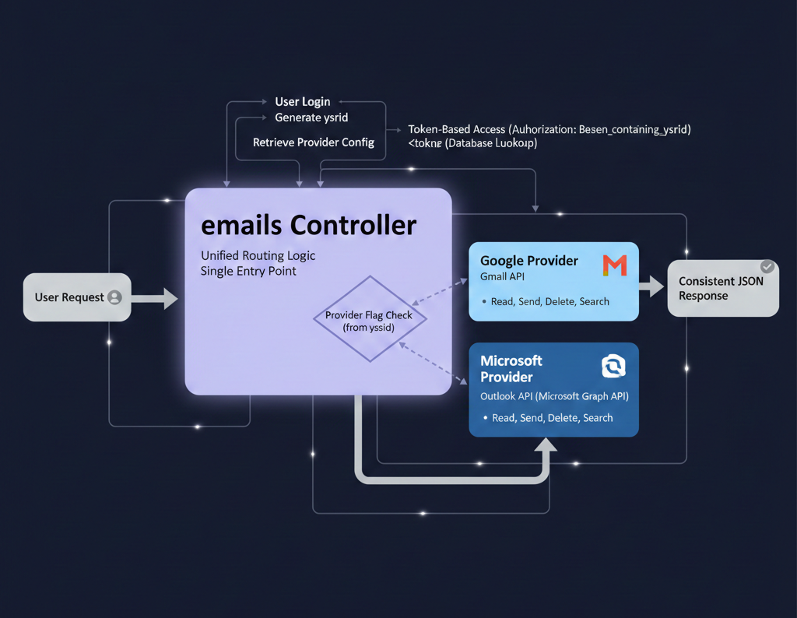

# Mail (Email) Module

## Overview
The Mail module is a unified email experience that seamlessly integrates with both Gmail and Outlook services. It provides a consistent, full-featured interface for day-to-day communication at work, regardless of your email provider. The system intelligently routes your requests to the appropriate provider based on your account configuration, giving you a single, predictable experience across different email platforms.

Whether you're triaging a busy inbox, collaborating with a team, or tracking important conversations, the Mail module keeps email fast, clean, and predictable—no matter which provider powers your account.

---

## Architecture & Authentication

### Unified Authentication Flow
When you log into the Mail module:

1. **User Authentication**: Your login credentials are validated and a unique `userId` is generated
2. **Token-Based Access**: The `userId` is included in the Authorization Bearer token for all subsequent requests
3. **Provider Detection**: The system retrieves your configured email provider (Gmail or Outlook) associated with your `userId`
4. **Smart Routing**: All email operations are routed through a unified `emails` controller

### Provider-Specific Routing
The `emails` controller acts as an intelligent router:
```
User Request → emails Controller → Provider Flag Check
                                   ├─→ Google Provider (Gmail API)
                                   └─→ Microsoft Provider (Outlook API)
```

- **Single Entry Point**: All email operations (read, send, delete, search) go through the same controller endpoint
- **Provider Flag**: The controller uses your account's provider configuration as a flag to determine routing
- **Dual Implementation**: Two separate provider methods handle the actual API calls:
  - `googleProvider()` - Interfaces with Gmail API
  - `microsoftProvider()` - Interfaces with Microsoft Graph API (Outlook)

### Authentication Headers
All API requests include:
```
Authorization: Bearer <token_containing_userId>
```

The backend automatically:
1. Extracts the `userId` from the token
2. Looks up the associated email provider
3. Routes to the appropriate provider method
4. Returns a consistent response format regardless of provider

---

## Supported Email Providers

### Gmail (Google Workspace)
- Full integration with Gmail API
- Support for Google Workspace accounts
- Access to all Gmail-specific features (labels, filters, categories)

### Outlook (Microsoft 365)
- Full integration with Microsoft Graph API
- Support for Outlook.com and Microsoft 365 accounts
- Access to Outlook-specific features (focused inbox, categories)

<p >
  
</p>


### Unified Experience
Regardless of your provider, you'll experience:
- Consistent UI and navigation
- Same folder structure and organization
- Identical compose and reply workflows
- Uniform search and filtering capabilities

---

## Core Features

### Inbox and Folder Navigation
- Familiar folder-based structure (Inbox, Sent, Drafts, Junk, Trash)
- Custom folders for organizing messages your way
- Quick switching between folders with preserved context (sort + filters per folder)
- Provider-agnostic folder mapping (Gmail labels ↔ Outlook folders)

### Message List and Reading Pane
- Efficient message list with unread state, sender, subject, preview, timestamp
- Reading view optimized for long threads and attachments
- Conversation/thread view for grouping related messages
- Consistent rendering across both Gmail and Outlook sources

### Compose and Reply
- Create new emails, reply, reply all, and forward
- Rich text formatting (bold/italic/underline, links, lists, etc.)
- Draft auto-save to prevent data loss
- Attach files while composing
- Cross-provider compatibility for all message features

### Attachments
- View and download attachments directly from any email
- Clear attachment metadata (name, size, type)
- Safe handling of common file formats
- Consistent attachment experience across providers

### Search
- Unified search across all your mail
- Fast results powered by native provider search APIs
- Filters by common fields like sender, subject, and date
- Sort search results to quickly find the newest or most relevant messages
- Provider-specific search optimizations applied automatically

### Sorting and Filtering
- Sort by date, sender, subject, or other supported fields
- Filters for unread, flagged/important, or attachment-only messages
- Consistent UI behavior across folders and providers
- Predictable workflow regardless of underlying email service

### Actions and Productivity
- Mark as read/unread
- Move to folder
- Delete and restore
- Flag/star important messages
- Bulk select actions for inbox clean-up at speed
- Archive messages (mapped appropriately per provider)

---

## Provider-Specific Features

### Gmail-Specific
When connected to Gmail, you also get:
- Gmail labels system (mapped to folders in UI)
- Category tabs (Primary, Social, Promotions)
- Advanced Gmail search operators
- Integration with Google Workspace features

### Outlook-Specific
When connected to Outlook, you also get:
- Focused Inbox support
- Outlook categories and color coding
- Integration with Microsoft 365 features
- Exchange-based shared mailbox support
- [Outlook Provider Documentation](../Providers/Outlook/outlook.md)

---

## Security and Access

### Multi-Layer Security
- **Token-Based Authentication**: Secure Bearer token with embedded `userId`
- **Provider Credentials**: Encrypted storage of OAuth tokens for Gmail/Outlook
- **Tenant Awareness**: Multi-tenant support with organization-level isolation
- **Secure API Calls**: All provider communications use encrypted HTTPS
- **Token Refresh**: Automatic OAuth token refresh for uninterrupted access

### Access Control
- User-level access tied to `userId`
- Role-based permissions for shared mailboxes (when configured)
- Safe defaults for all message actions and attachment handling
- Audit logging of email operations

---

## API Workflow Example

### Reading Your Inbox

1. **Client Request**:
```
   GET /api/emails/inbox
   Authorization: Bearer <token>
```

2. **Backend Processing**:
```
   emails Controller receives request
   ↓
   Extract userId from Bearer token
   ↓
   Query database: SELECT provider FROM users WHERE userId = <userId>
   ↓
   Provider flag check:
   ├─→ provider === "google" → Call googleProvider.getInbox()
   └─→ provider === "microsoft" → Call microsoftProvider.getInbox()
   ↓
   Normalize response to standard format
   ↓
   Return unified JSON response
```

3. **Client Receives**: Standardized email list regardless of provider

### Sending an Email

1. **Client Request**:
```
   POST /api/emails/send
   Authorization: Bearer <token>
   Body: { to, subject, body, attachments }
```

2. **Backend Processing**:
```
   emails Controller receives request
   ↓
   Extract userId and route to provider
   ↓
   Provider-specific send:
   ├─→ googleProvider.sendEmail() → Gmail API
   └─→ microsoftProvider.sendEmail() → Microsoft Graph API
   ↓
   Return success confirmation
```

---

This architecture ensures you get a seamless, consistent email experience while leveraging the full power of both Gmail and Outlook platforms.
For detailed information about Outlook integration, API behavior, and provider-specific features, refer to:  
