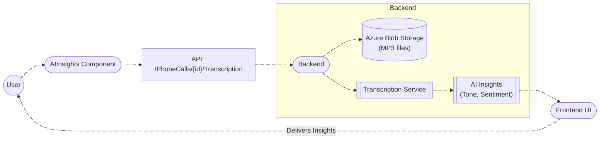
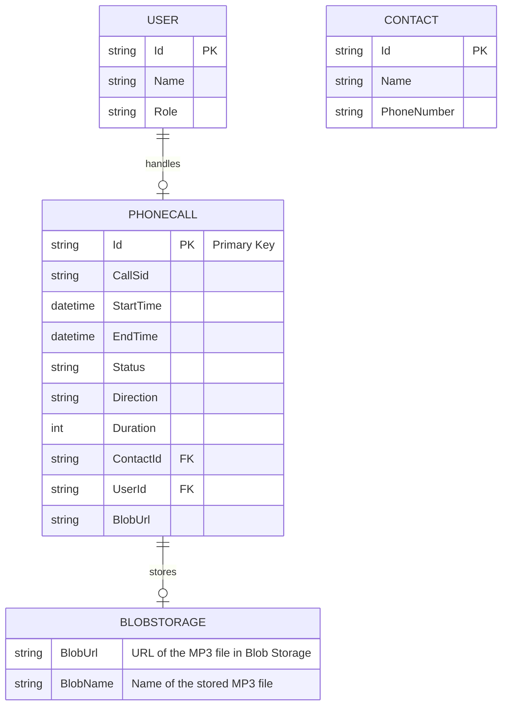

# **AI Insights Documentation**

## **Overview**
The **AI Insights** module is a telephony integration system that allows users (agents and managers) to view detailed insights of telephony interactions. It handles call recordings saved as MP3 files in Azure Blob Storage and uses these files to generate transcriptions and perform sentiment analysis. The data is then displayed in the frontend UI, providing agents with real-time feedback on their performance and the emotional tone of the calls.

This module integrates both frontend and backend components, leveraging **Twilio** for call handling and **Azure Blob Storage** for storing call recordings. The transcription and sentiment analysis are powered by AI models that process these recordings.

---

## **DFD (Data Flow Diagram)**



### Explanation:
- **User** interacts with the **AIInsights Component** to request call insights.
- The **AIInsights Component** sends API requests to fetch transcription data from the backend.
- **Backend** retrieves the **call recording (MP3)** from **Azure Blob Storage** and sends it to the **Transcription Service**.
- The **Transcription Service** converts the MP3 file into text and performs sentiment and tone analysis.
- **Frontend UI** displays the generated insights (transcription, tone analysis, sentiment) to the **User**.

---

## **Process Flow**

1. **User Interaction**: 
   - User selects a call from the call history to view its insights.
   - The **AIInsights Component** sends a request to the backend API to fetch transcription and insights for the selected call.
   
2. **Fetching Data**: 
   - Backend retrieves the **call recording (MP3)** from **Azure Blob Storage**.
   - The **Transcription Service** processes the MP3 file and generates the transcription, along with sentiment and emotional tone analysis.

3. **Displaying Insights**: 
   - The transcription and tone analysis data are sent back to the frontend.
   - **AIInsights Component** processes and displays the transcription, sentiment, and emotional tone analysis in the UI.

4. **End User View**: 
   - The **User** can view detailed insights, including:
     - Full transcription text.
     - Emotional tone analysis (positive, neutral, negative).
     - Key insights from the conversation.

---

## **ER Diagram**



### Explanation:
- **PhoneCall** entity stores details about the calls, including references to **User** (the agent who handled the call) and **Contact** (the customer).
- **PhoneCall** is linked to **BlobStorage**, where the MP3 recording of the call is stored.
- **User** represents the agent or admin interacting with the system.

---

## **Entity Definitions**

### **User**
- **Id**: Unique identifier for the user (e.g., agent).
- **Name**: Full name of the user.
- **Role**: Role of the user (e.g., Admin, Agent).

### **PhoneCall**
- **Id**: Unique identifier for each phone call.
- **CallSid**: Unique identifier for the call, provided by Twilio.
- **StartTime**: Timestamp of when the call started.
- **EndTime**: Timestamp of when the call ended.
- **Status**: Status of the call (e.g., completed, in-progress).
- **Direction**: Direction of the call (incoming or outgoing).
- **Duration**: Duration of the call in seconds.
- **ContactId**: Foreign key to the **Contact** entity.
- **UserId**: Foreign key to the **User** entity (the agent handling the call).
- **BlobUrl**: URL pointing to the MP3 recording in **Blob Storage**.

### **BlobStorage**
- **BlobUrl**: URL pointing to the stored MP3 file in Blob Storage.
- **BlobName**: Name of the MP3 file (e.g., `call_12345.mp3`).

### **Contact**
- **Id**: Unique identifier for the contact (client).
- **Name**: Name of the contact.
- **PhoneNumber**: Contact's phone number.

---

## **Authentication / APIs**

### Authentication:
The system uses **JWT-based authentication** for securing access to the API endpoints.

### API Endpoints

1. **GET /PhoneCalls/{id}/Transcription**  
   ```
2. **GET /PhoneCalls/{id}/Insights**  
   ```
3. **GET /BlobStorage/{callId}/Recording**  
---

## **Testing Guide**

### Unit Testing
- **Test API calls**: Ensure the backend APIs fetch the correct MP3 files from Blob Storage and process the transcription correctly.
  - Test that the transcription and sentiment analysis are properly generated.
  - Validate edge cases such as missing recordings, invalid call IDs, etc.

### Integration Testing
- **Test Frontend and Backend Interaction**: Ensure the frontend correctly interacts with the backend APIs to fetch transcription and tone analysis data.
  - Test the flow from initiating a call request to receiving and displaying the insights.

### End-to-End Testing
- **Simulate Real User Behavior**: Test the entire system by simulating a real user journey, from placing a call, storing the recording, transcribing it, and displaying the insights in the frontend UI.

---

## **References**

- **Azure Blob Storage Documentation**: [Azure Blob Storage Docs](https://docs.microsoft.com/en-us/azure/storage/blobs/)
- **Twilio API Documentation**: [Twilio Docs](https://www.twilio.com/docs)
- **Sentiment Analysis API**: [AI Sentiment API Documentation](#) (Example URL)

---

## **Version and Change Log**

- **v1.0.0** (2025-12-18): Initial release with transcription and tone analysis features.

---
