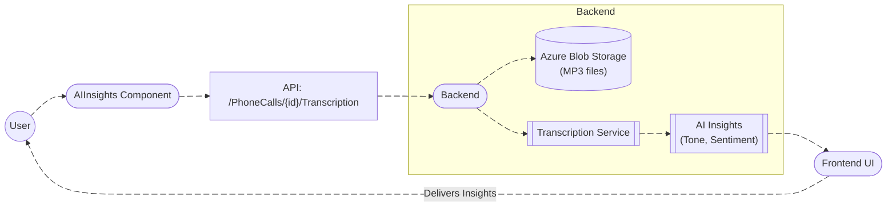
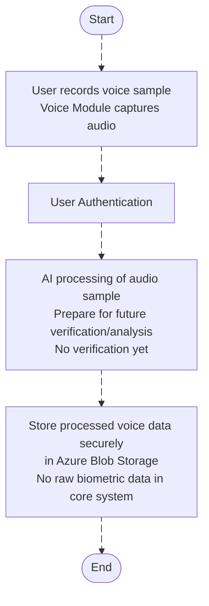

# **Voice Recording & AI Insights Module Documentation**

---

## **Overview**

The **Voice Recording & AI Insights** module is designed to enhance user interaction by collecting voice samples and providing comprehensive insights based on those voice recordings. It integrates two key features:

1. **Voice Recording & Collection** feature captures the user's voice sample to be used for identity verification or other purposes. This module securely collects voice data while ensuring compliance with privacy standards. The voice sample is processed, but raw biometric data is never stored or processed directly in the core system.

   
2. **AI Insights**: This component handles the transcription of recorded voice data, offering sentiment analysis and emotional tone detection. The insights provided by the AI models help agents and managers improve user experience, call handling, and engagement by interpreting the emotional context behind customer interactions.

These features work synergistically, ensuring both secure voice collection for possible future verification workflows and detailed, actionable analytics for agents or administrators.

---

## **DFD (Data Flow Diagram)**

---

---

## **ER Diagram**

```mermaid
erDiagram
    direction LR

    USER ||--o| VOICESTATUS : has

    USER {
        string Id PK "Primary Key"
        int PracticeId
    }

    VOICESTATUS {
        bool Recorded "Has Voice Sample"
        datetime On "Date Recorded"
        string UserId FK "Foreign Key to USER"
    }

    %% Highlight VOICESTATUS to simulate 'active' state/focus with black color
    classDef active fill:#000000,stroke:#ffffff,stroke-width:3px
    class VOICESTATUS active

    %% Optionally, style keys for greater clarity
```

---

## **Entity Definition**

### ApplicationUserVoiceStatus

Represents the collection state of a user’s voice sample.

Fields:
- **Recorded**: Indicates whether a voice sample was successfully collected.
- **On**: Timestamp of the last collected sample.

This structure ensures minimal data storage to maintain privacy and compliance.

---

## **Authentication / APIs**

## **API Endpoints:**

| **Description**                             | **HTTP Method** | **Endpoint**                                                | 
|---------------------------------------------|-----------------|------------------------------------------------------------|
| **Check Audio**                             | POST            | [/sample](https://localhost:5004/api-docs/index.html)       |
| **Upload Audio**                            | POST            | [/Auth/UploadAudio](https://localhost:5004/api-docs/index.html) | 
| **Upload Audio Sample (AuthController)**    | POST            | [/Auth/UploadAudio](https://localhost:5004/api-docs/index.html) |

---

## **Testing Guide**

- **Frontend Testing**: Test microphone permissions, auto-stop after 60 seconds, and UI paths for success or failure in the recording process.
- **API Testing**: Use the `POST /Auth/UploadAudio` endpoint with a `true` or `false` payload.
- **Database Validation**: Query the `ApplicationUser.Voice` fields directly in MongoDB to validate the successful recording.

---

## **References**

- `VoiceRecordingModal.tsx`
- `Profile.tsx`
- `ProfileService.tsx`
- `AuthController.cs`

---

## **Version and Change Log**

**v1.0.0**
- Initial release for voice sample collection.
- Integration with transcription and AI insights.
- MongoDB persistence for voice collection status.

---

End of Document

