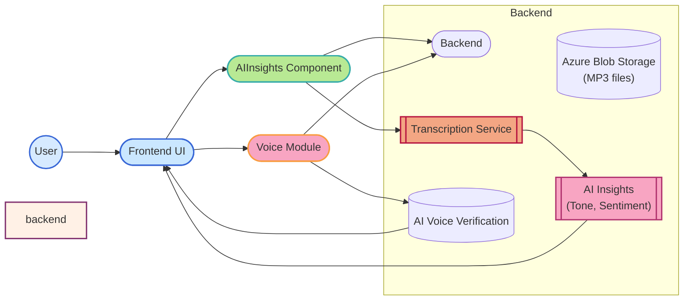
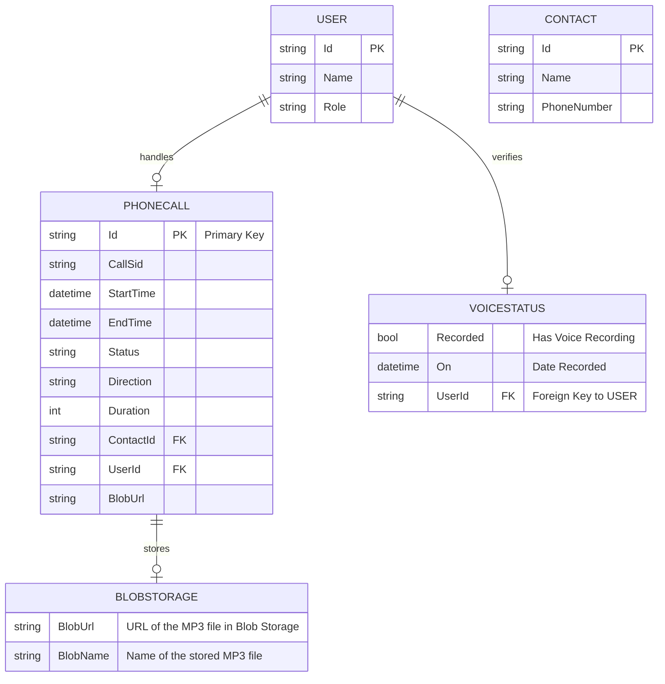

# **Voice Recording & AI Insights Module Documentation**

## **Overview**
The **Voice Recording & AI Insights** module is designed to enhance user interaction and provide comprehensive insights based on voice data. This module integrates two core features:

1. **Voice Recording & Verification**: This feature captures and verifies the user's voice as part of the identity verification process, allowing voice biometrics to be used for secure authentication.
2. **AI Insights**: This part handles the transcription of call recordings, providing detailed sentiment and emotional tone analysis to agents and managers. It uses AI models to provide actionable insights for improving user experience and call handling.

These two features work together to provide both secure voice authentication and detailed post-call analytics, ensuring a seamless and effective workflow for agents and administrators.

---

## **DFD (Data Flow Diagram)**



---

## **Process Flow**

### **Voice Recording & Verification**:
1. **User Interaction**: 
   - User records a voice sample for identity verification.
   - The **Voice Module** records the audio and sends it to the **AI Voice Verification** service for processing.

2. **Verification**: 
   - The voice sample is verified using AI algorithms. A result is returned indicating whether the voice sample matches the expected voice profile.

3. **Results Display**: 
   - The verification result is displayed to the user (e.g., successful verification or failure).

### **AI Insights**:
1. **User Interaction**: 
   - User selects a call to view detailed insights.
   - The **AIInsights Component** sends an API request to fetch transcription and insights.

2. **Data Fetching**: 
   - Backend retrieves the **call recording (MP3)** from **Azure Blob Storage**.
   - The **Transcription Service** converts the MP3 file into text and performs sentiment and tone analysis.

3. **Displaying Insights**: 
   - The transcription and tone analysis data are displayed to the user via the frontend.

---

## **ER Diagram**



---

## **Entity Definitions**

### **User**
- **Id**: Unique identifier for the user (e.g., agent).
- **Name**: Full name of the user.
- **Role**: Role of the user (e.g., Admin, Agent).

### **PhoneCall**
- **Id**: Unique identifier for each phone call.
- **CallSid**: Unique identifier for the call, provided by Twilio.
- **StartTime**: Timestamp of when the call started.
- **EndTime**: Timestamp of when the call ended.
- **Status**: Status of the call (e.g., completed, in-progress).
- **Direction**: Direction of the call (incoming or outgoing).
- **Duration**: Duration of the call in seconds.
- **ContactId**: Foreign key to the **Contact** entity.
- **UserId**: Foreign key to the **User** entity (the agent handling the call).
- **BlobUrl**: URL pointing to the MP3 recording in **Blob Storage**.

### **VoiceStatus**
- **Recorded**: Indicates whether the user's voice has been successfully recorded.
- **On**: Timestamp of when the last successful voice recording was made.

### **BlobStorage**
- **BlobUrl**: URL pointing to the stored MP3 file in Blob Storage.
- **BlobName**: Name of the MP3 file (e.g., `call_12345.mp3`).

### **Contact**
- **Id**: Unique identifier for the contact (client).
- **Name**: Name of the contact.
- **PhoneNumber**: Contact's phone number.

---

## **Authentication / APIs**

### Authentication:
The system uses **JWT-based authentication** to secure access to the API endpoints.

### API Endpoints

1. **GET /PhoneCalls/{id}/Transcription**  
   Fetches the transcription of the call recording, along with sentiment analysis and tone data.

   **Request Example:**
   ```js
   axios.get('/PhoneCalls/{callId}/Transcription');
   ```

2. **GET /PhoneCalls/{id}/Insights**  
   Retrieves detailed insights including transcription and tone analysis for the call.

   **Response Example:**
   ```json
   {
     "transcription": "Hello, how can I assist you today?",
     "tones": [
       { "label": "joy", "score": 0.75 },
       { "label": "neutral", "score": 0.15 }
     ]
   }
   ```

3. **GET /BlobStorage/{callId}/Recording**  
   Retrieves the MP3 recording stored in **Azure Blob Storage** for the given call.

---

## **Testing Guide**

### Unit Testing
- **Test API calls**: Ensure the backend APIs fetch the correct MP3 files from Blob Storage and process the transcription correctly.
  - Test that the transcription and sentiment analysis are properly generated.
  - Validate edge cases such as missing recordings, invalid call IDs, etc.

### Integration Testing
- **Test Frontend and Backend Interaction**: Ensure the frontend correctly interacts with the backend APIs to fetch transcription and tone analysis data.
  - Test the flow from initiating a call request to receiving and displaying the insights.

### End-to-End Testing
- **Simulate Real User Behavior**: Test the entire system by simulating a real user journey, from placing a call, storing the recording, transcribing it, and displaying the insights in the frontend UI.

---

## **References**

- **Azure Blob Storage Documentation**: [Azure Blob Storage Docs](https://docs.microsoft.com/en-us/azure/storage/blobs/)
- **Twilio API Documentation**: [Twilio Docs](https://www.twilio.com/docs)
- **Sentiment Analysis API**: [AI Sentiment API Documentation](#) (Example URL)

---

## **Version and Change Log**

- **v1.0.0** (2025-12-18): Initial release with transcription and tone analysis features.
- **v1.1.0** (2025-12-25): Added integration with **Azure Blob Storage** for MP3 file handling and storage.
- **v1.2.0** (2026-01-10): Enhanced sentiment analysis and improved UI for displaying insights.

---
