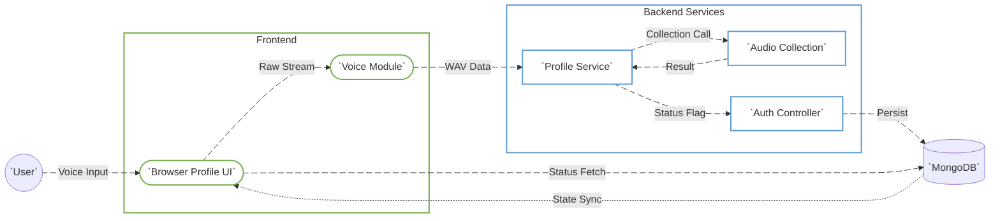
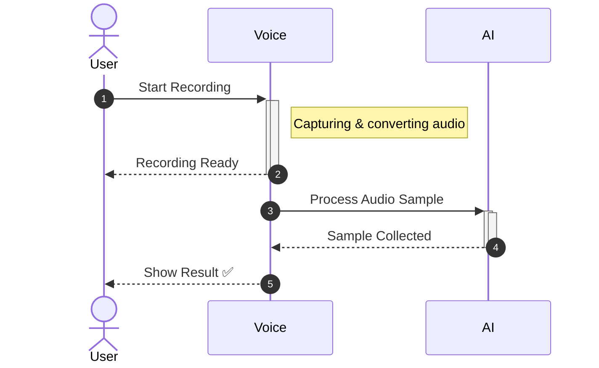
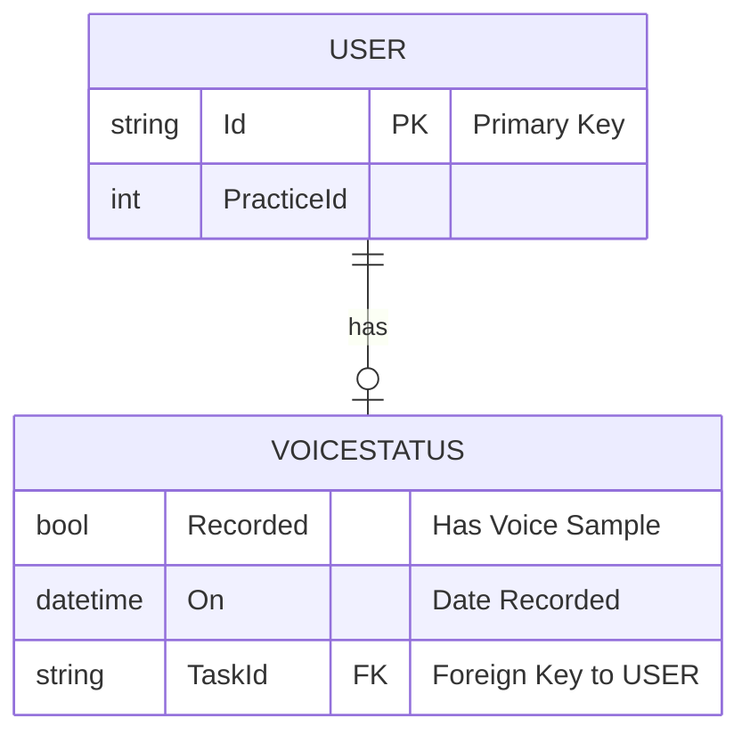

# Voice Recording Module

---

## 1. Overview

The **Voice Recording Module** is designed to securely collect and store a user’s voice sample by recording it and saving the data in blob storage. This module is integrated into the Profile section and focuses exclusively on the collection of voice samples, without involvement in authentication or verification processes.

The primary objectives of the module are:
- **Voice Sample Collection**: The module enables users to record their voice, which is then securely captured and stored.
- **Blob Storage**: Once recorded, the voice sample is uploaded and stored in blob storage, ensuring the safety and scalability of the data.
- **Minimal Data Retention**: The system ensures that only necessary metadata (such as the status of the sample) is retained in the database, avoiding the long-term storage of raw voice data.
- **Privacy and Security**: The module maintains strict privacy controls by isolating the voice sample collection process from core authentication or verification services.

By focusing solely on the collection and secure storage of voice data, the module provides a simple and efficient mechanism for gathering voice samples, which can later be used for various processing needs, while prioritizing user privacy and data security.

---

## 2. Data Flow Diagram (DFD)

---

## 3. Process Flow

---

## 4. Entity Relationship (ER) Diagram

---

## 5. Entity Definition

### ApplicationUserVoiceStatus

Represents the collection state of a user’s voice sample.

Fields:
- Recorded: Indicates whether a voice sample was successfully collected
- On: Timestamp of the last collected sample

This structure is intentionally minimal to reduce biometric footprint.

---

## 6. Authentication and APIs

### Frontend APIs (ProfileService)

## **API Endpoints:**

| **Description**                               | **HTTP Method** | **Endpoint**                                                                 |
|-----------------------------------------------|-----------------|-----------------------------------------------------------------------------|
| **Check Audio**                               | POST            | [/sample](https://localhost:5004/api-docs/index.html)                                                                  |
| **Upload Audio Sample**                       | POST            | [/Auth/UploadAudio](https://localhost:5004/api-docs/index.html)                                                       |
| **Voice Sample Collection**                   | POST            | [/sample](https://localhost:5004/api-docs/index.html)                                                                  |
| **Upload Audio Sample**                       | POST            | [/auth/uploadAudio](https://localhost:5004/api-docs/index.html)                                                       |
| **Get Profile Information**                   | GET             | [/profile](https://localhost:5004/api-docs/index.html)                                                                |
| **Update Profile Information**                | PUT             | [/profile/update](https://localhost:5004/api-docs/index.html)                                                         |
| **Get Audio Sample Status**                   | GET             | [/sample/status](https://localhost:5004/api-docs/index.html)                                                          |
| **Delete Audio Sample**                       | DELETE          | [/sample/delete](https://localhost:5004/api-docs/index.html)                                                          |
| **Get Audio Sample Details**                  | GET             | [/sample/{id}](https://localhost:5004/api-docs/index.html)                                                            |
| **Upload Audio Sample Metadata**              | POST            | [/metadata/upload](https://localhost:5004/api-docs/index.html)                                                        |
| **Create New Audio Sample Session**           | POST            | [/sample/session/create](https://localhost:5004/api-docs/index.html)                                                  |
| **Check Audio Sample Upload Status**          | GET             | [/sample/session/status/{sessionId}](https://localhost:5004/api-docs/index.html)                                       |
| **Cancel Audio Sample Session**               | DELETE          | [/sample/session/cancel/{sessionId}](https://localhost:5004/api-docs/index.html)                                       |

---

## 7. Testing Guide

Frontend Testing:
- Microphone permission flows
- Auto-stop after 60 seconds
- Success and failure UI paths
- Re-record functionality

API Testing:
POST /Auth/UploadAudio
Body: true or false

Database Validation:
Query ApplicationUser.Voice fields directly in MongoDB.

---

## 8. References

- VoiceRecordingModal.tsx
- Profile.tsx
- ProfileService.tsx
- AuthController.cs

---
