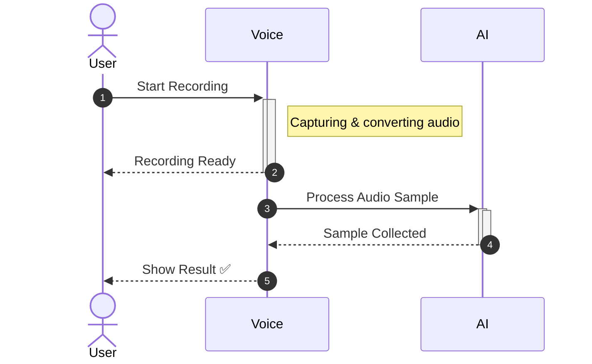

# Voice Recording Module

---

## 1. Overview

The Voice Recording module provides a secure mechanism for collecting a user’s voice sample. It is integrated into the Profile section and ensures clear separation of concerns between the UI, voice sample collection, and backend persistence.

### Goals
- Collect voice samples for further verification or processing
- Prevent storage of raw biometric data in core systems
- Provide clear auditability of sample collection status
- Ensure extensibility for future workflows involving voice data

### Non-Goals
- Voice authentication or verification at login time
- Long-term storage of voice samples
- Multi-factor biometric comparison

---

## 2. Architecture Summary

The module is composed of three logical layers:

### Presentation Layer
- VoiceRecordingModal
- Profile UI

### Collection Layer
- Audio capture service (/sample)

### Persistence Layer
- AuthController.UploadAudio
- MongoDB (ApplicationUser collection)

This layered approach ensures that biometric data does not leak into core authentication services.

---

## 3. DFD (Data Flow Diagram)

---

## 4. Process Flow

---

## 5. ER Diagram

```mermaid
erDiagram
    direction LR

    USER ||--o| VOICESTATUS : has

    USER {
        string Id PK "Primary Key"
        int PracticeId
    }

    VOICESTATUS {
        bool Recorded "Has Voice Sample"
        datetime On "Date Recorded"
        string TaskId FK "Foreign Key to USER"
    }

    %% Highlight VOICESTATUS to simulate 'active' state/focus with black color
    classDef active fill:#000000,stroke:#ffffff,stroke-width:3px
    class VOICESTATUS active

    %% Optionally, style keys for greater clarity
```

---

## 6. Entity Definition

### ApplicationUserVoiceStatus

Represents the collection state of a user’s voice sample.

Fields:
- Recorded: Indicates whether a voice sample was successfully collected
- On: Timestamp of the last collected sample

This structure is intentionally minimal to reduce biometric footprint.

---

## 7. Authentication and APIs

### Frontend APIs (ProfileService)

checkAudio
- Endpoint: /sample
- Method: POST
- Payload: multipart/form-data
- Responsibility: AI-based audio sample processing

uploadAudio
- Endpoint: /Auth/UploadAudio
- Method: POST
- Payload: boolean
- Responsibility: Persist voice sample collection result

---

### Backend API (AuthController)

POST /Auth/UploadAudio

Behavior:
1. Validates authenticated user
2. Filters MongoDB document using PracticeId and UserId
3. Updates user.voice.recorded and user.voice.on

No raw audio is stored or processed at this layer.

---

## 8. Security Considerations

- Raw audio never reaches AuthController
- Audio collection service is isolated and accessed via OIDC
- Voice status is boolean, not biometric data
- MongoDB stores metadata only
- Browser permissions strictly enforced

---

## 9. Error Handling and Recovery

Frontend:
- Permission denial handling
- Unsupported browser detection
- Silent audio detection
- Retry and re-record support

Backend:
- MongoDB update validation
- Graceful failure on no modification
- Standard ApiResponse error propagation

---

## 10. Testing Guide

Frontend Testing:
- Microphone permission flows
- Auto-stop after 60 seconds
- Success and failure UI paths
- Re-record functionality

API Testing:
POST /Auth/UploadAudio
Body: true or false

Database Validation:
Query ApplicationUser.Voice fields directly in MongoDB.

---

## 11. Performance Notes

- Audio processing done client-side
- Small payloads to backend
- No blocking operations on profile load
- Minimal database write footprint

---

## 12. Future Enhancements

- Audio sample quality verification
- Multiple language sample support
- Expiry-based re-sample
- Admin audit view

---

## 13. References

- VoiceRecordingModal.tsx
- Profile.tsx
- ProfileService.tsx
- AuthController.cs

---

## 14. Version and Change Log

v1.0.0
- Initial voice sample collection
- Audio processing integration
- MongoDB persistence

---

End of Document
