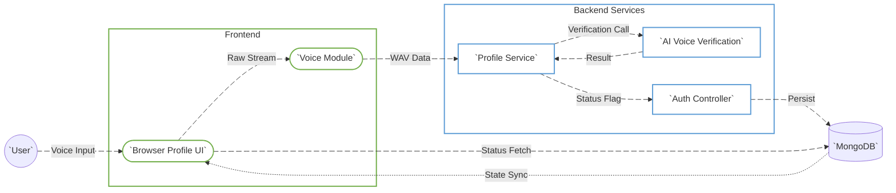
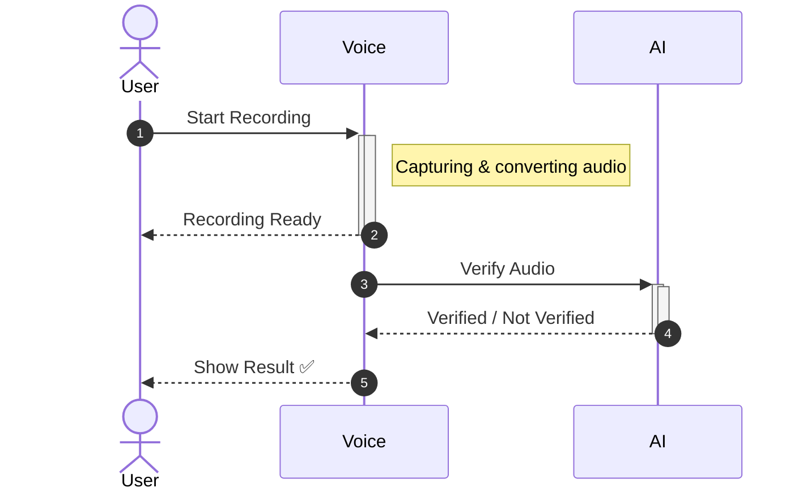

# Voice Recording & Verification Module

---

## 1. Overview

The Voice Recording & Verification module provides a secure mechanism for verifying a user’s identity using voice biometrics.
It is integrated into the Profile section and is designed with clear separation of concerns between UI, AI verification, and backend persistence.

### Goals
- Enable voice-based identity verification
- Prevent storage of raw biometric data in core systems
- Provide clear auditability of verification status
- Ensure extensibility for future biometric workflows

### Non-Goals
- Long-term storage of voice samples
- Voice authentication at login time
- Multi-factor biometric comparison

---

## 2. Architecture Summary

The module is composed of three logical layers:

### Presentation Layer
- VoiceRecordingModal
- Profile UI

### Verification Layer
- AI audio verification service (/sample)

### Persistence Layer
- AuthController.UploadAudio
- MongoDB (ApplicationUser collection)

This layered approach ensures that biometric data does not leak into core authentication services.

---

## 3. DFD (Data Flow Diagram)

---

## 4. Process Flow

---

## 5. ER Diagram

---

## 6. Entity Definition

### ApplicationUserVoiceStatus

Represents the verification state of a user’s voice identity.

Fields:
- Recorded: Indicates whether verification succeeded
- On: Timestamp of last successful verification

This structure is intentionally minimal to reduce biometric footprint.

---

## 7. Authentication and APIs

### Frontend APIs (ProfileService)

checkAudio
- Endpoint: /sample
- Method: POST
- Payload: multipart/form-data
- Responsibility: AI-based voice verification

uploadAudio
- Endpoint: /Auth/UploadAudio
- Method: POST
- Payload: boolean
- Responsibility: Persist verification result

---

### Backend API (AuthController)

POST /Auth/UploadAudio

Behavior:
1. Validates authenticated user
2. Filters MongoDB document using PracticeId and UserId
3. Updates user.voice.recorded and user.voice.on

No raw audio is stored or processed at this layer.

---

## 8. Security Considerations

- Raw audio never reaches AuthController
- AI service is isolated and accessed via OIDC
- Voice status is boolean, not biometric data
- MongoDB stores metadata only
- Browser permissions strictly enforced

---

## 9. Error Handling and Recovery

Frontend:
- Permission denial handling
- Unsupported browser detection
- Silent audio detection
- Retry and re-record support

Backend:
- MongoDB update validation
- Graceful failure on no modification
- Standard ApiResponse error propagation

---

## 10. Testing Guide

Frontend Testing:
- Microphone permission flows
- Auto-stop after 60 seconds
- Success and failure UI paths
- Re-record functionality

API Testing:
POST /Auth/UploadAudio
Body: true or false

Database Validation:
Query ApplicationUser.Voice fields directly in MongoDB.

---

## 11. Performance Notes

- Audio processing done client-side
- Small payloads to backend
- No blocking operations on profile load
- Minimal database write footprint

---

## 12. Future Enhancements

- Voice confidence score storage
- Multiple language sample support
- Expiry-based re-verification
- Admin audit view

---

## 13. References

- VoiceRecordingModal.tsx
- Profile.tsx
- ProfileService.tsx
- AuthController.cs

---

## 14. Version and Change Log

v1.0.0
- Initial voice verification
- AI integration
- MongoDB persistence

v1.1.0
- WAV conversion
- Auto-stop recording
- Improved error handling

v1.2.0
- UI sync improvements
- Re-record flow
- Background user refresh

---

End of Document
