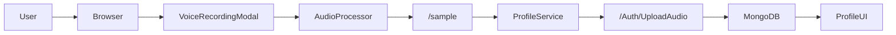
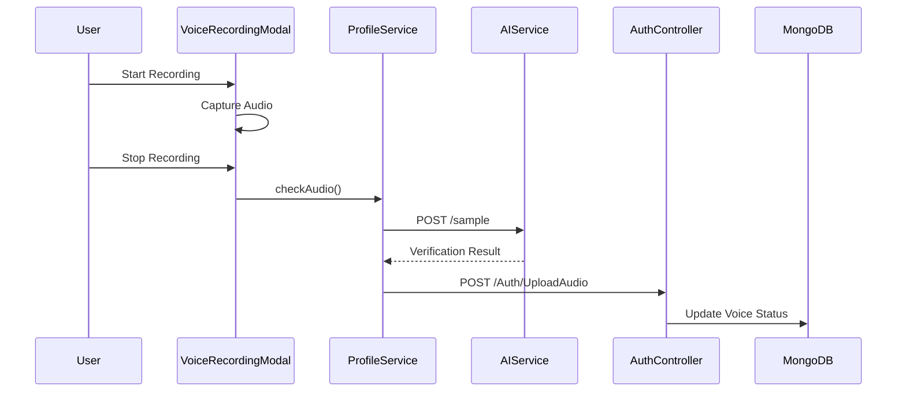
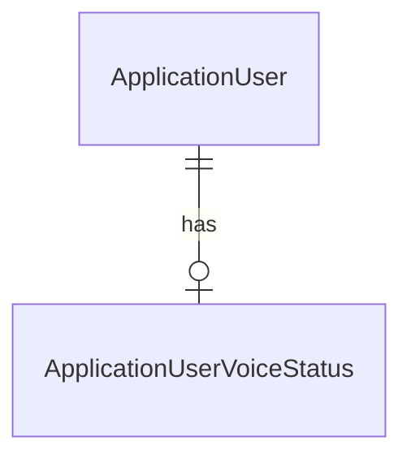

# Voice Recording & Verification Module

## Overview
The Voice Recording & Verification module enables voice-based identity verification from the Profile section of the application.
It integrates browser-side audio recording, AI-powered verification, and backend persistence of verification status.

## DFD (Data Flow Diagram)

## Process Flow

## ER Diagram

## Entity Definition
ApplicationUserVoiceStatus:
- recorded: boolean
- on: datetime

## Authentication / APIs
- POST /sample (AI verification)
- POST /Auth/UploadAudio (persist verification status)

## Testing Guide
- Manual UI testing via Profile screen
- API testing via Postman

## References
- VoiceRecordingModal.tsx
- Profile.tsx
- ProfileService.tsx
- AuthController.cs

## Version and Change Log
v1.0.0 Initial implementation
