# **Email Module Documentation**

## Overview

This email module integrates two service providers—**Outlook** and **Gmail**—based on the practice ID, with functionality that spans sending emails, managing drafts, and handling attachments. This module also supports advanced features like AI-based suggestions for responses and translation. The redirection for the email service is decided as:

- **Outlook**: `/admin/emails`
- **Gmail**: `/admin/emails/google`

### **Key Features**

The module provides several key features, such as:

- **Compose Email** with options to set email importance (Low, Normal, High).
- **Manage Folders**: Inbox, Sent, Drafts, Archive, etc.
- **AI Features**: Translate, Summarize, Short Replies.
- **Attachment Handling**: Upload, Download, and Delete Attachments.
- **Search and Filters**: Apply filters for read/unread emails, importance, and more.
- **Conversation History**: Maintain email threads for ongoing conversations.

---

## DFD (Data Flow Diagram)

Here is the **Data Flow Diagram** illustrating the interaction between the user, system components, and the email service providers.

```mermaid
flowchart LR
    A([👤 User]) edge1@--> B[🖥️ User Interface]
    B edge2@--> C[⚙️ Backend System]
    C edge3@--> D{📧 Email Provider}
    D edge4@-->|Outlook| E[📬 Outlook API]
    D edge5@-->|Gmail| F[📮 Gmail API]
    E edge6@--> C
    F edge7@--> C
    C edge8@--> B
    B edge9@--> G[🤖 AI Service API]
    G edge10@--> B
    
    edge1@{ animate: fast }
    edge2@{ animate: fast }
    edge3@{ animate: fast }
    edge4@{ animate: fast }
    edge5@{ animate: fast }
    edge6@{ animate: fast }
    edge7@{ animate: fast }
    edge8@{ animate: fast }
    edge9@{ animate: fast }
    edge10@{ animate: fast }
    
    style A fill:#e3f2fd,stroke:#1976d2,stroke-width:4px,color:#000
    style B fill:#f3e5f5,stroke:#7b1fa2,stroke-width:3px,color:#000
    style C fill:#fff3e0,stroke:#f57c00,stroke-width:3px,color:#000
    style D fill:#fff9c4,stroke:#f57f17,stroke-width:3px,color:#000
    style E fill:#e1f5fe,stroke:#0277bd,stroke-width:3px,color:#000
    style F fill:#fce4ec,stroke:#c2185b,stroke-width:3px,color:#000
    style G fill:#c8e6c9,stroke:#2e7d32,stroke-width:3px,color:#000
```



---

## Process Flow

### **Description:**
The process flow outlines the step-by-step operations within the Email Module.

1. **Email Provider Selection**:
   - The service provider is determined dynamically based on the practice ID
   - If Outlook is selected, redirection occurs to `/admin/emails`
   - For Gmail, it redirects to `/admin/emails/google`

2. **Compose Email**:
   - The user opens the email composition screen
   - Sets email importance (Low, Normal, High)
   - Writes the body content
   - Attaches files
   - Selects recipients

3. **Email Sending**:
   - Once composed, the email is sent to the selected email provider's API (Outlook or Gmail)

4. **Drafts & Sent Items**:
   - Emails saved as drafts are stored in the drafts folder
   - Once sent, the email is moved to the sent items folder

5. **AI Features**:
   - AI suggestions such as translations, summarizations, and short replies are available when viewing an email

---

## ER Diagram

Here is the **Entity Relationship Diagram (ERD)** that maps out the relationships between core entities in the email system:


---

## Entity Definitions

### **User**

- **user_id** (string): Unique identifier for the user
- **email_address** (string): User's email address
- **name** (string): User's full name
- **role** (string): User's role (ADMIN, MANAGER, STAFF)

### **Email**

- **email_id** (string): Unique identifier for the email
- **subject** (string): Email subject line
- **body** (text): Email body content
- **date** (datetime): Date and time the email was sent/received
- **importance** (string): Priority level (Low, Normal, High)
- **is_read** (boolean): Whether the email has been read
- **folder_id** (string): Foreign key to the folder
- **user_id** (string): Foreign key to the user

### **Attachment**

- **attachment_id** (string): Unique identifier for the attachment
- **email_id** (string): Foreign key to the email
- **file_name** (string): Name of the attached file
- **content_type** (string): MIME type of the file
- **size** (int): File size in bytes

### **Folder**

- **folder_id** (string): Unique identifier for the folder
- **display_name** (string): Name of the folder (Inbox, Sent, Drafts, etc.)
- **message_count** (int): Number of messages in the folder
- **user_id** (string): Foreign key to the user

### **AI Features**

- **feature_id** (string): Unique identifier for AI features
- **email_id** (string): Foreign key to the email
- **translation_language** (string): Target language for translation
- **summary** (text): Brief summary of the email
- **short_reply** (text): AI-generated suggested reply

---

## Authentication / APIs

The email module supports both **Outlook** and **Gmail** authentication, with APIs to manage email composition, attachment uploads, and AI features.

### **API Endpoints:**

#### **Update Email Preferences**
```
POST /admin/emails/preferences
```
- **Description**: Updates the user's email preferences
- **Request Body**: User preference settings
- **Response**: Success status

#### **Get Inbox Emails**
```
GET /Emails/Inbox
```
- **Description**: Retrieves the list of emails in the inbox
- **Query Parameters**: filters, sorting, pagination
- **Response**: Array of email objects

#### **Send Email**
```
POST /Emails/Message/{id}/send
POST /Emails/Message/send

```
- **Description**: Sends an email, including attachments
- **Request Body**: Email content, recipients, attachments
- **Response**: Success status with email ID

#### **Get Email Details**
```
GET /Emails/Message/{id}
```
- **Description**: Retrieves email details
- **Response**: Complete email object with metadata

#### **Upload Attachment**
```
POST /Emails/Message/{messageId}/Attachments

```
- **Description**: Uploads an attachment to an email
- **Request Body**: Multipart form-data with file
- **Response**: Attachment object with ID

#### **Download Attachment**
```
GET /admin/emails/{id}/attachment/{attachmentId}/Download
```
- **Description**: Downloads an attachment
- **Response**: File stream or download link

---

## Testing Guide

### **Unit Testing**

- **Test Email Composition**: Validate the ability to create, send, and store email drafts
- **Test AI Features**: Ensure AI features like translation and summarization work as expected
- **Test Attachment Upload**: Verify that attachments can be successfully uploaded and downloaded
- **Test Folder Management**: Validate folder creation, deletion, and email organization

### **Integration Testing**

- **Email Provider API Integration**: Test communication with the Outlook and Gmail APIs
- **Ensure emails are sent and fetched correctly**: Validate email delivery and retrieval
- **Test attachments handling**: Verify attachment upload, download, and deletion across providers
- **Test authentication flows**: Ensure OAuth 2.0 integration works for both providers

### **End-to-End Testing**

- **Full Email Flow**: Test the entire process from composing an email to sending it
- **Include attachment upload**: Verify files are properly attached and sent
- **Test folder management**: Ensure emails are properly organized in folders
- **Test email filters**: Validate filtering by read/unread, importance, attachments
- **Test AI features integration**: Verify translation, summarization, and short replies work end-to-end
- **Test conversation threading**: Ensure email threads are maintained properly

---

## References

- [Outlook API Documentation](https://docs.microsoft.com/en-us/graph/api/resources/mail-api-overview) - Microsoft Graph API
- [Gmail API Documentation](https://developers.google.com/gmail/api) - Google Gmail API
- [OAuth 2.0 Specification](https://oauth.net/2/) - Authentication protocol
- [MIME Types Reference](https://developer.mozilla.org/en-US/docs/Web/HTTP/Basics_of_HTTP/MIME_types) - File type specifications

---

This Markdown file provides an organized structure for the email system's technical documentation, covering all necessary details like the system overview, DFD, ERD, API references, and testing guidelines.
