# **Email Module Documentation**

# **Overview**

This **Email Module** integrates with two major email service providers—**Outlook** and **Gmail**—and provides a comprehensive solution for managing emails, drafts, and attachments within your system. The integration is designed to dynamically select the email service provider based on the practice ID, allowing seamless and personalized email management for users. Whether you're using Outlook or Gmail, the system ensures smooth interaction with both providers while leveraging advanced features to enhance communication.The core functionality of this module spans essential email management tasks, from composing and sending emails to organizing messages into folders. Users can manage their inbox, sent items, drafts, and other custom folders, offering full flexibility in how emails are organized. Additionally, the module supports managing email attachments, including uploading and downloading files, ensuring that users can easily exchange documents and multimedia.

   One of the standout features of this email module is its **AI-driven capabilities**. These intelligent features, including automatic response generation, email summarization, and translation, enhance user productivity and streamline email communication. The AI features make it easier for users to handle routine email responses, summarize long emails for quicker reading, and even translate emails into their preferred language.


The module provides several key features, such as:

- **Compose Email** with options to set email importance (Low, Normal, High).
- **Manage Folders**: Inbox, Sent, Drafts, Archive, etc.
- **AI Features**: Translate, Summarize, Short Replies.
- **Attachment Handling**: Upload, Download, and Delete Attachments.
- **Search and Filters**: Apply filters for read/unread emails, importance, and more.
- **Conversation History**: Maintain email threads for ongoing conversations.

---

## DFD (Data Flow Diagram)

Here is the **Data Flow Diagram** illustrating the interaction between the user, system components, and the email service providers.

```mermaid
flowchart LR
    A([👤 User]) edge1@--> B[🖥️ User Interface]
    B edge2@--> C["⚙️<a href='https://apiuat.actingoffice.com/api-docs/index.html'> Backend System</a>"]
    C edge3@--> H["💾 Database"]
    H edge4@--> C
    H edge5@--> D{📧 Email Provider}
    C edge6@--> D
    D edge7@-->|Outlook| E["📬 Outlook API"]
    D edge8@-->|Gmail| F["📮 Gmail API"]
    E edge9@--> C
    F edge10@--> C
    C edge11@--> B
    B edge12@--> G["🤖 <a href='https://ai.servicesuat.actingoffice.com/swagger/?urls.primaryName=Acting+Office+-+Convomail#/default/suggest_suggest_post'> AI Service API</a>"]
    G edge13@--> B
    
    edge1@{ animate: fast }
    edge2@{ animate: fast }
    edge3@{ animate: fast }
    edge4@{ animate: fast }
    edge5@{ animate: fast }
    edge6@{ animate: fast }
    edge7@{ animate: fast }
    edge8@{ animate: fast }
    edge9@{ animate: fast }
    edge10@{ animate: fast }
    edge11@{ animate: fast }
    edge12@{ animate: fast }
    edge13@{ animate: fast }
    
    style A fill:#e3f2fd,stroke:#1976d2,stroke-width:4px,color:#000
    style B fill:#f3e5f5,stroke:#7b1fa2,stroke-width:3px,color:#000
    style C fill:#fff3e0,stroke:#f57c00,stroke-width:3px,color:#000
    style D fill:#fff9c4,stroke:#f57f17,stroke-width:3px,color:#000
    style E fill:#e1f5fe,stroke:#0277bd,stroke-width:3px,color:#000
    style F fill:#fce4ec,stroke:#c2185b,stroke-width:3px,color:#000
    style G fill:#c8e6c9,stroke:#2e7d32,stroke-width:3px,color:#000
    style H fill:#fff8e1,stroke:#f9a825,stroke-width:3px,color:#000
```



---

## **Process Flow**

### **Description:**
The process flow outlines the step-by-step operations within the Email Module. The flow provides a seamless user experience from selecting an email provider to composing and sending emails, managing drafts, and leveraging AI features to enhance communication.

1. **Email Provider Selection**:
   - The system automatically determines the email service provider (either **Outlook** or **Gmail**) based on the **practice ID**. 
   - The selected email provider enables users to access their respective email services, manage emails, and interact with system features such as sending and receiving emails.
   
2. **Compose Email**:
   - The user navigates to the email composition screen where they can:
     - Set the **email importance** to **Low**, **Normal**, or **High**, ensuring that recipients understand the priority of the email.
     - Write the body content of the email, including formatting options (e.g., bold, italics, bullet points, etc.).
     - **Attach files** by selecting them from the local file system or by using a drag-and-drop interface.
     - Select recipients, including **To**, **CC**, and **BCC**.
   
3. **Email Sending**:
   - Once the email is composed, the system sends it to the selected email provider’s API (either **Outlook** or **Gmail**), where it is processed and delivered to the recipients.
   - The email is sent with all the composed content, attachments, and any additional metadata such as **importance** and **attachments**.

4. **Drafts & Sent Items**:
   - Emails that are not sent immediately are stored as **Drafts** within the **Drafts folder**. The user can access and edit the draft later before sending it.
   - Once an email is successfully sent, it is moved to the **Sent Items** folder, allowing the user to track emails that have been sent.
   
5. **AI Features**:
   - When viewing an email, the user can take advantage of AI-based features that assist in understanding and responding to the message:
     - **Auto Response**: AI suggests a suitable reply based on the content of the received email, saving time for routine responses.
     - **Translation**: If the email is written in a foreign language, the system can translate the email body into English (or another language) to facilitate comprehension.
     - **Email Summary**: AI provides a brief summary of the email’s content, enabling users to understand the main points without reading the entire body.
     - **Short Replies**: Based on the context of the email, AI suggests short, contextual replies to help users respond quickly.

---

### **Process Flow Diagram**:

```mermaid
flowchart TD
    A([🚀 Start]) edge1@--> B{📧 Email Provider}
    B edge2@-->|Outlook| C[📬 Outlook Email API]
    B edge3@-->|Gmail| D[📮 Gmail Email API]
    C edge4@--> E[✍️ Compose Email]
    D edge5@--> E
    E edge6@--> O[🤖 AI Features Available]
    O edge20@--> P[🌐 Translation]
    O edge21@--> Q[📝 Summarization]
    O edge22@--> R[💬 Auto Response]
    O edge23@--> S[✨ Short Replies]
    P edge24@--> F[📝 Set Email Properties]
    Q edge25@--> F
    R edge26@--> F
    S edge27@--> F
    E edge28@-->|Skip AI| F
    F edge7@--> G[⚡ Set Importance]
    F edge8@--> H[💬 Write Content]
    F edge9@--> I[📎 Attach Files]
    F edge10@--> J[👥 Select Recipients]
    G edge11@--> K{📤 Send Email?}
    H edge12@--> K
    I edge13@--> K
    J edge14@--> K
    K edge15@-->|Send| L[🚀 Send to Email Provider API]
    K edge16@-->|Save Draft| M[💾 Move to Drafts]
    L edge17@--> N[📨 Move to Sent Items]
    M edge18@-->|Edit| E
    N edge19@--> T([✅ End])
    
    edge1@{ animate: fast }
    edge2@{ animate: fast }
    edge3@{ animate: fast }
    edge4@{ animate: fast }
    edge5@{ animate: fast }
    edge6@{ animate: fast }
    edge7@{ animate: fast }
    edge8@{ animate: fast }
    edge9@{ animate: fast }
    edge10@{ animate: fast }
    edge11@{ animate: fast }
    edge12@{ animate: fast }
    edge13@{ animate: fast }
    edge14@{ animate: fast }
    edge15@{ animate: fast }
    edge16@{ animate: fast }
    edge17@{ animate: fast }
    edge18@{ animate: fast }
    edge19@{ animate: fast }
    edge20@{ animate: fast }
    edge21@{ animate: fast }
    edge22@{ animate: fast }
    edge23@{ animate: fast }
    edge24@{ animate: fast }
    edge25@{ animate: fast }
    edge26@{ animate: fast }
    edge27@{ animate: fast }
    edge28@{ animate: fast }
    
    style A fill:#e3f2fd,stroke:#1976d2,stroke-width:4px,color:#000
    style B fill:#fff9c4,stroke:#f57f17,stroke-width:3px,color:#000
    style C fill:#e1f5fe,stroke:#0277bd,stroke-width:3px,color:#000
    style D fill:#fce4ec,stroke:#c2185b,stroke-width:3px,color:#000
    style E fill:#f3e5f5,stroke:#7b1fa2,stroke-width:3px,color:#000
    style F fill:#fff3e0,stroke:#f57c00,stroke-width:3px,color:#000
    style G fill:#ffe0b2,stroke:#ef6c00,stroke-width:2px,color:#000
    style H fill:#ffccbc,stroke:#bf360c,stroke-width:2px,color:#000
    style I fill:#ffebee,stroke:#c62828,stroke-width:2px,color:#000
    style J fill:#f8bbd0,stroke:#880e4f,stroke-width:2px,color:#000
    style K fill:#fff9c4,stroke:#f9a825,stroke-width:3px,color:#000
    style L fill:#e8f5e9,stroke:#43a047,stroke-width:3px,color:#000
    style M fill:#fff8e1,stroke:#f9a825,stroke-width:3px,color:#000
    style N fill:#c8e6c9,stroke:#2e7d32,stroke-width:3px,color:#000
    style O fill:#b2ebf2,stroke:#006064,stroke-width:3px,color:#000
    style P fill:#e1bee7,stroke:#6a1b9a,stroke-width:2px,color:#000
    style Q fill:#f8bbd0,stroke:#880e4f,stroke-width:2px,color:#000
    style R fill:#dcedc8,stroke:#33691e,stroke-width:2px,color:#000
    style S fill:#ffe0b2,stroke:#e65100,stroke-width:2px,color:#000
    style T fill:#c8e6c9,stroke:#2e7d32,stroke-width:4px,color:#000
```


---


## ER Diagram

Here is the **Entity Relationship Diagram (ERD)** that maps out the relationships between core entities in the email system:


---

## **Entity Definitions**

### **User**
Represents the system user interacting with emails.

- **user_id** (string): Unique identifier for the user
- **email_address** (string): User's email address
- **name** (string): User's full name
- **role** (string): User's role (ADMIN, MANAGER, STAFF)

### **Email**
Represents the email message.

- **email_id** (string): Unique identifier for the email
- **subject** (string): Email subject line
- **body** (text): Email body content
- **date** (datetime): Date and time the email was sent/received
- **importance** (string): Priority level (Low, Normal, High)
- **is_read** (boolean): Whether the email has been read
- **folder_id** (string): Foreign key to the folder
- **user_id** (string): Foreign key to the user

### **Attachment**
Represents an attachment in an email.

- **attachment_id** (string): Unique identifier for the attachment
- **email_id** (string): Foreign key to the email
- **file_name** (string): Name of the attached file
- **content_type** (string): MIME type of the file
- **size** (int): File size in bytes

### **Folder**
Represents email folders.

- **folder_id** (string): Unique identifier for the folder
- **display_name** (string): Name of the folder (Inbox, Sent, Drafts, etc.)
- **message_count** (int): Number of messages in the folder
- **user_id** (string): Foreign key to the user


## Authentication / APIs

The email module supports both **Outlook** and **Gmail** authentication, with APIs to manage email composition and  attachment uploads

### **API Endpoints:**

#### **Update Email Preferences**

```
POST /admin/emails/preferences
```


#### **Get Inbox Emails**
```
GET /Emails/Inbox
```


#### **Send Email**
```
POST /Emails/Message/{id}/send
POST /Emails/Message/send

```


#### **Get Email Details**
```
GET /Emails/Message/{id}
```


#### **Upload Attachment**
```
POST /Emails/Message/{messageId}/Attachments

```


#### **Download Attachment**
```
GET /admin/emails/{id}/attachment/{attachmentId}/Download
```

---

## Testing Guide

### **Unit Testing**

- **Test Email Composition**: Validate the ability to create, send, and store email drafts
- **Test AI Features**: Ensure AI features like translation and summarization work as expected
- **Test Attachment Upload**: Verify that attachments can be successfully uploaded and downloaded
- **Test Folder Management**: Validate folder creation, deletion, and email organization

### **Integration Testing**

- **Email Provider API Integration**: Test communication with the Outlook and Gmail APIs
- **Ensure emails are sent and fetched correctly**: Validate email delivery and retrieval
- **Test attachments handling**: Verify attachment upload, download, and deletion across providers
- **Test authentication flows**: Ensure OAuth 2.0 integration works for both providers

### **End-to-End Testing**

- **Full Email Flow**: Test the entire process from composing an email to sending it
- **Include attachment upload**: Verify files are properly attached and sent
- **Test folder management**: Ensure emails are properly organized in folders
- **Test email filters**: Validate filtering by read/unread, importance, attachments
- **Test AI features integration**: Verify translation, summarization, and short replies work end-to-end
- **Test conversation threading**: Ensure email threads are maintained properly

---

## References

- [Outlook API Documentation](https://docs.microsoft.com/en-us/graph/api/resources/mail-api-overview) - Microsoft Graph API
- [Gmail API Documentation](https://developers.google.com/gmail/api) - Google Gmail API
- [OAuth 2.0 Specification](https://oauth.net/2/) - Authentication protocol
- [MIME Types Reference](https://developer.mozilla.org/en-US/docs/Web/HTTP/Basics_of_HTTP/MIME_types) - File type specifications

---

