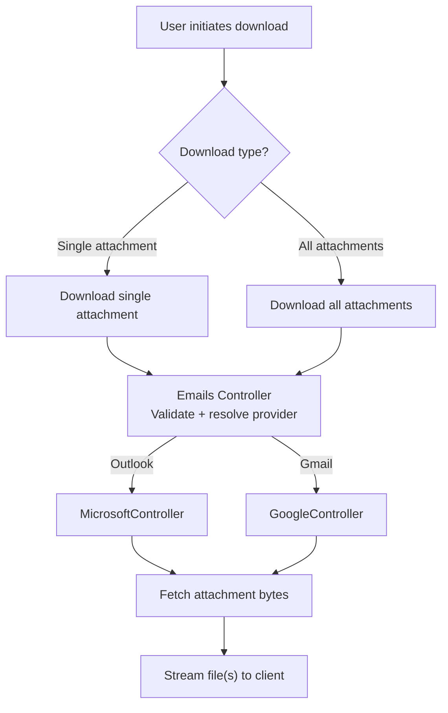

# Attachments Download Module

## Overview

The **Attachments Download module** enables secure retrieval of email attachments from supported email providers (**Outlook** and **Gmail**) through a **provider-agnostic API**.

It provides a **single, predictable interface** for downloading attachments while hiding provider-specific authentication and API differences. This keeps the UI and integrations consistent, even as providers evolve independently.

This module solves:

- A **unified download experience** across Outlook and Gmail
- **Secure, role-based access** to email attachments
- Provider-specific API complexity stays inside backend provider handlers
- Supports both **single attachment download** and **bulk download all** workflows

### Key Responsibilities

- Validate request inputs (`messageId`, `attachmentId`)
- Authorize user via roles: `ADMIN`, `MANAGER`, `STAFF`
- Resolve the authenticated user's provider via `EmailProvider`
- Delegate provider-specific download to `MicrosoftController` or `GoogleController`
- Stream files back using correct `Content-Type` and `filename`

---

## Overall Flowchart


## Unified Entry Point

### Emails Controller – Attachments Download

All attachment downloads are routed through the single Emails controller.

Why a single entry point is used:

- Keeps frontend provider-agnostic
- Centralizes authorization + validation + error handling
- Makes logging/monitoring consistent
- Enables adding providers without changing UI contracts

### Supported Operations

- Download single attachment (implemented)
- Download all attachments (supported by design; typically implemented as ZIP aggregation)

## API: Download Single Attachment

### Endpoint
```http
GET /Message/{messageId}/Attachment/{attachmentId}/Download
Authorization: Bearer <token>
```

### Authorization

Required roles: `ADMIN`, `MANAGER`, `STAFF`

### Input Model

| Property Name | Type | Source | Purpose |
|---------------|------|--------|---------|
| messageId | string | route | Identifies the email message containing the attachment |
| attachmentId | string | route | Identifies the specific attachment to download |

## Core Concepts / Normalization Logic

### Provider Resolution

Provider is resolved from the stored access token:

- Outlook → `MicrosoftController.DownloadAttachment(...)`
- Gmail → `GoogleController.DownloadGmailAttachment(...)`

### Normalized Output Contract

Both providers return the same logical output:

- `fileName` (string)
- `content` (byte[])
- `contentType` (string)

The controller returns:
```csharp
return File(bytes, contentType, fileName);
```

### Edge Cases

- `messageId == null` → error (Invalid message id)
- `attachmentId == null` → error (Invalid attachment id)
- access token missing → error (Access token not found)
- bytes empty or null → `404 NotFound()`
- unsupported provider → error (Unsupported email provider)

## Execution Flow: Download Single Attachment

### Trigger Condition

User clicks Download on a specific attachment in the UI.

### Step-by-step Flow

1. UI calls:
```
   GET /Message/{messageId}/Attachment/{attachmentId}/Download
```

2. API validates `messageId` and `attachmentId`

3. API loads user token from `ApplicationUserAccessTokensDB`

4. API branches based on `accessToken.EmailProvider`:
   - Outlook → build `GraphServiceClient`
   - Gmail → construct `GoogleController`

5. Provider fetches the attachment bytes + metadata

6. API streams the file back to the client using `File(...)`

## Provider Implementation

### Outlook (Microsoft Graph)

#### Controller Delegation
```csharp
var client = _graphSdkHelper.GetAuthenticatedClient(accessToken);
var (fileName, bytes, contentType) =
  await MicrosoftController.DownloadAttachment(client, messageId, attachmentId);
```

#### Provider Method
```csharp
public static async Task<(string fileName, byte[] content, string contentType)>
  DownloadAttachment(GraphServiceClient client, string messageId, string attachmentId)
{
  byte[] bytes = null;
  string fileName = null;
  string contentType = null;

  try
  {
    var attachment = (FileAttachment)await client.Me.Messages[messageId]
      .Attachments[attachmentId].GetAsync();

    if (attachment == null)
      throw new AppModelException("Attachment not found");

    fileName = attachment.Name;
    bytes = attachment.ContentBytes;
    contentType = attachment.ContentType;

    return (fileName, bytes, contentType);
  }
  catch (Exception ex)
  {
    throw new AppModelException("Failed to download attachment", ex);
  }
}
```

### Gmail

The controller follows the same contract:
```csharp
var (fileName, bytes, contentType) =
  await controller.DownloadGmailAttachment(User.GetUserId(), messageId, attachmentId);
```

Gmail logic is provider-specific (Gmail API / blob storage) but must still output:
`(fileName, bytes, contentType)`.

## Download All Attachments (Bulk)

### Purpose

Allows the UI to download all attachments from a message in a single action.

### Typical Backend Strategy

1. List all attachments for the message
2. Download each attachment using the same provider mechanism
3. Package into a ZIP (or tar) archive
4. Stream archive back as a single file

### Considerations

- Large attachment sets can be memory intensive
- Prefer streaming ZIP creation when possible
- Enforce max archive size if needed
- Preserve original filenames and content-types within archive

📌 This document is an index-level module overview.
Keep the Download and Download All endpoints documented separately as:

- `Download.md` (single attachment)
- `DownloadAll.md` (bulk ZIP flow)

## Error Handling Strategy

### Current Behavior (Controller)

Errors are captured into `ApiResponse<bool>`

Response returns:

- `File(...)` on success
- `NotFound()` when bytes are missing
- `BadRequest(ApiResponse)` when validation/provider/token errors occur

### Why This Strategy

- Keeps a consistent JSON error model for most failure cases
- Still supports raw file streaming on success (binary response)

### Recommended Enhancement (Future)

Consider returning provider errors as proper HTTP status codes consistently:

- `400` for validation
- `401` for auth/token missing
- `404` for not found
- `502` for provider issues
- `500` for unexpected failures

## Design Principles

- Provider-agnostic contract
- Single controller entry point
- Thin controller, provider-specific services
- Extensible provider routing
- Stream-first response design to support large file downloads safely

## Final Outcome

This design achieves:

- A single UI + integration contract for downloading attachments
- Provider switching without frontend rewrites
- Clear separation of responsibilities (controller vs provider logic)
- Streaming-friendly response behavior for scalability and UX