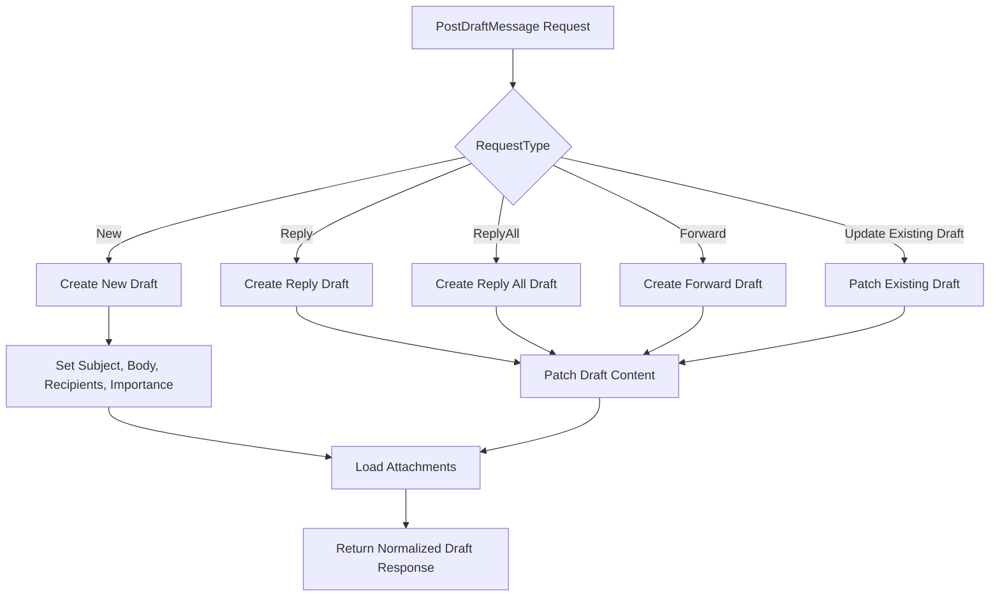
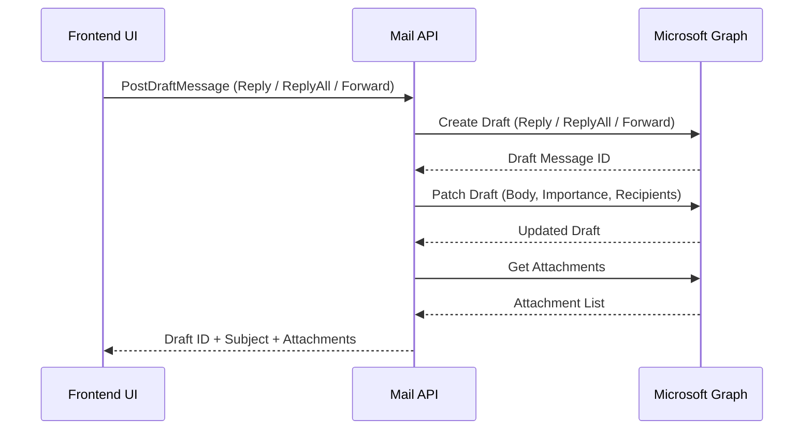
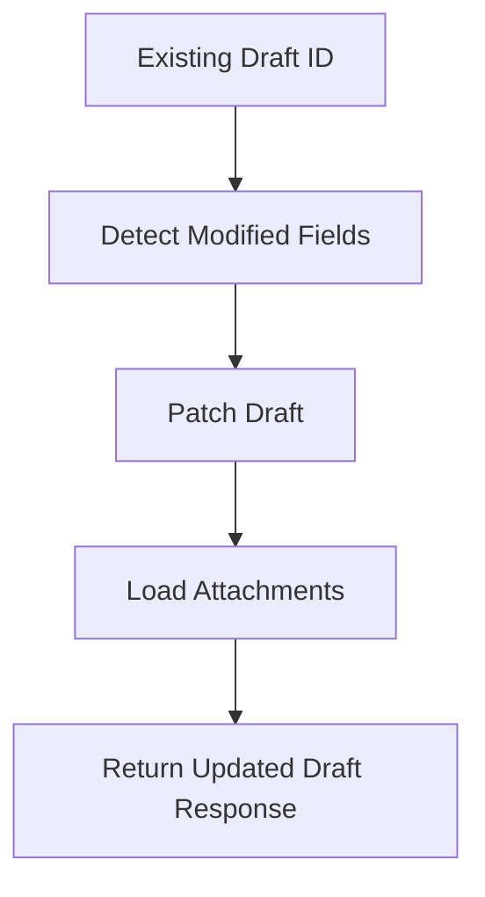
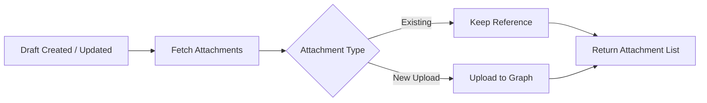

# Draft Email Handling – Detailed Flow Documentation (Outlook / Microsoft Graph)

This document explains **how the `PostDraftMessage` method works end-to-end**, including request models, internal logic, and how different email actions (**New, Reply, Reply All, Forward**) are handled using **Microsoft Graph**.

---

## 1. Purpose of `PostDraftMessage`

`PostDraftMessage` is a **single unified entry point** responsible for:

- Creating a **new draft**
- Updating an **existing draft**
- Creating drafts for **Reply / Reply All / Forward**
- Updating recipients, subject, body, and importance
- Fetching attachments associated with the draft

It returns a **normalized response** containing:

- **`Id`** → Draft message ID  
- **`Name`** → Subject  
- **`Value`** → List of attachments

---

## 2. Input Model – `EmailRequest`

`EmailRequest` acts as a **provider-agnostic payload** from the frontend.

### Fields Breakdown

| Property | Purpose |
|--------|--------|
| `Id` | Existing message ID (used for replies, forwards, or updating drafts) |
| `Importance` | Email priority (Low / Normal / High) |
| `RequestType` | Determines the action (New, Reply, ReplyAll, Forward) |
| `ToRecipients` | List of To recipients |
| `CcRecipients` | List of CC recipients |
| `BccRecipients` | List of BCC recipients |
| `Subject` | Email subject |
| `Body / Content` | HTML email body |
| `Attachments` | New files to be uploaded |
| `ExistingAttachmentIds` | Already attached file references |
| `ScheduleDateTime` | Optional follow-up or scheduling metadata |

---

## 3. Recipient Modeling (`IdNameModel`)

Recipients are passed as:

```csharp
IdNameModel<string>
```

Where:

- **`Id`** → Email address  
- **`Name`** → Display name

### Conversion to Microsoft Graph Recipient

```csharp
new Recipient
{
    EmailAddress = new EmailAddress
    {
        Address = e.Id,
        Name = e.Name
    }
}
```

---

## 4. Importance Resolution

Importance is normalized before sending to Microsoft Graph:

- Defaults to **Normal**
- Explicitly maps to:
  - **High**
  - **Low**

This guarantees a valid importance value in all cases.

---

## 5. Base Message Construction

A reusable base message is constructed early:

```csharp
new Message
{
    Importance = importance,
    ToRecipients = toRecipients,
    CcRecipients = ccRecipients,
    BccRecipients = bccRecipients
}
```

### Purpose

- Avoids duplication
- Ensures consistent recipient handling
- Acts as the foundation for all draft operations

---

## 6. Draft Patch Helper – `PatchDraftAsync`

### Why It Exists

Microsoft Graph draft APIs for **Reply / Reply All / Forward** do **not allow full body replacement** during draft creation.

### Patch Strategy

1. Create the draft
2. Patch the draft with:
   - HTML body
   - Importance
   - Updated recipients

### Fields Updated

- `Body`
- `Importance`
- `ToRecipients`
- `CcRecipients`
- `BccRecipients`

This ensures the UI-defined content is always applied.

---

## 7. Attachment Loading Strategy

After every draft operation:

```csharp
client.Me.Messages[draftId].Attachments.GetAsync();
```

### Result

- Always retrieves the latest attachment state
- Supports existing and newly added attachments
- Keeps the UI synchronized with the server

---

## 8. Request Type Execution Flow

### A. Reply

**Flow**

1. Validate original message ID
2. Call `CreateReply`
3. Patch the draft with updated body and recipients
4. Return draft ID and subject

**Why Patch?**

Graph auto-generates quoted content; patching ensures UI-controlled content.

---

### B. Reply All

**Flow**

1. Validate message ID
2. Call `CreateReplyAll`
3. Patch body and recipients
4. Preserve all recipients

---

### C. Forward

**Flow**

1. Validate original message ID
2. Call `CreateForward`
3. Patch draft body and recipients
4. Retain original attachments

---

### D. Update Existing Draft

**Triggered when:** `Id` exists without a special request type.

**Behavior**

- Only patches modified fields
- Prevents overwriting unchanged data

---

### E. Create New Draft

**Triggered when:** No `Id` is provided.

**Flow**

1. Create a new draft message
2. Set subject, body, recipients, and importance
3. Return the newly created draft ID

---

## 9. File & Attachment Model – `FileModel`

Used for both **new uploads** and **existing attachments**.

| Property | Purpose |
|--------|--------|
| `Id` | Existing attachment ID |
| `File` | Uploaded file (`IFormFile`) |
| `ContentByte` | Base64 encoded file content |
| `ContentType` | MIME type |
| `Name` | File name |

Supports **multipart** and **JSON-based** uploads.

---

## 10. Scheduling Model – `ScheduleDateTime`

Used for follow-up or delayed actions (**outside Graph native scheduling**).

### Fields

- `FollowUpDate`
- `FollowUpHour`
- `FollowUpMinute`
- `FollowUpTT` (AM / PM)

Includes validation for correct date formats.

---

## 11. Error Handling Strategy

All errors are wrapped using:

```csharp
throw new AppModelException("Draft operation failed");
```

### Benefits

- Clean, consistent API error responses
- Prevents leaking Microsoft Graph internals

---

## 12. Key Design Principles

- Single method, multiple draft behaviors
- Provider-agnostic request models
- Patch-first update strategy
- Optimized Microsoft Graph usage
- Consistent attachment synchronization
- UI-friendly response structure

---

## 13. Mermaid Flowcharts

### A. Overall `PostDraftMessage` Flow



---

### B. Reply / Reply All / Forward – Patch Strategy



---

### C. Update Existing Draft Flow



---

### D. Attachment Synchronization Flow



---

## 14. Final Outcome

This implementation delivers:

- Predictable draft lifecycle
- Unified compose experience
- Minimal API overhead
- High UI consistency
- Scalable provider integration

     