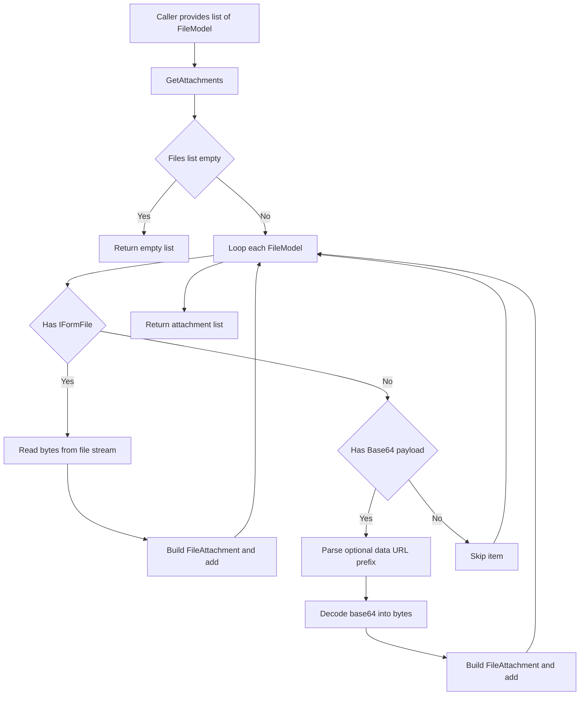
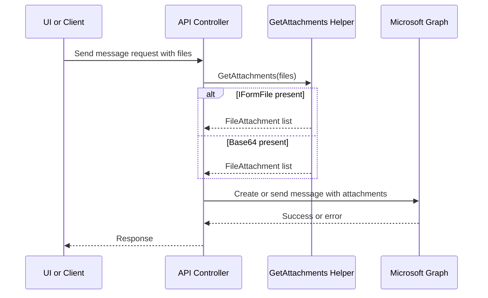
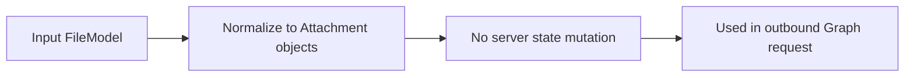
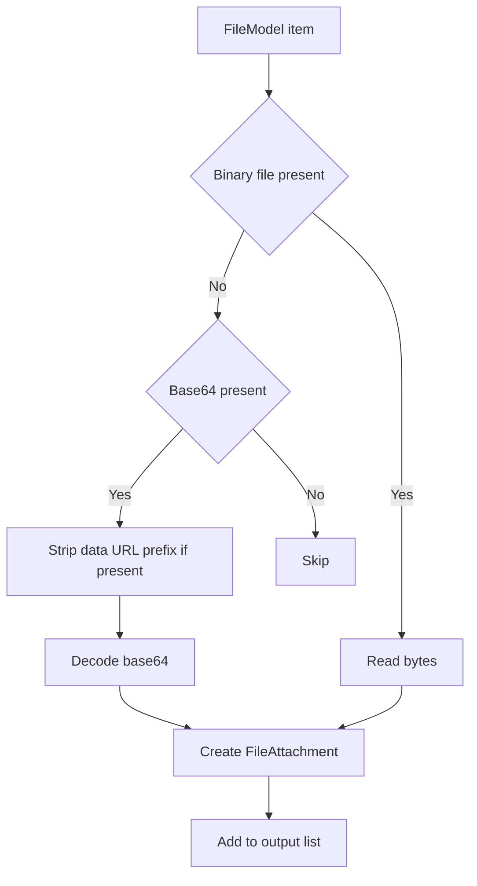

# 📎 Email Attachments – Build Microsoft Graph Attachments from Files

## Attachment Normalization – Detailed Flow Documentation (Microsoft Graph)

This document explains the **end-to-end flow** of the `GetAttachments` helper, which normalizes incoming UI/API file payloads into **Microsoft Graph `Attachment` objects** (specifically `FileAttachment`) suitable for message create/reply/forward operations.

The method supports two input shapes commonly produced by web and mobile clients:
- **Binary upload** via `IFormFile`
- **Inline payload** via **Base64** (optionally wrapped as a data URL)

---

## 1. Overview

### High-level purpose of the module
`GetAttachments` converts heterogeneous incoming files (`FileModel`) into a consistent list of Microsoft Graph `Attachment` objects.

### What problems it solves
- Allows frontend clients to send attachments in different formats without changing Graph integration code.
- Ensures attachment bytes are fully read and safe to send to Graph.
- Handles Base64 payload variations (plain vs `data:<type>;base64,` prefix).
- Applies sensible defaults for missing names and content types.

### Key responsibilities
- Validate file list inputs and short-circuit when empty.
- Prefer `IFormFile` binary content when present.
- Fall back to Base64 content when binary is absent.
- Normalize:
  - Attachment name
  - Content type
  - Raw bytes (`ContentBytes`)
- Throw clear errors for invalid Base64 payloads.

---

## 2. Unified Entry Point

### Method
```csharp
public static async Task<List<Attachment>> GetAttachments(List<FileModel> files)
```

### Why a single entry point is used
- Centralizes normalization rules and default handling.
- Makes all message-write workflows (send, reply, forward, draft update) reuse the same logic.
- Reduces provider/SDK coupling in controllers.

### Operations it supports
- Convert `IFormFile` uploads into Graph `FileAttachment`.
- Convert Base64 / data URL strings into Graph `FileAttachment`.
- Skip invalid or empty items (except invalid Base64 which is treated as an error).

---

## 3. Input Models

### `FileModel`

| Property | Type | Purpose |
|---|---|---|
| File | `IFormFile?` | Binary file upload (preferred input when present) |
| Name | `string?` | Optional override for filename |
| ContentType | `string?` | MIME type for attachment; used when `File.ContentType` missing or when using Base64 |
| ContentByte | `string?` | Base64 payload; may be a plain base64 string or a data URL (`data:...;base64,...`) |

### Output Model

| Type | Purpose |
|---|---|
| `List<Attachment>` | Microsoft Graph attachment list to be sent in message create/reply/forward calls |
| Concrete type per item | `FileAttachment` (`#microsoft.graph.fileAttachment`) |

---

## 4. Core Concepts / Normalization Logic

### Priority order (most important design rule)
The helper chooses the best available representation per file item:

1. **Binary `IFormFile`** (most reliable)
2. **Base64 string** (`ContentByte`)
3. Otherwise: **skip** the item

This prevents ambiguous cases and ensures deterministic behavior.

---

### Binary path normalization (`IFormFile`)
For an item with `f.File != null`:
- Fully reads the stream into memory using `CopyToAsync` (avoids partial reads).
- Sets:
  - `Name`: `f.Name` if provided, else `f.File.FileName`
  - `ContentType`: `f.File.ContentType` if present, else `f.ContentType`
  - `ContentBytes`: the read bytes

---

### Base64 path normalization (`ContentByte`)
For an item with `ContentByte` populated:
- Supports **optional data URL prefix**, e.g.:
  - `data:image/jpeg;base64,AAAA...`
  - `data:application/pdf;base64,BBBB...`
- If a data URL is detected:
  - Strips everything before the comma (keeps only base64 payload).
  - If `ContentType` is missing, attempts to extract it from `data:<mime>;...`

Then:
- Decodes using `Convert.FromBase64String`.
- On `FormatException`, throws an `ApplicationException` with attachment context.
- Applies defaults:
  - `Name`: `"attachment"` when missing
  - `ContentType`: `"application/octet-stream"` when missing

---

### Defaults & edge cases
- `files == null` or empty list → returns empty list.
- Item has neither `File` nor `ContentByte` → skipped (no exception).
- Base64 with invalid format → **throws** (fail-fast, client must fix payload).
- `OdataType` is set explicitly to `#microsoft.graph.fileAttachment` (SDK can infer it; explicit is OK for clarity).

---

## 5. Base Object Construction

### `FileAttachment` construction
```csharp
var fa = new FileAttachment
{
    OdataType = "#microsoft.graph.fileAttachment",
    Name = ...,
    ContentType = ...,
    ContentBytes = bytes
};
```

### Why this exists
- Produces the exact object shape required by Microsoft Graph for file attachments.
- Keeps attachment assembly consistent across all message workflows.

### What it prevents / optimizes
- Prevents sending partial streams or empty bytes.
- Prevents missing MIME type issues by applying defaults.
- Optimizes code reuse and reduces controller complexity.

---

## 6. Internal Helpers / Services

### In-method components
- `MemoryStream` for reading `IFormFile` safely and completely.
- Data URL parsing logic to extract:
  - MIME type (optional)
  - Base64 payload
- `Convert.FromBase64String` for decoding.

### Why they exist
- To support multiple client upload strategies without changing external API shapes.
- To keep Microsoft Graph integration code clean and focused on Graph calls.

### When they are used
- Every time the application needs to attach files to a message being created/sent/replied/forwarded.

---

## 7. Execution Flow by Action Type

### Action: Build Graph Attachments (Normalization)

#### Trigger conditions
- A message operation requires attachments.
- Caller provides a `List<FileModel>` payload.

#### Step-by-step flow
1. Initialize `attachments` list.
2. If `files` is null or empty → return empty list.
3. For each file model `f`:
   1. If `f.File` present:
      - Read bytes via `CopyToAsync`.
      - Build `FileAttachment` from file metadata + bytes.
      - Add to output list.
      - Continue to next item.
   2. Else if `f.ContentByte` present:
      - If data URL prefix detected:
        - Extract content-type if missing.
        - Strip prefix to raw base64.
      - Decode base64:
        - If invalid → throw `ApplicationException`.
      - Build `FileAttachment` with defaults.
      - Add to output list.
      - Continue.
   3. Else:
      - Skip item (optional log hook).
4. Return `attachments`.

#### Special considerations / constraints
- This helper reads full attachment content into memory (size considerations apply).
- Invalid Base64 is treated as an error (client must correct payload).
- Skipping “empty items” is intentional to tolerate mixed payloads.

---

## 8. Attachment / Asset Handling

### Upload strategy
This helper supports two strategies (input-side):
- **Multipart upload** (`IFormFile`)
- **JSON Base64 payload** (`ContentByte`), optionally a data URL

### Sync strategy
Not applicable. This helper builds request objects only.

### Retrieval strategy
Not applicable. This helper does not fetch content; it only normalizes input.

---

## 9. Scheduling / Metadata Handling

### Model explanation
- `Name` and `ContentType` are treated as metadata used by the email provider and clients.

### Validation rules
- `Name` defaults to `"attachment"` when missing.
- `ContentType` defaults to `"application/octet-stream"` when missing.
- For data URLs, MIME type may be inferred when missing.

### Limitations
- MIME type extraction from data URL is best-effort and assumes `data:<mime>;...` format.
- No validation is performed to confirm content bytes actually match the MIME type.

---

## 10. Error Handling Strategy

### How errors are wrapped
- Base64 decoding errors (`FormatException`) are wrapped in:
```csharp
throw new ApplicationException($"Invalid base64 for attachment '{name}'", fe);
```

### Why this strategy is used
- Invalid Base64 is a client contract violation; failing fast avoids sending corrupt payloads to Graph.
- Error message includes attachment name context for debugging.

### Benefits
- Clear, actionable client errors.
- Prevents silent corruption and confusing Graph failures.
- Keeps controller-level handling simpler.

---

## 11. Design Principles

### Key architectural principles
- **Normalization at the boundary**: convert varied inputs into one internal shape early.
- **Deterministic precedence**: `IFormFile` wins over Base64.
- **Fail-fast on corrupt payloads**: invalid Base64 triggers explicit errors.
- **Minimal SDK coupling**: callers receive `List<Attachment>` and don’t need Graph construction logic.

### Scalability considerations
- Memory usage scales with total attachment bytes; large files can cause high memory pressure.
- For very large attachments, consider:
  - streaming to provider (if supported)
  - server-side temp storage with chunking
  - upload sessions (Outlook large attachments via upload session)

### Provider-agnostic / extensibility notes
- While this implementation targets **Microsoft Graph**, the *normalization concept* can be reused for other providers by mapping:
  - `Name`
  - `ContentType`
  - `ContentBytes`
into their attachment models.

---

## 12. Mermaid Diagrams (MANDATORY)

### Overall Flowchart (high-level request lifecycle)


### Sequence Diagram (UI → API → External Service)


### Update / Patch Flow


### Attachment or Asset Flow


---

## 13. Final Outcome

### What this design achieves
- A reliable attachment normalization pipeline for Microsoft Graph message operations.
- Support for both multipart uploads and Base64 JSON payloads.
- Consistent defaulting and error behavior that simplifies upstream code.

### Benefits for UI, API, and scalability
- **UI**: Flexible upload formats (multipart or Base64).
- **API**: Centralized normalization rules and predictable error handling.
- **Scalability**: Clear upgrade path for large-file strategies (chunking/upload sessions).
