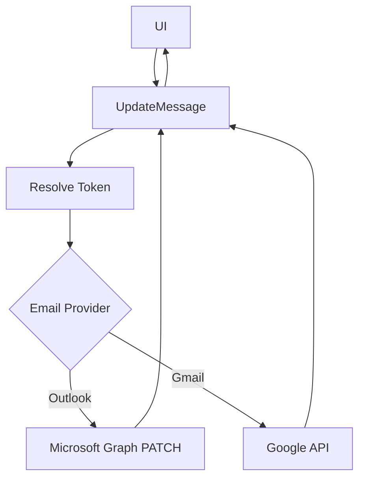
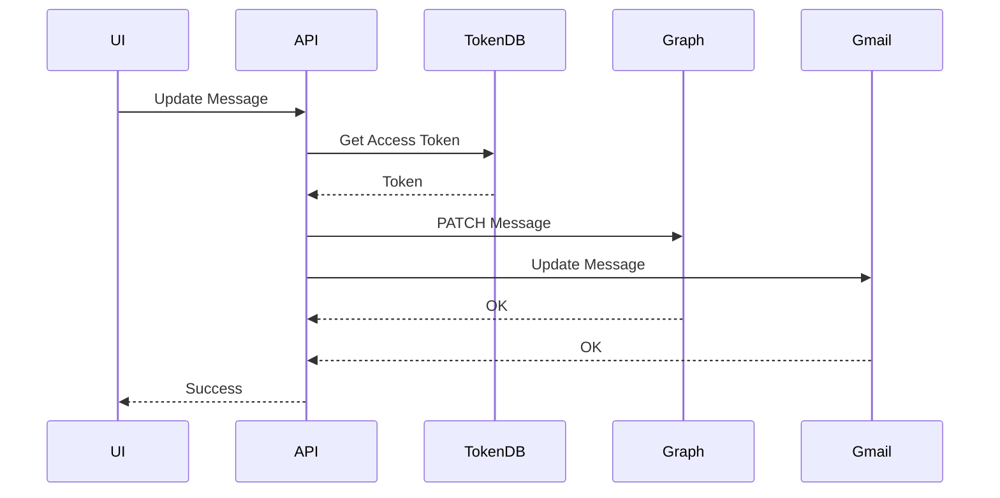
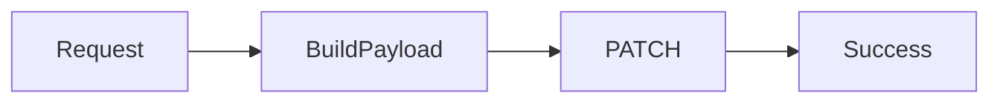
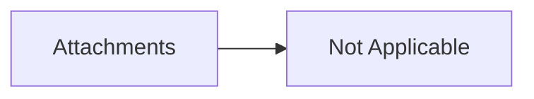

# Unified Email Message Update Module (Outlook & Gmail)

## 1. Overview

### Purpose
The **Email Message Update Module** provides a unified mechanism to update email message state across multiple providers (Outlook and Gmail). It supports common email actions such as marking messages as read/unread, flagging, and category management.

### Problems It Solves
- Eliminates provider-specific logic from controllers
- Provides a single API for multiple email update actions
- Normalizes update behavior across Outlook and Gmail

### Key Responsibilities
- Authenticate and identify the user’s email provider
- Route update requests to provider-specific implementations
- Apply partial updates to messages using PATCH semantics
- Handle provider-specific constraints and date formats

---

## 2. Unified Entry Point

### API Endpoint
```http
POST /UpdateMessage/{id}
```

### Controller Method
```csharp
public async Task<ApiResponse<bool>> UpdateMessage(string id, [FromForm] EmailUpdate model)
```

### Why a Single Entry Point
- Simplifies frontend integration
- Centralizes authorization and provider detection
- Enables extensibility for future update actions

### Supported Operations
- Mark Read / Unread
- Flag / Unflag
- Add Category
- Remove Category

---

## 3. Input Models

### Route & Form Parameters

| Property | Type | Purpose |
|--------|------|--------|
| `id` | `string` | Unique message identifier |
| `model` | `EmailUpdate` | Update payload defining the action |

### EmailUpdate Model

| Property | Type | Purpose |
|--------|------|--------|
| `Type` | `EmailUpdateType` | Determines update operation |
| `IsRead` | `bool?` | Used for read/unread updates |
| `CategoryId` | `string?` | Category to add or remove |
| `FlagModel` | `EmailFlagUpdate?` | Flag update details |

### EmailUpdateType Enum

| Value | Description |
|-----|------------|
| `ReadUnRead` | Marks message as read/unread |
| `Flag` | Applies or removes follow-up flag |
| `Category` | Adds a category |
| `RemoveSingleCategory` | Removes a category |

---

## 4. Core Concepts / Normalization Logic

### Provider Detection
The user’s email provider is resolved using stored access tokens:

```csharp
accessToken.EmailProvider
```

### Partial Update Strategy
- Uses **PATCH** semantics
- Only modified fields are sent to provider APIs
- Prevents accidental overwrites

---

## 5. Base Object Construction

### Update Payload

```csharp
var requestBody = new Message
{
    LastModifiedDateTime = DateTime.UtcNow
};
```

### Why This Exists
- Ensures consistent audit metadata
- Limits payload to only changed fields

---

## 6. Internal Helpers / Services

### Outlook
- `MicrosoftController.UpdateMessage()`
- Uses `GraphServiceClient`

### Gmail
- `GoogleController.MarkAsRead()`

### Token Resolution
- `ApplicationUserAccessTokensDB`

---

## 7. Execution Flow by Action Type

### Action: Read / Unread

**Trigger**: User toggles read state

**Flow**:
1. Resolve provider
2. Build PATCH payload (`IsRead`)
3. Execute provider update

---

### Action: Flag / Unflag

**Trigger**: User flags message

**Flow**:
1. Map flag dates to Graph `DateTimeTimeZone`
2. Apply `FollowupFlag`
3. PATCH message

**Special Considerations**:
- Date format: `dd/MM/yyyy`
- Timezone applied explicitly

---

### Action: Add Category

**Trigger**: User assigns category

**Flow**:
1. Fetch existing categories
2. Append new category
3. PATCH updated list

---

### Action: Remove Category

**Trigger**: User removes category

**Flow**:
1. Validate category existence
2. Remove from list
3. PATCH updated list

---

## 8. Attachment / Asset Handling

> Not applicable for this module

---

## 9. Scheduling / Metadata Handling

### Flag Dates

| Field | Format | Notes |
|-----|-------|------|
| StartDateTime | `dd/MM/yyyy` | Converted to UTC |
| DueDateTime | `dd/MM/yyyy` | Optional |
| CompletedDateTime | `dd/MM/yyyy` | Optional |

---

## 10. Error Handling Strategy

### Strategy
- Controller wraps errors in `ApiResponse`
- Service throws `AppModelException`

### Benefits
- Unified error surface for UI
- Provider-specific errors are hidden

---

## 11. Design Principles

### Architectural Principles
- **Provider Abstraction**
- **Single Responsibility**
- **Patch-Only Updates**

### Scalability Considerations
- Easy to add new update actions
- Provider expansion ready

---

## 12. Mermaid Diagrams

### Overall Flowchart


### Sequence Diagram


### Update / Patch Flow


### Attachment Flow


---

## 13. Final Outcome

### What This Design Achieves
- Unified message updates across providers
- Safe, minimal PATCH operations
- Clear separation of concerns

### Benefits
- **UI**: Single update API
- **API**: Centralized logic
- **Scalability**: Easy action & provider extension

---

**Status:** Production-ready, extensible message update architecture