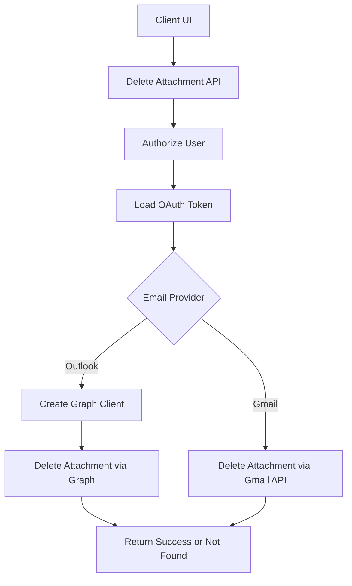
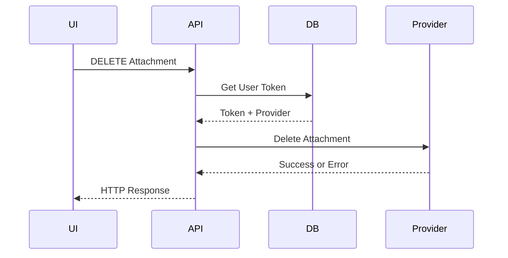
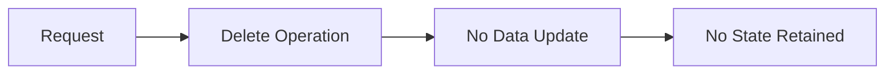
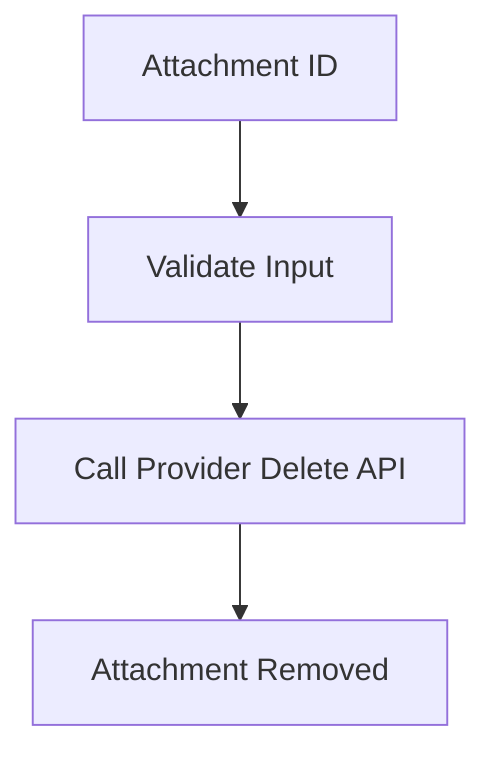

# 🗑️ Email Attachment – Delete

## Email Attachment Deletion – Detailed Flow Documentation (Outlook / Gmail)

This document describes the **end-to-end design and execution flow** of the **Delete Attachment** feature, which allows authorized users to delete a specific attachment from an email message across **Outlook (Microsoft Graph)** and **Gmail**, using a single unified API.

---

## 1. Overview

### High-level purpose of the module
The **Delete Attachment** module provides a secure and provider-agnostic API to delete an individual attachment from an email message.

### What problems it solves
- Removes provider-specific logic from the UI layer.
- Ensures consistent authorization and validation across providers.
- Abstracts Outlook and Gmail deletion mechanics.
- Provides predictable API responses for success and failure cases.

### Key responsibilities
- Validate request inputs.
- Authenticate and authorize the user.
- Resolve the user’s email provider.
- Invoke provider-specific attachment deletion.
- Map provider responses to standard HTTP results.

---

## 2. Unified Entry Point

### API Endpoint
```http
DELETE /Message/{messageId}/Attachment/{attachmentId}/Delete
```

### Controller Method
```csharp
Task<IActionResult> Delete(string messageId, string attachmentId)
```

### Why a single entry point is used
- Keeps frontend logic provider-agnostic.
- Centralizes authorization, validation, and error handling.
- Enables extensibility without API contract changes.

### Operations it supports
- Delete attachment from Outlook emails.
- Delete attachment from Gmail emails.

---

## 3. Input Models

### Route Parameters

| Property       | Type   | Purpose |
|----------------|--------|---------|
| messageId      | string | Identifier of the email message |
| attachmentId   | string | Identifier of the attachment to delete |

### Implicit Inputs
- Authenticated user context (JWT)
- User roles: `ADMIN`, `MANAGER`, `STAFF`
- OAuth access token from persistence

---

## 4. Core Concepts / Normalization Logic

### Provider Resolution
The provider is determined using the stored OAuth token:
- Outlook → Microsoft Graph
- Gmail → Google APIs

### Validation Rules
- `messageId` must not be null or empty.
- `attachmentId` must not be null or empty.
- Missing or unsupported provider results in a client error.

No data transformation is required since this is a delete-only operation.

---

## 5. Base Object Construction

### Authenticated Provider Clients

#### Microsoft Graph Client
```csharp
_graphSdkHelper.GetAuthenticatedClient(accessToken)
```

**Why it exists**
- Centralizes Graph authentication logic.
- Ensures consistent client configuration.

**What it prevents**
- Token misuse.
- Repeated authentication boilerplate.

---

## 6. Internal Helpers / Services

### ApplicationUserAccessTokensDB
- Retrieves OAuth tokens for the authenticated user.
- Determines which email provider is active.

### MicrosoftController.DeleteAttachment
- Deletes an attachment via Microsoft Graph.
- Wraps provider exceptions into domain exceptions.

### GoogleController.DeleteGmailAttachment
- Deletes an attachment via Gmail APIs.
- Normalizes provider-specific errors into boolean results.

---

## 7. Execution Flow by Action Type

### Action: Delete Attachment

#### Trigger conditions
- Valid `messageId` and `attachmentId`.
- User is authenticated and authorized.
- Supported email provider.
- Attachment exists.

---

#### Step-by-step flow
1. Validate `messageId` and `attachmentId`.
2. Fetch OAuth token for the user.
3. Resolve email provider.
4. Provider branch:
   - **Outlook**
     - Create Graph client.
     - Invoke `DeleteAttachment`.
   - **Gmail**
     - Invoke `DeleteGmailAttachment`.
5. If deletion succeeds → return HTTP 200.
6. If attachment not found → return HTTP 404.
7. If validation or provider errors occur → return HTTP 400.

---

#### Special considerations / constraints
- Deletion is irreversible.
- Provider permissions must allow attachment deletion.
- Failures are logged and wrapped consistently.

---

## 8. Attachment / Asset Handling

### Upload strategy
Not applicable.

### Sync strategy
- Deletion is executed directly against the provider.
- No background jobs or retries.

### Retrieval strategy
- Outlook: Microsoft Graph Attachments API.
- Gmail: Google attachment delete endpoint.

---

## 9. Scheduling / Metadata Handling

### Model explanation
Not applicable.

### Validation rules
Not applicable.

### Limitations
- No undo or soft-delete capability.

---

## 10. Error Handling Strategy

### How errors are wrapped
- Provider exceptions are wrapped using `AppModelException`.
- Controller aggregates errors into a standard API response.

### Why this strategy is used
- Prevents provider error leakage.
- Ensures consistent client-facing responses.
- Simplifies frontend error handling.

### Benefits
- Predictable HTTP behavior.
- Centralized logging.
- Clean separation of concerns.

---

## 11. Design Principles

### Key architectural principles
- Provider abstraction.
- Stateless request processing.
- Explicit validation.

### Scalability considerations
- No shared mutable state.
- Safe for horizontal scaling.

### Provider-agnostic extensibility
- New providers can be added internally.
- No changes required to API consumers.

---

## 12. Mermaid Diagrams (MANDATORY)

### Overall Flowchart (high-level request lifecycle)


---

### Sequence Diagram (UI → API → External Service)


---

### Update / Patch Flow


---

### Attachment Flow


---

## 13. Final Outcome

### What this design achieves
- A single, clean API for deleting email attachments.
- Consistent behavior across Outlook and Gmail.
- Clear separation between orchestration and provider logic.

### Benefits for UI, API, and scalability
- **UI**: Simple delete action, no provider logic.
- **API**: Centralized validation and error handling.
- **Scalability**: Stateless, provider-agnostic, and extensible.
