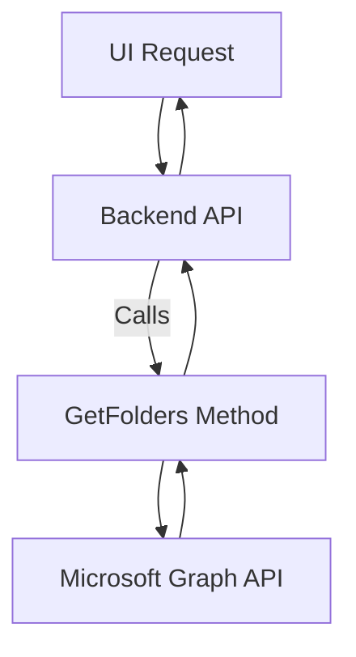
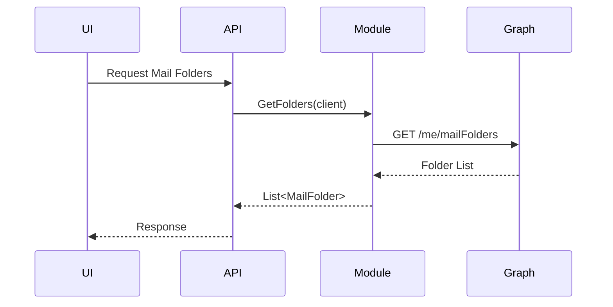
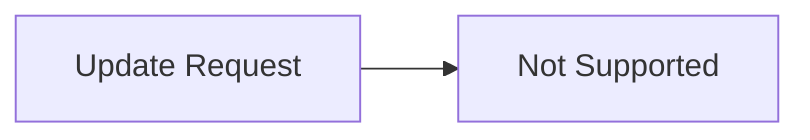
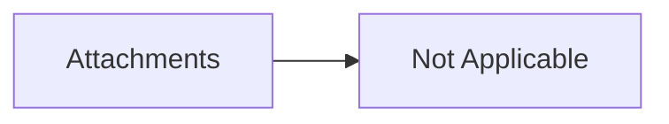

# Mail Folder Retrieval Module (Microsoft Graph)

## 1. Overview

### Purpose
The **Mail Folder Retrieval Module** is responsible for fetching a user's mail folders from Microsoft Outlook via the **Microsoft Graph API** using the `GraphServiceClient`.

### Problems It Solves
- Provides a centralized, reusable way to retrieve mailbox folders
- Abstracts Microsoft Graph SDK complexity from higher layers
- Ensures consistent error handling and response structure

### Key Responsibilities
- Communicate with Microsoft Graph `/me/mailFolders` endpoint
- Retrieve folder metadata (ID, name, counts)
- Apply query optimization (field selection & pagination limits)
- Wrap and normalize errors into domain-specific exceptions

---

## 2. Unified Entry Point

### Entry Method
```csharp
public static async Task<List<MailFolder>> GetFolders(GraphServiceClient client)
```

### Why a Single Entry Point
- Enforces **consistent Graph access patterns**
- Centralizes query configuration
- Simplifies future enhancements (pagination, caching, subfolders)

### Supported Operations
- Fetch top-level mail folders
- Selectively retrieve essential folder metadata

---

## 3. Input Models

### Method Parameters

| Property | Type | Purpose |
|--------|------|--------|
| `client` | `GraphServiceClient` | Authenticated Microsoft Graph client used to execute API calls |

---

## 4. Core Concepts / Normalization Logic

### Field Selection
Only essential fields are requested to minimize payload size:
- `Id`
- `DisplayName`
- `TotalItemCount`
- `UnreadItemCount`

```csharp
config.QueryParameters.Select = new[] {
    "Id",
    "DisplayName",
    "TotalItemCount",
    "UnreadItemCount"
};
```

### Pagination Strategy
- Uses `Top = 100` as a safe default
- Prevents excessive payloads
- Can be extended to handle `@odata.nextLink`

### Edge Case Handling
- If `folders.Value` is `null`, a domain exception is thrown

---

## 5. Base Object Construction

### Response Object
```csharp
var response = new List<MailFolder>();
```

### Why This Exists
- Ensures method always returns a predictable collection type
- Prevents null propagation to upper layers

---

## 6. Internal Helpers / Services

### Microsoft Graph SDK
- `GraphServiceClient` handles:
  - Authentication
  - Token refresh
  - HTTP retries

### Potential Extensions
- `GetSubFolders(client, folder.Id)` (currently commented)
- Folder tree builder service

---

## 7. Execution Flow

### Action: Fetch Mail Folders

#### Trigger
- UI or API requests mailbox folder list

#### Step-by-Step Flow
1. Initialize empty folder list
2. Execute Graph API request
3. Apply query constraints (Top, Select)
4. Validate response
5. Return folder list

#### Constraints
- Requires valid OAuth token
- Limited to top-level folders only

---

## 8. Attachment / Asset Handling

> Not applicable for this module

---

## 9. Scheduling / Metadata Handling

> Not applicable for this module

---

## 10. Error Handling Strategy

### Strategy
All exceptions are wrapped in a custom domain exception:

```csharp
catch (Exception ex)
{
    throw new AppModelException(ex.Message);
}
```

### Why This Strategy
- Prevents SDK-specific exceptions leaking to UI
- Enables centralized logging & user-friendly messaging

### Benefits
- Clean API contracts
- Consistent error semantics

---

## 11. Design Principles

### Architectural Principles
- **Single Responsibility**: Only folder retrieval
- **Abstraction**: SDK logic hidden from callers
- **Fail Fast**: Immediate exception on invalid state

### Scalability Considerations
- Pagination-ready
- Easy to cache results

### Provider Agnostic Notes
- Can be adapted for Gmail / IMAP by swapping service layer

---

## 12. Mermaid Diagrams

### Overall Flowchart


### Sequence Diagram


### Update / Patch Flow


### Attachment Flow


---

## 13. Final Outcome

### What This Design Achieves
- Clean and maintainable Graph integration
- Predictable data contracts
- Strong separation of concerns

### Benefits
- **UI**: Simple, consistent data model
- **API**: Centralized logic & error handling
- **Scalability**: Easy extension for pagination and subfolders

---

**Status:** Production-ready and extensible

