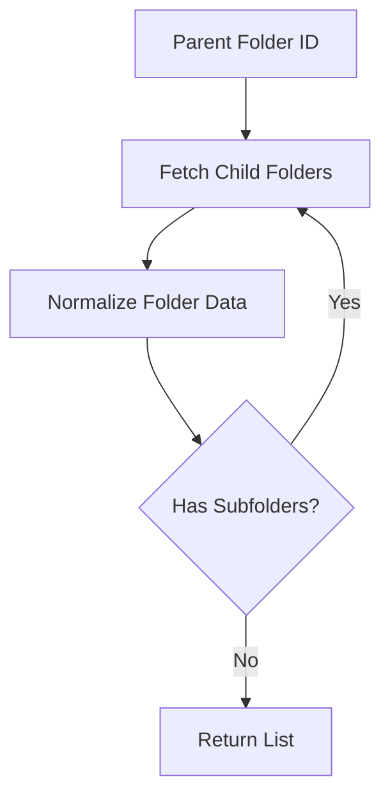
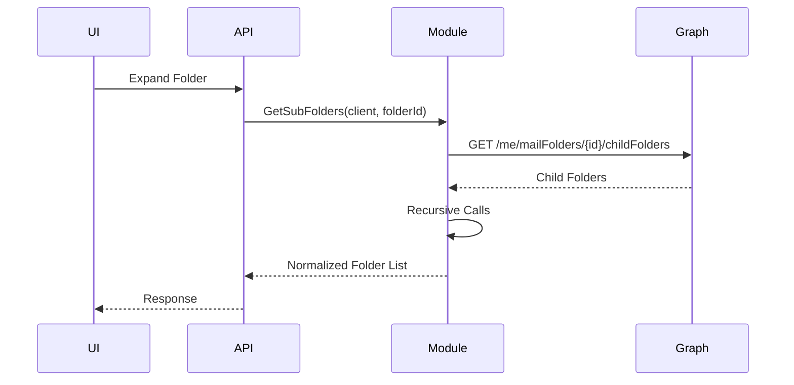
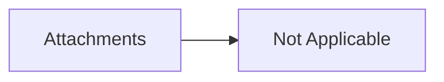

# Mail Subfolder Retrieval & Normalization Module (Microsoft Graph)

## 1. Overview

### Purpose
The **Mail Subfolder Retrieval & Normalization Module** is responsible for recursively fetching all child mail folders under a given parent folder and normalizing them into a simplified, UI-friendly model.

### Problems It Solves
- Retrieves nested mail folder hierarchies
- Converts Graph SDK folder models into lightweight domain models
- Applies business-specific logic for unread vs total count

### Key Responsibilities
- Fetch child folders using Microsoft Graph
- Traverse folder trees recursively
- Normalize folder metadata into `IdNameValueModel<int>`
- Apply conditional value calculation logic

---

## 2. Unified Entry Point

### Entry Method
```csharp
private static async Task<List<IdNameValueModel<int>>> GetSubFolders(
    GraphServiceClient client,
    string folderId
)
```

### Why a Single Entry Point
- Centralizes recursive traversal logic
- Prevents duplication across callers
- Ensures consistent normalization rules

### Supported Operations
- Retrieve immediate child folders
- Recursively retrieve nested subfolders

---

## 3. Input Models

### Method Parameters

| Property | Type | Purpose |
|--------|------|--------|
| `client` | `GraphServiceClient` | Authenticated Microsoft Graph client |
| `folderId` | `string` | ID of the parent mail folder |

---

## 4. Core Concepts / Normalization Logic

### Field Selection Optimization
Only essential fields are requested:
- `Id`
- `DisplayName`
- `TotalItemCount`
- `UnreadItemCount`

```csharp
config.QueryParameters.Select = new[] {
    "Id",
    "DisplayName",
    "TotalItemCount",
    "UnreadItemCount"
};
```

### Normalized Output Model
Each Graph `MailFolder` is transformed into:

```csharp
IdNameValueModel<int>
```

| Property | Source | Purpose |
|--------|-------|--------|
| `Id` | `MailFolder.Id` | Unique folder identifier |
| `Name` | `MailFolder.DisplayName` | Folder display name |
| `Value` | Derived | Item count based on business rules |

### Business Rule: Value Calculation

```csharp
Value = subFolder.DisplayName.Contains("Draft")
    ? (subFolder.TotalItemCount ?? 0)
    : (subFolder.UnreadItemCount ?? 0);
```

- **Draft folders** → show total items
- **Other folders** → show unread count
- Null-safe fallback to `0`

---

## 5. Base Object Construction

### Collection Initialization

```csharp
var subFolders = new List<IdNameValueModel<int>>();
```

### Why This Exists
- Guarantees predictable return type
- Prevents null propagation
- Simplifies UI rendering

---

## 6. Internal Helpers / Services

### Recursive Traversal

```csharp
subFolders.AddRange(await GetSubFolders(client, subFolder.Id));
```

### Why Recursion Is Used
- Microsoft Graph represents folders as a tree
- Recursion ensures deep hierarchy traversal
- Keeps logic concise and readable

### Considerations
- Depth depends on mailbox structure
- Can be optimized with iterative traversal if needed

---

## 7. Execution Flow

### Action: Retrieve Subfolders

#### Trigger
- Parent folder is expanded in UI
- Backend requires full folder hierarchy

#### Step-by-Step Flow
1. Receive parent folder ID
2. Fetch immediate child folders
3. Normalize each folder
4. Recursively process nested folders
5. Aggregate and return result

#### Constraints
- Requires mailbox read permissions
- Recursive depth depends on mailbox

---

## 8. Attachment / Asset Handling

> Not applicable for this module

---

## 9. Scheduling / Metadata Handling

> Not applicable for this module

---

## 10. Error Handling Strategy

### Strategy
- Relies on upstream exception handling
- Graph SDK exceptions bubble to caller

### Rationale
- Keeps helper method lightweight
- Centralized error handling at service boundary

---

## 11. Design Principles

### Architectural Principles
- **Single Responsibility**: Folder traversal only
- **Normalization**: UI-ready data model
- **Recursion Over Iteration**: Matches domain structure

### Scalability Considerations
- Suitable for typical mailbox depths
- Can be enhanced with paging support

### Provider-Agnostic Notes
- Can be adapted for other email providers with hierarchical folders

---

## 12. Mermaid Diagrams

### Overall Flowchart


### Sequence Diagram


### Update / Patch Flow


### Attachment Flow


---

## 13. Final Outcome

### What This Design Achieves
- Complete folder hierarchy retrieval
- UI-optimized data structure
- Business-rule-driven count display

### Benefits
- **UI**: Simplified folder tree rendering
- **API**: Clean, reusable helper method
- **Scalability**: Easy extension for paging and caching

---

**Status:** Production-ready and UI-optimized

