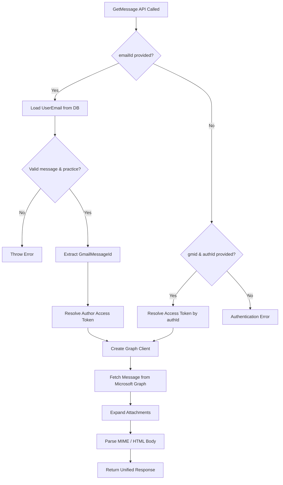
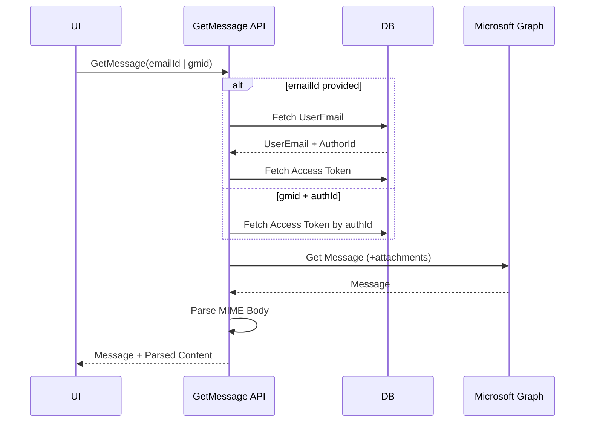

# GetMessage API – Outlook Message Details

This document explains the **`GetMessage` API** end-to-end, including how message identifiers are resolved, how Microsoft Graph is used to fetch the email, and how the message body is parsed for frontend consumption.

---

## 1. Purpose

The `GetMessage` API retrieves **a single Outlook email message** with full details, including:

- Message metadata
- Attachments
- Parsed HTML/body content

It supports **multiple lookup strategies** to accommodate messages stored locally or fetched directly from Microsoft Graph.

---

## 2. Endpoint Responsibility

- Resolve message identity (`emailId` OR `gmid + authId`)
- Validate ownership and practice scope
- Fetch message from **Microsoft Graph**
- Parse MIME/HTML body into a frontend-friendly structure
- Return a unified response

---

## 3. Method Signature

```csharp
public async Task<ApiResponse<object>> GetMessage(
    string emailId = null,
    string gmid = null,
    string authId = null
)
```

---

## 4. Supported Retrieval Modes

### Mode 1: Internal Email Record (`emailId`)

Used when the message already exists in the application database.

Flow:
1. Load `UserEmail` from DB
2. Validate practice ownership
3. Extract `GmailMessageId` (used as Graph Message ID)
4. Resolve author’s Microsoft access token

---

### Mode 2: Direct Microsoft Lookup (`gmid + authId`)

Used when:
- Message is not stored locally
- Frontend already knows Graph Message ID

Flow:
1. Skip DB lookup
2. Fetch access token using `authId`

---

## 5. Access Token Resolution

```csharp
ApplicationUserAccessTokens accessToken
```

The access token determines:
- Email provider (Outlook)
- Target mailbox (`accessToken.EmailAddress`)
- Authorization context for Microsoft Graph

If no token is found → request fails.

---

## 6. Microsoft Graph Integration

### API Used

```http
GET /users/{emailAddress}/messages/{messageId}?$expand=attachments
```

### SDK Call

```csharp
client.Users[accessToken.EmailAddress]
      .Messages[gmid]
      .GetAsync(rc => {
          rc.QueryParameters.Expand = ["attachments"];
      });
```

---

## 7. Message Parsing

After fetching the message:

- Raw Graph message is returned as-is
- Body content is parsed using:

```csharp
UserEmailMessageProcesser.ParseMimeMessage(message.Body)
```

This produces:
- Sanitized HTML
- Inline image handling
- Structured content for UI rendering

---

## 8. Final API Response Structure

```json
{
  "message": { /* Microsoft Graph Message */ },
  "parsedMsg": { /* Parsed HTML / MIME content */ }
}
```

Wrapped inside:

```csharp
ApiResponse<object>
```

---

## 9. Error Handling

### Possible Errors

| Scenario | Error |
|--------|------|
| Invalid emailId | Message not found |
| Practice mismatch | Invalid message details |
| Missing author | Message not linked with author |
| Missing token | Microsoft authentication not found |
| Graph failure | Propagated exception |

All errors are added to `ApiResponse.Errors`.

---

## 10. Mermaid Flowchart



---

## 11. Mermaid Sequence Diagram



---

## 12. Key Design Notes

- Uses **GmailMessageId as Graph Message ID** for cross-provider consistency
- Ensures **practice-level data isolation**
- Single API supports **stored + live messages**
- Parsing is centralized for consistent UI rendering

---

This API completes the **message read lifecycle** in the unified Mail module.