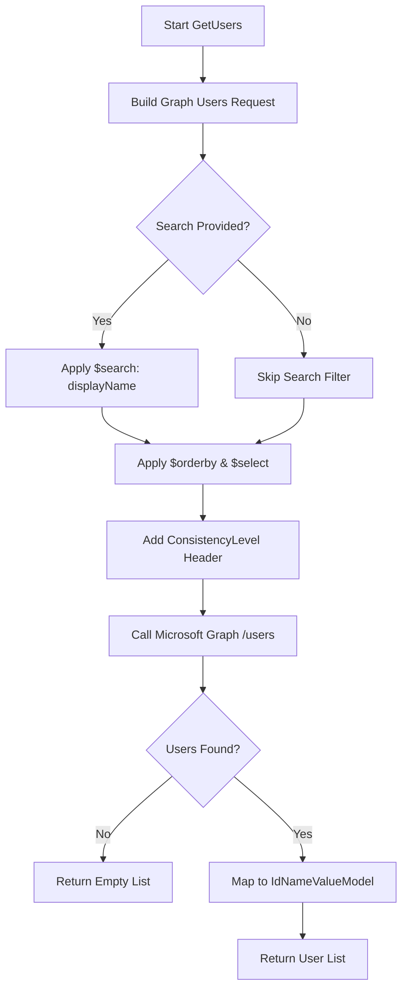
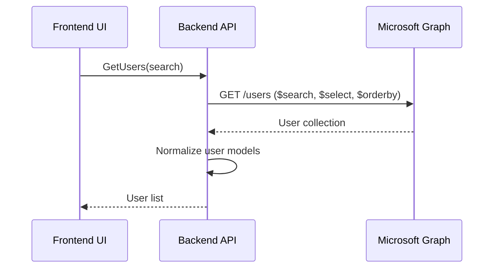

# Get Users API – Outlook Directory Search (Microsoft Graph)

This document explains **how the `GetUsers` method works end-to-end**, including search behavior, Microsoft Graph query configuration, filtering, and response normalization.

---

## 1. Purpose of `GetUsers`

`GetUsers` provides a **lightweight directory lookup** against Microsoft Entra ID (Azure AD) using **Microsoft Graph**, primarily for:

- Email compose **recipient auto-suggestions**
- User picker dropdowns
- Directory-based people search

The method returns a **normalized, UI-friendly list** of users with:

- `Id` → Azure AD user ID
- `Name` → Display name
- `Value` → Email address

---

## 2. Method Signature

```csharp
public static async Task<List<IdNameValueModel<string>>> GetUsers(
    GraphServiceClient client,
    string search
)
```

---

## 3. Input Parameters

| Parameter | Type | Purpose |
|---------|------|--------|
| `client` | `GraphServiceClient` | Authenticated Microsoft Graph client |
| `search` | `string` | Optional display name filter for directory search |

---

## 4. Microsoft Graph Query Construction

The method queries:

```
GET /users
```

### Applied Query Options

| Option | Behavior |
|------|---------|
| `$search` | Filters users by `displayName` (if provided) |
| `$orderby` | Sorts results alphabetically by display name |
| `$select` | Limits payload to essential fields |
| `ConsistencyLevel` | Enables advanced search support |

### Search Expression

When `search` is provided:

```
"displayName:{search}"
```

This allows **partial, case-insensitive matching** on user display names.

---

## 5. Selected Fields

To minimize payload size, only the following fields are requested:

- `id`
- `displayName`
- `mail`
- `identities`

This keeps the query fast and cost-efficient.

---

## 6. Response Mapping

Each Graph `User` object is normalized into:

```csharp
IdNameValueModel<string>
```

### Mapping Logic

| Model Field | Source |
|-----------|-------|
| `Id` | `user.Id` |
| `Name` | `user.DisplayName` |
| `Value` | `user.Mail` |

Null users are filtered out defensively.

---

## 7. Error Handling Strategy

- Any exception is wrapped in:

```csharp
AppModelException
```

### Benefits

- Prevents Graph SDK exception leakage
- Ensures consistent API error contracts
- Simplifies frontend error handling

---

## 8. Mermaid Flowchart



---

## 9. Mermaid Sequence Diagram



---

## 10. Key Design Principles

- Provider-native directory search
- Minimal payload for performance
- Consistent response model across providers
- Safe null handling
- Search optimized with `ConsistencyLevel: eventual`

---

## 11. Final Outcome

This implementation delivers:

- Fast, scalable directory search
- Predictable recipient auto-complete behavior
- Clean separation between Graph models and UI contracts
- Seamless integration into the Mail compose experience
