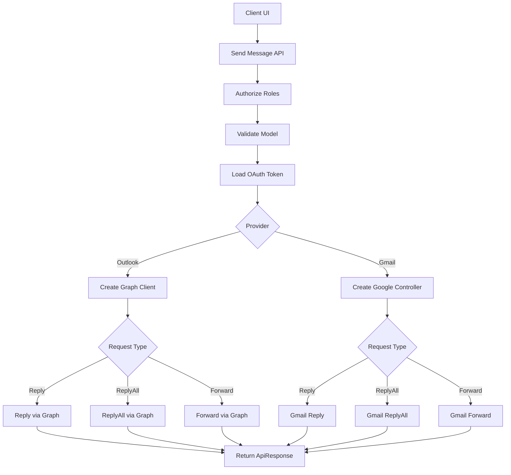
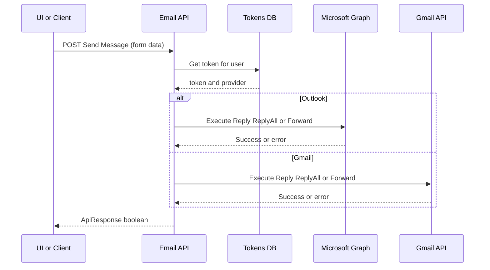
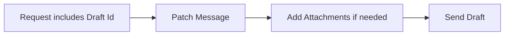
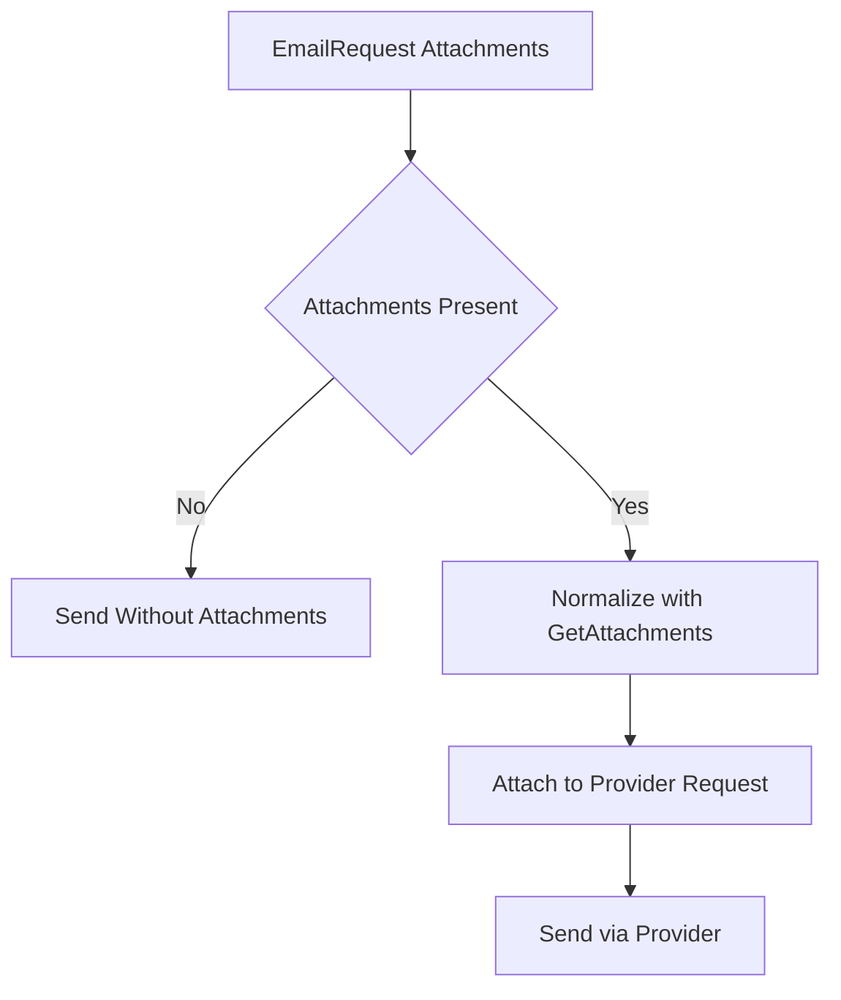

# ✉️ Email Message – Send (Reply / ReplyAll / Forward)

## Send Message – Detailed Flow Documentation (Outlook / Gmail)

This document explains the **end-to-end flow** of the `SendMessage` endpoint, which performs **Reply**, **ReplyAll**, or **Forward** actions for an existing email message using **Outlook (Microsoft Graph)** or **Gmail**, based on the user’s configured provider.

The API exposes a **single unified endpoint** and routes execution to the correct provider implementation and action type, while normalizing inputs such as recipients and attachments.

---

## 1. Overview

### High-level purpose of the module
The **Send Message** module enables users to send a response to an existing message thread by performing:
- `Reply`
- `ReplyAll`
- `Forward`

### What problems it solves
- Hides provider differences (Outlook vs Gmail) behind one endpoint.
- Centralizes authorization, validation, and error collection.
- Normalizes attachment inputs into provider-compatible formats.
- Supports “draft-style” behavior for Outlook by optionally patching a message and then sending it.

### Key responsibilities
- Validate recipients and request intent (`RequestType`).
- Resolve the user’s email provider using OAuth token metadata.
- Execute the correct action handler for Outlook or Gmail.
- Build and normalize recipients for provider APIs.
- Build attachments using shared normalization (`GetAttachments`).
- Return a consistent `ApiResponse<bool>` result.

---

## 2. Unified Entry Point

### API Endpoint
```http
POST /Message/{id}/Send
```

### Controller Method
```csharp
[Authorize(Roles = "ADMIN,MANAGER,STAFF")]
[HttpPost("Message/{id}/Send")]
public async Task<ApiResponse<bool>> SendMessage(string id, [FromForm] EmailRequest model)
```

### Why a single entry point is used
- Provides a single “send” contract for UI and integrations.
- Prevents frontend branching based on provider or action subtype.
- Keeps provider logic isolated to dedicated controllers/helpers.

### Operations it supports
- Outlook: Reply, ReplyAll, Forward (Microsoft Graph)
- Gmail: Reply, ReplyAll, Forward (Google integration)

---

## 3. Input Models

### Route Parameters

| Property | Type | Purpose |
|---|---|---|
| id | string | Identifier for the original message in the thread (provider message id) |

### Request Body (multipart form)

The endpoint accepts `[FromForm] EmailRequest`, which allows mixing **text fields** and **file uploads**.

#### `EmailRequest` (key fields)

| Property | Type | Purpose |
|---|---|---|
| RequestType | `EmailRequestType` | Action selector: Reply / ReplyAll / Forward |
| ToRecipients | `List<RecipientModel>` | Primary recipients (required) |
| CcRecipients | `List<RecipientModel>?` | Carbon copy recipients |
| BccRecipients | `List<RecipientModel>?` | Blind carbon copy recipients |
| Content | `string?` | HTML or plain content inserted into the message body/comment |
| Attachments | `List<FileModel>?` | Files to attach (IFormFile or Base64) |
| Importance | `Importance?` | Provider importance flag |
| Id | `string?` | Optional draft/message id used for patch + send behavior |

#### Recipient Model (inferred)
| Property | Type | Purpose |
|---|---|---|
| Name | `string?` | Display name |
| Id | `string` | Email address (used as Graph `EmailAddress.Address`) |

#### File Model (inferred)
| Property | Type | Purpose |
|---|---|---|
| File | `IFormFile?` | Binary upload |
| Name | `string?` | Optional attachment name override |
| ContentType | `string?` | MIME type |
| ContentByte | `string?` | Base64 payload (optional fallback) |

---

## 4. Core Concepts / Normalization Logic

### Provider routing
The provider is resolved from the stored OAuth token:
- Outlook → Microsoft Graph client + MicrosoftController
- Gmail → GoogleController

### RequestType routing
The endpoint dispatches based on `model.RequestType`:

| RequestType | Outlook Handler | Gmail Handler |
|---|---|---|
| Reply | `MicrosoftController.ReplyMessage` | `GoogleController.MessageReply` |
| ReplyAll | `MicrosoftController.ReplyAllMessage` | `GoogleController.MessageReplyAll` |
| Forward | `MicrosoftController.ForwardMessage` | `GoogleController.MessageForward` |

### Recipient normalization (Outlook)
Recipient models are mapped into Graph `Recipient` objects:
- Null entries are filtered in some flows (`Where(e != null)`).
- Email address is mapped from `RecipientModel.Id`.

### Attachment normalization
If `reply.Attachments` is provided, attachments are normalized through `GetAttachments(files)` into Graph `FileAttachment` objects.

### Draft-style send behavior (Outlook)
For Reply and ReplyAll:
- If `reply.Id` is empty → direct `Reply.PostAsync` / `ReplyAll.PostAsync`.
- If `reply.Id` is provided → patch message body then `Send.PostAsync`.

For Forward:
- If `reply.Id` is provided → patch a draft forward, add only new attachments, then send.
- Otherwise → call `Forward.PostAsync` on the original message.

---

## 5. Base Object Construction

### Graph Message construction (Reply / ReplyAll)
A `Message` object is created with normalized recipient lists and attachments:

```csharp
var message = new Message
{
    ToRecipients = ...,
    CcRecipients = ...,
    BccRecipients = ...,
    Attachments = attachments,
    Importance = reply?.Importance
};
```

### Request body objects
- Reply uses `ReplyPostRequestBody`
- ReplyAll uses `ReplyAllPostRequestBody`
- Forward uses `ForwardPostRequestBody`

### Why these builders exist
- The Graph SDK expects specific request body types per action.
- Building these centrally improves consistency and testability.

### What they prevent / optimize
- Prevents inconsistent mapping of recipients and attachments.
- Reduces controller complexity and duplication.

---

## 6. Internal Helpers / Services

### `ApplicationUserAccessTokensDB`
- Retrieves the OAuth token and provider for the current user.
- Used at the start of the endpoint.

### `_graphSdkHelper.GetAuthenticatedClient(accessToken)`
- Builds an authenticated Graph client.
- Used only for Outlook provider.

### `GetAttachments(files)`
- Converts `FileModel` inputs into Graph `FileAttachment` items.
- Used for Reply, ReplyAll, and Forward when attachments are present.

### `GoogleController`
- Encapsulates Gmail send operations and provider-specific formatting.

---

## 7. Execution Flow by Action Type

### Action: Reply (Outlook)

#### Trigger conditions
- Provider is Outlook
- `RequestType == Reply`

#### Step-by-step flow
1. Normalize attachments (`GetAttachments`) if provided.
2. Map recipients (To/Cc/Bcc) into Graph `Message`.
3. Build `ReplyPostRequestBody` with `Message` + `Comment`.
4. If `reply.Id` is empty:
   - `Messages[id].Reply.PostAsync(requestBody)`
5. Else:
   - Patch draft body (`Messages[reply.Id].PatchAsync(message)`)
   - Send draft (`Messages[reply.Id].Send.PostAsync()`)

#### Special considerations / constraints
- Patch mode sets `Message.Body` to HTML explicitly.
- Patch mode assumes `reply.Id` references an editable draft/message.

---

### Action: ReplyAll (Outlook)

#### Trigger conditions
- Provider is Outlook
- `RequestType == ReplyAll`

#### Step-by-step flow
1. Normalize attachments.
2. Build Graph `Message` and `ReplyAllPostRequestBody`.
3. If `reply.Id` is empty:
   - `Messages[id].ReplyAll.PostAsync(requestBody)`
4. Else:
   - Patch draft (`Messages[reply.Id].PatchAsync(Message)`)
   - Send (`Messages[reply.Id].Send.PostAsync()`)

#### Special considerations / constraints
- Behavior mirrors Reply with ReplyAll semantics.

---

### Action: Forward (Outlook)

#### Trigger conditions
- Provider is Outlook
- `RequestType == Forward`

#### Step-by-step flow
1. Normalize attachments.
2. If `reply.Id` is present (draft mode):
   1. Patch draft forward message (body, recipients, metadata).
   2. If attachments exist:
      - Load existing attachments for the draft message.
      - Add only attachments with names not already present (case-insensitive).
   3. Send draft (`Messages[reply.Id].Send.PostAsync()`).
3. Else:
   - Build `ForwardPostRequestBody` and call:
     - `Messages[originalMessageId].Forward.PostAsync(requestBody)`

#### Special considerations / constraints
- Attachment dedupe is name-based (fast, not content-hash based).
- Draft mode requires permission to patch and send the referenced message.

---

### Action: Reply / ReplyAll / Forward (Gmail)

#### Trigger conditions
- Provider is Gmail
- `RequestType` matches supported actions

#### Step-by-step flow
1. Instantiate `GoogleController`.
2. Dispatch:
   - Reply → `MessageReply`
   - ReplyAll → `MessageReplyAll`
   - Forward → `MessageForward`
3. Store boolean result in `ApiResponse.Result`.

#### Special considerations / constraints
- Gmail-specific formatting and attachment handling are delegated to Google controller.

---

## 8. Attachment / Asset Handling

### Upload strategy
- Attachments are submitted via multipart form (`[FromForm]`) and/or Base64 inside `FileModel`.

### Sync strategy
- Attachments are attached and sent immediately.
- No persistent storage implied by this endpoint.

### Retrieval strategy
- Outlook forward draft mode retrieves existing attachments to avoid duplicates.

---

## 9. Scheduling / Metadata Handling

### Model explanation
- `Importance` is passed to the provider message model.
- `Id` enables optional patch+send draft behavior.

### Validation rules (recommended)
- `RequestType` must be one of Reply/ReplyAll/Forward.
- `ToRecipients` must not be empty.
- Email addresses should be validated (format) before provider calls.

### Limitations
- Current controller notes `//TODO: validate model`.
- Some recipient lists are not null-filtered in sample code.

---

## 10. Error Handling Strategy

### How errors are wrapped
- Controller aggregates errors into `ApiResponse<bool>` via `response.AddError(ex)`.
- Outlook helper methods throw `AppModelException` for provider failures.

### Why this strategy is used
- Preserves a consistent response envelope for UI and integrations.
- Avoids leaking provider-specific SDK exceptions.

### Benefits
- Predictable client-side parsing.
- Centralized error telemetry and logging.

---

## 11. Design Principles

### Key architectural principles
- **Provider abstraction** with a unified endpoint.
- **Action dispatch** via `EmailRequestType`.
- **Normalization reuse** for attachments.
- **Draft workflow support** for richer UX and editing.

### Scalability considerations
- Stateless per request; safe for horizontal scaling.
- In-memory attachment normalization can increase memory pressure for large files.

### Provider-agnostic / extensibility notes
- Add new providers by implementing the same action contract:
  - Reply
  - ReplyAll
  - Forward
- Keep request model stable; adapt internally.

---

## 12. Mermaid Diagrams (MANDATORY)

### Overall Flowchart (high-level request lifecycle)


### Sequence Diagram (UI → API → External Service)


### Update / Patch Flow


### Attachment or Asset Flow


---

## 13. Final Outcome

### What this design achieves
- A unified send endpoint supporting Reply, ReplyAll, and Forward across Outlook and Gmail.
- Consistent mapping of recipients and attachments.
- Support for direct send and patch+send draft workflows in Outlook.

### Benefits for UI, API, and scalability
- **UI**: One API regardless of provider or action type.
- **API**: Centralized validation, provider routing, and consistent responses.
- **Scalability**: Stateless flow with clear extension points.
