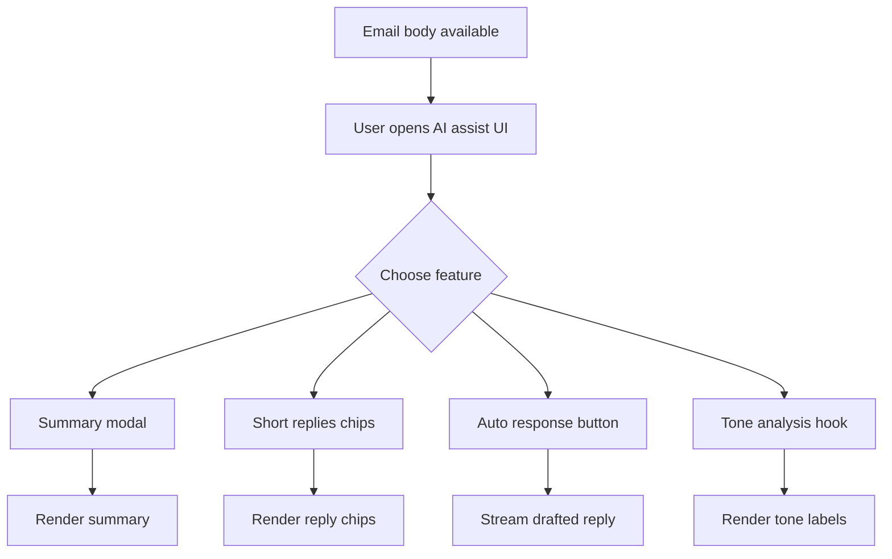
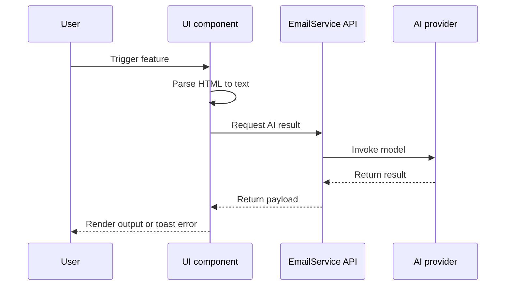
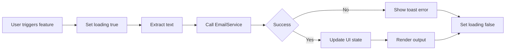
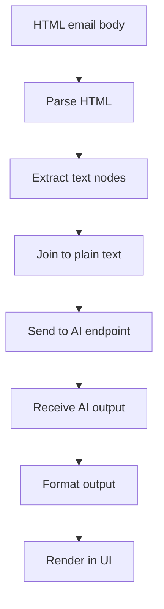

# Email AI Assist Module — SummaryModel, ShortReplies, AutoResponsePanel, useAnalyzeTone

## 1. Overview

This module provides **AI-assisted reading and responding tools** around an email body (HTML). It is designed to be embedded into the email detail and compose experiences, giving users fast “understand and respond” workflows.

### High-level purpose
- Generate a **summary** of an email in a focused modal.
- Provide **short reply suggestions** as one-click chips.
- Generate a richer **auto-response draft** with an animated “typing” reveal.
- Provide a reusable **tone analysis hook** with debounced analysis and robust response coercion.

### Problems it solves
- Reduces time-to-understanding for long messages (summary).
- Reduces time-to-action for routine emails (short replies / auto-response).
- Avoids duplicate parsing and request logic across components (shared HTML → text extraction).
- Handles inconsistent provider outputs for tone analysis via normalization.

### Key responsibilities
- Extract meaningful text from HTML email content deterministically.
- Call AI endpoints via a provider-agnostic boundary (`EmailService`).
- Provide user feedback with spinners and non-blocking errors.
- Normalize output formats (markdown-like emphasis, bullets, paragraphs).
- Expose stable APIs for embedding in other UI surfaces.

---

## 2. Unified Entry Point

This module is intentionally **composed of multiple entry points**, each optimized for a specific UX surface:

- `SummaryModel`: modal-based summarization and feedback loop
- `ShortReplies`: inline reply chips for quick actions
- `AutoResponsePanel`: a single-button panel that streams a drafted reply into a target field
- `useAnalyzeTone`: hook used by composer flows for live tone signals

A single entry point is not used because these features are consumed by **different UX patterns** (modal, inline chips, small panel, hook) and have distinct rendering and lifecycle needs.

---

## 3. Input Models

### 3.1 SummaryModel Props

| Property | Type | Purpose |
|---|---|---|
| `emailBody` | `string` | Source email HTML that will be summarized. |
| `onDismiss` | `(val?: any) => void` | Modal close handler. |
| `isOpen` | `boolean` | Controls modal visibility. When true, summary generation runs. |

### 3.2 ShortReplies Props

| Property | Type | Purpose |
|---|---|---|
| `emailBody` | `string` | Source email HTML used to generate suggested replies. |
| `onReplyClick` | `(replyText: string) => void` | Callback when user selects a suggested reply. |

### 3.3 AutoResponsePanel Props

| Property | Type | Purpose |
|---|---|---|
| `emailBody` | `string` | Source email HTML used to generate an auto-response draft. |
| `onGenerate` | `(responseHtml: string) => void` | Callback called repeatedly to “stream” the generated content into the host UI. |

### 3.4 useAnalyzeTone API

| Property | Type | Purpose |
|---|---|---|
| `analyzeTone` | `string[] \| null` | Current detected tones. `null` means “not yet run” or “reset”. |
| `analyzeToneBody` | `(html: string) => Promise<void>` | Runs tone analysis on the given email body. |
| `debouncedAnalyzeTone` | `(html: string) => void` | Debounced tone analysis (10s debounce). |
| `setAnalyzeTone` | `(tones: string[] \| null) => void` | Direct state setter for host components. |
| `hasToneError` | `boolean` | True if the last analysis attempt failed. |
| `setHasToneError` | `(val: boolean) => void` | Direct error flag setter for host components. |

---

## 4. Core Concepts / Normalization Logic

### 4.1 HTML to Plain Text extraction (shared approach)

All features share the same foundational strategy:

1. Parse HTML using `DOMParser`
2. Walk the DOM and collect **trimmed text nodes**
3. Join the text nodes into a single plain text payload

This avoids:
- Sending noisy raw HTML to AI endpoints
- Inconsistent extraction behavior between features

**Default behavior**
- Empty or missing `emailBody` short-circuits with an error (SummaryModel, AutoResponsePanel) or no-op (ShortReplies, useAnalyzeTone).

**Edge-case handling**
- If the extracted text is empty, the operation fails fast with a user-safe message.

### 4.2 Summary formatting (plain text ↔ rich display)

The summary pipeline normalizes between:
- Provider output (often HTML or markdown-ish)
- Internal representation (stored as a text-like format)
- UI rendering (converted back into HTML via `dangerouslySetInnerHTML`)

The formatting logic includes:
- Line breaks normalized to paragraph and break tags
- Bullets normalized to consistent bullet symbols
- Simple emphasis markers mapped to strong and em tags

**Special note**
- SummaryModel applies formatting twice (duplicate `setSummaryResponse` calls exist in the snippet). This is harmless but should be cleaned up for maintainability.

### 4.3 Feedback indexing model

Summary feedback uses a numeric key:
- Preset feedback reasons: `1` to `5`
- Custom feedback: `6`

The final key sent to the backend is:
- `6` when custom feedback exists
- otherwise the preset key

This enables a stable backend contract without shipping verbose strings.

### 4.4 Auto-response “typing” streaming

AutoResponsePanel does not return a single final string to the host. Instead, it:
- Splits the formatted response into tokens (words and breaks)
- Calls `onGenerate` repeatedly with an incrementally longer prefix
- Uses `requestAnimationFrame` to animate

This creates a “typing” effect and keeps the host component in control of where the content is rendered (e.g., editor).

### 4.5 Tone response coercion

Tone analysis is notoriously inconsistent across providers. `useAnalyzeTone` includes `coerceToneResponse()` to normalize:
- arrays of strings
- arrays of objects containing label-like fields
- nested objects holding tones inside common properties
- string forms of JSON or pseudo-JSON
- comma or newline separated strings

This reduces UI fragility and gives host components a stable `string[]` shape.

---

## 5. Base Object Construction

### 5.1 Summary request payload

SummaryModel builds a stable summary request:
- Extracted plain text payload
- A fixed “long summary” flag set to true (as written)
- Feedback key (optional)
- Optional custom feedback string

Example payload concept (not exact code):
```ts
{
  text: extractedText,
  long: true,
  feedbackKey: feedbackIndexOrSix,
  feedbackText: customFeedbackOrUndefined
}
```

### 5.2 Auto-response formatting base

AutoResponsePanel constructs a formatted HTML response before streaming it:
- Removes model preamble and “drafted reply” scaffolding
- Converts emphasis markers to HTML tags
- Normalizes bullets and line breaks

---

## 6. Internal Helpers / Services

### 6.1 SummaryModel internal helpers

| Helper | Why it exists | When used |
|---|---|---|
| `summarizeEmailBody(feedbackKey, custom)` | Orchestrates summary generation and formatting | On modal open, on submit, on Enter |
| `handleKeyDown` | Allows Enter to submit feedback | While user types feedback |

### 6.2 ShortReplies internal helpers

| Helper | Why it exists | When used |
|---|---|---|
| `generateReply(emailBody)` | Extracts text and fetches reply suggestions | On `emailBody` change |
| `hoveredIndex` | Controls hover styling | On chip hover |

### 6.3 AutoResponsePanel internal helpers

| Helper | Why it exists | When used |
|---|---|---|
| `handleGenerate()` | Runs generation, formatting, and streaming | When user clicks button |

### 6.4 useAnalyzeTone internal helpers

| Helper | Why it exists | When used |
|---|---|---|
| `coerceToneResponse(input)` | Stabilizes provider outputs | After tone service returns |
| `debouncedAnalyzeTone` | Rate-limits analysis | During user typing |

### 6.5 External service boundary

All AI calls are routed through `EmailService`, which keeps UI code provider-agnostic.

| Service method | Used by | Purpose |
|---|---|---|
| `EmailService.generateSummary(text, longFlag, feedbackKey, feedbackText)` | SummaryModel | Summary generation and refinement |
| `EmailService.generateReply(text)` | ShortReplies | Suggested replies |
| `EmailService.generateAutoResponse(text)` | AutoResponsePanel | Drafted response generation |
| `EmailService.analyzeTone(text)` | useAnalyzeTone | Tone label detection |

---

## 7. Execution Flow by Action Type

### 7.1 Generate Summary

**Trigger conditions**
- `isOpen` becomes true
- User submits feedback via button or Enter

**Step-by-step flow**
1. Set `loading` true
2. Validate `emailBody` exists
3. Parse HTML and extract plain text
4. Determine feedback key (preset or custom)
5. Call summary endpoint
6. Normalize summary into a displayable format
7. Update `summaryResponse`, clear `customFeedback`
8. Set `loading` false

**Special considerations**
- The modal renders HTML via `dangerouslySetInnerHTML`. Inputs and outputs must be treated as untrusted unless sanitized upstream.

---

### 7.2 Generate Short Replies

**Trigger conditions**
- `emailBody` changes

**Step-by-step flow**
1. Clear existing replies
2. Parse HTML and extract plain text
3. Call reply generation endpoint
4. Normalize and filter result list
5. Render reply chips
6. On chip click, call `onReplyClick(reply)`

**Special considerations**
- If the reply endpoint returns a single string, ensure backend returns a list or a delimiter format. The current snippet assumes mappable output.

---

### 7.3 Generate Auto Response

**Trigger conditions**
- User clicks the “Auto response” button

**Step-by-step flow**
1. Set `loading` true
2. Validate `emailBody` exists
3. Parse HTML and extract plain text
4. Call auto-response endpoint
5. Format response into HTML
6. Split into tokens and stream via `onGenerate`
7. Set `loading` false

**Special considerations**
- Streaming via animation is UI-friendly but must ensure it does not run after unmount; consider adding a cancellation guard if needed.

---

### 7.4 Analyse Tone

**Trigger conditions**
- Host calls `analyzeToneBody(html)`
- Host calls `debouncedAnalyzeTone(html)`

**Step-by-step flow**
1. Reset error and tone state
2. Parse HTML and extract plain text
3. Call tone endpoint
4. Coerce response into `string[]`
5. Update `analyzeTone`

**Special considerations**
- If coercion returns an empty array, the hook treats it as “no tone detected” rather than an error.

---

## 8. Attachment / Asset Handling

Not applicable. These components operate only on email body content and derived text.

---

## 9. Scheduling / Metadata Handling

Not applicable.

---

## 10. Error Handling Strategy

### How errors are wrapped
- Most failures are handled via `try/catch`
- User-facing feedback uses `AOToast.error(...)`
- Silent failures are used where safe (e.g., no-op when email body is empty for short replies)

### Why this strategy is used
- AI features are assistive and should not block reading or composing flows.
- Users need immediate feedback, but the app should remain usable.

### Benefits
- Localized failure domains (one feature can fail without impacting others)
- Predictable UI state transitions (loading true/false)
- Cleaner integration for host screens

---

## 11. Design Principles

### Stable service boundary
All AI capabilities are behind `EmailService`, enabling provider swaps without UI churn.

### Deterministic extraction
A consistent HTML-to-text extraction pipeline reduces variance in AI outputs and debugging effort.

### UX-first async behavior
- Spinners are shown only for long-running operations.
- Auto-response uses progressive rendering to feel responsive.

### Scalability considerations
- Large emails can produce large text payloads; consider:
  - max text length guards
  - backend truncation/token budgets
  - caching repeated summaries per message id

### Extensibility notes
- Feedback key model supports adding new categories without a contract redesign.
- Tone coercion is designed to accept evolving provider formats.

---

## 12. Mermaid Diagrams (MANDATORY)

The following diagrams use **strict-safe Mermaid labels** (no parentheses, dots, quotes, arrows, or slashes) to avoid parser errors in strict renderers.

### 12.1 Overall Flowchart (High-level request lifecycle)


### 12.2 Sequence Diagram (UI to API to External Service)


### 12.3 Update / Patch Flow


### 12.4 Content Asset Flow (Email body to derived output)


---

## 13. Final Outcome

This module delivers a cohesive set of AI assist features that:
- Improves reading comprehension and response speed
- Keeps provider variability contained through normalization
- Provides clear, non-blocking error and loading behavior
- Enables reuse across screens (detail view, composer, and panels)
- Scales to new AI features through a stable `EmailService` boundary
