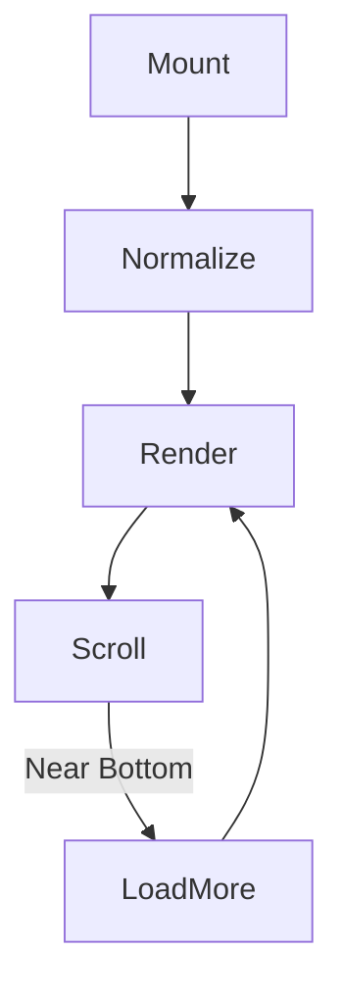
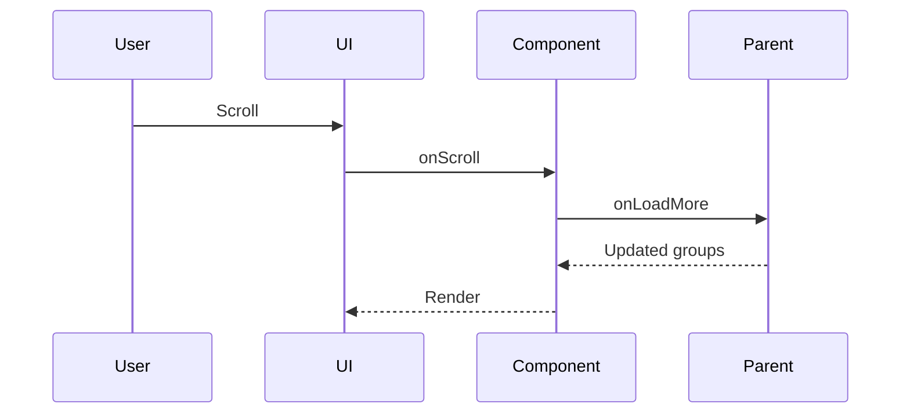

# ControlledGroupList – Grouped Infinite Scroll List

## 1. Overview

The **ControlledGroupList** component is a highly reusable, controlled React component for rendering **grouped lists with infinite scrolling, collapsible sections, refresh support, and skeleton loading**.

It is designed for data-heavy UIs such as **email inboxes, activity feeds, notifications, and logs**, where pagination and grouping are managed by the parent layer.

### Problems It Solves
- Avoids internal data fetching assumptions
- Supports large datasets efficiently
- Handles refresh, pagination, and grouping consistently

### Key Responsibilities
- Render grouped items
- Handle infinite scroll pagination
- Manage collapse/expand UI state
- Display loading and skeleton states

---

## 2. Unified Entry Point

### Component
```tsx
<ControlledGroupList />
```

### Why a Single Entry Point
- Centralizes list behavior
- Keeps pagination logic consistent
- Makes the component backend-agnostic

### Supported Operations
- Initial load
- Incremental load (infinite scroll)
- Manual refresh
- Group collapse / expand

---

## 3. Input Models

### GroupBlock

| Property | Type | Purpose |
|-------|------|-------|
| key | string | Group identifier (e.g. date) |
| items | T[] | Raw items for the group |

### Item

| Property | Type | Purpose |
|----|----|----|
| id | string \| number | Unique key |
| group | string | Group label |
| content | ReactNode | Renderable content |
| meta | T | Optional raw metadata |

### Props

| Property | Type | Purpose |
|------|------|------|
| groups | GroupBlock[] | Controlled grouped data |
| mapItem | (raw, group, index) => Item | Adapter for rendering |
| onLoadMore | () => Promise<boolean> | Pagination handler |
| loading | boolean | External loading flag |
| groupRenderer | (group, collapsed, toggle) => ReactNode | Custom header |
| refresh | boolean | Trigger refresh |
| onRefreshDone | () => void | Refresh callback |
| onLoadDone | () => void | First-load callback |
| fetchThresholdPx | number | Scroll threshold |
| skeletonRowCount | number | Skeleton rows |
| style | CSSProperties | Container styles |
| className | string | Custom class |

---

## 4. Core Concepts & Normalization Logic

### Controlled Data Model
- Component **never mutates data**
- Parent owns pagination & grouping

### Group Flattening
Groups are normalized into:
- `groupOrder` (render order)
- `groupedItems` (lookup map)
- `items` (flat list)

This enables fast rendering and scroll calculations.

---

## 5. Base Object Construction

### mapItem Adapter

```ts
mapItem(raw, groupKey, index) => Item
```

### Why It Exists
- Separates rendering from data shape
- Enables reuse across different domains

---

## 6. Internal Helpers / Services

### Infinite Scroll Engine
- Uses `requestAnimationFrame`
- Throttles scroll events
- Prevents duplicate fetches (`inFlight`)

### Refresh Detection
- Detects `false → true` edge
- Ensures refresh fires only once per toggle

### Collapse State
- Stored per group key
- Collapse triggers auto top-up if needed

---

## 7. Execution Flow by Action Type

### Initial Load

**Trigger:** Groups prop populated

**Steps:**
1. Normalize groups
2. Render headers and items
3. Fire `onLoadDone` once

---

### Infinite Scroll Load

**Trigger:** Scroll near bottom

**Steps:**
1. Check `hasMore` and `inFlight`
2. Call `onLoadMore()`
3. Parent updates `groups`
4. Update `hasMore`

---

### Refresh Flow

**Trigger:** `refresh = true`

**Steps:**
1. Call `onLoadMore()`
2. Replace data upstream
3. Fire `onRefreshDone`

---

### Collapse / Expand

**Trigger:** Group header click

**Steps:**
1. Toggle collapse state
2. Recalculate scroll space
3. Auto-fetch if content is short

---

## 8. Skeleton & Loading Strategy

### Skeleton Mode
Displayed when:
- Loading OR refreshing
- No items yet

### Incremental Loading Spinner
Displayed when:
- Fetching more
- Existing items already rendered

---

## 9. Error Handling Strategy

- Component assumes parent handles errors
- Safe guards prevent duplicate fetches
- UI never blocks on failed loads

---

## 10. Design Principles

- Fully controlled component
- Provider & backend agnostic
- Performance-first rendering
- Progressive data loading

### Scalability Considerations
- Handles thousands of items
- Minimal re-renders
- Efficient scroll detection

---

## 11. Mermaid Diagrams

### Overall Flow


### Sequence Diagram


### Refresh Flow


---

## 12. Final Outcome

### What This Design Achieves
- Clean separation of UI and data
- Predictable pagination behavior
- High reusability across domains

### Benefits
- **UI:** Smooth scrolling & grouping
- **API:** Full control of pagination
- **Scalability:** Efficient large-list handling

---

**Status:** Production-ready
