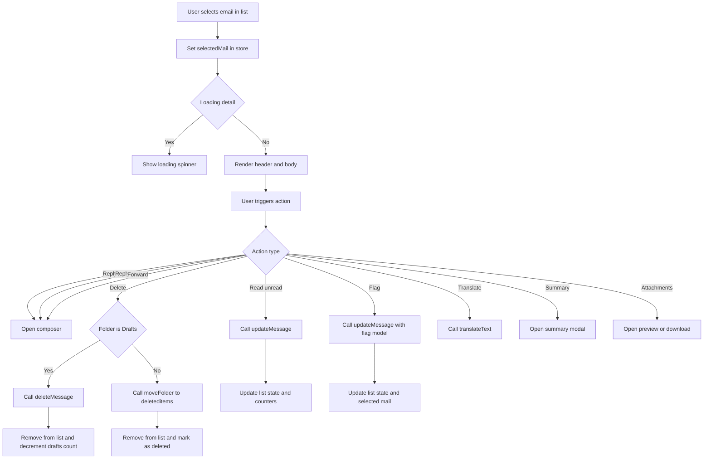
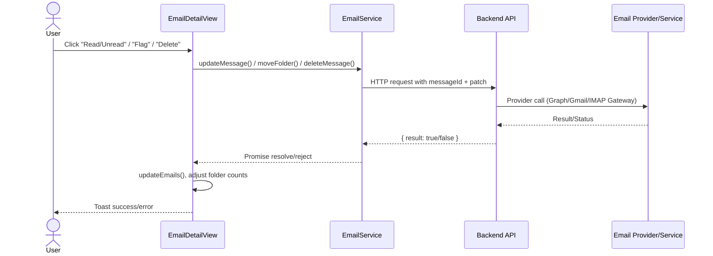
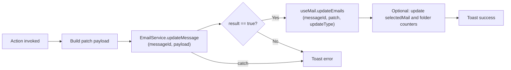
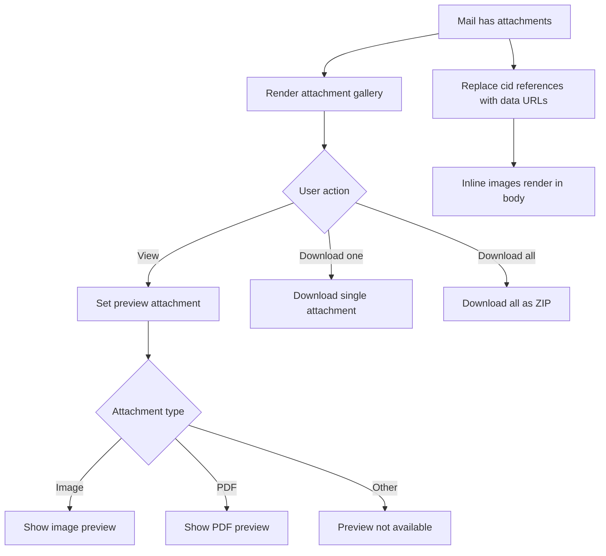

# Email Module — Email Detail View (Frontend)

## 1. Overview

`EmailDetailView` is the **primary email-reading surface** in the UI. It renders the selected message (headers, recipients, categories, body, flags, attachments) and exposes **message actions** such as Reply/Reply All/Forward, Read/Unread, Flag, Delete, Translate, and Summary.

### Purpose
- Provide a consistent, high-signal reading experience for the currently selected email.
- Bridge user actions to backend APIs via `EmailService`, while keeping the UI state consistent via `useMail()` store updates.
- Handle email-body specifics (HTML sanitization for display, inline CID images, attachment preview) without leaking concerns into other components.

### Problems it solves
- Prevents duplicated logic scattered across list and detail screens (e.g., read/unread toggles, delete behavior differing by folder, flag status handling).
- Normalizes HTML email content into a safe-ish renderable form that works with inline images and reply-forward blocks.
- Manages multiple “secondary” experiences (attachments preview, translation ribbon, summary modal, AI panel) without breaking the core reading flow.

### Key responsibilities
- **Render**: subject, sender persona, recipients (To/Cc/Bcc), message date, categories, body.
- **Action orchestration**: open composer, update read/unread, flag/unflag, delete/move.
- **Body processing**: remove reply-forward container and separators, replace `cid:` references with inline attachment data URLs.
- **Attachments**: gallery, per-file preview panel, download and bulk-download.
- **AI add-ons**: translation, summary, short replies, tone analysis (composer).

---

## 2. Unified Entry Point

### Component Entry Point
```ts
export const EmailDetailView = ({ colors, onThreads, getFlagDates }: Props) => { ... }
```

This component acts as a **single, unified entry point** for “view + act on the selected email” within the mail client.

#### Why a single entry point is used
- Ensures all actions mutate UI state consistently via the same store (`useMail`) and the same service layer (`EmailService`).
- Allows folder-specific rules (e.g., delete vs move-to-deleted) to be enforced in one place.
- Keeps secondary panels/modals (attachment preview, translation, summary, AI panel) coordinated with the current selection.

#### Supported operations
- Reply / Reply All / Forward (opens `EditMessage`)
- Read/Unread toggle (`EmailService.updateMessage`)
- Flag/Complete follow-up (`EmailService.updateMessage`)
- Delete (Drafts: permanent delete; others: move to Deleted Items)
- Translate body (`EmailService.translateText`)
- Generate summary (opens `SummaryModel`)
- View/Download attachments (`EmailService.downloadAttachment`, `downloadAllAttachments`)

---

## 3. Input Models

### 3.1 Component Props

| Property | Type | Purpose |
|---|---|---|
| `colors` | `any[]` | Category-to-style lookup used by `renderCategories()` to render chips with consistent colors/borders. |
| `onThreads` | `() => void` | Navigation trigger for thread view (gated behind non-production env). |
| `getFlagDates?` | `(type: 'today' \| 'tomorrow' \| 'thisWeek' \| 'nextWeek' \| 'noDate') => { dueDateTime?: string; startDateTime?: string }` | Optional helper that returns start/due dates used when flagging a message (e.g., set follow-up date presets). |

### 3.2 Store Contract (useMail)

`EmailDetailView` depends on a mail store hook:
- `selectedMail`: the currently selected email (observable-like `.get()` / `.set()` pattern)
- `isLoading`: detail-loading state (`{ type, value }`)
- `updateEmails(id, patch, updateType)`: list/store updater to keep email list consistent
- `currentFolder`, `folders`, `emails`: folder context + list state

> Note: the exact typings are not shown in the snippet; this documentation describes usage and expected behavior.

### 3.3 Service Calls

| Service method | Input | Output (observed) | Used for |
|---|---|---|---|
| `EmailService.updateMessage(id, payload)` | `{ type: EmailUpdateType, isRead?, categoryId?, flagModel?, isStarred? }` | `{ result: boolean }` | Read/Unread, Flag/Complete, other “patch-style” message updates |
| `EmailService.moveFolder(id, 'deleteditems')` | message id + folder key | `{ result: boolean }` | Delete (move) for non-draft folders |
| `EmailService.deleteMessage(id)` | message id | `{ result: boolean }` | Permanent delete for Drafts |
| `EmailService.translateText(texts: string[], target: string)` | array of text fragments | `{ translations: string[], source_language?: string }` | Translation pipeline |
| `EmailService.downloadAttachment(messageId, attachmentId)` | ids | (blob/stream side effect) | Download single attachment |
| `EmailService.downloadAllAttachments(messageId)` | message id | (zip side effect) | Download all as ZIP |

---

## 4. Core Concepts / Normalization Logic

### 4.1 Recipient rendering with truncation
`renderRecipients()` shows up to `10` recipients by default and provides a `+N others` affordance. This prevents header overflow on large distribution lists.

**Default:**
- Display 10 recipients
- If more exist, show a toggle (+N others / View less)

### 4.2 Email body cleanup
`cleanEmailBody(htmlContent)` removes:
- The element with `id="divReplyFwdMsg"` (often used for reply/forward quoted content)
- Subsequent `DIV` siblings after that marker (as a heuristic)
- `HR` separators

This is a pragmatic UI normalization step to keep the displayed body focused.

**Edge cases handled**
- If no marker exists, body is returned mostly unchanged.
- Multiple `HR` elements are stripped to reduce visual noise.

### 4.3 Inline CID image resolution
`processEmailBody(htmlContent, attachments)` replaces references like:
- `cid:<attachment.cid>`  
with a `data:` URL built from attachment content:
- `data:<contentType>;base64,<contentByte>`

This allows inline images in HTML emails to render without separate network fetches.

**Important constraints**
- Requires attachment objects to include `cid`, `contentType`, and `contentByte`.
- Large inline images increase DOM memory usage; consider truncation or lazy rendering for very large messages.

### 4.4 Safe-ish HTML rendering
The component uses:
```tsx
dangerouslySetInnerHTML={{ __html: ... }}
```
This is necessary for HTML emails, but it is inherently risky.

**Expected mitigation (outside this snippet)**
- Server-side sanitization OR trusted-source enforcement.
- Client-side sanitization library if needed (e.g., DOMPurify) before injecting.

---

## 5. Base Object Construction

### 5.1 Follow-up / Flag model construction
When flagging, the component builds a `flagModel`:

| Property | Source | Purpose |
|---|---|---|
| `completedDateTime` | `undefined` | Not set when toggling Flagged/Complete from the UI toggle. |
| `dueDateTime` | `getFlagDates(type).dueDateTime` | Due date for follow-up. |
| `startDateTime` | `getFlagDates(type).startDateTime` | Start date for follow-up. |
| `flagStatus` | toggled based on current status | `Flagged` ↔ `Complete` logic. |

This base object prevents inconsistencies between UI state and backend expectations.

---

## 6. Internal Helpers / Services

### 6.1 `getButtonStyles(accent, disabled)`
Centralizes icon button styling, ensuring disabled states are visually consistent across actions.

### 6.2 `handleComposerClose()`
Resets the reply composer state and importance:
- `showReply = { show: false, value: undefined }`
- `importance = Normal`

### 6.3 `formattedDateTime(date)`
Returns `DD/MM/YYYY hh:mm A` using `dayjs`.

### 6.4 Translation pipeline: `translateEmailBody()`
Performs translation by:
1. Parsing HTML (`DOMParser`)
2. Extracting **text nodes only** (keeps tags, layout)
3. Calling `EmailService.translateText(texts, 'English')`
4. Replacing node contents in-place
5. Storing translated HTML in `translatedText` and `sourceLanguage`
6. Displaying translation ribbon and success/error toast

**Defaults & edge handling**
- Throws if email body is missing or contains no translatable text.
- Validates translation array length matches input length.
- Catches and displays a user-safe message (`AOToast.error`).

---

## 7. Execution Flow by Action Type

### 7.1 Reply / Reply All / Forward

**Trigger conditions**
- User clicks top bar action buttons OR More menu items OR bottom action buttons.

**Step-by-step flow**
1. Set `showReply = { show: true, value: 'reply' | 'replyAll' | 'fwd' }`
2. Render `EditMessage` with:
   - `replyType`
   - `prefillBody` (optional, from `ShortReplies`)
   - tone analysis hooks (`useAnalyzeTone`)
   - `importance` controls (High/Low/Normal)
3. On close, `handleComposerClose()` resets state.

**Special considerations**
- Composer supports “max view” (full page) mode.
- Importance toggles are disabled when already selected.

---

### 7.2 Read / Unread Toggle

**Trigger conditions**
- User selects “Unread Mail / Read Mail” from the More menu.

**Step-by-step flow**
1. Call:
   ```ts
   EmailService.updateMessage(id, {
     isRead,
     categoryId: undefined,
     flagModel: undefined,
     isStarred: undefined,
     type: EmailUpdateType.ReadUnRead
   })
   ```
2. On success (`res.result === true`):
   - Update store via `updateEmails(id, { isRead }, EmailUpdateTypes.readUnread)`
   - If folder is `Inbox` or `Deleted Items`, adjust unread count in `folders`
   - Show toast success

**Special considerations / constraints**
- Folder count adjustment is **conditional**, implying other folders may not maintain unread counts the same way.
- Errors are surfaced via toast; consider structured error messaging if backend returns structured codes.

---

### 7.3 Flag / Complete Follow-up

**Trigger conditions**
- User clicks “Flagged” in the More menu.

**Step-by-step flow**
1. Compute date preset:
   - `getFlagDates?.('noDate')` or fallback `{ dueDateTime: undefined, startDateTime: undefined }`
2. Toggle status:
   - If currently `Flagged`, set to `Complete`; else set to `Flagged`
3. Send patch via:
   ```ts
   EmailService.updateMessage(mailId, { flagModel: request, type: EmailUpdateType.Flag })
   ```
4. On success:
   - `updateEmails(mailId, request, EmailUpdateTypes.flag)`
   - Update the selected mail flag in-place (`selectedMail.set(...)`)

**Special considerations**
- This action is designed as a toggle; if the product later supports more flag states, this logic should be moved into a dedicated mapper.

---

### 7.4 Delete

**Trigger conditions**
- User selects “Delete” from the More menu.

**Step-by-step flow**
1. Capture `mailId`, `currentFolderName`
2. Optimistically clear detail selection if it’s the active mail
3. Remove from list state:
   - local helper `removeEmailFromList()` filters `emails` store
4. Branch by folder:
   - If `Drafts`:
     - `EmailService.deleteMessage(mailId)`
     - Decrement Drafts counter
   - Else:
     - `EmailService.moveFolder(mailId, 'deleteditems')`
     - `updateEmails(mailId, {}, EmailUpdateTypes.delete)`
5. Toast success on completion

**Special considerations / constraints**
- Draft deletion is irreversible; consider adding confirmation modal in UI.
- For non-drafts, delete is a “move” operation; restoring would be possible elsewhere.
- Selected mail is cleared early; if backend fails, UI currently does not restore selection automatically.

---

### 7.5 Translate

**Trigger conditions**
- User selects “Translate” from More menu.

**Step-by-step flow**
1. If `translatedText` is empty, run `translateEmailBody()`
2. Set `isTranslateOpen = true`
3. Render translation ribbon:
   - “Translated from {sourceLanguage}”
   - “Show original message” button toggles `isTranslateOpen` off
4. Render translated HTML when open; otherwise render original.

**Special considerations**
- Translation target is hardcoded as `'English'` in this snippet.
- Translation preserves markup but only translates text nodes.

---

### 7.6 Generate Summary

**Trigger conditions**
- User selects “Generate summary” from More menu.

**Step-by-step flow**
1. `setIsSummaryOpen(true)`
2. Render:
   ```tsx
   <SummaryModel emailBody={selectedMail.get()?.body ?? ''} ... />
   ```
3. On dismiss, `setIsSummaryOpen(false)`

**Special considerations**
- Summary generation appears modal-based; ensure summary service calls are cancellable to avoid state updates on unmounted.

---

### 7.7 Short Replies (Inbox only)

**Trigger conditions**
- Current folder is `Inbox`.

**Step-by-step flow**
1. Render `ShortReplies` with `emailBody`
2. On user click of a suggested reply:
   - `setPrefillBody(replyText)`
   - open composer in Reply mode
   - run `analyzeToneBody(replyText)` to populate tone signal

**Special considerations**
- This flow makes tone analysis “opt-in” by interaction rather than auto-running for every message.

---

## 8. Attachment / Asset Handling

### Upload strategy
Not handled in this component (composition likely handled by `EditMessage`).

### Sync strategy
Attachments are assumed to be provided as part of the selected mail payload:
- `selectedMail.get()?.attachments`

### Retrieval strategy
- **Inline rendering**: `processEmailBody()` embeds inline attachments referenced via CID.
- **Gallery rendering**: `AttachmentGallery` shows attachment cards.
- **Preview**:
  - Images: rendered via `;base64,<bytes>" />`
  - PDFs: rendered via `<iframe src="data:application/pdf;base64,<bytes>" />`
  - Others: “Preview not available”
- **Download**:
  - Single: `EmailService.downloadAttachment(messageId, attachmentId)`
  - Bulk: `EmailService.downloadAllAttachments(messageId)` (ZIP)

**Constraints**
- Base64-heavy previews can be memory intensive; consider streaming URLs for large assets.
- PDF iframe preview depends on browser PDF support; fallback preview may be needed for restricted environments.

---

## 9. Scheduling / Metadata Handling

This component does not directly schedule emails, but it does handle **follow-up metadata** for flagged messages:
- `startDateTime` / `dueDateTime` come from `getFlagDates()`
- `flagStatus` toggles between `Flagged` and `Complete`

### Validation rules (implied)
- `getFlagDates(type)` should return ISO timestamps or `undefined`.
- If missing, flagging proceeds with no dates.

### Limitations
- Only a single preset (`'noDate'`) is used in the shown menu flow.
- No UI is shown here for selecting Today/Tomorrow/This Week/Next Week; that likely exists elsewhere.

---

## 10. Error Handling Strategy

### How errors are wrapped
- Service call failures fall into `.catch(err => AOToast.error(err))` or `catch (error) { AOToast.error(error.message || ...) }`
- UI behavior is generally **non-blocking**: errors produce toasts rather than hard failures.

### Why this strategy is used
- Email actions are user-initiated and should remain responsive.
- Toasts provide immediate feedback without disrupting navigation.

### Benefits
- Clear user feedback with minimal UI complexity.
- Works well for a “best effort” UX where network errors are expected.

> Recommendation: standardize toast inputs to accept a structured error object (`{ code, message, details }`) so that integration engineers can trace failures reliably.

---

## 11. Design Principles

### State coherence
- All message mutations route through `EmailService` + `useMail().updateEmails()`
- Prevents “detail says one thing, list says another” drift.

### Folder-aware behavior
- Delete behavior is **folder-dependent** (Drafts delete vs move-to-deleted for others).
- Unread counts are adjusted for key folders.

### Extensibility
- More-menu centralizes action surfacing; adding future actions (Archive, Move, Spam, etc.) fits cleanly.
- Translation/summarization are separate panels/modals, minimizing coupling to the reading UI.

### Provider-agnostic notes
- By using `EmailService` as a boundary, providers (Microsoft Graph, Gmail API, IMAP gateway) can be swapped behind consistent method signatures.

---

## 12. Mermaid Diagrams (MANDATORY)

### 12.1 Overall Flowchart (High-level request lifecycle)


### 12.2 Sequence Diagram (UI → API → External Service)


### 12.3 Update / Patch Flow


### 12.4 Attachment / Asset Flow


---

## 13. Final Outcome

This design delivers a **single, dependable detail experience** that:
- Keeps list and detail states consistent after user actions.
- Encapsulates email-specific rendering quirks (HTML cleanup, CID images, attachment preview).
- Cleanly composes advanced features (translate, summary, AI panel, short replies, tone analysis) without bloating the core view.
- Scales well as new actions are added, because the UI routes changes through a consistent `EmailService + useMail()` pattern.
