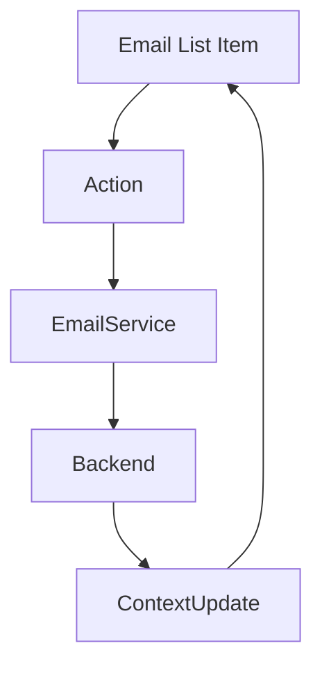
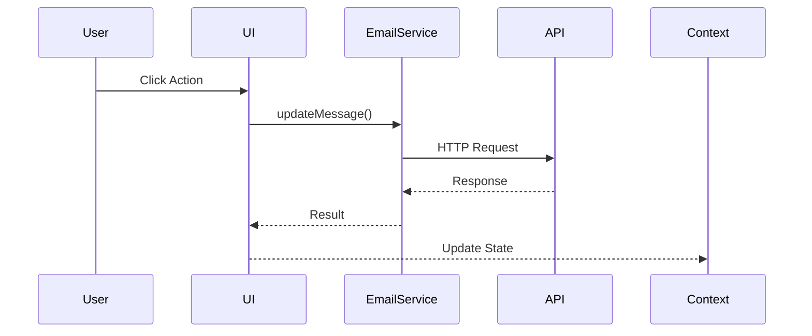
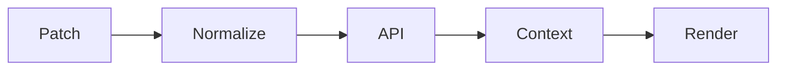
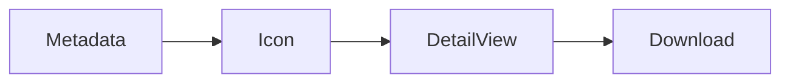

# Email List Module Documentation

## 1. Overview

The **Email List Module** is a frontend-driven orchestration layer responsible for rendering, interacting with, and mutating email list items within the application. It acts as the primary bridge between user intent (UI interactions) and backend email operations.

### Purpose
- Display email items in standard and compact list views.
- Enable common mailbox actions directly from the list.
- Keep UI state, counters, and selections synchronized with backend state.

### Problems It Solves
- Prevents excessive navigation for basic email actions.
- Centralizes update logic for read/unread, flag, delete, and folder movement.
- Ensures consistent state updates across folders, counters, and selected mail.

### Key Responsibilities
- Rendering email metadata (sender, subject, flags, importance).
- Handling inline actions (read/unread, flag, delete).
- Triggering backend mutations via EmailService.
- Updating shared MailContext state.

---

## 2. Unified Entry Point

### Component Entry Points
- `EmailListItem`
- `EmailListCompactItem`

These two components share identical behavior but differ in layout density.

### Why a Unified Behavioral Entry
- All mutations route through `EmailService.updateMessage`, `deleteMessage`, or `moveFolder`.
- Ensures predictable mutation handling and state updates.
- Simplifies backend integration and frontend reasoning.

### Supported Operations
- Select email
- Mark read / unread
- Flag / unflag
- Delete (hard delete for drafts, soft delete otherwise)
- Visual status rendering

---

## 3. Input Models

### EmailListItemProps

| Property | Type | Purpose |
|--------|------|--------|
| itm | EmailItem | Core email metadata |
| name | string | Sender display name |
| email | string | Sender email |
| subject | string | Email subject |
| snippet | string | Preview text |
| categories | array | Category tags |
| replyCount | number | Reply indicator |
| handleRightClick | function | Context menu trigger |
| onItemClick | function | Selection callback |
| getFlagDates | function | Flag date resolver |

---

## 4. Core Concepts / Normalization Logic

### Date Normalization
- Same-day emails render time only.
- Older emails render date.
- Powered by `dayjs` for timezone safety.

### Category De-duplication
- Duplicate categories are filtered before rendering.

### Folder-Aware Logic
- Drafts are hard-deleted.
- Other folders move items to `Deleted Items`.

---

## 5. Base Object Construction

### Email Update Payload
```ts
{
  isRead?: boolean;
  categoryId?: string;
  flagModel?: FlagModel;
  isStarred?: boolean;
  type: EmailUpdateType;
}
```

### Why This Exists
- Prevents over-posting.
- Allows partial updates.
- Backend contract remains stable.

---

## 6. Internal Helpers / Services

### EmailService
Responsible for backend interaction:
- `updateMessage`
- `deleteMessage`
- `moveFolder`

### MailContext
Shared state container:
- Selected email
- Email lists
- Folder counters
- Draft state

---

## 7. Execution Flow by Action Type

### Select Email
**Trigger:** Click on item  
**Flow:**
1. Clear draft state
2. Set selected mail ID
3. Fetch email details

### Mark Read / Unread
**Trigger:** Mail icon click  
**Flow:**
1. Show spinner
2. Call `updateMessage`
3. Update list state
4. Update folder counters

### Flag / Unflag
**Trigger:** Flag icon click  
**Flow:**
1. Resolve flag dates
2. Call `updateMessage` with Flag type
3. Update list and selected mail

### Delete
**Trigger:** Delete icon click  
**Flow:**
- Drafts → `deleteMessage`
- Others → `moveFolder(deleteditems)`

---

## 8. Attachment Handling

### Strategy
- Attachment presence is metadata-driven (`hasAttachment`).
- No inline downloads handled here.
- Retrieval handled in detail view.

---

## 9. Scheduling / Metadata Handling

### Follow-Up Flags
- Supports flagged and completed states.
- Uses computed start/due dates.
- No recurring scheduling supported.

---

## 10. Error Handling Strategy

### Approach
- Backend errors surfaced via `AOToast`.
- No silent failures.
- Loaders always cleared in `finally` blocks.

### Benefits
- Predictable UX
- Debug-friendly
- Prevents stale loaders

---

## 11. Design Principles

### Architectural Principles
- Single-responsibility components
- Context-driven shared state
- Stateless rendering where possible

### Scalability
- Supports pagination and virtualized lists.
- Backend-agnostic update contract.

### Extensibility
- New actions require minimal wiring.
- Flag and category logic already abstracted.

---

## 12. Mermaid Diagrams

### Overall Flow


### Sequence Diagram


### Update / Patch Flow


### Attachment Flow


---

## 13. Final Outcome

This design delivers a responsive, scalable, and predictable email list experience.  
UI remains fast, backend contracts stay stable, and new features can be layered without refactoring existing flows.
