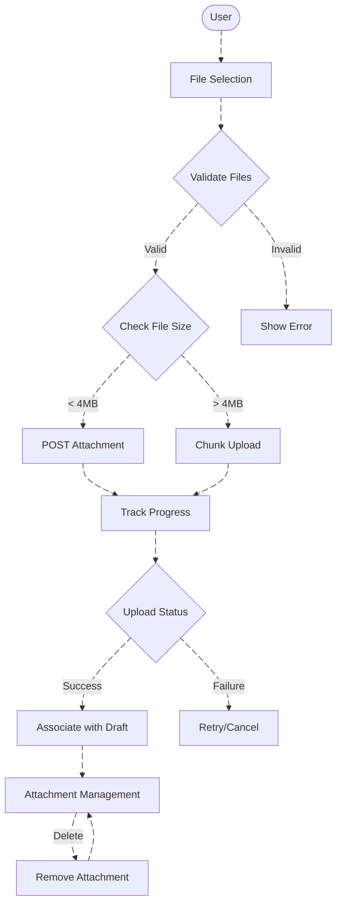
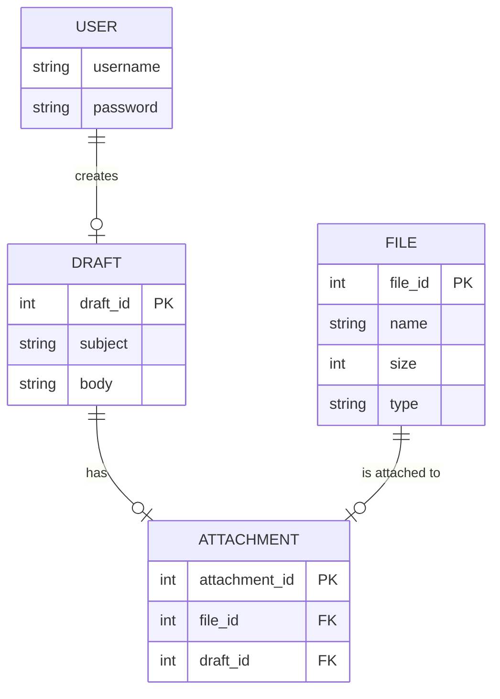

# **File Upload Drop Zone Module - Technical Documentation**

## 1. Overview

### **High-Level Purpose of the Module:**
The **File Upload Drop Zone Module** enables the functionality for users to upload multiple files with support for various file types (e.g., `.pdf`, `.docx`, `.jpg`, etc.) directly into a draft or selected email. This module handles file validation, upload progress tracking, chunked uploads for large files, and attachment management for email drafts.

### **What Problems It Solves:**
- **File Management:** Simplifies the process of adding, validating, and removing attachments within an email draft.
- **Progress Tracking:** Provides feedback on upload progress and handles large files through chunked uploads.
- **File Validation:** Ensures uploaded files conform to specified size and type limits.
- **Attachment Persistence:** Ensures attachments are correctly associated with email drafts and can be added or removed dynamically.

### **Key Responsibilities:**
- **File Validation:** Validates file types and sizes, rejecting files that exceed predefined limits.
- **Progress Tracking:** Tracks and displays the progress of each file being uploaded.
- **Chunked Uploads:** Handles large files by uploading in chunks and tracking progress.
- **Attachment Management:** Associates uploaded files with the email draft, supports deleting or removing attachments.
- **Error Handling:** Catches and handles errors during the file upload process, including network issues or cancellation requests.

---

## 2. Data Flow Diagram (DFD)

### **Description:**
The **Data Flow Diagram (DFD)** for the File Upload Drop Zone shows how files are handled through the upload process, from selecting files to uploading and associating them with an email draft.

### **Key Components:**
- **User**: Initiates the file selection and upload process.
- **File Selection**: The user selects one or more files to upload.
- **Validate Files**: The system validates the files to ensure they meet size and type requirements.
- **Upload Files**: Files are uploaded to the server, either as a whole or in chunks.
- **Track Progress**: The progress of each file upload is tracked and updated in the UI.
- **File Success/Failure**: Displays success or failure messages based on the upload outcome.
- **Associate with Draft**: The uploaded files are associated with the current email draft.
- **Attachment Management**: Allows users to manage, delete, or modify attachments associated with the draft.

---

## 3. Process Flow

### **Description:**
The Process Flow explains the step-by-step flow of file handling, from file selection to successful attachment of files to the draft.

1. **User Selects Files**:
   - The user selects one or more files for upload. The selected files are validated based on file type and size.

2. **File Validation**:
   - The module checks if the files meet the required file type and size limits.

3. **File Upload**:
   - Files that pass validation are uploaded, either as a whole or in chunks, depending on their size.

4. **Progress Tracking**:
   - As each file uploads, progress is tracked, and updates are provided in the UI.

5. **File Success/Failure**:
   - Once uploaded, the system provides feedback on the success or failure of the upload process.

6. **Attach to Draft**:
   - The uploaded files are then attached to the email draft, making them available for the user to review or send.

7. **Attachment Management**:
   - The user can delete or manage attachments associated with the draft as needed.

---

## 4. Entity Relationship Diagram (ERD)

### **Description:**
The Entity Relationship Diagram (ERD) illustrates the relationship between files, drafts, and the system's attachment management process.

### **Key Entities:**
- **USER**: Represents the user interacting with the system.
- **FILE**: Represents each file uploaded by the user.
- **DRAFT**: Represents an email draft to which files can be attached.
- **ATTACHMENT**: Represents the relationship between files and email drafts.

---

## 5. Entity Definitions

### **USER:**
- **username**: A unique identifier for the user.
- **password**: The user's password (stored securely).

### **FILE:**
- **file_id**: A unique identifier for each file.
- **name**: The name of the file.
- **size**: The size of the file in bytes.
- **type**: The MIME type of the file.

### **DRAFT:**
- **draft_id**: A unique identifier for each email draft.
- **subject**: The subject of the email.
- **body**: The body content of the email.

### **ATTACHMENT:**
- **attachment_id**: A unique identifier for each attachment.
- **file_id**: The ID of the file associated with the attachment.
- **draft_id**: The ID of the draft to which the file is attached.

---

## 6. Authentication / APIs

### **Authentication:**
The module uses OAuth 2.0 for secure user authentication, ensuring that the user has the appropriate permissions to access and upload files.

### **APIs:**
- **POST /uploadAttachment**: Uploads files to the server.
- **GET /fetchAttachments/{draftId}**: Retrieves the list of attachments associated with the email draft.
- **DELETE /deleteAttachment/{attachmentId}**: Deletes a specific attachment from the draft.
- **POST /uploadAttachmentInChunks**: Handles the chunked upload of larger files.

---

## 7. Testing Guide

### **Unit Testing:**
- **Test File Validation**: Ensure that files are validated correctly (e.g., size, type).
- **Test File Upload**: Verify that the upload process handles both small and large files correctly.
- **Test Progress Tracking**: Ensure that the upload progress is displayed accurately.
- **Test Attachment Management**: Validate that attachments can be added, retrieved, and deleted from the draft.

### **Integration Testing:**
- **Test API Integration**: Verify that the backend APIs for file uploads, fetching attachments, and deleting attachments function correctly.
- **Test Error Handling**: Ensure that error cases (e.g., file size limit exceeded, network failure) are handled appropriately.

### **UI Testing:**
- **Test UI Components**: Verify that the file upload drop zone UI works as expected, including drag-and-drop functionality and error handling.

---

## 8. References

- [OAuth 2.0 Specification](https://oauth.net/2/)
- [Email Service API Documentation](#)
- [File Upload Best Practices](#)
