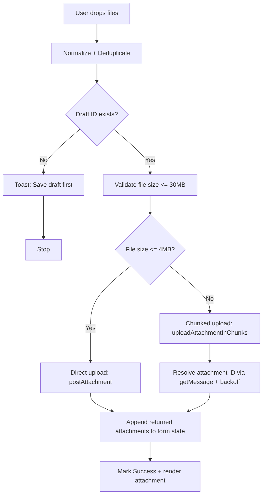
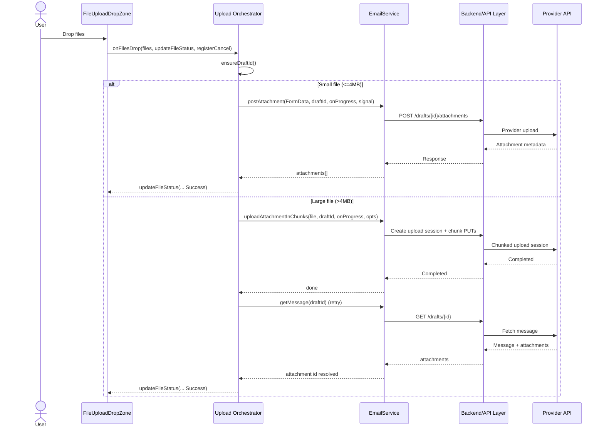
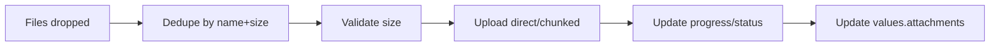
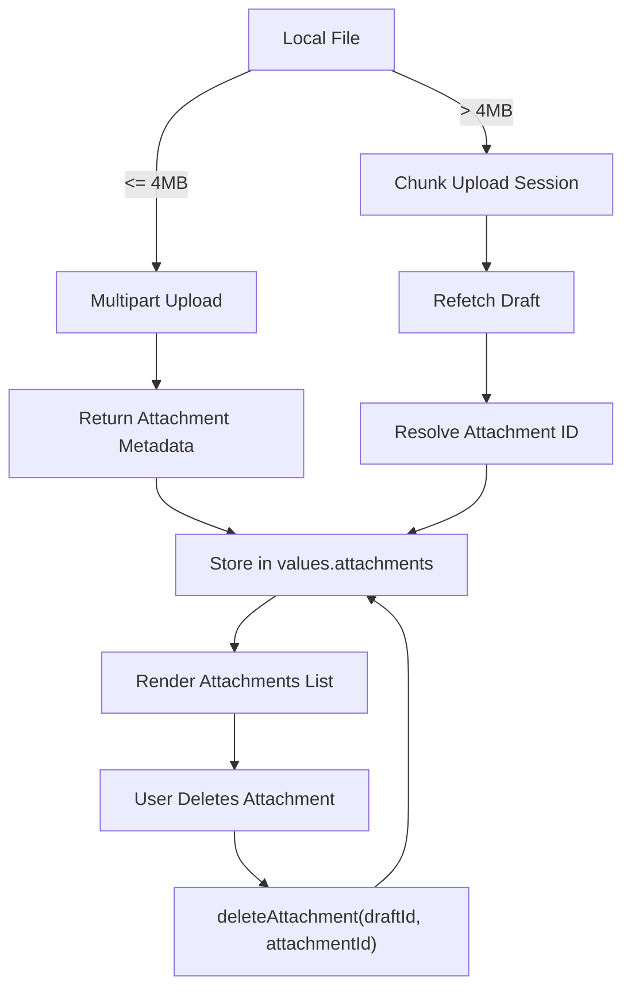

# Draft Attachment Upload Module Documentation

## 1. Overview

The **Draft Attachment Upload module** enables users to upload, track, and delete attachments for an email **draft** through a `FileUploadDropZone` UI component. It supports both **single-shot uploads** for small files and **chunked uploads** for larger files, while providing real-time progress updates, cancellation support, and resilient post-upload reconciliation (attachment ID resolution).

This module is a frontend orchestration layer that coordinates:
- UI file intake and de-duplication
- Draft identity resolution
- Upload strategy selection (direct vs chunked)
- Progress reporting + cancel handling
- Attachment list hydration into the form state
- Deletion of previously uploaded attachments

### High-level purpose
- Provide a smooth and safe attachment upload experience for email drafts.
- Ensure attachments are persisted against the correct draft message.
- Keep form state and backend attachment state consistent.

### Problems it solves
- Handles large file uploads without timing out by switching to chunked upload.
- Prevents duplicate uploads (by name/size).
- Avoids user confusion with reliable progress reporting and cancellation.
- Deals with eventual consistency by polling/refetching to resolve attachment IDs after chunked upload.

### Key responsibilities
- Accept a controlled set of file types.
- Enforce size limits and surface UX-friendly errors.
- Upload attachments (direct or chunked).
- Track progress and status per file.
- Update the composing form’s `attachments` model.
- Delete attachments and update the UI list.

---

## 2. Unified Entry Point

### UI Entry Point
- **`<FileUploadDropZone />`**

This component provides two primary hooks that form the unified behavioral entry points:
- `onFilesDrop(filesOrOne, updateFileStatus, registerCancel)`
- `onDelete(file)`

### Why a single entry point is used
- Ensures that all upload/delete actions go through one controlled pipeline.
- Guarantees that draft resolution, progress updates, and state mutation are consistent across all uploads.
- Provides a clear integration contract for upstream UI components.

### Operations supported
- Multi-file drop/upload
- Direct upload (small files)
- Chunked upload (large files)
- Upload cancellation
- Attachment deletion

---

## 3. Input Models

### DropZone Props (relevant)

| Property | Type | Purpose |
|---|---|---|
| value | `AttachmentViewModel[]` | Current attachments shown in the UI |
| multiple | `boolean` | Allows multi-file drop |
| accept | `{ custom: string[] }` | Allowed file extensions |
| onFilesDrop | `(...) => Promise<void>` | Upload pipeline entry |
| onDelete | `(file: any) => Promise<void>` | Delete pipeline entry |

### AttachmentViewModel (form state shape, inferred)

| Property | Type | Purpose |
|---|---|---|
| id | `string` | Provider attachment ID (server-side) |
| name | `string` | Filename |
| file | `File` | Browser file object (client-side reference) |
| size | `number` | File size in bytes |
| isTemporary | `boolean` | Indicates local placeholder vs persisted |
| _uid | `string` | UI uniqueness key for stable rendering |

### Upload Callback Contracts (inferred)

| Parameter | Type | Purpose |
|---|---|---|
| updateFileStatus | `(id: string, pct: number, status: FileUploadStatus) => void` | Updates per-file UI progress and status |
| registerCancel | `(fn: () => void) => void` | Registers cancel handler for UI-triggered abort |
| evt | `{ loaded: number; total?: number }` | Progress event from HTTP client |

---

## 4. Core Concepts / Normalization Logic

### File normalization
Incoming `filesOrOne` may be either a `File` or wrapper objects containing `{ file: File }`. The module normalizes using:

```ts
const toFile = (x: any): File | null => (x instanceof File ? x : x?.file instanceof File ? x.file : null);
```

### De-duplication rule
Files are deduplicated by a compound key:

- `name::size`

This prevents accidental double drops of the same file.

### Draft ID resolution
Uploads are only valid when a **draft ID** exists. Draft ID is derived from multiple sources to support different composing states:

- `draftMessage.id`
- `selectedMail.draftId`
- `selectedMail.id` if `selectedMail.isDraft === true`

If no draft ID is found, upload aborts with a user-facing error:
- `"Draft ID not found. Save draft first."`

### Upload strategy selection
Two thresholds govern behavior:

| Constant | Value | Purpose |
|---|---:|---|
| `MAX_SIZE` | 30 MB | Reject files above this limit |
| `CHUNK_THRESHOLD` | 4 MB | Files above this use chunked upload |

### Progress normalization and “99% guard”
Progress updates are cached and monotonic:
- Never decreases progress.
- Guards against showing `100%` before backend confirms completion (prevents “lying progress bars”).

Mechanism:
- `safeUpdate()` caps at `99%` until `markSuccess()` allows completion.

### Eventual consistency handling (chunked)
Chunked upload may complete before the attachment appears in `getMessage(draftId)` results. The module uses:
- A backoff retry loop
- A name/size match heuristic to resolve the real attachment ID.

---

## 5. Base Object Construction

### Shared progress and completion guards
Reusable local “base objects”:
- `progressCache: Map<string, number>`
- `canComplete: Map<string, boolean>`

These provide consistent progress semantics across upload strategies.

### Why they exist
- Avoids flicker and regressions in percent displayed.
- Guarantees consistent UX for both direct and chunked uploads.

### What they prevent or optimize
- Prevents premature `100%` display.
- Prevents out-of-order progress events from breaking UI.
- Improves perceived reliability of long uploads.

---

## 6. Internal Helpers / Services

### EmailService dependencies

| Method | Purpose | When used |
|---|---|---|
| `postAttachment(form, draftId, onProgress, signal)` | Direct upload of small files | When `file.size <= CHUNK_THRESHOLD` |
| `uploadAttachmentInChunks(file, draftId, onProgress, opts)` | Chunked upload for large files | When `file.size > CHUNK_THRESHOLD` |
| `getMessage(draftId)` | Refresh draft to find attachment IDs | After chunked upload completion |
| `deleteAttachment(draftId, attachmentId)` | Deletes attachment from draft | On user delete action |

### Key local helpers

#### `ensureDraftId()`
Resolves the correct draft identifier or throws.

#### `pickAttachments(resp)`
Normalizes attachments response shape across providers (`attachments` vs `Attachments`).

#### `resolveAttachmentId(name, size)`
Performs retry-based resolution of attachment ID by fetching draft and matching name/size.

#### `uploadOne(file)`
Encapsulates per-file upload pipeline, including validation, progress, and form updates.

---

## 7. Execution Flow by Action Type

### A) Upload Attachments

**Trigger conditions**
- User drops one or more files into the drop zone.

**Step-by-step flow**
1. Normalize incoming payload into a `File[]`.
2. Deduplicate by `name::size`.
3. Mark compose state dirty (`setIsChange(true)`).
4. Resolve `draftId` via `ensureDraftId()`.
   - If missing → toast error and return.
5. Create an `AbortController` and register cancel hook.
6. For each file:
   1. Validate size (`<= 30MB`), else toast and skip.
   2. Create a temporary UI ID (`temp-...`).
   3. Choose strategy:
      - **Direct upload** if `<= 4MB`
      - **Chunked upload** if `> 4MB`
   4. Stream progress updates via `safeUpdate()`.
   5. On success:
      - Direct: map response attachments into form state.
      - Chunked: resolve attachment ID via `resolveAttachmentId` and append to form state.
   6. Mark upload success with `markSuccess()`.

**Special considerations / constraints**
- Uploads run concurrently (`Promise.all(files.map(uploadOne))`).
- Chunked uploads may complete before attachment is queryable; ID resolution handles this.
- If chunked upload completes but the attachment ID cannot be resolved immediately, the UI shows an informational toast and does not append an attachment entry yet.

### B) Cancel Upload

**Trigger conditions**
- User presses cancel in the upload UI (provided by DropZone via `registerCancel`).

**Step-by-step flow**
1. UI calls cancel handler → `AbortController.abort()`.
2. Upload promise rejects with abort/cancel error.
3. Module sets file status to `Failed` (current implementation) and shows toast `"Upload cancelled..."`.

**Special considerations**
- Cancellation is detected by checking `AbortError`, `CanceledError`, or message `"canceled"`.
- Consider mapping cancellation to a distinct UI status (e.g., `Cancelled`) if supported by the DropZone component.

### C) Delete Attachment

**Trigger conditions**
- User clicks delete on an attachment entry.

**Step-by-step flow**
1. Resolve `draftId` using `draftMessage`/`selectedMail` logic.
2. Call `EmailService.deleteAttachment(draftId, file.id)`.
3. On success:
   - Show `"Attachment deleted"` toast.
   - Remove attachment entry from form state.
4. On failure:
   - Log error and toast `"Failed to delete attachment"`.

**Constraints**
- Requires a resolvable `draftId` and attachment `id`.
- If `draftId` is missing, deletion aborts with an error toast.
  → Reference: [`DeleteAttachment`](../API/deleteAttachment.md)


---

## 8. Attachment / Asset Handling

### Upload strategy
  → Reference: [`UploadAttachment`](../API/UploadAttachments/upload.md)

- **Small files (≤ 4MB):** Multipart `FormData` upload via `postAttachment`  
  → Reference: [`PostAttachment`](../API/UploadAttachments/PostAttachments.md)
- **Large files (> 4MB):** `uploadAttachmentInChunks` using chunked/session semantics (provider-specific but abstracted by `EmailService`).
  → Reference: [`UploadAttachmentInChunks`](../API/UploadAttachments/uploadAttachmentInChunks.md)


### Sync strategy
- **Direct upload:** uses returned attachment objects as the source of truth.
- **Chunked upload:** performs post-upload synchronization by refetching the draft and resolving the attachment ID.

### Retrieval strategy
- Attachments are stored in form state (`values.attachments`) for UI rendering and subsequent send/update flows.
- Full attachment download is outside the scope of this module.

---

## 9. Scheduling / Metadata Handling

### Metadata handled
- Draft identity (`draftId`)
- Upload progress and status
- Attachment identifiers (`id`) and UI identifiers (`_uid`)

### Validation rules
- File size must be ≤ 30MB.
- Draft ID must exist prior to upload/delete.
- Allowed extensions enforced by DropZone `accept.custom`.

### Limitations
- For chunked uploads, attachments may not appear immediately; unresolved IDs are not appended until resolvable.
- Duplicate detection uses only `(name, size)`; different files with the same name and size will be treated as duplicates.

---

## 10. Error Handling Strategy

### How errors are wrapped/surfaced
- Errors are caught per-file in `uploadOne`.
- Toast feedback:
  - Cancel: informational toast
  - Failure: error toast
  - Oversize: error toast
- Deletion errors are caught and surfaced with a generic toast.

### Why this strategy is used
- Prevents one failed file from blocking other uploads (per-file isolation).
- Provides immediate user feedback for common issues (draft missing, oversize, cancel).
- Avoids stuck “uploading” indicators by always updating status on terminal paths.

### Benefits
- Resilient multi-file experience.
- Clear UX without leaking implementation details.
- Safe cancellation semantics.

---

## 11. Design Principles

### Key architectural principles
- **Provider abstraction:** `EmailService` hides provider-specific attachment semantics.
- **Deterministic thresholds:** clear size limits and strategy split.
- **Monotonic progress:** progress never moves backwards; avoids UI jitter.
- **State synchronization:** form state reflects backend truth (direct) or refetch-confirmed truth (chunked).

### Scalability considerations
- Supports parallel uploads for multiple attachments.
- Chunked path supports large payloads without large single requests.
- Backoff-based ID resolution is bounded and avoids tight loops.

### Provider-agnostic / extensibility notes
- Response normalization supports multiple casing conventions (`attachments` vs `Attachments`).
- Additional providers can be added behind `EmailService` without changing UI logic.
- Future improvements:
  - Distinct `Cancelled` status
  - Retry per-file with exponential backoff
  - Stronger dedupe (hash/checksum) if needed

---

## 12. Mermaid Diagrams (MANDATORY)

### Overall Flowchart (high-level request lifecycle)


### Sequence Diagram (UI → API → External Service)


### Update / Patch Flow


### Attachment / Asset Flow


## 13. Final Outcome

This design provides a robust attachment pipeline for email drafts that is **safe**, **scalable**, and **provider-agnostic**.

### Benefits for UI
- Smooth multi-file uploads with progress and cancellation.
- Prevents misleading progress completion through the 99% guard.
- Immediate state updates on success and deletion.

### Benefits for API / backend integration
- Clear separation between small-file direct upload and large-file chunked upload.
- Draft ID enforcement prevents orphaned uploads.
- Eventual consistency is handled gracefully via bounded retries.

### Benefits for scalability
- Parallel uploads scale with user needs.
- Chunked upload supports large files reliably.
- Extensible toward retries, cancellation states, and stronger deduplication.
