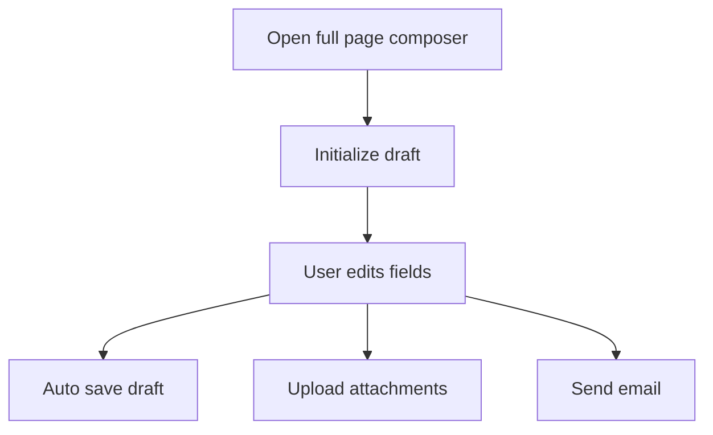
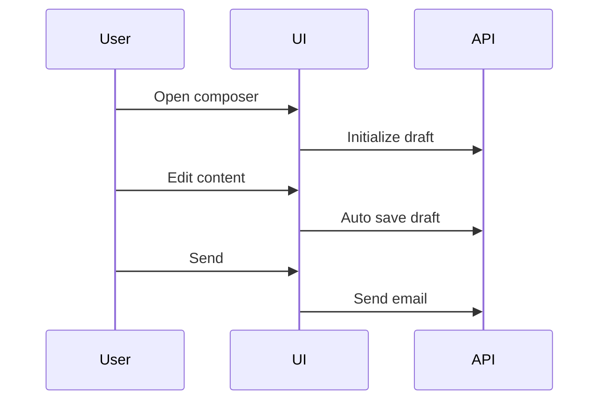
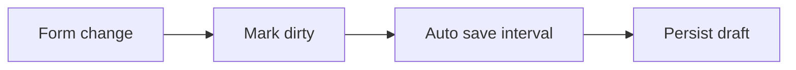
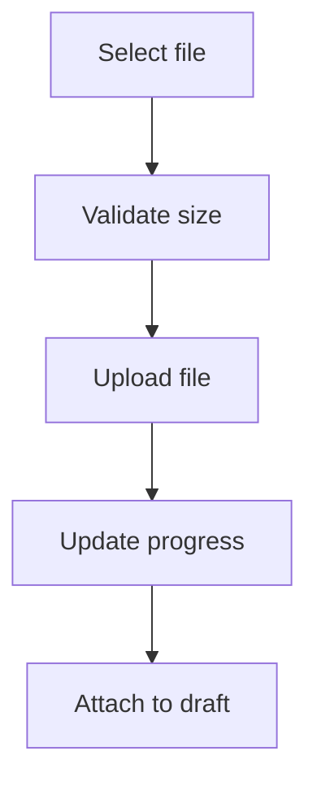

# FullPageEmailPanel — Full Page Email Composer

## 1. Overview

`FullPageEmailPanel` is the **full-screen email composition module** responsible for composing, replying, forwarding, and drafting emails with rich content, recipients, importance, tone analysis, and attachment uploads.

### Purpose
- Provide a distraction-free, full-page email authoring experience.
- Support complex email scenarios such as drafts, replies, forwards, and auto-responses.
- Integrate attachments, tone analysis, and importance marking in a single workflow.

### Problems It Solves
- Prevents fragmented compose logic across multiple UI components.
- Centralizes draft lifecycle management and auto-save behavior.
- Handles large attachment uploads safely and consistently.

### Key Responsibilities
- Render and manage recipient selection (To, Cc, Bcc).
- Manage draft creation and auto-save.
- Handle rich text editing and tone analysis.
- Upload, track, and delete attachments.
- Submit composed emails via a unified handler.

---

## 2. Unified Entry Point

### Component Entry
```ts
FullPageEmailPanel(props)
```

### Why a Single Entry Point
- Guarantees consistent validation and submission behavior.
- Centralizes draft, attachment, and editor lifecycle.
- Simplifies integration with backend email APIs.

### Supported Operations
- Compose new email
- Reply / Forward
- Save draft (manual and automatic)
- Send email
- Upload and delete attachments

---

## 3. Input Models

### Props Interface

| Property | Type | Purpose |
|--------|------|---------|
| onDismiss | Function | Close or minimize the panel |
| title | string | Header title |
| handleSend | Function | Final send handler |
| initialValues | Object | Initial form state |
| initializeDraft | Function | Initializes draft on load |
| isDraft | boolean | Indicates draft mode |

### Initial Values Structure

| Field | Type | Purpose |
|-----|-----|--------|
| toRecipients | array | Primary recipients |
| ccRecipients | array | Carbon copy recipients |
| bccRecipients | array | Blind carbon copy recipients |
| subject | string | Email subject |
| body | string | HTML body |
| attachments | array | Uploaded attachments |
| requestType | enum | Compose, Draft, Reply |
| importance | enum | High, Normal, Low |

---

## 4. Core Concepts / Normalization Logic

### Recipient Normalization
- Users are normalized into `{ id, name, email }`.
- Manual entries are parsed from `name<email>` format.

### Draft Auto-Save
- Triggered every 30 seconds when form state changes.
- Ensures a draft ID exists before attachment uploads.

### Importance Handling
- Only one importance state allowed at a time.
- UI disables conflicting selections.

---

## 5. Base Object Construction

### Draft Payload
```ts
{
  Id: draftId,
  requestType: Draft,
  importance: Normal,
  ...formValues
}
```

### Why It Exists
- Prevents partial draft states.
- Ensures backend compatibility for incremental saves.

---

## 6. Internal Helpers / Services

| Helper | Purpose |
|------|--------|
| useAnalyzeTone | Tone detection for content |
| EmailService.saveAsDraft | Auto-save draft |
| EmailService.postAttachment | Upload attachments |
| EmailService.uploadAttachmentInChunks | Chunked uploads |
| EmailService.deleteAttachment | Remove attachment |

---

## 7. Execution Flow by Action Type

### Compose / Edit
- User enters content.
- Tone analysis runs on debounce.
- Draft auto-save triggers periodically.

### Send
- Validation enforced.
- `handleSend(values)` invoked.

### Draft Auto-Save
1. Detect form change.
2. Start interval timer.
3. Persist draft to backend.
4. Update draft timestamp.

---

## 8. Attachment / Asset Handling

### Upload Strategy
- Files under 4MB: direct upload.
- Files over 4MB: chunked upload.
- Max size: 30MB.

### Sync Strategy
- Attachments stored against draft ID.
- UI progress synced via callbacks.

### Retrieval Strategy
- Backend attachment list refreshed after upload.
- Attachments merged into form state.

---

## 9. Scheduling / Metadata Handling

Not applicable in this module.

---

## 10. Error Handling Strategy

### Approach
- Errors surfaced via toast notifications.
- Upload failures tracked per file.

### Benefits
- Non-blocking UX.
- Clear feedback on partial failures.

---

## 11. Design Principles

- **Single Source of Truth**: Formik manages form state.
- **Fail Safe Drafting**: Auto-save prevents data loss.
- **Scalable Uploads**: Chunking supports large files.
- **Extensible**: Provider-agnostic EmailService.

---

## 12. Mermaid Diagrams

### 12.1 Overall Flowchart


### 12.2 Sequence Diagram


### 12.3 Update Patch Flow


### 12.4 Attachment Flow


---

## 13. Final Outcome

This design provides a **robust, scalable, and user-safe** full-page email composition experience with:
- Reliable draft persistence
- Advanced attachment handling
- Clear separation of concerns
- Easy extensibility for future features
