# **Attachment Gallery - Technical Documentation**

## 1. Overview

### **High-Level Purpose of the Module:**
The **Attachment Gallery** is a React component that displays a gallery of uploaded file attachments. The gallery allows users to view and download individual attachments, show or hide additional attachments, and supports bulk download of all attachments. The component dynamically adjusts its layout based on the number of attachments, providing a smooth and efficient user experience.

### **What Problems It Solves:**
- **Efficient Attachment Management**: Manages multiple attachments in a gallery-style interface, allowing users to interact with files easily.
- **Progressive Display**: Displays a subset of attachments initially, allowing users to expand and view more if necessary.
- **Bulk Download**: Provides a bulk download option to allow users to download all attachments at once.
- **File Previews**: Supports file previews for images and file-type-specific icons for other attachments.
- **Dynamic Interaction**: Allows users to download or view individual attachments and manage their visibility dynamically.

### **Key Responsibilities:**
- **Attachment Display**: Displays attachments in a grid layout, providing users with an overview of uploaded files.
- **Pagination and Expansion**: Supports dynamic visibility of attachments, showing only a subset by default with an option to show more.
- **Bulk Actions**: Supports actions like bulk download of attachments.
- **Attachment Management**: Includes actions for viewing, downloading, and managing individual attachments.

---

## 2. Data Flow Diagram (DFD)

### **Description:**
The **Data Flow Diagram (DFD)** illustrates the flow of data through the **Attachment Gallery** component, from displaying attachments to managing actions such as viewing and downloading.

```mermaid
flowchart TD
  A([👤 User]) edge1@--> B[📁 Select Attachments]
    B edge2@--> C[🖼️ Display Attachments]
    C edge3@--> D{📊 Manage Visibility}
    D edge4@-->|Show More| E[🔍 Track User Actions]
    D edge11@-->|Show Less| C
    E edge5@--> F[👁️ View Attachment]
    E edge6@--> G[⬇️ Download Attachment]
    E edge7@--> H[📦 Download All]
    H edge8@--> I[🚀 Bulk Download]
    G edge9@--> J{✅ Update State}
    I edge10@--> J
    F edge12@--> K[🖥️ Preview File]
    J edge13@--> L[✨ Success]
    
    edge1@{ animate: fast }
    edge2@{ animate: fast }
    edge3@{ animate: fast }
    edge4@{ animate: fast }
    edge5@{ animate: fast }
    edge6@{ animate: fast }
    edge7@{ animate: fast }
    edge8@{ animate: fast }
    edge9@{ animate: fast }
    edge10@{ animate: fast }
    edge11@{ animate: fast }
    edge12@{ animate: fast }
    edge13@{ animate: fast }
```

### **Key Components:**
- **User**: Initiates actions such as selecting attachments and performing bulk actions.
- **Select Attachments**: The user selects the attachments to be displayed in the gallery.
- **Display Attachments**: The component renders the selected attachments in a gallery format.
- **Manage Visibility**: Dynamically shows or hides additional attachments based on user interaction.
- **Track User Actions**: Tracks actions performed by the user, such as viewing or downloading attachments.
- **View/Download Attachments**: The user can view or download individual attachments.
- **Bulk Download**: The user can download all attachments at once.
- **Manage Attachment State**: Updates the state of attachments based on user actions (e.g., viewed, downloaded).

---

## 3. Process Flow

### **Description:**
The Process Flow explains the sequential steps taken by the system to display and manage attachments within the gallery.

1. **User Selects Attachments**:
   - The user selects which attachments to display, either through a drag-and-drop interface or a file selection dialog.

2. **Display Attachments**:
   - The component renders a subset of the attachments in the gallery grid layout, showing only the first few attachments (based on maxVisible).

3. **Manage Visibility**:
   - The component checks if more attachments are available and provides an option to expand the gallery and show additional attachments.

4. **Track User Actions**:
   - User actions (viewing or downloading attachments) are tracked, allowing interaction with each file individually.

5. **View/Download Attachments**:
   - The user can click to view or download individual attachments.

6. **Bulk Download**:
   - The user can download all the attachments at once by clicking the Download all button.

---

## 4. Entity Relationship Diagram (ERD)

### **Description:**
The Entity Relationship Diagram (ERD) defines the relationships between files, users, and attachments within the system.

### **Key Entities:**
- **USER**: Represents the user uploading and managing attachments.
- **ATTACHMENT**: Represents a file attachment that is associated with a user.
- **ATTACHMENT_FILE**: Represents the physical file data, including file size and type.

---

## 5. Entity Definitions

### **USER:**
- **username**: A unique identifier for the user uploading the attachments.
- **email**: The user's email address used for communication and authentication.

### **ATTACHMENT:**
- **attachment_id**: A unique identifier for each attachment.
- **name**: The name of the attachment.
- **size**: The size of the attachment in bytes.
- **type**: The MIME type of the attachment (e.g., image/png, application/pdf).

### **ATTACHMENT_FILE:**
- **file_id**: A unique identifier for the file data.
- **file_name**: The name of the file.
- **file_size**: The size of the file in bytes.
- **file_type**: The MIME type of the file.

---

## 6. Authentication / APIs

### **Authentication:**
The system uses OAuth 2.0 for secure authentication, ensuring that users are authorized to upload, view, and delete attachments.

### **APIs:**
- **POST /uploadAttachment**: Uploads an attachment to the server.
- **GET /getAttachments/{userId}**: Retrieves a list of attachments associated with the user.
- **GET /downloadAttachment/{attachmentId}**: Downloads an individual attachment.
- **DELETE /deleteAttachment/{attachmentId}**: Deletes a specific attachment from the server.

---

## 7. Testing Guide

### **Unit Testing:**
- **Test Attachment Display**: Ensure that the correct number of attachments is displayed based on the maxVisible property.
- **Test Attachment Visibility**: Verify that the component correctly handles expanding and collapsing the attachment gallery.
- **Test Download Actions**: Ensure that individual and bulk download actions work correctly.
- **Test Error Handling**: Test that the system correctly handles errors when displaying or downloading attachments.

### **Integration Testing:**
- **Test API Endpoints**: Verify that the attachment upload, retrieval, and deletion APIs work as expected.
- **Test User Authentication**: Ensure that only authorized users can upload or manage attachments.

### **UI Testing:**
- **Test UI Components**: Verify that the gallery correctly displays attachments in a responsive grid layout.
- **Test File Previews**: Ensure that image files display thumbnails, and non-image files show the appropriate icons.
- **Test File Actions**: Validate that file actions like view, download, and delete are functional and trigger the correct behaviors.
