# **FileUploadDropZone - Technical Documentation**

## 1. Overview

### **High-Level Purpose of the Module**

The **FileUploadDropZone** component provides a user-friendly interface for uploading files. This module simplifies the process of adding files to a system by allowing users to drag files directly from their file explorer into a designated drop zone, or alternatively, to select files through a file input. The module is designed to handle multiple files at once, offering a smooth user experience for uploading, monitoring upload progress, and managing uploaded files.

### **What Problems It Solves**

- **Simplifies file uploads**: It reduces the need for complex file selection dialogs, offering a more intuitive drag-and-drop experience.
- **Improves file management**: Users can easily manage files, view upload progress, cancel uploads, and retry failed uploads.
- **Validates file types and sizes**: Automatically validates file types and ensures that files meet size constraints before upload, providing real-time feedback to the user.
- **Handles failed uploads and retries**: Allows users to retry failed uploads and cancel ongoing ones, ensuring a smooth upload experience.

### **Key Responsibilities**

- **File Dragging and Dropping**: Allows users to drag files directly from their file explorer to the drop zone for upload.
- **File Validation**: Validates file types and file sizes to ensure they meet the system's requirements.
- **Progress Tracking**: Provides real-time upload progress indicators, allowing users to track the status of their files.
- **Retry and Cancel Mechanism**: Offers the ability to retry failed uploads or cancel ongoing uploads.
- **State Management**: Manages the state of files during upload, including those that are pending, successfully uploaded, or failed.
- **Customizable UI**: Customizes the look and feel of the upload zone based on the current state (e.g., active drag zone, upload progress, success, failure).

---

## 2. Data Flow Diagram (DFD)

```mermaid
flowchart TD
    A([👤 User]) edge1@--> B[📂 Drag Files or Click to Select]
    B edge2@--> C{✔️ Validate File Type & Size}
    C edge3@-->|Valid| D[📋 Add to Upload Queue]
    C edge12@-->|Invalid| M[⚠️ Show Error]
    D edge4@--> E[📊 Track Upload Progress]
    E edge5@--> F[⬆️ File Uploading]
    F edge6@--> G{📌 Upload Result}
    G edge7@-->|Success| J[✅ View/Download Files]
    G edge8@-->|Failure| H[🔄 Retry or Cancel]
    H edge9@-->|Retry| F
    H edge10@-->|Cancel| I[🗑️ Mark for Deletion]
    I edge11@--> K[❌ Remove from Queue]
    K edge13@--> J
    
    edge1@{ animate: fast }
    edge2@{ animate: fast }
    edge3@{ animate: fast }
    edge4@{ animate: fast }
    edge5@{ animate: fast }
    edge6@{ animate: fast }
    edge7@{ animate: fast }
    edge8@{ animate: fast }
    edge9@{ animate: fast }
    edge10@{ animate: fast }
    edge11@{ animate: fast }
    edge12@{ animate: fast }
    edge13@{ animate: fast }
    
    style A fill:#e3f2fd,stroke:#1976d2,stroke-width:4px,color:#000
    style B fill:#fff3e0,stroke:#f57c00,stroke-width:3px,color:#000
    style C fill:#fff9c4,stroke:#f57f17,stroke-width:3px,color:#000
    style D fill:#f3e5f5,stroke:#7b1fa2,stroke-width:3px,color:#000
    style E fill:#e0f2f1,stroke:#00897b,stroke-width:3px,color:#000
    style F fill:#e1f5fe,stroke:#0277bd,stroke-width:3px,color:#000
    style G fill:#fff9c4,stroke:#f9a825,stroke-width:3px,color:#000
    style H fill:#ffe0b2,stroke:#ef6c00,stroke-width:3px,color:#000
    style I fill:#ffebee,stroke:#c62828,stroke-width:3px,color:#000
    style J fill:#c8e6c9,stroke:#2e7d32,stroke-width:4px,color:#000
    style K fill:#ffcdd2,stroke:#d32f2f,stroke-width:3px,color:#000
    style M fill:#ffebee,stroke:#c62828,stroke-width:3px,color:#000
```



---

## 3. Process Flow

The process flow for the **FileUploadDropZone** component is as follows:

1. **User Drags or Selects Files**:
   - The user either drags files into the drop zone or selects them using the file input.

2. **Validate File Type and Size**:
   - The component checks the file types and sizes to ensure they meet the system's requirements (e.g., file type and max file size).

3. **Add Files to Upload Queue**:
   - Valid files are added to the upload queue, and a unique identifier (UID) is assigned to each file.

4. **Track Upload Progress**:
   - Each file's upload progress is tracked in real-time, with a progress bar being displayed for each file.

5. **File Uploading**:
   - The upload is initiated, and the progress is continuously updated.

6. **Upload Success or Failure**:
   - Once the file upload completes, the status is updated as "Success" or "Failed."

7. **Retry or Cancel Upload**:
   - The user can retry a failed upload or cancel an ongoing one.

8. **Mark Files for Deletion**:
   - Files can be marked for deletion if the user opts to remove them from the upload queue.

9. **View/Download Files**:
   - Once uploaded, files can be viewed or downloaded by the user.

---

## 4. Entity Relationship (ER) Diagram

The **FileUploadDropZone** component operates on entities related to the file upload process, including files, their states, and actions. Below is the basic ER diagram:


---

## 5. Entity Definitions

### **File**

- **uid** (string): A unique identifier for the file, generated using the `nextUid()` method.
- **name** (string): The name of the file (e.g., `document.pdf`).
- **size** (int): The size of the file in bytes.
- **type** (string): The MIME type of the file (e.g., `application/pdf`).
- **status** (string): The current status of the file (e.g., `Uploading`, `Success`, `Failed`).
- **progress** (string): The current progress of the file upload (e.g., `75%`).

### **Upload Action**

- **actionType** (string): Describes the action being performed (e.g., `upload`, `delete`, `retry`).
- **timestamp** (string): The timestamp when the action occurred.

### **User**

- **userId** (string): The unique identifier for the user.
- **username** (string): The username of the user who initiated the upload.

---

## 6. Authentication / APIs

The **FileUploadDropZone** module does not handle direct authentication. Authentication for file uploads would be handled by the backend API, which should ensure that users are authorized to upload files. Here's an example API for handling file uploads:

### **API Example: File Upload**

**POST /api/upload**

- **Request Body**: Multipart form-data containing the file to be uploaded.
- **Response**: JSON response indicating success or failure of the upload.

```json
{
  "status": "success",
  "message": "File uploaded successfully.",
  "fileId": "file_12345"
}
```

### **API Example: Delete File**

**DELETE /api/delete/{fileId}**

- **Request**: `fileId` parameter in the URL.
- **Response**: JSON response indicating success or failure of the file deletion.

```json
{
  "status": "success",
  "message": "File deleted successfully."
}
```

---

## 7. Testing Guide

To ensure the functionality of the **FileUploadDropZone** component, the following testing strategies should be employed:

### **Unit Tests:**

- Test each utility function (e.g., `isImage`, `getFileIconName`).
- Validate file size and type checks.

### **Component Tests:**

- Test the drag-and-drop functionality by simulating drag events and file drops.
- Test upload progress tracking by simulating file uploads and monitoring the progress.
- Test retry and cancel functionalities.

### **Integration Tests:**

- Test the file upload process with backend APIs to ensure correct integration between the frontend and backend.

### **End-to-End Tests:**

- Perform manual or automated tests for file uploads, handling errors, and retry mechanisms to ensure a smooth user experience.
