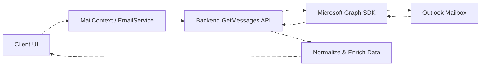
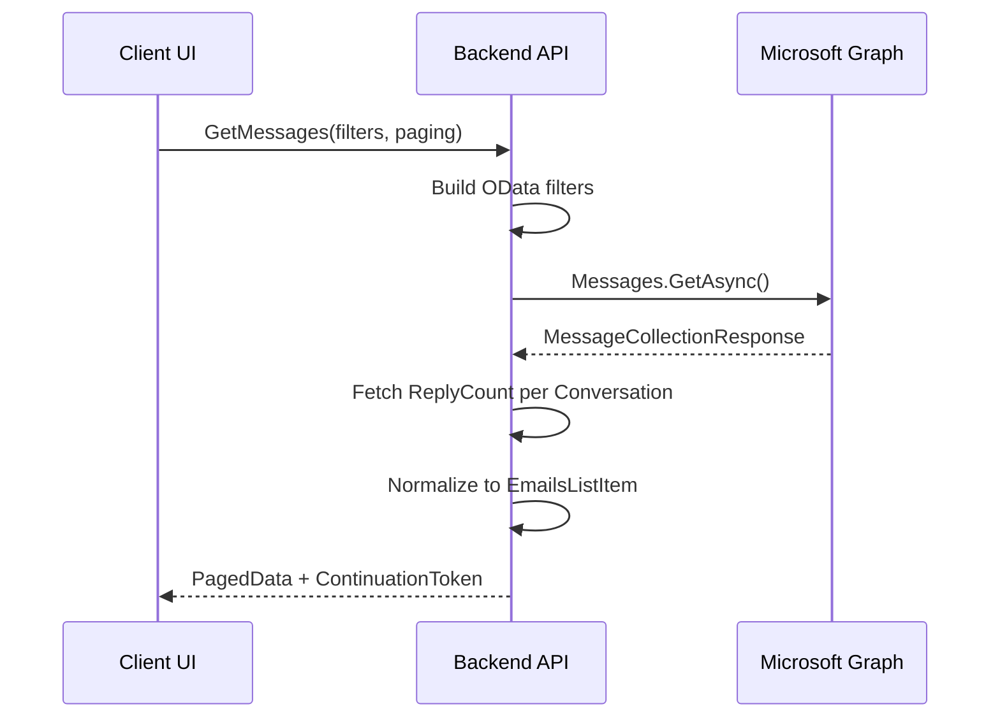
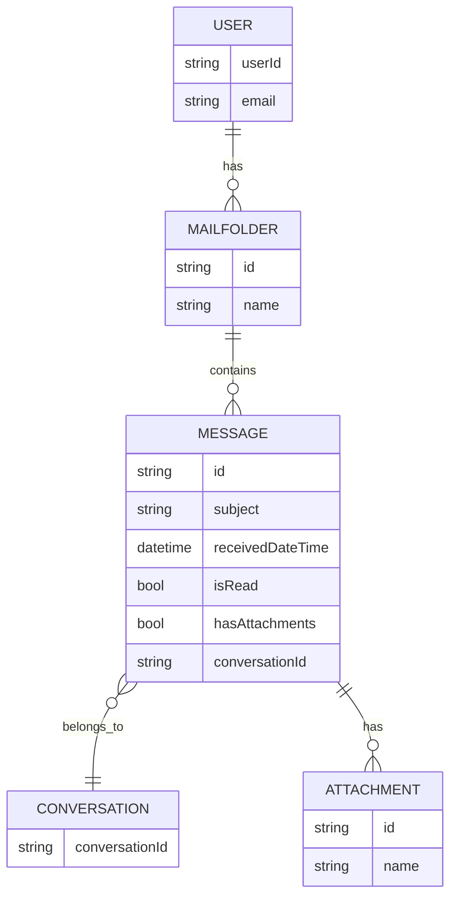
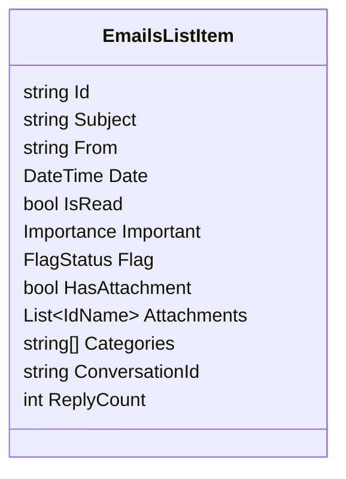

# Email Get Messages – Technical Documentation


## Overview

This document describes the backend implementation of the **GetMessages API**, which retrieves paginated email messages from Microsoft Outlook using the **Microsoft Graph SDK**.

The API supports Inbox, Sent Items, and Drafts through a single unified method and provides advanced filtering such as unread/read, flagged, important, attachments, mentions, categories, search, and date-based sorting.

---

## DFD (Data Flow Diagram)



The backend acts as an abstraction layer that converts UI filters into Graph OData queries and normalizes Graph responses into application-friendly models.

---

## Process Flow



---

## ER Diagram



---

## Entity Definition

### EmailsListItem



| Field          | Type         | Description              |
| -------------- | ------------ | ------------------------ |
| Id             | string       | Message ID               |
| Subject        | string       | Email subject            |
| From           | string       | Sender name              |
| Date           | DateTime     | Received/Sent/Draft date |
| IsRead         | bool         | Read status              |
| Important      | Importance   | Importance level         |
| Flag           | FlagStatus   | Follow-up flag           |
| HasAttachment  | bool         | Attachment indicator     |
| Attachments    | List<IdName> | Attachment metadata      |
| Categories     | string[]     | Outlook categories       |
| ConversationId | string       | Conversation grouping    |
| ReplyCount     | int          | Replies in conversation  |

---

## Authentication / APIs

### Authentication

* Uses **Bearer Token (OAuth 2.0)**
* Token is resolved to a Microsoft identity
* `GraphServiceClient` is instantiated per authenticated user

### API Signature

```csharp
Task<PagedData<EmailsListItem>> GetMessages(...)
```

The API translates frontend filters into Graph-compatible OData filters.

---

## Testing Guide

### Unit Testing

* Filter generation logic
* Date selection logic per folder
* DTO mapping

### Integration Testing

* Microsoft Graph sandbox account
* Pagination & continuation token
* Folder switching

### Edge Cases

* Empty mailbox
* Large conversations
* Missing ConversationId

---

## References

* Microsoft Graph Messages API
* OData Query Options
* Microsoft Graph SDK for .NET
