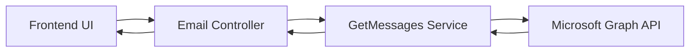

# Email Messages Retrieval Module – GetMessages

## Overview

The **GetMessages** module is a backend service responsible for retrieving a paginated, filtered, and normalized list of email messages from **Microsoft Graph**. It acts as the **single backend entry point** for inbox-like views (Inbox, Sent Items, Drafts, etc.) used by frontend applications.

### Purpose

* Provide a **unified email listing API** across folders
* Support rich filtering (read/unread, flagged, categories, attachments, mentions)
* Enable efficient pagination and infinite scroll
* Normalize raw Graph responses into UI-ready models

### Problems It Solves

* Avoids multiple folder-specific APIs
* Centralizes OData filter construction
* Ensures consistent sorting and pagination
* Decouples frontend from Graph SDK complexities

---

## Data Flow Diagram (DFD)



---

## Process Flow


---

## ER Diagram


---

## Entity Definition

### EmailsListItem

| Property         | Type               | Description             |
| ---------------- | ------------------ | ----------------------- |
| `Id`             | string             | Unique message ID       |
| `From`           | string             | Sender display name     |
| `ToRecipients`   | List<IdNameModel>  | Recipient list          |
| `Subject`        | string             | Email subject           |
| `Snippet`        | string             | Body preview            |
| `Date`           | DateTime           | Normalized message date |
| `IsRead`         | bool               | Read status             |
| `IsDraft`        | bool               | Draft indicator         |
| `Important`      | Importance         | Importance flag         |
| `Flag`           | FollowupFlagStatus | Follow-up flag status   |
| `Categories`     | List<string>       | Assigned categories     |
| `HasAttachment`  | bool               | Attachment indicator    |
| `Attachments`    | List<IdName>       | Attachment metadata     |
| `ConversationId` | string             | Conversation thread ID  |
| `ReplyCount`     | int                | Replies count           |

---

## Authentication / APIs

### Authentication

* OAuth 2.0 access token
* Token scoped for **Mail.Read** / **Mail.ReadWrite**
* Injected into `GraphServiceClient`

### External APIs

* **Microsoft Graph**: `/me/mailFolders/{folder}/messages`

### Backend API Contract

```http
GET /api/emails/messages
```

### Key Query Parameters

* `inboxType` (inbox, sentitems, drafts)
* `viewType` (unread, read, all)
* `search`
* `isFlagged`
* `categoryType`
* `hasAttachment`
* `hasMentioned`
* `start`, `length`

---

## Testing Guide

### Unit Tests

* Filter construction logic
* View type handling (read/unread)
* Date normalization logic
* Reply count aggregation

### Integration Tests

* Microsoft Graph sandbox
* Pagination & continuation token validation
* Large mailbox scenarios

### Edge Cases

* Empty folders
* Messages without ConversationId
* Draft vs Sent date resolution
* Search strings with special characters

---

## References

* Microsoft Graph Mail API Documentation
* OData Filter Syntax
* Internal Mail Architecture Guide
