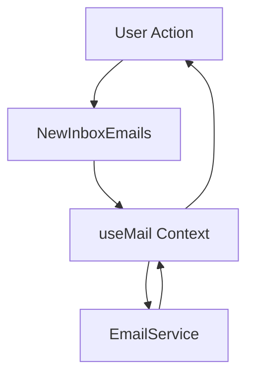
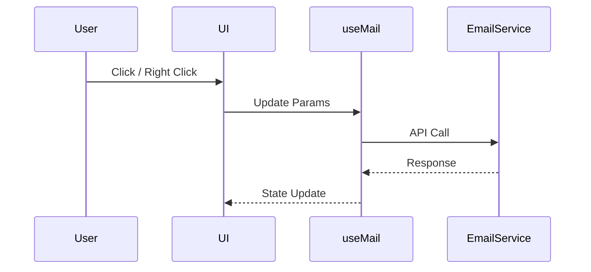
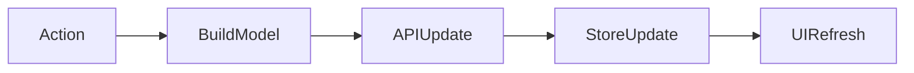
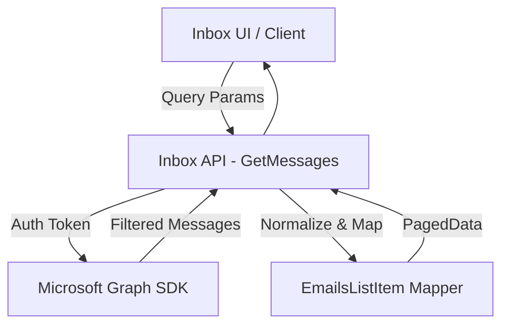
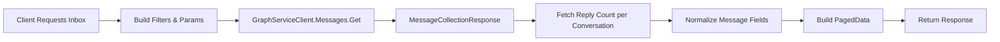
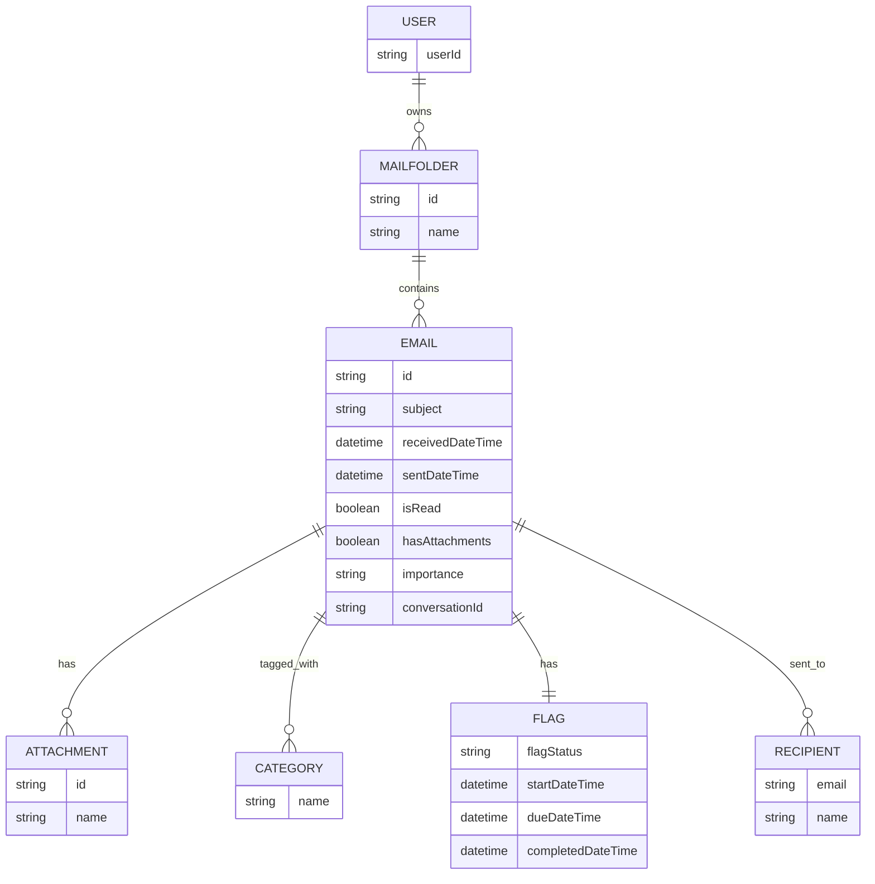

# NewInboxEmails Module – Technical Documentation

## 1. Overview

### Purpose

The **NewInboxEmails** module is a production-grade inbox listing and interaction layer for an email client application. It is responsible for rendering inbox emails, handling user interactions (read/unread, flagging, categorization, archive, delete), and synchronizing UI state with backend email services.

### Problems It Solves

* Unified inbox rendering with grouping and infinite scrolling
* Consistent state synchronization between UI and backend
* Contextual actions (right-click menu) with minimal UI latency
* Debounced searching and filtering for performance

### Key Responsibilities

* Fetch and render grouped inbox emails
* Handle email updates (read/unread, flags, categories)
* Manage folder-based filtering and search
* Coordinate UI state with backend APIs via `EmailService`

---

## 2. Unified Entry Point

### Primary Component

`NewInboxEmails` (React Functional Component)

### Why a Single Entry Point

* Centralizes inbox-related logic
* Ensures consistent state handling via `useMail` context
* Simplifies integration for parent layouts and routing

### Supported Operations

* List inbox emails (grouped & paginated)
* Search emails (debounced)
* Update email status (read/unread)
* Flag / unflag emails with due dates
* Assign or clear categories
* Archive and delete emails

---

## 3. Input Models

### Component Props

| Property      | Type                   | Purpose                                         |
| ------------- | ---------------------- | ----------------------------------------------- |
| `categories`  | `any[]`                | List of available categories for tagging emails |
| `onItemClick` | `(id: string) => void` | Triggered when an email item is selected        |
| `resize`      | `boolean`              | (Reserved) UI resize trigger                    |

---

## 4. Core Concepts / Normalization Logic

### Email Normalization

* Missing subject → `(No subject)`
* Missing snippet → `(No preview is available)`
* Sender parsing via RegEx to extract name and email

### Search Normalization

* Debounced (500ms) updates to prevent API flooding
* Folder change resets search state

### Edge Cases

* Empty inbox renders a fallback UI
* Context menu hidden during loading states

---

## 5. Base Object Construction

### EmailUpdateModel

Reusable update payload sent to backend APIs.

**Why It Exists**

* Prevents partial or conflicting updates
* Enforces update intent via `EmailUpdateType`

**Optimizations**

* Undefined fields are ignored by backend
* Minimizes payload size

---

## 6. Internal Helpers / Services

### `useMail` Context

* Centralized state for folders, emails, loading, pagination
* Prevents prop drilling

### `EmailService`

* Abstracts API communication
* Provider-agnostic (REST / Graph / Gmail / Outlook adaptable)

### Helper Functions

* `getFlagDates()` – Computes follow-up dates
* `getUniqueItemCount()` – Pagination safety

---

## 7. Execution Flow by Action Type

### Read / Unread

**Trigger:** Toggle or context menu

1. Build `EmailUpdateModel`
2. Call `EmailService.updateMessage`
3. Update local store via `updateEmails`

### Flag / Follow-up

**Trigger:** Context menu selection

1. Compute dates (preset or explicit)
2. Send flag model to backend
3. Sync selected mail if open

### Category Update

**Trigger:** Context menu

1. Update category ID
2. Optimistically update UI

### Archive / Delete

**Trigger:** Context menu

1. Call `moveFolder`
2. Remove email from inbox state

---

## 8. Attachment / Asset Handling

> **Not Applicable**

This module only manages metadata and listing. Attachments are handled in the email detail module.

---

## 9. Scheduling / Metadata Handling

### Follow-up Flags

| Field               | Description                     |
| ------------------- | ------------------------------- |
| `startDateTime`     | Follow-up start                 |
| `dueDateTime`       | Due date                        |
| `completedDateTime` | Completion timestamp            |
| `flagStatus`        | Flagged / Complete / NotFlagged |

**Validation Rules**

* Dates formatted as `DD/MM/YYYY`
* `Complete` clears due dates

---

## 10. Error Handling Strategy

### Approach

* Promise-based error capture
* Toast-based user feedback (`AOToast`)

### Why This Strategy

* Non-blocking UI
* Immediate user visibility

### Benefits

* Consistent UX
* Easy instrumentation and logging

---

## 11. Design Principles

* **Single Source of Truth** via context
* **Optimistic UI Updates**
* **Provider Agnostic Backend**
* **Debounced IO Operations**

### Scalability

* Infinite scrolling
* Group-based rendering
* Minimal re-renders

---

## 12. Mermaid Diagrams

### Overall Flowchart

### Sequence Diagram

### Update / Patch Flow

---

## 13. Final Outcome

### What This Design Achieves

* Clean separation of UI, state, and services
* High-performance inbox rendering
* Easy extensibility for new actions

### Benefits

* **UI:** Responsive and predictable
* **API:** Clean contracts
* **Scalability:** Supports large inboxes

---

## Additional Architecture Sections

## DFD (Data Flow Diagram)

## Process Flow

## ER Diagram

## Entity Definition

### Email Entity

* id
* subject
* snippet
* from
* isRead
* categories[]
* flag

## Authentication / APIs

* Assumes authenticated session
* Token-based API access via EmailService

## Testing Guide

* Unit test helper functions
* Mock `EmailService`
* UI tests for context menu actions

## References

* Fluent UI
* React Context API
* Day.js
* Lodash debounce
