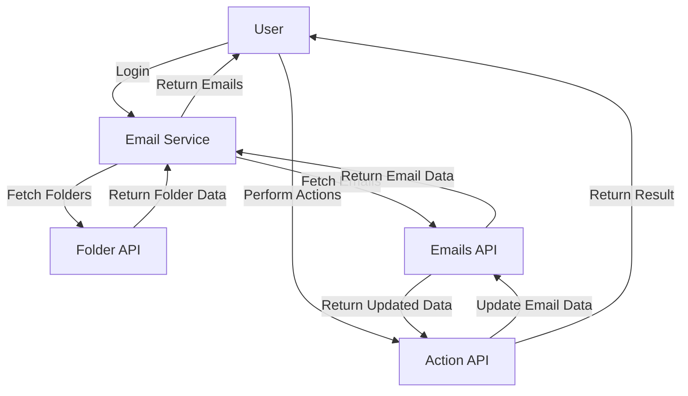
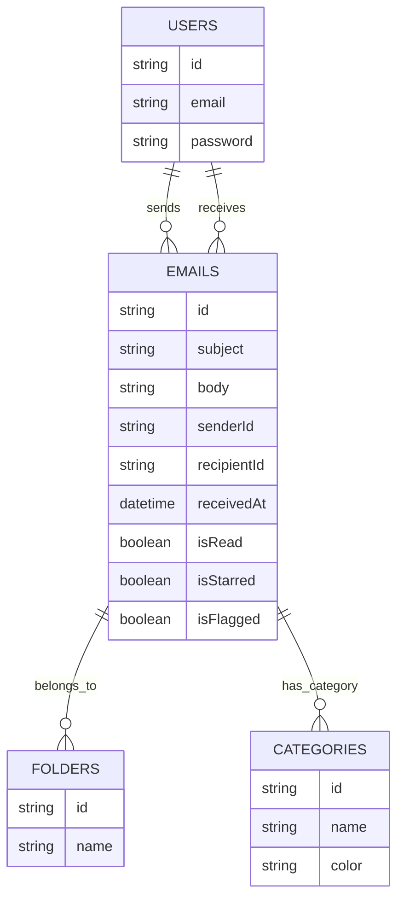

# Technical Documentation for **Mail System Module**

## 1. Overview

### High-level Purpose of the Module:
The **Mail System Module** is designed to provide an interface for managing emails, including reading, filtering, categorizing, flagging, and archiving emails within an application. It facilitates the seamless interaction between different folders (Inbox, Sent, Drafts, etc.), providing users with the ability to perform CRUD operations on emails while maintaining system performance through features like pagination, sorting, and caching.

### What Problems It Solves:
- Provides a central hub for accessing and managing multiple email accounts and folders.
- Supports filtering of emails based on criteria such as read/unread, flagged, important, or attachments.
- Efficiently handles large volumes of emails through caching, pagination, and auto-refresh features.
- Integrates with third-party services to provide features like email flagging and categorization.

### Key Responsibilities:
- **Fetching Email Data**: Retrieves emails from the mail server (e.g., Outlook) and processes them based on various filters.
- **Email Display**: Displays emails in the user interface with options to sort, filter, and search.
- **Email Actions**: Provides actions like marking as read/unread, archiving, deleting, flagging, and categorizing emails.
- **Folder Management**: Allows users to switch between different email folders (Inbox, Sent, Drafts) and apply filters based on the folder.
- **Auto-refresh**: Ensures the email data is kept up to date by periodically polling for new messages.

---

## 2. Data Flow Diagram (DFD)

### Description:
The **Data Flow Diagram (DFD)** for the Mail System Module depicts the flow of data between external and internal components, showing how email data is processed and displayed in the system.

### Key:
- **User**: The end-user interacting with the system.
- **Email Service**: The service that communicates with external email APIs.
- **Folder API**: The external system that provides folder-related data (e.g., Inbox, Sent).
- **Emails API**: The system that fetches email data from an external service like Outlook.
- **Action API**: The API that handles actions like reading, marking, or deleting emails.

---

## 3. Process Flow

### Description:
The **Process Flow** explains how the system handles the user actions from initiating an email fetch to applying actions like marking as read/unread or archiving an email.

1. **User Logs In**:
   - The user initiates a login process which authenticates them and provides necessary access tokens.

2. **Folder Fetch**:
   - The system queries the Folder API to retrieve all available folders (Inbox, Sent, Drafts, etc.).

3. **Fetch Emails**:
   - Based on the current folder, the system fetches emails using the Emails API.

4. **Display Emails**:
   - The fetched emails are displayed in the UI with options for filtering and sorting.

5. **User Action**:
   - The user performs an action (e.g., marking an email as read, flagging it).

6. **API Call**:
   - The system calls the Action API to update the status of the email.

7. **Refresh UI**:
   - The UI is refreshed to reflect the updated state of the emails.

---

## 4. Entity Relationship Diagram (ER Diagram)

### Description:
The **Entity Relationship Diagram (ERD)** for the Mail System defines the structure of the core entities involved and their relationships.

### Key Entities:
- **Users**: Users who interact with the email system.
- **Emails**: Represents an email message.
- **Folders**: Represents email folders like Inbox, Sent, Drafts.
- **Categories**: Represents email categories for filtering purposes.

---

## 5. Entity Definitions

### Users:
- **id**: Unique identifier for the user.
- **email**: The user's email address.
- **password**: User's encrypted password for authentication.

### Emails:
- **id**: Unique identifier for the email.
- **subject**: Subject of the email.
- **body**: The content of the email.
- **senderId**: Reference to the sender (user).
- **recipientId**: Reference to the recipient (user).
- **receivedAt**: Timestamp when the email was received.
- **isRead**: Boolean flag indicating whether the email has been read.
- **isStarred**: Boolean flag indicating whether the email is starred.
- **isFlagged**: Boolean flag indicating whether the email is flagged.

### Folders:
- **id**: Unique identifier for the folder.
- **name**: Name of the folder (e.g., Inbox, Sent, Drafts).

### Categories:
- **id**: Unique identifier for the category.
- **name**: Name of the category.
- **color**: Color associated with the category.

---

## 6. Authentication / APIs

### Authentication:
The module uses OAuth2 authentication to access the user's email account (e.g., Outlook, Gmail). Upon login, the user's access token is stored for subsequent API calls.

### Key APIs:
- **EmailService.getFolders()**: Fetches the list of available folders.
- **EmailService.getMessages()**: Fetches emails from a specific folder.
- **EmailService.updateMessage()**: Updates the status of an email (e.g., marking as read).
- **EmailService.moveFolder()**: Moves an email to another folder (e.g., archive, trash).
- **EmailService.getCategories()**: Fetches available categories for emails.

---

## 7. Testing Guide

### Unit Testing:
- **Test Email Service**: Mock external APIs and test that the service correctly handles fetching, updating, and sorting emails.
- **Test Folder Management**: Ensure that folders are correctly populated and accessible.
- **Test Sorting and Filtering**: Validate that the sorting and filtering logic works as expected (e.g., by date, importance).

### Integration Testing:
- **Test Email Fetching**: Verify that emails are correctly fetched and displayed in the UI.
- **Test Actions**: Test the actions like marking as read, flagging, and archiving, ensuring they update both the UI and the backend.

---

## 8. References

- **Fluent UI**: [https://developer.microsoft.com/en-us/fluentui](https://developer.microsoft.com/en-us/fluentui)
- **Hookstate**: [https://hookstate.js.org/](https://hookstate.js.org/)
- **Outlook API**: [https://learn.microsoft.com/en-us/graph/api/resources/mail-api-overview?view=graph-rest-1.0](https://learn.microsoft.com/en-us/graph/api/resources/mail-api-overview?view=graph-rest-1.0)

---

