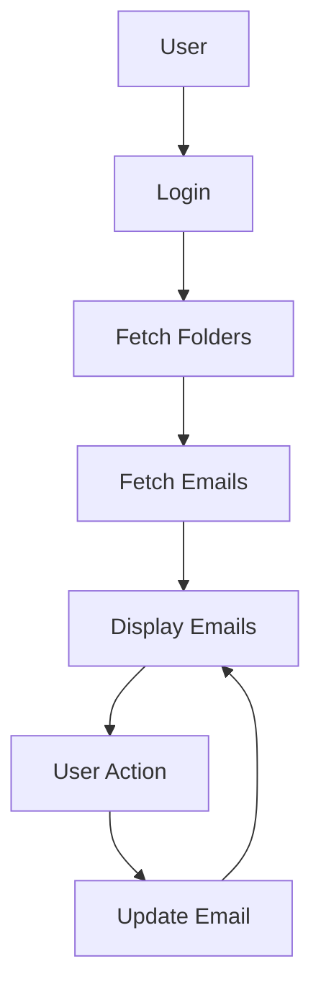
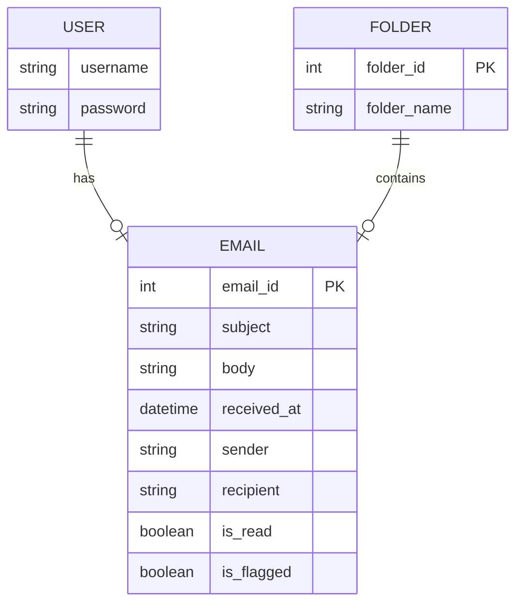

# **Mail System Module - Technical Documentation**

## 1. Overview

### High-Level Purpose of the Module:
The **Mail System Module** is designed to provide an interface for managing emails in an application. It allows users to read, filter, categorize, flag, and archive emails seamlessly across multiple folders (e.g., Inbox, Sent, Drafts). The module facilitates CRUD operations on emails while ensuring system performance through pagination, sorting, and caching.

### Problems It Solves:
- **Centralized Email Management**: Integrates multiple email accounts and folders in a unified interface.
- **Advanced Email Filtering**: Supports filtering emails based on criteria such as read/unread status, flagged, importance, and attachments.
- **Handling Large Volumes of Emails**: Optimizes the handling of large email data through caching, pagination, and auto-refresh.
- **Integration with Third-Party Services**: Enhances features like email flagging, categorization, and organizational tools.

### Key Responsibilities:
- **Email Retrieval**: Fetches emails from the mail server (e.g., Outlook) and processes them based on filters.
- **Email Display**: Provides a user interface for displaying emails, with options to sort, filter, and search.
- **Email Actions**: Supports actions such as marking emails as read/unread, archiving, deleting, flagging, and categorizing.
- **Folder Management**: Allows users to switch between email folders (Inbox, Sent, Drafts) and apply appropriate filters.
- **Auto-Refresh**: Periodically fetches new emails to keep data up to date.

---

## 2. Data Flow Diagram (DFD)

### Description:
The **Data Flow Diagram (DFD)** visually represents how email data flows between different system components, illustrating the interactions between users, APIs, and email servers.

### Key Components:
- **User**: The end-user interacting with the system.
- **Email Service**: A component that communicates with external email APIs (e.g., Outlook) to retrieve and manage emails.
- **Folder API**: Provides data related to email folders (Inbox, Sent, Drafts).
- **Emails API**: Fetches email content from external services.
- **Action API**: Handles email actions like reading, marking, or deleting messages.

---

## 3. Process Flow

### Description:
The Process Flow explains how the system handles user actions, from logging in to applying changes to emails (e.g., marking as read/unread or archiving).

1. **User Logs In**:
   - The user logs in, and the system authenticates them, obtaining necessary access tokens for interaction.

2. **Folder Fetch**:
   - The system queries the Folder API to retrieve all available folders (e.g., Inbox, Sent, Drafts).

3. **Fetch Emails**:
   - Based on the selected folder, the system calls the Emails API to fetch the list of emails.

4. **Display Emails**:
   - Fetched emails are displayed in the UI, providing sorting, filtering, and search options for the user.

5. **User Action**:
   - The user performs actions on an email (e.g., marking it as read, flagging it).

6. **API Call**:
   - The system calls the Action API to update the status of the email (e.g., marking as read) and updates the UI accordingly.

---

## 4. Entity Relationship Diagram (ERD)

### Description:
The Entity Relationship Diagram (ERD) illustrates the relationships between key entities within the Mail System Module. This diagram helps define the structure of email data, its attributes, and how entities relate to each other.

### Key Entities:
- **USER**: Represents the user in the system, storing their credentials and profile information.
- **EMAIL**: Represents individual emails, including attributes like subject, body, sender, recipient, status (read/unread), and flag status.
- **FOLDER**: Represents email folders (Inbox, Sent, etc.), containing a list of emails.

---

## 5. Entity Definitions

### USER:
- **username**: A unique identifier for the user.
- **password**: The user's password (hashed for security).

### EMAIL:
- **email_id**: A unique identifier for each email.
- **subject**: The subject of the email.
- **body**: The content of the email.
- **received_at**: The timestamp when the email was received.
- **sender**: The email address of the sender.
- **recipient**: The email address of the recipient.
- **is_read**: Boolean flag indicating if the email is read.
- **is_flagged**: Boolean flag indicating if the email is flagged.

### FOLDER:
- **folder_id**: A unique identifier for each folder.
- **folder_name**: The name of the folder (e.g., Inbox, Sent).

---

## 6. Authentication / APIs

### Authentication:
The Mail System Module supports OAuth 2.0 for user authentication, ensuring secure login and access to email services.

### APIs:
For detailed API documentation, please refer to the following link:
[API Documentation](#)

---

## 7. Testing Guide

### Unit Testing:
- **Test Email Retrieval**: Ensure that emails are fetched correctly from the external email service.
- **Test Filters**: Verify that filtering functionality (read/unread, flagged, etc.) works as expected.
- **Test Actions**: Ensure that email actions (mark as read/unread, flag, delete) are correctly applied and reflected in the UI.

### Integration Testing:
- **Email Fetching Integration**: Ensure that the system can successfully integrate with the Emails API and fetch email data.
- **Folder Management Integration**: Verify that the system correctly handles switching between folders and applies folder-specific filters.

### UI Testing:
- **Email Display**: Ensure that emails are correctly displayed in the UI with options for sorting, filtering, and searching.
- **Action Verification**: Verify that user actions (e.g., marking emails as read) are reflected in the UI.

---
