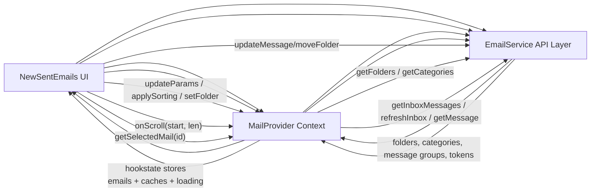
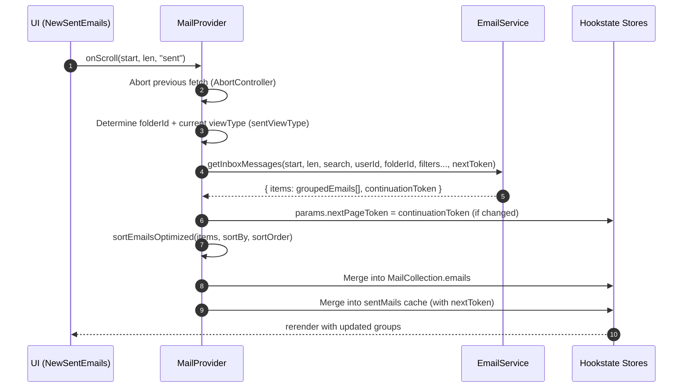
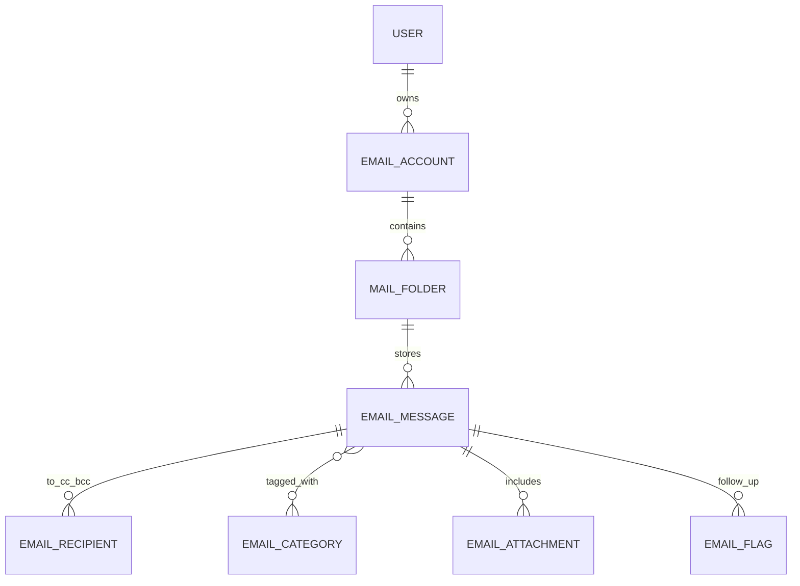

# Mail Module (MailProvider Context + Sent Items UI)

**Primary artifacts**
- `Contexts/MailContext.tsx` — client-side state management, caching, sorting, filtering, polling/refresh.
- `Components/Admin/Emails/NewSentEmails.tsx` — “Sent Items” list UI with filters, search, infinite scroll, and context menu actions.

**Audience**: Backend, Frontend, and Integration engineers  
**Scope**: End-to-end data flow from UI → context/state → EmailService APIs, plus cache/refresh strategy and mutation propagation.

---

## 1. Overview

### Purpose
This module provides the **email client state layer** and a **Sent Items list UI** that together deliver:
- Folder discovery and navigation (Inbox/Sent/Drafts/…)
- Paginated message listing with caching and infinite scroll
- Local filtering/sorting + view toggles (Unread/Read/All per folder)
- Message detail fetching
- Mutations (read/unread, flag, category, star, delete, archive) with UI-first updates
- Auto-refresh for Inbox (polling + focus/online refresh)

### Problems it solves
- **Single source of truth**: folder selection, list parameters, selection state, loading state.
- **Per-folder continuity**: remembers parameters per folder (`folderParamsRef`) and restores them when returning.
- **Performance**: folder-scoped caches (`inboxMails`, `sentMails`, `draftMails`) provide instant UI reuse and reduce “spinner fatigue”.
- **Consistency under concurrency**: `AbortController` cancels in-flight list fetches when user changes params/folder rapidly.
- **Resilience**: local, optimistic updates keep UI consistent even if server reconciliation arrives later (auto-refresh).

### Key responsibilities
**MailProvider / context**
- Initial boot: folders + categories load, default folder selection.
- List orchestration: `getItems()` fetches messages, merges groups, updates caches, manages continuation tokens.
- Parameter management: `updateParams()` and per-folder viewType selection logic.
- Mutation propagation: `updateEmails()` applies changes across combined list + relevant folder cache, then schedules refresh.
- Background refresh: Inbox polling every 30s and refresh on `online`/visibility changes.

**NewSentEmails UI**
- Renders the “Sent Items” folder list using `ControlledGroupList`.
- Supports:
  - View toggles: Unread/Read/All (sentViewType)
  - Search: debounced input + explicit onSearch
  - Infinite scroll: `onLoadMore` → context `onScroll()`
  - Context menu actions: archive/delete/read-unread/flag/category

---

## 2. DFD

### 2.1 Logical Data Flow (DFD Level 1)



### 2.2 Physical Data Flow (DFD Level 2: List Fetch)



---

## 3. Process Flow

### 3.1 App boot (initial load)
1. `MailProvider` mounts.
2. If `currentUser.emailStatus.status === 1`:
   - Sets loading `type='all'`
   - Fetches folders (`getFolders()`) and categories (`EmailService.getCategories()`) in parallel.
3. Folders:
   - Excludes “Outbox” and “SENT” (legacy/duplicate).
   - Applies Gmail-like ordering for consistent UX.
   - Sets default folder to Inbox.
   - Immediately triggers initial list fetch: `getItems(0, 100, true)`.
4. Categories:
   - Mapped into UI-ready items with color/icon styles (from `categoryColors` and server-provided colors).

### 3.2 Folder switch (`setFolder`)
When user selects another folder:
1. Clear current selection + draft-related state.
2. Save previous folder params to `folderParamsRef` keyed by folder id/name.
3. Restore params for new folder (if previously visited), else reset filters/search and default sorting.
4. Attempt **cache reuse** for Inbox/Sent/Drafts:
   - If cache exists → set `MailCollection.emails` immediately and schedule a near-term refresh (`triggerAutoRefresh`).
   - If not → clear list and fetch first page (`getItems(0, 15, true)`).

**Design intent**: make folder switching feel instantaneous while still reconciling with server soon after.

### 3.3 Search & filters
- UI search is **debounced** (500ms) and updates `params.search`.
- Filters (flag/star/important/attachments/mentioned/category) are stored in `params`.
- Changing params triggers `useEffect` with shallow param comparison:
  - Debounces 200ms
  - Calls `getItems(0, 100, true)` to reset and refetch.

**Local filtering**: `updateParams()` also calls `applyLocalFilters()` on current groups so the UI responds instantly even before the next fetch.

### 3.4 Infinite scroll
- UI calculates `start = getUniqueItemCount(sentEmails.value)` and requests `PAGE=15`.
- Provider uses folder cache token logic:
  - `getNextToken("sent")` reads from `sentMails.nextToken`
  - If scrolling and token is missing → stops (no more pages).
- Provider merges newly fetched groups into existing groups and de-dupes by message id.

### 3.5 Mutations (read, flag, category, star, delete, archive)
1. UI calls EmailService to perform mutation.
2. On success, UI calls `updateEmails(id, payload, EmailUpdateTypes.*)`.
3. Provider:
   - Applies transformation across **combined list** and the **active folder cache** (or specified folderName)
   - Re-flattens and re-groups using `sortEmailsOptimized` to keep grouping consistent
4. Schedules a refresh (`triggerAutoRefresh('mutation', 200)`) to reconcile with server.

**Why this hybrid approach?**
- Optimistic updates keep UX snappy and deterministic.
- Periodic refresh prevents long-lived divergence.

### 3.6 Inbox auto-refresh
When current folder is Inbox:
- Polls every 30s with `EmailService.refreshInbox(0, 10, folderId)`.
- Prepends new items into existing groups and increments Inbox folder count.

Also triggers refresh on:
- Browser `online` event
- Tab visibility return (`visibilitychange`)

---

## 4. ER Diagram

> This module is a **client-side** layer; entities are the client representations of server resources.



---

## 5. Entity Definition

### 5.1 `OutlookSingleMailResponse` (Message detail)
Represents a fully-fetched message for the detail view.

| Field | Type | Notes |
|---|---|---|
| id | string | Message id |
| date | string | Date-time string (parsed by `new Date()`) |
| conversationId | string | Conversation/thread id |
| lastModifiedDateTime | string | Server change time |
| changeKey | string | Server concurrency token (if used) |
| isRead | boolean | Read state |
| isStarred | boolean | Star state |
| isDraft | boolean | Draft state |
| isImportant | boolean | Important marker |
| flag | `FollowUpFlagStatus` | Follow-up state (notFlagged/flagged/complete) |
| subject | string | Subject line |
| bodyPreview | string | Preview text |
| body | string | HTML or text body |
| senderEmailAddress | string | Sender email |
| senderName | string | Sender display name |
| toRecipients / ccRecipients / bccRecipients | `IIdName[]` | Recipient lists |
| attachments | `IIdName[] \| undefined` | Attachments |
| categories | any[] | Category values/ids as returned |
| draftId | string | Draft id (if applicable) |
| importance | `Importance` | Low/Normal/High |

### 5.2 `EmailsListResponse` (Grouped list response)
This is the **grouped list** format used by the UI:

```ts
type EmailsListResponse = {
  key: string;      // group key, e.g. "Today", "Yesterday", "High importance", "Alice"
  items: EmailItem[]; // items in that group
}
```

### 5.3 `EmailItemsCacheState` (Per-folder cache pack)
```ts
type EmailItemsCacheState = {
  nextToken: string;            // continuation token for paging
  value: EmailsListResponse[];  // cached grouped list
}
```

### 5.4 `IEmailListParamsState` (List query + UI state)
Key fields (subset):
- `userId`, `search`
- Folder view types:
  - `viewType` (default)
  - `inboxViewType`, `sentViewType`, `draftViewType`
- Filters: `isFlagged`, `isStarred`, `isImportant`, `hasAttachment`, `isMentioned`, `categoryType`
- Sorting: `sortBy`, `sortOrder`
- Paging: `nextPageToken`

---

## 6. Authentication / APIs

### Authentication
This module assumes authentication is handled **outside** this context (e.g., app-level auth/session/token management). `EmailService` should attach credentials (Bearer token / cookie / etc.) to requests.

**Integration contract**
- The UI/context expects `EmailService` calls to reject with errors that can be surfaced as toasts (`AOToast.error`).
- Aborted fetches should throw `AbortError` (and are treated as non-errors).

### APIs

**API Link:** ``

#### Endpoints used by this module (logical)
- `getFolders()` → folder navigation list
- `getCategories()` → category metadata
- `getInboxMessages(...)` → list fetch for the current folder (despite name, it supports folders via `folderId`)
- `refreshInbox(...)` → small poll for newest Inbox items
- `getMessage(id)` → detail fetch
- `updateMessage(id, model)` → read/unread, flag, category, star (depending on `type`)
- `moveFolder(id, target)` → archive/delete

---

## 7. Testing Guide

### 7.1 Unit tests (recommended)
**MailProvider**
- `sortEmailsOptimized()`
  - date grouping keys (Today/Yesterday/This Week/…)
  - from/to grouping + “Unknown” handling
  - flagStatus grouping for complete/flagged/unflagged
  - stable ordering asc/desc
- `applyLocalFilters()`
  - each filter independently and in combination
- `shallowEqualParams()`
  - only material keys trigger fetch
- `getNextToken()` behavior per folder
- `updateEmails()` mutation behavior:
  - read/unread removal when viewType excludes the item
  - delete/archive removes from groups and caches
  - category adds distinct values
  - flag/star set correctly

**NewSentEmails**
- View toggle changes `sentViewType` and clears selection
- Debounced search calls `updateParams` with `search`
- Context menu actions call appropriate service + `updateEmails`

### 7.2 Integration tests (Playwright/Cypress)
- Folder switch uses cache (instant render) and then refresh reconciles.
- Infinite scroll:
  - loads next page until token is empty
  - does not duplicate items
- Mutation flows:
  - mark read/unread updates UI immediately
  - archive/delete removes the item and does not reappear after refresh
- Inbox polling:
  - while on Inbox, new mail appears and folder count increases

### 7.3 Mocking strategy
- Mock `EmailService` at module level:
  - Return grouped items + `continuationToken`
  - Simulate abort via rejecting with `{ name: 'AbortError' }`
- Use fake timers for debounce/polling:
  - 200ms param debounce
  - 500ms search debounce
  - 30s polling

---

## 8. References

- React Context + hooks (`createContext`, `useContext`, `useMemo`, `useCallback`)
- Hookstate (`@hookstate/core`) for global-ish state with fine-grained updates
- Lodash `throttle` and `debounce` to control scroll/search churn
- Fluent UI components for the UI shell and context menus
- Mermaid diagrams in Markdown:
  - GitHub supports Mermaid in Markdown code fences (` ```mermaid `)

