# Communication Email Schedule Module - Technical Documentation

## Table of Contents
1. [Overview](#1-overview)
2. [Data Flow Diagram (DFD)](#2-data-flow-diagram-dfd)
3. [Process Flow](#3-process-flow)
4. [ER Diagram](#4-er-diagram)
5. [Entity Definition](#5-entity-definition)
6. [Authentication / APIs](#6-authentication--apis)
7. [Testing Guide](#7-testing-guide)
8. [References](#8-references)

---

## 1. Overview

### 1.1 Module Introduction

The Communication Email Module is a comprehensive email management system with advanced scheduling capabilities. It is accessed through the `/admin/clients` route and is powered by the Acting Office APIs backend service. This module provides all standard email features plus the unique ability to schedule emails for future delivery with automatic retry on failures.

### 1.2 Architecture Components

#### Backend Service

| Service | Purpose | Responsibilities |
|---------|---------|------------------|
| **Acting Office APIs** | Authentication & Communication Backend | • User authentication and authorization • Email provider linking/unlinking operations • Communication (Scheduling) module backend • Token management and storage • Scheduled email delivery tracking • Retry logic for failed deliveries |

#### Frontend Module

| Module                   | Route              | Backend Service             | Features                                                                                                                                                                                                                                                                               |
| ------------------------ | ------------------ | --------------------------- | -------------------------------------------------------------------------------------------------------------------------------------------------------------------------------------------------------------------------------------------------------------------------------------- |
| **Communication Email Module** | `admin/clients`    | Acting Office APIs          | • View inbox, sent items, drafts • Send and receive emails • Organize folders/labels • Search and filter emails • **Schedule emails for future delivery** • **Track scheduled email status** • **Automatic retry on failures**                      |

### 1.3 Key Module Characteristics

**Communication Email Module:**
- Backend: Acting Office APIs Service
- Purpose: Email management with scheduling capabilities
- Provider Support: Both Outlook and Gmail
- Features: All standard email operations + scheduling, tracking, and retry logic
- Unique Capability: Schedule emails for future delivery with automatic retry on failures
- For a detailed functional and architectural overview of the Communication Email Module, refer to the documentation [here](./communication-email-section.md)

### 1.4 System Architecture Diagram

---

## 2. Data Flow Diagram (DFD)

### 2.1 Level 1 - Communication Email Module Data Flow

```mermaid
graph TD
    %% Actors
    U[User]
    FE[Frontend Communication]

    %% Core Services
    API[Acting Office APIs]
    AS[Authentication Service]

    %% Infrastructure
    DB[(Database)]
    Q[Email Queue]
    S[Scheduler]

    %% Providers
    P{Provider Check}
    O[Outlook API]
    G[Gmail API]

    %% Notification
    NS[Notification Service]

    %% User flow
    U edge1@--> FE
    FE edge2@--> API

    %% 🔐 Authentication (same pattern)
    API edge3@--> AS
    AS edge4@--> API

    %% Data access
    API edge5@--> DB
    DB edge6@--> API

    %% Queue processing
    API edge7@--> Q
    Q edge8@--> S

    %% Provider selection
    S edge9@--> P
    P edge10@-->|Outlook| O
    P edge11@-->|Gmail| G

    %% Provider responses
    O edge12@-->|Success| API
    G edge13@-->|Success| API

    O edge14@-->|Failure| NS
    G edge15@-->|Failure| NS

    %% Notification + response
    NS edge16@--> U
    API edge17@--> FE
    FE edge18@--> U

    %% Animations
    edge1@{ animate: fast }
    edge2@{ animate: fast }
    edge3@{ animate: fast }
    edge4@{ animate: fast }
    edge5@{ animate: fast }
    edge6@{ animate: fast }
    edge7@{ animate: fast }
    edge8@{ animate: fast }
    edge9@{ animate: fast }
    edge10@{ animate: fast }
    edge11@{ animate: fast }
    edge12@{ animate: fast }
    edge13@{ animate: fast }
    edge14@{ animate: fast }
    edge15@{ animate: fast }
    edge16@{ animate: fast }
    edge17@{ animate: fast }
    edge18@{ animate: fast }
```

---

## 3. Process Flow

### 3.1 Communication Email Module - Scheduled Email Workflow

**Workflow Steps:**
1. User creates an email in the **Communication Email module** and submits it from the Frontend.
2. Frontend sends the request to **Acting Office APIs** with `data.isSchedule` flag.
3. Acting Office APIs evaluate the request:

   * If `data.isSchedule = true`, the email is **added to the Email Queue** with the scheduled time.
   * If `data.isSchedule = false`, the email is **sent immediately to the Email Provider**.
4. **Scheduler continuously monitors the Email Queue** for pending scheduled emails.
5. When the scheduled time is reached, the Scheduler **picks the email from the queue** and sends it to the Email Provider.
6. On successful delivery, the Email Provider returns a success response and the email is **removed from the Email Queue**, and the user is updated accordingly.
7. On failure, the Email Provider returns an error, a **notification is sent to the user**, and the email is **re-queued for automatic retry** based on the retry policy.

### 3.2 Communication Flow States

### 3.3 Token Refresh & Error Handling

**Token Management Strategy:**
- Automatic token validation before each request
- Proactive refresh before expiration (8-minute buffer for Google)
- User notification sent when re-authorization required
- Failed operations queued for retry after re-linking

---

## 4. ER Diagram

### 4.1 Core Entity Relationships

---

## 5. Entity Definition

### 5.1 ApplicationUserAccessTokens

Stores authentication tokens and provider-specific credentials for users.

**Collection Name:** `UserAccessTokens`

| Field | Type | Description |
|-------|------|-------------|
| `Id` | string | Primary Key |
| `User` | IdNameModel | User reference (Id, Name) |
| `EmailProvider` | enum | Provider type (Outlook=1, Gmail=0) |
| `Google` | UserGoogleAccessToken | Google token object |
| `Microsoft` | UserMicrosoftAccessToken | Microsoft token object |
| `LastTokenRefresh` | DateTime | Last token refresh timestamp |
| `EmailAddress` | string | User's email address |
| `GoogleWatchUpdate` | DateTime | Google watch notification update |
| `GmailHistoryId` | ulong | Gmail history tracking ID |
| `Meta` | Dictionary | Additional metadata |
| `PracticeId` | int | Practice reference |

**Purpose:** Central storage for OAuth tokens and provider-specific authentication data.

### 5.2 UserMicrosoftAccessToken

Stores Microsoft-specific authentication and subscription data.

| Field | Type | Description |
|-------|------|-------------|
| `TenantId` | string | Azure AD tenant identifier |
| `ObjectId` | string | Unique account ID |
| `Environment` | string | Identity provider (e.g., login.microsoftonline.com) |
| `TokenCache` | string | Serialized token cache |
| `SubscriptionIdInbox` | string | Inbox notification subscription ID |
| `SubscriptionIdSent` | string | Sent items notification subscription ID |
| `SubscriptionUpdateInbox` | DateTime | Inbox subscription last update |
| `SubscriptionUpdateSent` | DateTime | Sent subscription last update |
| `Status` | UserAccessTokenStatus | Token status (Active, Deleted, NeedApproval) |
| `LastError` | string | Last error message |

**Purpose:** Manages Microsoft Graph API authentication and webhook subscriptions.

### 5.3 UserGoogleAccessToken

Stores Google-specific authentication and authorization data used for Gmail integration.

| Field              | Type                  | Description                                               |
| ------------------ | --------------------- | --------------------------------------------------------- |
| `AccessToken`      | string                | OAuth 2.0 access token issued by Google                   |
| `TokenType`        | string                | Token type (e.g., `Bearer`)                               |
| `ExpiresInSeconds` | long                  | Lifetime of the access token in seconds                   |
| `RefreshToken`     | string                | OAuth 2.0 refresh token used to obtain new access tokens  |
| `Scope`            | string                | OAuth scopes granted to the application                   |
| `IdToken`          | string                | JWT ID token issued by Google                             |
| `IssuedUtc`        | DateTime              | UTC timestamp when the token was issued                   |
| `Status`           | UserAccessTokenStatus | Current state of the token (Active, Expired, Error)       |
| `LastError`        | string                | Last error encountered during token refresh or API access |

**Purpose:**
Manages Gmail API authentication using OAuth 2.0. This entity stores all Google-specific token metadata required to securely access Gmail APIs, handle token refresh cycles, and track authentication failures in alignment with the system's email provider abstraction.

### 5.4 ApplicationPractices

Stores practice-level configuration.

**Collection Name:** `ApplicationPractices`

| Field | Type | Description |
|-------|------|-------------|
| `Id` | int | Primary Key |
| `PracticeId` | int | Practice identifier |
| `Name` | string | Practice name |
| `Email` | string | Practice email address |
| `EnableCacheFirst` | bool | Enable cache priority |
| `CacheExpirationTime` | int | Cache expiration (seconds) |

**Purpose:** Organization/tenant configuration and settings.

### 5.5 EmailQueueItem

Stores scheduled emails for the Communication Email module.

**Collection Name:** `EmailQueueItems`

| Field | Type | Description |
|-------|------|-------------|
| `Id` | string | Primary Key |
| `UserId` | string | User who scheduled email |
| `PracticeId` | int | Practice reference |
| `Provider` | ApplicationEmailServiceProviders | Email provider |
| `ScheduledTime` | DateTime | Scheduled delivery time |
| `Recipients` | List<string> | Email recipients |
| `Subject` | string | Email subject |
| `Body` | string | Email body content |
| `Status` | string | Queue status (Queued, Processing, Sent, Failed) |
| `RetryCount` | int | Number of retry attempts |
| `ErrorType` | EmailQueueItemErrorTypes | Error classification |
| `CreatedBy` | AuditInfo | Creation audit info |

**Purpose:** Queue management for scheduled email delivery in Communication Email module.

### 5.6 EmailQueueItemError

Tracks failed email delivery attempts.

**Collection Name:** `EmailQueueItemErrors`

| Field | Type | Description |
|-------|------|-------------|
| `Id` | string | Primary Key |
| `UserId` | string | User reference |
| `PracticeId` | int | Practice reference |
| `Provider` | ApplicationEmailServiceProviders | Email provider |
| `ErrorType` | EmailQueueItemErrorTypes | Error type (Reauthorize, etc.) |
| `Date` | DateTime | Error occurrence date |
| `ErrorMessage` | string | Error details |
| `CreatedBy` | AuditInfo | Creation audit info |

**Purpose:** Track failed emails for retry after account re-linking (15-day retention).

### 5.7 Enumerations

#### ApplicationEmailServiceProviders
- `Gmail = 0`
- `Outlook = 1`

#### UserAccessTokenStatus
- `Active` - Token valid and operational
- `Deleted` - Token revoked or removed
- `NeedApproval` - User action required

#### EmailQueueItemErrorTypes
- `Reauthorize` - Authentication required
- `InvalidRecipient` - Invalid email address
- `QuotaExceeded` - Provider quota limit reached
- `NetworkError` - Network connectivity issue
- `Unknown` - Unclassified error

#### ApplicationUserEmailStatus
- `NotConnected` - No provider linked
- `Connected` - Provider successfully linked
- `NeedApproval` - Re-authorization required

---

## 6. Authentication / APIs

### 6.1 API Overview

The Communication Email Module provides RESTful APIs for email management with scheduling capabilities. All endpoints are served by the Acting Office APIs Service.

**API Categories:**
- Email operations with scheduling
- Email sending and management
- Draft management
- Schedule management
- Search and filtering

### 6.2 Communication Email Module API Endpoints

**Communication Email Module (Acting Office APIs):**

| **Endpoint**            | **HTTP Method** | **Purpose**                                     |
| ----------------------- | --------------- | ----------------------------------------------- |
| [`/SendEmail`](https://apiuat.actingoffice.com/api-docs/index.html?urls.primaryName=Acting+Office+-+CRM)            | POST            | Send an email immediately                       |
| [`/CannedMessages`](https://apiuat.actingoffice.com/api-docs/index.html?urls.primaryName=Acting+Office+-+CRM)       | GET             | Retrieve predefined (canned) email messages     |
| [`/SaveDraft`](https://apiuat.actingoffice.com/api-docs/index.html?urls.primaryName=Acting+Office+-+CRM)            | POST            | Create a new email draft                        |
| [`/SaveDraft/{id}`](https://apiuat.actingoffice.com/api-docs/index.html?urls.primaryName=Acting+Office+-+CRM)       | POST            | Update an existing email draft                  |
| [`/GetDraftMails`](https://apiuat.actingoffice.com/api-docs/index.html?urls.primaryName=Acting+Office+-+CRM)        | GET             | Fetch all saved draft emails                    |
| [`/DraftFileDownload`](https://apiuat.actingoffice.com/api-docs/index.html?urls.primaryName=Acting+Office+-+CRM)    | GET             | Download attachment from a draft email          |
| [`/GetScheduleMails`](https://apiuat.actingoffice.com/api-docs/index.html?urls.primaryName=Acting+Office+-+CRM)     | GET             | Retrieve all scheduled emails                   |
| [`/SaveSchedule`](https://apiuat.actingoffice.com/api-docs/index.html?urls.primaryName=Acting+Office+-+CRM)         | POST            | Create a new email schedule                     |
| [`/SaveSchedule/{id}`](https://apiuat.actingoffice.com/api-docs/index.html?urls.primaryName=Acting+Office+-+CRM)    | POST            | Update an existing scheduled email              |
| [`/UpdateSchedule/{id}`](https://apiuat.actingoffice.com/api-docs/index.html?urls.primaryName=Acting+Office+-+CRM)  | POST            | Modify schedule details (status/content/timing) |
| [`/schedule/{id}`](https://apiuat.actingoffice.com/api-docs/index.html?urls.primaryName=Acting+Office+-+CRM)        | GET             | Fetch scheduled email details by ID             |
| [`/SendSchedule/{id}`](https://apiuat.actingoffice.com/api-docs/index.html?urls.primaryName=Acting+Office+-+CRM)    | POST            | Trigger sending of a scheduled email            |
| [`/ScheduleFileDownload`](https://apiuat.actingoffice.com/api-docs/index.html?urls.primaryName=Acting+Office+-+CRM) | GET             | Download attachment from a scheduled email      |

### 6.3 Common API Features

**Authentication:**
- JWT Bearer token authentication
- Role-based access control
- User context validation

**Filtering and Pagination:**
- Start/length pagination
- View type filters (unread, read, all)
- Importance/starred filters
- Attachment filters
- Date range filters
- Category filters
- Sort options

**Provider Routing:**
- Automatic provider detection from user tokens
- Dynamic routing to Outlook or Gmail APIs
- Unified response format regardless of provider

**Error Handling:**
- Standardized error response structure
- HTTP status codes
- Detailed error messages
- Error type classification

### 6.4 Provider Comparison

| Feature | Microsoft Outlook | Google Gmail |
|---------|------------------|--------------|
| **Provider Value** | 1 | 0 |
| **Auth Method** | Azure AD OpenID Connect | OAuth 2.0 |
| **API** | Microsoft Graph API | Gmail API |
| **Real-time Notifications** | Webhook subscriptions | Push notifications |
| **Token Expiration** | Standard OAuth | 8-minute buffer |
| **Supported Features** | All email operations + scheduling | All email operations + scheduling |

### 6.5 Response Format

All APIs return responses in a standardized format:

**Success Response:**
- `result`: Response data (type varies by endpoint)
- `isSuccess`: true
- `errors`: Empty array

**Error Response:**
- `result`: null or partial data
- `isSuccess`: false
- `errors`: Array of error objects with code and message

---

## 7. Testing Guide

### 7.1 Testing Strategy

**Test Levels:**
1. Unit Testing - Individual components and functions
2. Integration Testing - API endpoints and database operations
3. End-to-End Testing - Complete user workflows
4. Performance Testing - Load and stress testing
5. Security Testing - Authentication and authorization

### 7.2 Key Test Scenarios

#### Communication Email Module Testing

**Scenario 1: Schedule Email**
- Objective: Verify email scheduling functionality
- Steps: Navigate to communication → Schedule email → Set future time
- Expected: Email queued, appears in scheduled list

**Scenario 2: Scheduled Email Delivery**
- Objective: Verify scheduled email sent at correct time
- Steps: Wait for scheduled time → Verify delivery
- Expected: Email sent at scheduled time, removed from queue

**Scenario 3: Failed Email Retry**
- Objective: Verify automatic retry logic
- Steps: Unlink account → Schedule email → Re-link → Verify retry
- Expected: Failed email re-queued and sent after re-link

**Scenario 4: Send Immediate Email**
- Objective: Verify immediate email sending from Communication module
- Steps: Compose email → Add recipients → Send without scheduling
- Expected: Email sent successfully, appears in sent folder

**Scenario 5: Draft Management**
- Objective: Verify draft save and update functionality
- Steps: Create draft → Save → Edit → Update → Verify changes
- Expected: Draft saved correctly, updates persisted

**Scenario 6: Schedule Management**
- Objective: Verify scheduled email update and cancellation
- Steps: Schedule email → Update schedule → Cancel schedule
- Expected: Schedule updated correctly, cancellation successful

#### Token Management Testing

**Scenario 7: Token Refresh**
- Objective: Verify automatic token refresh
- Steps: Use expired/near-expired token → Make API request
- Expected: Token automatically refreshed, request succeeds

**Scenario 8: Token Expiration Handling**
- Objective: Verify handling of expired tokens
- Steps: Use expired token → Verify notification sent
- Expected: User notified to re-link account

### 7.3 Performance Testing

**Load Test Scenarios:**

1. **Concurrent Schedule Requests**
   - 100 concurrent users scheduling emails
   - Target response time: < 2 seconds
   - Success rate: > 99%

2. **Bulk Email Scheduling**
   - Schedule 1000 emails across multiple users
   - Verify queue processing efficiency
   - Monitor system resource usage

3. **Token Refresh Under Load**
   - Multiple users with near-expired tokens
   - Simultaneous requests triggering refresh
   - Verify all refreshes succeed

### 7.4 Security Testing

**Test Cases:**

1. **Unauthorized Access Prevention**
   - Attempt access without authentication
   - Expected: 401 Unauthorized

2. **Cross-User Access Prevention**
   - User A tries to access User B's scheduled emails
   - Expected: 403 Forbidden

3. **Token Validation**
   - Use invalid or expired tokens
   - Expected: Proper error handling

4. **Input Validation**
   - Test with malicious inputs
   - Expected: Input sanitized, no vulnerabilities

### 7.5 Testing Tools

**Recommended Tools:**
- Postman/Insomnia - API testing
- JMeter/k6 - Load testing
- Selenium - End-to-end testing
- xUnit/NUnit - Unit testing (.NET)
- MongoDB Compass - Database verification

### 7.6 Test Data Management

**Test Accounts:**
- Create dedicated test accounts for Outlook and Gmail
- Use sandbox/test environments when available
- Maintain separate test practice IDs
- Clean up test data after testing

**Database Verification:**
- Monitor token storage and updates
- Verify queue item creation and deletion
- Check subscription/watch status
- Validate audit trails

---

## 8. References

### 8.1 External Documentation

**Microsoft Resources:**
- Microsoft Graph API Documentation
- Azure AD Authentication Documentation
- Outlook Mail API Reference
- Microsoft Identity Platform

**Google Resources:**
- Gmail API Documentation
- Google OAuth 2.0 Documentation
- Gmail Push Notifications Guide
- Google Cloud Platform Console

### 8.2 Technology Stack

| Technology | Purpose |
|------------|---------|
| .NET 8.0 | Backend framework |
| MongoDB | Database storage |
| Redis | Distributed caching |
| Microsoft.Identity.Web | Azure AD authentication |
| Google.Apis.Gmail.v1 | Gmail API client |
| Microsoft.Graph | Graph API client |

### 8.3 Database Collections

| Collection | Purpose |
|------------|---------|
| `ApplicationPractices` | Practice/tenant configuration |
| `UserAccessTokens` | Authentication tokens |
| `ApplicationUserOutlookSubscription` | Outlook webhook subscriptions |
| `EmailQueueItems` | Scheduled emails queue |
| `EmailQueueItemErrors` | Failed email tracking |

### 8.4 Common Workflows Summary

| Workflow | Services Involved | User Impact |
|----------|------------------|-------------|
| User Login & Routing | Acting Office APIs | Automatic redirect based on provider |
| Link Email Account | Acting Office APIs → Provider OAuth | Enable email features |
| Unlink Email Account | Acting Office APIs → Provider API | Disable email features |
| View Inbox (Communication Email Module) | Acting Office APIs → Provider API | Email access with scheduling |
| Send Email Immediately | Acting Office APIs → Provider API | Instant delivery |
| Schedule Email | Acting Office APIs → Queue → Provider API | Future delivery with retry |
| Token Refresh | Automatic (Background Service) | Seamless operation |
| Failed Email Recovery | Acting Office APIs (on re-link) | Automatic retry |

### 8.5 System Characteristics

**Scalability:**
- Practice-level data isolation
- Distributed caching for performance
- Queue-based scheduling architecture
- Horizontal scaling capability

**Reliability:**
- Automatic token refresh
- Failed email retry mechanism
- 15-day error retention
- Comprehensive error handling

**Security:**
- OAuth 2.0 / OpenID Connect
- Encrypted token storage
- Role-based access control
- Audit trail for operations

**Maintainability:**
- Modular architecture
- Clear separation of concerns
- Standardized API responses
- Comprehensive logging

---

*Document Version: 1.0*  
*Last Updated: December 2025*  
*Communication Email Schedule Module - Technical Documentation*