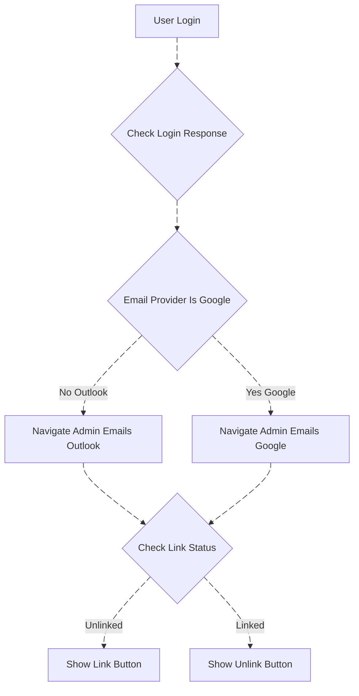

# Emails Module Documentation

## 1. Overview

### 1.1 Module Introduction

This **Email Module** integrates with two major email service providers—**Outlook** and **Gmail**—and provides a comprehensive solution for managing emails, drafts, and attachments within your system. The integration is designed to dynamically select the email service provider based on the practice ID, allowing seamless and personalized email management for users. Whether you're using Outlook or Gmail, the system ensures smooth interaction with both providers while leveraging advanced features to enhance communication.

The core functionality of this module spans essential email management tasks, from composing and sending emails to organizing messages into folders. Users can manage their inbox, sent items, drafts, and other custom folders, offering full flexibility in how emails are organized. Additionally, the module supports managing email attachments, including uploading and downloading files, ensuring that users can easily exchange documents and multimedia.

One of the standout features of this email module is its **AI-driven capabilities**. These intelligent features, including automatic response generation, email summarization, and translation, enhance user productivity and streamline email communication. The AI features make it easier for users to handle routine email responses, summarize long emails for quicker reading, and even translate emails into their preferred language.

### 1.2 Key Characteristics

**Emails Module:**
- **Backend**: Acting Office Email Service
- **Route**: `/admin/emails`
- **Purpose**: Real-time email management
- **Provider Support**: Both Outlook and Gmail
- **Features**: Standard email operations (view, send, organize, search)

### 1.3 Key Features

The module provides several key features, such as:

- **Compose Email** with options to set email importance (Low, Normal, High).
- **Manage Folders**: Inbox, Sent, Drafts, Archive, etc.
- **AI Features**: Translate, Summarize, Short Replies.
- **Attachment Handling**: Upload, Download, and Delete Attachments.
- **Search and Filters**: Apply filters for read/unread emails, importance, and more.
- **Conversation History**: Maintain email threads for ongoing conversations.

### 1.4 Architecture Components

#### Backend Services

| Service | Purpose | Responsibilities |
|---------|---------|------------------|
| **Acting Office Email Service** | Real-time Email Operations Backend | • Real-time email operations (inbox, sent, drafts) • Email retrieval and display • Email sending and management • Provider-specific API routing (Outlook/Gmail) • Email filtering and categorization |
| **Acting Office AI Service** | AI Email Processing | • Translate emails (any language → English) • Summarize email content • Tone analysis (professional, neutral, urgent, etc.) • Generate auto-complete suggestions while composing • Generate contextual replies • Generate automatic responses based on email intent |
| **Authentication Service** | User Authentication | • User authentication and authorization • Token validation • Session management |

---

## 2. Data Flow Diagram (DFD)

### Email Module Data Flow

---

## 3. Process Flow

### 3.1 Process Flow Description

The process flow outlines the step-by-step operations within the Email Module. It provides a seamless user experience, from selecting an email provider to composing and sending emails, managing drafts, and leveraging AI features to enhance communication.

1. **Email Provider Selection**:
   - The system automatically determines the email service provider (either **Outlook** or **Gmail**) based on the **practice ID**. The selected email provider enables users to access their respective email services, manage emails, and interact with system features such as sending and receiving emails.

2. **Compose Email**:
   - The user navigates to the email composition screen where they can:
     - Set the **email importance** to **Low**, **Normal**, or **High**, ensuring that recipients understand the priority of the email.
     - Write the body content of the email, including formatting options (e.g., bold, italics, bullet points, etc.).
     - **Attach files** by selecting them from the local file system or by using a drag-and-drop interface.
     - Select recipients, including **To**, **CC**, and **BCC**.

3. **Email Sending**:
   - Once the email is composed, the system sends it to the selected email provider's API (either **Outlook** or **Gmail**), where it is processed and delivered to the recipients. The email is sent with all the composed content, attachments, and any additional metadata such as **importance** and **attachments**.

4. **Drafts & Sent Items**:
   - Emails that are not sent immediately are stored as **Drafts** within the **Drafts folder**. The user can access and edit the draft later before sending it. Once an email is successfully sent, it is moved to the **Sent Items** folder, allowing the user to track emails that have been sent.

5. **AI Features**:
   - When viewing an email, the user can take advantage of AI-based features that assist in understanding and responding to the message:
     - **Auto Response**: AI suggests a suitable reply based on the content of the received email, saving time for routine responses.
     - **Translation**: If the email is written in a foreign language, the system can translate the email body into English (or another language) to facilitate comprehension.
     - **Email Summary**: AI provides a brief summary of the email's content, enabling users to understand the main points without reading the entire body.
     - **Short Replies**: Based on the context of the email, AI suggests short, contextual replies to help users respond quickly.

### 3.2 User Login and Routing

**Login Routing Logic:**
- If provider is Google (0): Navigate to `/admin/emails/google`
- If provider is Outlook: Navigate to `/admin/emails`
- Display Link button if account is unlinked
- Display Unlink button if account is linked

### 3.3 Comprehensive Process Flow Diagram

### 3.4 Inbox Retrieval Process Flow

**Note:** Email Module routes through Acting Office Email Service for real-time operations.

### 3.5 Token Refresh & Error Handling

**Token Management Strategy:**
- Automatic token validation before each request
- Proactive refresh before expiration (8-minute buffer for Google)
- User notification sent when re-authorization required
- Failed operations queued for retry after re-linking

---

## 4. ER Diagram

### 4.1 Core Entity Relationships

### 4.2 Extended Entity Relationships with Provider Tokens

---

## 5. Entity Definition

### 5.1 User

Represents the system user interacting with emails.

| Field | Type | Description |
|-------|------|-------------|
| `user_id` | string | Unique identifier for the user |
| `email_address` | string | User's email address |
| `name` | string | User's full name |
| `role` | string | User's role (ADMIN, MANAGER, STAFF) |

**Purpose:** Stores user information for authentication and email management.

### 5.2 Email

Represents the email message.

| Field | Type | Description |
|-------|------|-------------|
| `email_id` | string | Unique identifier for the email |
| `subject` | string | Email subject line |
| `body` | text | Email body content |
| `date` | datetime | Date and time the email was sent/received |
| `importance` | string | Priority level (Low, Normal, High) |
| `is_read` | boolean | Whether the email has been read |
| `folder_id` | string | Foreign key to the folder |
| `user_id` | string | Foreign key to the user |

**Purpose:** Stores email message data and metadata.

### 5.3 Attachment

Represents an attachment in an email.

| Field | Type | Description |
|-------|------|-------------|
| `attachment_id` | string | Unique identifier for the attachment |
| `email_id` | string | Foreign key to the email |
| `file_name` | string | Name of the attached file |
| `content_type` | string | MIME type of the file |
| `size` | int | File size in bytes |

**Purpose:** Stores email attachment information and metadata.

### 5.4 Folder

Represents email folders.

| Field | Type | Description |
|-------|------|-------------|
| `folder_id` | string | Unique identifier for the folder |
| `display_name` | string | Name of the folder (Inbox, Sent, Drafts, etc.) |
| `message_count` | int | Number of messages in the folder |
| `user_id` | string | Foreign key to the user |

**Purpose:** Organizes emails into different categories and folders.

### 5.5 ApplicationUserAccessTokens

Stores authentication tokens and provider-specific credentials for users.

**Collection Name:** `UserAccessTokens`

| Field | Type | Description |
|-------|------|-------------|
| `Id` | string | Primary Key |
| `User` | IdNameModel | User reference (Id, Name) |
| `EmailProvider` | enum | Provider type (Outlook=1, Gmail=0) |
| `Google` | UserGoogleAccessToken | Google token object |
| `Microsoft` | UserMicrosoftAccessToken | Microsoft token object |
| `LastTokenRefresh` | DateTime | Last token refresh timestamp |
| `EmailAddress` | string | User's email address |
| `GoogleWatchUpdate` | DateTime | Google watch notification update |
| `GmailHistoryId` | ulong | Gmail history tracking ID |
| `Meta` | Dictionary | Additional metadata |
| `PracticeId` | int | Practice reference |

**Purpose:** Central storage for OAuth tokens and provider-specific authentication data.

### 5.6 UserMicrosoftAccessToken

Stores Microsoft-specific authentication and subscription data.

| Field | Type | Description |
|-------|------|-------------|
| `TenantId` | string | Azure AD tenant identifier |
| `ObjectId` | string | Unique account ID |
| `Environment` | string | Identity provider (e.g., login.microsoftonline.com) |
| `TokenCache` | string | Serialized token cache |
| `SubscriptionIdInbox` | string | Inbox notification subscription ID |
| `SubscriptionIdSent` | string | Sent items notification subscription ID |
| `SubscriptionUpdateInbox` | DateTime | Inbox subscription last update |
| `SubscriptionUpdateSent` | DateTime | Sent subscription last update |
| `Status` | UserAccessTokenStatus | Token status (Active, Deleted, NeedApproval) |
| `LastError` | string | Last error message |

**Purpose:** Manages Microsoft Graph API authentication and webhook subscriptions.

### 5.7 UserGoogleAccessToken

Stores Google-specific authentication and authorization data used for Gmail integration.

| Field | Type | Description |
|-------|------|-------------|
| `AccessToken` | string | OAuth 2.0 access token issued by Google |
| `TokenType` | string | Token type (e.g., `Bearer`) |
| `ExpiresInSeconds` | long | Lifetime of the access token in seconds |
| `RefreshToken` | string | OAuth 2.0 refresh token used to obtain new access tokens |
| `Scope` | string | OAuth scopes granted to the application |
| `IdToken` | string | JWT ID token issued by Google |
| `IssuedUtc` | DateTime | UTC timestamp when the token was issued |
| `Status` | UserAccessTokenStatus | Current state of the token (Active, Expired, Error) |
| `LastError` | string | Last error encountered during token refresh or API access |

**Purpose:** Manages Gmail API authentication using OAuth 2.0. This entity stores all Google-specific token metadata required to securely access Gmail APIs, handle token refresh cycles, and track authentication failures in alignment with the system's email provider abstraction.

### 5.8 ApplicationPractices

Stores practice-level configuration.

**Collection Name:** `ApplicationPractices`

| Field | Type | Description |
|-------|------|-------------|
| `Id` | int | Primary Key |
| `PracticeId` | int | Practice identifier |
| `Name` | string | Practice name |
| `Email` | string | Practice email address |
| `EnableCacheFirst` | bool | Enable cache priority |
| `CacheExpirationTime` | int | Cache expiration (seconds) |

**Purpose:** Organization/tenant configuration and settings.

### 5.9 Enumerations

#### ApplicationEmailServiceProviders
- `Gmail = 0`
- `Outlook = 1`

#### UserAccessTokenStatus
- `Active` - Token valid and operational
- `Deleted` - Token revoked or removed
- `NeedApproval` - User action required

#### ApplicationUserEmailStatus
- `NotConnected` - No provider linked
- `Connected` - Provider successfully linked
- `NeedApproval` - Re-authorization required

---

## 6. Authentication / APIs

### 6.1 API Overview

The Email Module provides RESTful APIs for real-time email operations through the Acting Office Email Service. All endpoints require JWT Bearer token authentication with role-based access control.

### 6.2 Microsoft Outlook API Endpoints

**Authentication Endpoints:**

| Endpoint | Method | Purpose |
|----------|--------|---------|
| [`/Addons/Microsoft/Link`](https://apiuat.actingoffice.com/api-docs/index.html?urls.primaryName=Acting+Office+-+Addons) | GET | Initiates OAuth flow to link Outlook account |
| [`/Addons/Microsoft/Unlink`](https://apiuat.actingoffice.com/api-docs/index.html?urls.primaryName=Acting+Office+-+Addons) | POST | Unlinks Outlook account and removes subscriptions |

**Key Features:**
- Anonymous access for Link and Callback (OAuth flow)
- Role-based authorization for Unlink (ADMIN, MANAGER, STAFF)
- Automatic subscription management
- Failed email re-queuing on successful link

### 6.3 Google Gmail API Endpoints

**Authentication Endpoints:**

| Endpoint | Method | Purpose |
|----------|--------|---------|
| [`/Addons/Google/Link`](https://apiuat.actingoffice.com/api-docs/index.html?urls.primaryName=Acting+Office+-+Addons) | GET | Initiates OAuth 2.0 flow to link Gmail account |
| [`/Addons/Google/Unlink`](https://apiuat.actingoffice.com/api-docs/index.html?urls.primaryName=Acting+Office+-+Addons) | POST | Unlinks Gmail account and stops watch |

**Key Features:**
- OAuth 2.0 authorization flow
- Push notification watch management
- Token refresh handling
- Account status synchronization

### 6.4 Email Service API Endpoints

**Email Operations (Acting Office Email Service):**

| Description | HTTP Method | Endpoint |
|-------------|-------------|----------|
| **Update Email Preferences** | POST | [`/admin/emails/preferences`](https://emails.servicesuat.actingoffice.com/swagger/index.html) |
| **Get Inbox Emails** | GET | [`/Emails/Inbox`](https://emails.servicesuat.actingoffice.com/swagger/index.html) |
| **Send Email** | POST | [`/Emails/Message/{id}/send`](https://emails.servicesuat.actingoffice.com/swagger/index.html) |
| **Send Email** | POST | [`/Emails/Message/send`](https://emails.servicesuat.actingoffice.com/swagger/index.html) |
| **Get Email Details** | GET | [`/Emails/Message/{id}`](https://emails.servicesuat.actingoffice.com/swagger/index.html) |
| **Upload Attachment** | POST | [`/Emails/Message/{messageId}/Attachments`](https://emails.servicesuat.actingoffice.com/swagger/index.html) |
| **Upload Attachment In Chunks** | POST | [`/Message/{messageId}/Attachments/UploadSession`](https://emails.servicesuat.actingoffice.com/swagger/index.html) |
| **Upload Attachment In Chunks** | PUT | [`/Attachments/UploadSession/{sessionId}/Chunk`](https://emails.servicesuat.actingoffice.com/swagger/index.html) |
| **Upload Attachment In Chunks** | GET | [`/Attachments/UploadSession/{sessionId}/Status`](https://emails.servicesuat.actingoffice.com/swagger/index.html) |
| **Download Attachment** | GET | [`/Message/{messageId}/Attachment/{attachmentId}/Download`](https://emails.servicesuat.actingoffice.com/swagger/index.html) |
| **Download All Attachments** | GET | [`/Message/{messageId}/Attachment/DownloadAll`](https://emails.servicesuat.actingoffice.com/swagger/index.html) |
| **Delete Attachment** | DELETE | [`/Message/{messageId}/Attachment/{attachmentId}/Delete`](https://emails.servicesuat.actingoffice.com/swagger/index.html) |
| **Parse MIME Message** | POST | [`/ParseMIME`](https://emails.servicesuat.actingoffice.com/swagger/index.html) |
| **Create Attachment Upload Session** | POST | [`/Message/{messageId}/Attachments/UploadSession`](https://emails.servicesuat.actingoffice.com/swagger/index.html) |
| **Upload Attachment Chunk** | PUT | [`/Attachments/UploadSession/{sessionId}/Chunk`](https://emails.servicesuat.actingoffice.com/swagger/index.html) |
| **Get Attachment Upload Status** | GET | [`/Attachments/UploadSession/{sessionId}/Status`](https://emails.servicesuat.actingoffice.com/swagger/index.html) |
| **Move Message** | GET | [`/Move`](https://emails.servicesuat.actingoffice.com/swagger/index.html) |
| **Delete Message** | GET | [`/Message/{id}/Delete`](https://emails.servicesuat.actingoffice.com/swagger/index.html) |
| **Get Categories** | GET | [`/Categories`](https://emails.servicesuat.actingoffice.com/swagger/index.html) |
| **Schedule Email** | POST | [`/ScheduleEmails`](https://emails.servicesuat.actingoffice.com/swagger/index.html) |
| **Get Scheduled Emails** | GET | [`/ScheduleEmails`](https://emails.servicesuat.actingoffice.com/swagger/index.html) |
| **Get Email Folders** | GET | [`/Folders`](https://emails.servicesuat.actingoffice.com/swagger/index.html) |
| **Create Folder** | POST | [`/Folders`](https://emails.servicesuat.actingoffice.com/swagger/index.html) |
| **Get Users** | GET | [`/Users`](https://emails.servicesuat.actingoffice.com/swagger/index.html) |

### 6.5 AI Features (Acting Office AI Services – ConvoMail)

| Endpoint | HTTP Method | Purpose |
|----------|-------------|---------|
| [`/translate`](https://ai.servicesuat.actingoffice.com/swagger/?urls.primaryName=Acting+Office+-+Convomail#/default/suggest_suggest_post) | POST | Translate email content from any language to the target language (default Hindi) |
| [`/summarize`](https://ai.servicesuat.actingoffice.com/swagger/?urls.primaryName=Acting+Office+-+Convomail#/default/suggest_suggest_post) | POST | Generate a concise or detailed summary of email content |
| [`/tone`](https://ai.servicesuat.actingoffice.com/swagger/?urls.primaryName=Acting+Office+-+Convomail#/default/suggest_suggest_post) | POST | Analyze the tone of an email (professional, neutral, urgent, etc.) |
| [`/draftMail`](https://ai.servicesuat.actingoffice.com/swagger/?urls.primaryName=Acting+Office+-+Convomail#/default/suggest_suggest_post) | POST | Generate an automatic email response based on the provided content |
| [`/replies`](https://ai.servicesuat.actingoffice.com/swagger/?urls.primaryName=Acting+Office+-+Convomail#/default/suggest_suggest_post) | POST | Generate contextual reply suggestions for an email |
| [`/completion`](https://ai.servicesuat.actingoffice.com/swagger/?urls.primaryName=Acting+Office+-+Convomail#/default/suggest_suggest_post) | POST | Provide auto-complete suggestions while composing an email |

### 6.6 Common API Features

**Authentication:**
- JWT Bearer token authentication
- Role-based access control
- User context validation

**Filtering and Pagination:**
- Start/length pagination
- View type filters (unread, read, all)
- Importance/starred filters
- Attachment filters
- Date range filters
- Category filters
- Sort options

**Provider Routing:**
- Automatic provider detection from user tokens
- Dynamic routing to Outlook or Gmail APIs
- Unified response format regardless of provider

**Error Handling:**
- Standardized error response structure
- HTTP status codes
- Detailed error messages
- Error type classification

### 6.7 Provider Comparison

| Feature | Microsoft Outlook | Google Gmail |
|---------|------------------|--------------|
| **Provider Value** | 1 | 0 |
| **Auth Method** | Azure AD OpenID Connect | OAuth 2.0 |
| **API** | Microsoft Graph API | Gmail API |
| **Real-time Notifications** | Webhook subscriptions | Push notifications |
| **Token Expiration** | Standard OAuth | 8-minute buffer |
| **Supported Features** | All email operations | All email operations |

### 6.8 Response Format

All APIs return responses in a standardized format:

**Success Response:**
- `result`: Response data (type varies by endpoint)
- `isSuccess`: true
- `errors`: Empty array

**Error Response:**
- `result`: null or partial data
- `isSuccess`: false
- `errors`: Array of error objects with code and message

---

## 7. Testing Guide

### 7.1 Testing Strategy

**Test Levels:**
1. Unit Testing - Individual components and functions
2. Integration Testing - API endpoints and database operations
3. End-to-End Testing - Complete user workflows
4. Performance Testing - Load and stress testing
5. Security Testing - Authentication and authorization

### 7.2 Unit Testing

- **Test Email Composition**: Validate the ability to create, send, and store email drafts
- **Test AI Features**: Ensure AI features like translation and summarization work as expected
- **Test Attachment Upload**: Verify that attachments can be successfully uploaded and downloaded
- **Test Folder Management**: Validate folder creation, deletion, and email organization

### 7.3 Integration Testing

- **Email Provider API Integration**: Test communication with the Outlook and Gmail APIs
- **Ensure emails are sent and fetched correctly**: Validate email delivery and retrieval
- **Test attachments handling**: Verify attachment upload, download, and deletion across providers
- **Test authentication flows**: Ensure OAuth 2.0 integration works for both providers

### 7.4 End-to-End Testing

- **Full Email Flow**: Test the entire process from composing an email to sending it
- **Include attachment upload**: Verify files are properly attached and sent
- **Test folder management**: Ensure emails are properly organized in folders
- **Test email filters**: Validate filtering by read/unread, importance, attachments
- **Test AI features integration**: Verify translation, summarization, and short replies work end-to-end
- **Test conversation threading**: Ensure email threads are maintained properly

### 7.5 Key Test Scenarios

#### Authentication Testing

**Scenario 1: Link Microsoft Outlook Account**
- Objective: Verify successful account linking
- Steps: Login → Navigate to profile → Click Link button → Authorize → Verify success
- Expected: Token stored, status "Connected", subscriptions created

**Scenario 2: Unlink Microsoft Outlook Account**
- Objective: Verify successful account unlinking
- Steps: Click Unlink → Confirm → Verify status update
- Expected: Subscriptions deleted, tokens removed, notification sent

**Scenario 3: Link Google Gmail Account**
- Objective: Verify Gmail account linking
- Steps: Similar to Outlook with Google OAuth flow
- Expected: Token stored, watch created, status updated

#### Email Module Testing

**Scenario 4: View Inbox**
- Objective: Verify inbox retrieval for both providers
- Steps: Navigate to emails → View inbox → Apply filters
- Expected: Emails displayed, filters work, pagination functional

**Scenario 5: Send Email**
- Objective: Verify immediate email sending
- Steps: Compose email → Add recipients → Send
- Expected: Email sent successfully, appears in sent folder

**Scenario 6: Search and Filter**
- Objective: Verify search and filter functionality
- Steps: Apply various filters and search terms
- Expected: Relevant results returned, filters applied correctly

#### Token Management Testing

**Scenario 7: Token Refresh**
- Objective: Verify automatic token refresh
- Steps: Use expired/near-expired token → Make API request
- Expected: Token automatically refreshed, request succeeds

**Scenario 8: Token Expiration Handling**
- Objective: Verify handling of expired tokens
- Steps: Use expired token → Verify notification sent
- Expected: User notified to re-link account

### 7.6 Performance Testing

**Load Test Scenarios:**

1. **Concurrent Inbox Requests**
   - 100 concurrent users requesting inbox
   - Target response time: < 2 seconds
   - Success rate: > 99%

2. **Token Refresh Under Load**
   - Multiple users with near-expired tokens
   - Simultaneous requests triggering refresh
   - Verify all refreshes succeed

### 7.7 Security Testing

**Test Cases:**

1. **Unauthorized Access Prevention**
   - Attempt access without authentication
   - Expected: 401 Unauthorized

2. **Cross-User Access Prevention**
   - User A tries to access User B's emails
   - Expected: 403 Forbidden

3. **Token Validation**
   - Use invalid or expired tokens
   - Expected: Proper error handling

4. **Input Validation**
   - Test with malicious inputs
   - Expected: Input sanitized, no vulnerabilities

### 7.8 Testing Tools

**Recommended Tools:**
- Postman/Insomnia - API testing
- JMeter/k6 - Load testing
- Selenium - End-to-end testing
- xUnit/NUnit - Unit testing (.NET)
- MongoDB Compass - Database verification

### 7.9 Test Data Management

**Test Accounts:**
- Create dedicated test accounts for Outlook and Gmail
- Use sandbox/test environments when available
- Maintain separate test practice IDs
- Clean up test data after testing

**Database Verification:**
- Monitor token storage and updates
- Verify subscription/watch status
- Validate audit trails

---

## 8. References

### 8.1 External Documentation

**Microsoft Resources:**
- [Microsoft Graph API Documentation](https://docs.microsoft.com/en-us/graph/api/resources/mail-api-overview)
- [Azure AD Authentication Documentation](https://docs.microsoft.com/azure/active-directory)
- [Outlook Mail API Reference](https://docs.microsoft.com/graph/api/resources/mail-api-overview)
- [Microsoft Identity Platform](https://docs.microsoft.com/azure/active-directory/develop/)

**Google Resources:**
- [Gmail API Documentation](https://developers.google.com/gmail/api)
- [Google OAuth 2.0 Documentation](https://developers.google.com/identity/protocols/oauth2)
- [Gmail Push Notifications Guide](https://developers.google.com/gmail/api/guides/push)
- [Google Cloud Platform Console](https://console.cloud.google.com)

**Authentication:**
- [OAuth 2.0 Specification](https://oauth.net/2/)

**Content:**
- [MIME Types Reference](https://developer.mozilla.org/en-US/docs/Web/HTTP/Basics_of_HTTP/MIME_types)

### 8.2 Technology Stack

| Technology | Purpose |
|------------|---------|
| .NET 8.0 | Backend framework |
| MongoDB | Database storage |
| Redis | Distributed caching |
| Microsoft.Identity.Web | Azure AD authentication |
| Google.Apis.Gmail.v1 | Gmail API client |
| Microsoft.Graph | Graph API client |

### 8.3 Database Collections

| Collection | Purpose |
|------------|---------|
| `ApplicationPractices` | Practice/tenant configuration |
| `UserAccessTokens` | Authentication tokens |
| `ApplicationUserOutlookSubscription` | Outlook webhook subscriptions |

### 8.4 System Characteristics

**Scalability:**
- Practice-level data isolation
- Distributed caching for performance
- Horizontal scaling capability

**Reliability:**
- Automatic token refresh
- Comprehensive error handling

**Security:**
- OAuth 2.0 / OpenID Connect
- Encrypted token storage
- Role-based access control
- Audit trail for operations

**Maintainability:**
- Modular architecture
- Clear separation of concerns
- Standardized API responses
- Comprehensive logging

---

*Document Version: 1.0*  
*Last Updated: December 2025*  
*Acting Office Email System - Emails Module Documentation*