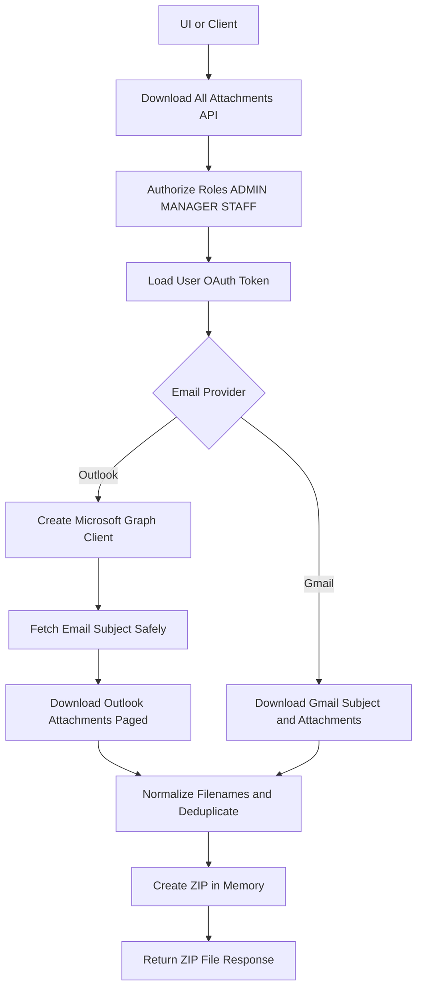
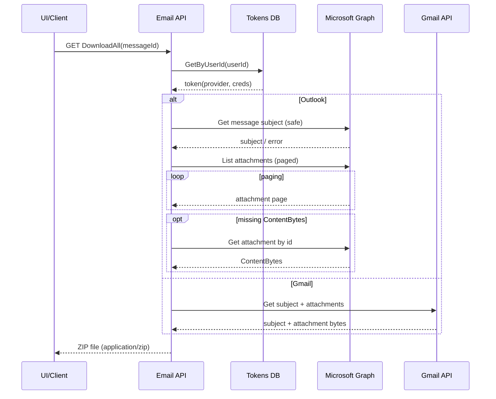
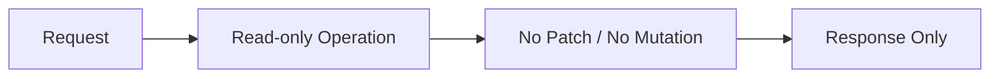
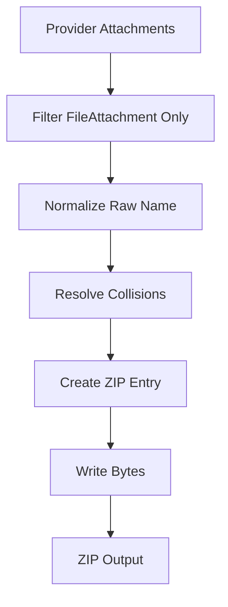

## Email Attachments DownloadAll 

This document explains the **end-to-end flow** of the `DownloadAll` endpoint, which retrieves **all file attachments** for a given email message from **Outlook (Microsoft Graph)** or **Gmail**, normalizes them, and returns them as a **single ZIP archive**.

The design intentionally abstracts provider-specific logic and exposes a **single, UI-friendly API**.

---

## 1. Overview

### High-level purpose of the module
The **Download All Attachments** module provides a secure, provider-agnostic way to download every file attachment for a given email message as **one ZIP file**.

### What problems it solves
- Removes provider complexity (Outlook vs Gmail) from UI and integrations.
- Handles provider quirks such as pagination and missing attachment bytes.
- Prevents unsafe filenames and OS download issues.
- Ensures a consistent “Download all” experience.

### Key responsibilities
- Authenticate and authorize the request.
- Resolve the user’s email provider based on stored OAuth tokens.
- Fetch message subject (best-effort) to name the ZIP.
- Retrieve all **file** attachments (skip non-file types).
- Normalize attachment names and handle duplicates.
- Build and return the ZIP as a downloadable response.

---

## 2. Unified Entry Point

### API Endpoint
```http
GET /Message/{messageId}/Attachments/DownloadAll
```

### Controller Method
```csharp
[Authorize(Roles = "ADMIN,MANAGER,STAFF")]
[HttpGet("Message/{messageId}/Attachments/DownloadAll")]
public async Task<IActionResult> DownloadAll(string messageId)
```

### Why a single entry point is used
- Keeps the client provider-agnostic.
- Centralizes authorization, validation, logging, and error mapping.
- Allows adding future providers without changing the API surface.

### Operations it supports
- Download all attachments from **Outlook** using **Microsoft Graph**.
- Download all attachments from **Gmail** using internal Google integration.

---

## 3. Input Models

### Request parameters

| Property   | Type   | Purpose |
|-----------|--------|---------|
| messageId | string | Route parameter identifying the email message |

### Implicit inputs (from auth context)
- `User.GetUserId()` – identifies the signed-in user
- OAuth token record from `ApplicationUserAccessTokensDB`
- Provider selection via `token.EmailProvider`

---

## 4. Core Concepts / Normalization Logic

### Provider Resolution
The provider is determined by stored OAuth token metadata:
- `ApplicationEmailServiceProviders.Outlook` → Microsoft Graph client
- `ApplicationEmailServiceProviders.Gmail` → Google controller

### Subject handling (ZIP naming)
- Default subject: `"Attachments"`
- Outlook: subject is fetched via Graph in a **safe** helper that never fails the operation.
- Gmail: subject is returned from `GoogleController.DownloadAllGmailAttachments`.

If subject fetch fails/blank → ZIP name falls back to `"Attachments.zip"`.

### Attachment filtering
- Outlook attachments can include types other than files (item/reference attachments).
- The implementation **only includes `FileAttachment`**.

### Filename collision handling
When multiple attachments share the same filename:
- Maintains a case-insensitive count map.
- Adds suffixes ` (2)`, ` (3)`, etc.
- Preserves extension when present.

Example:
```
report.pdf
report (2).pdf
report (3).pdf
```

### Filesystem-safe ZIP filename
`MakeSafeFileName()`:
- Replaces invalid filename characters with `_`
- Collapses whitespace
- Enforces a max length (default `120`)
- Falls back to `"Attachments"` if the result is empty

---

## 5. Base Object Construction

### ZIP creation (in-memory)
```csharp
using var ms = new MemoryStream();
using (var zip = new ZipArchive(ms, ZipArchiveMode.Create, leaveOpen: true))
{
    // create entries + write bytes
}
ms.Position = 0;
return File(ms.ToArray(), "application/zip", $"{MakeSafeFileName(subject)}.zip");
```

### Why this exists
- Avoids disk I/O and temp files.
- Keeps the endpoint stateless and cloud-friendly.
- Prevents cleanup complexity and shared filesystem contention.

### What it prevents / optimizes
- Prevents temp file leaks in container environments.
- Optimizes for speed by using `CompressionLevel.Fastest`.
- Keeps response generation atomic per request.

---

## 6. Internal Helpers / Services

### `ApplicationUserAccessTokensDB`
**Why it exists:** central persistence for provider + OAuth token retrieval.  
**When used:** every request, immediately after input validation.  
**Outcome:** returns a token record or `null` (unauthorized).

### `_graphSdkHelper.GetAuthenticatedClient(token)`
**Why it exists:** encapsulates Graph client construction.  
**When used:** Outlook branch only.  
**Failure mode:** returns `null` → 401 with a clear message.

### `GetOutlookSubjectSafe(GraphServiceClient client, string messageId)`
**Why it exists:** subject fetch should not block attachment download.  
**When used:** Outlook branch before downloading attachments.  
**Behavior:** swallow Graph errors and return `null`.

### `MicrosoftController.DownloadAllAttachments(GraphServiceClient client, string messageId)`
**Why it exists:** isolates Graph attachment paging and missing bytes handling.  
**When used:** Outlook branch to retrieve all attachments.  
**Behavior highlights:**
- Iterates pages via `OdataNextLink`
- Includes only `FileAttachment`
- If `ContentBytes` missing, re-fetches attachment by attachment id
- Wraps failures into `AppModelException`

### `GoogleController.DownloadAllGmailAttachments(userId, messageId)`
**Why it exists:** encapsulates Gmail API calls and normalization.  
**When used:** Gmail branch.  
**Returns:** `(subject, files[])` where each file has name, content bytes, content type.

### Local helpers
- `InsertSuffix(name, suffix)` – inserts suffix before file extension when present
- `MakeSafeFileName(input, maxLen)` – sanitizes ZIP file name

---

## 7. Execution Flow by Action Type

### Action: DownloadAll (Download all attachments)

#### Trigger conditions
- `messageId` is non-empty.
- User is authenticated and has role `ADMIN`, `MANAGER`, or `STAFF`.
- Token exists for the user.
- Provider is supported.
- At least one attachment is found.

#### Step-by-step flow
1. Validate `messageId` (400 if invalid).
2. Fetch OAuth token from `ApplicationUserAccessTokensDB` (401 if missing).
3. Determine provider using `token.EmailProvider`.
4. Provider branch:
   - **Outlook**
     1. Build Graph client (401 if cannot create).
     2. Fetch subject using `GetOutlookSubjectSafe`.
     3. Fetch all attachments using `MicrosoftController.DownloadAllAttachments`.
   - **Gmail**
     1. Call `GoogleController.DownloadAllGmailAttachments`.
     2. Use returned subject if non-empty.
5. If provider is not supported → 400.
6. If no files retrieved → 404.
7. Create ZIP in memory:
   - Normalize empty names to `attachment`
   - Resolve duplicates with suffixes
   - Add each attachment as a ZIP entry
8. Return ZIP file:
   - Content-Type: `application/zip`
   - Filename: `{MakeSafeFileName(subject)}.zip`

#### Special considerations / constraints
- Subject failures are non-fatal.
- Only file attachments are included (Outlook).
- In-memory ZIP means memory scales with total attachment size.

---

## 8. Attachment / Asset Handling

### Upload strategy
Not applicable (this is a download-only endpoint).

### Sync strategy
- On-demand retrieval from provider APIs.
- No local persistence or background sync implied by this endpoint.

### Retrieval strategy
- Outlook: `client.Me.Messages[messageId].Attachments.GetAsync()` with paging.
- Gmail: handled within `GoogleController.DownloadAllGmailAttachments`.

---

## 9. Scheduling / Metadata Handling

### Model explanation
- Metadata used: **email subject** → ZIP filename.

### Validation rules
- Subject is sanitized via `MakeSafeFileName`.
- Empty/invalid results fall back to `"Attachments"`.

### Limitations
- Subject retrieval may fail due to provider permissions or transient errors; endpoint still succeeds.

---

## 10. Error Handling Strategy

### How errors are wrapped
- Provider-specific retrieval errors can be wrapped:
  - Outlook helper throws `AppModelException("Failed to retrieve all attachments from Outlook", ex)`
- Controller catches any exception and returns HTTP 500 with a generic message.

### Why this strategy is used
- Prevents leaking provider internals to clients.
- Ensures consistent UX for integrations/UI.
- Preserves full diagnostic detail in server logs.

### Benefits
- Stable API contract for clients.
- Clear operational logging (`messageId` included).
- Reduced client-side branching and error parsing.

---

## 11. Design Principles

### Key architectural principles
- **Provider abstraction**: one endpoint, multiple providers.
- **Separation of concerns**: provider logic lives in provider helpers/controllers.
- **Fail-soft metadata**: subject fetch does not block core functionality.

### Scalability considerations
- Stateless per request (safe for horizontal scaling).
- In-memory ZIP is fast but bounded by memory; large attachments may require streaming in future.

### Provider-agnostic / extensibility notes
- Add new providers by:
  - Extending `ApplicationEmailServiceProviders`
  - Implementing a provider-specific attachment fetcher returning normalized file tuples
- Keep API unchanged.

---

## 12. Mermaid Diagrams (MANDATORY)

### Overall Flowchart (high-level request lifecycle)


### Sequence Diagram (UI → API → External Service)


### Update / Patch Flow


### Attachment or Asset Flow


---

## 13. Final Outcome

### What this design achieves
- A single endpoint that reliably downloads all attachments across providers.
- Robust normalization for filenames and ZIP naming.
- Clear separation between API orchestration and provider integrations.

### Benefits for UI, API, and scalability
- **UI**: One-click download; no provider branching.
- **API**: Centralized security, validation, and error handling.
- **Scalability**: Stateless design; provider integrations isolated; future streaming upgrade path.
