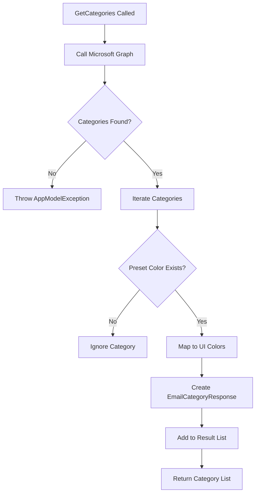
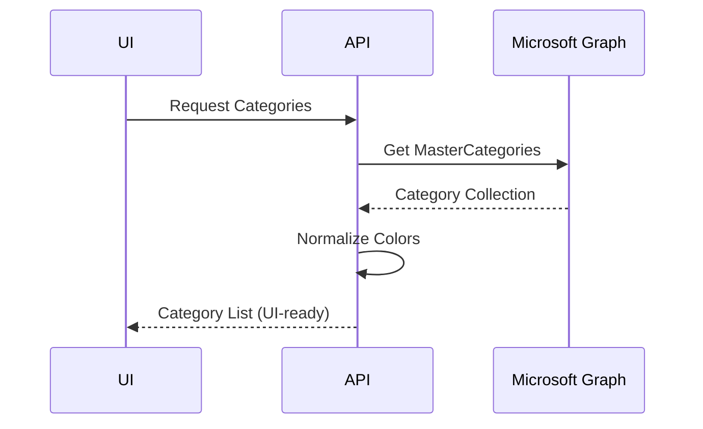

# Email Categories Listing – Detailed Flow Documentation (Outlook / Microsoft Graph)

This document explains the **end-to-end flow of the `GetCategories` method**, which retrieves **Outlook Master Categories** using **Microsoft Graph** and normalizes them into a **UI-friendly color model**.

---

## 1. Purpose of `GetCategories`

`GetCategories` is responsible for:

- Fetching **Outlook Master Categories** for the signed-in user
- Mapping Microsoft preset colors to **custom UI color codes**
- Returning a **normalized category list** for frontend consumption
- Ensuring consistent category color rendering across the application

This method acts as a **read-only metadata provider** for email categorization features.

---

## 2. Method Signature

```csharp
public static async Task<List<EmailCategoryResponse>> GetCategories(
    GraphServiceClient client
)
```

### Parameters

| Parameter | Purpose |
|---------|--------|
| `client` | Authenticated Microsoft Graph client |

---

## 3. Microsoft Graph API Used

```csharp
client.Me.Outlook.MasterCategories.GetAsync()
```

### What Are Master Categories?

- User-defined and system-defined **Outlook categories**
- Shared across Outlook experiences (Mail, Calendar, Tasks)
- Each category includes:
  - `Id`
  - `DisplayName`
  - `Color` (preset value)

---

## 4. Data Fetch & Validation

```csharp
var categories = await client.Me.Outlook.MasterCategories.GetAsync();
if (categories?.Value == null)
    throw new AppModelException("Categories not found");
```

### Validation Strategy

- Ensures Graph returns valid data
- Prevents returning empty or corrupted metadata

---

## 5. Category Normalization Logic

Each Graph category is transformed into `EmailCategoryResponse`.

### Mapping Strategy

- Microsoft Graph provides **preset color names** (`Preset0` – `Preset24`)
- Application maps presets to:
  - Foreground color hex
  - Background color hex

```csharp
if (category.Color != null && colorMapping.ContainsKey(category.Color.ToString()))
```

### Normalized Response Model

```csharp
new EmailCategoryResponse
{
    Id = category.Id,
    Name = category.DisplayName,
    Color = colorDetails.ColorHex,
    BgColor = colorDetails.BgColorHex
}
```

Categories without a valid color mapping are **ignored**.

---

## 6. Color Mapping Dictionary

The `colorMapping` dictionary maps **Microsoft preset colors** to UI-friendly color values.

### Dictionary Structure

```csharp
Dictionary<string, (string Name, string ColorHex, string BgColorHex)>
```

### Example Mapping

| Preset | Name | Text Color | Background Color |
|------|------|------------|------------------|
| Preset0 | Red | `#FF0000` | `#FFCDD2` |
| Preset7 | Blue | `#0000FF` | `#BBDEFB` |
| Preset12 | Gray | `#808080` | `#EEEEEE` |
| Preset24 | DarkCranberry | `#7A003C` | `#FFEBEE` |

This ensures:

- Visual consistency
- Accessibility-friendly contrast
- Predictable UI theming

---

## 7. Filtering & Final Response

```csharp
.Where(category => category != null)
.ToList()
```

### Behavior

- Null or unsupported categories are removed
- Always returns a **safe, non-null list**

---

## 8. Error Handling Strategy

```csharp
catch (Exception ex)
{
    throw new AppModelException(ex.Message, ex);
}
```

### Benefits

- Preserves original exception context
- Provides consistent application-level error handling

---

## 9. Mermaid Flowcharts

### A. Category Fetch & Normalization Flow



---

### B. Sequence Diagram – Category Retrieval



---

## 10. Key Design Principles

- Read-only metadata endpoint
- Provider-specific logic isolated
- UI-first normalization
- Graceful handling of unsupported presets
- Strong typing and validation

---

## 11. Final Outcome

This implementation delivers:

- Consistent category colors across UI
- Reliable Outlook category integration
- Minimal Graph payload usage
- Clean separation between Graph models and UI models
