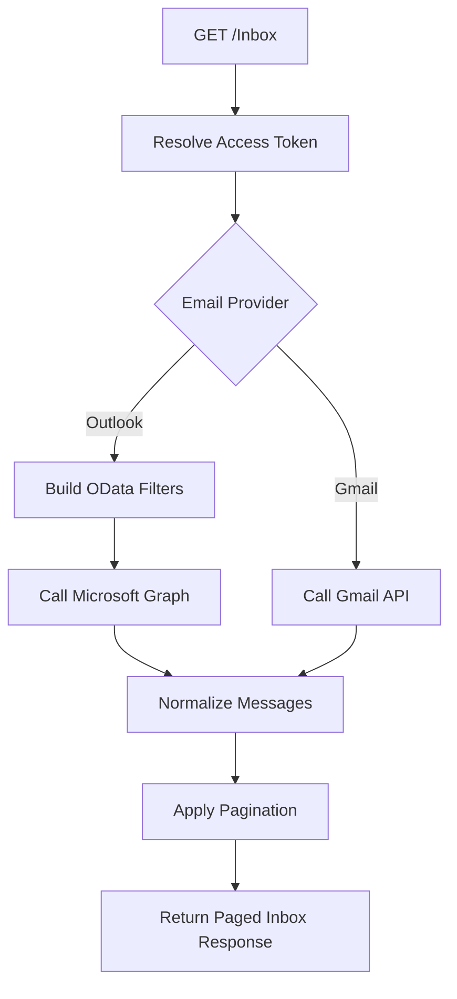
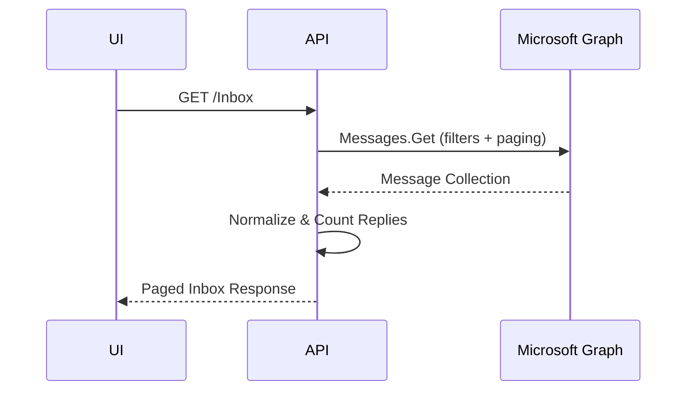

# Unified Inbox Listing – Detailed Flow Documentation (Outlook & Gmail)

This document explains the **end-to-end flow of the Inbox listing API**, which provides a **unified email list experience** across **Microsoft Outlook (Graph API)** and **Gmail**. It covers authorization, provider resolution, filtering, pagination, and message normalization.

---

## 1. Purpose of `GetAllMessages`

The `GetAllMessages` endpoint is responsible for:

- Fetching **paginated email lists** for the inbox UI
- Supporting **multiple email providers** (Outlook & Gmail)
- Applying filters (important, unread, flagged, attachments, mentions, categories)
- Handling search, sorting, and date ranges
- Returning a **normalized, UI-ready response**

---

## 2. API Definition

```csharp
[Authorize(Roles = "ADMIN,MANAGER,STAFF")]
[HttpGet("Inbox")]
public async Task<ApiResponse<PagedData<EmailsListItem>>> GetAllMessages(...)
```

### Key Characteristics

| Attribute | Purpose |
|---------|--------|
| `Authorize` | Restricts access to valid application roles |
| `HttpGet("Inbox")` | Unified inbox listing endpoint |

---

## 3. Query Parameters

| Parameter | Purpose |
|--------|--------|
| `start` | Pagination offset |
| `length` | Page size |
| `search` | Subject / sender search |
| `inboxType` | Folder name (inbox, sentitems, drafts, etc.) |
| `isImportant` | High importance mails only |
| `viewType` | unread / read / all |
| `isFlagged` | Flagged emails |
| `isStarred` | Starred emails (Gmail) |
| `hasAttachment` | Emails with attachments |
| `hasMentioned` | Emails where user is mentioned |
| `categoryType` | Outlook category filter |
| `sortBy` | Sorting field |
| `nextPageToken` | Gmail pagination token |
| `startDate` | Filter start date |
| `endDate` | Filter end date |

---

## 4. Access Token & Provider Resolution

```csharp
var db = new ApplicationUserAccessTokensDB(User);
var accessToken = await db.GetByUserId(User.GetUserId());
```

### Provider Routing

- **Outlook** → Microsoft Graph flow
- **Gmail** → Google API flow

```csharp
if (accessToken.EmailProvider == Outlook) { ... }
else if (accessToken.EmailProvider == Gmail) { ... }
```

This ensures a **single inbox API** with provider-specific implementations.

---

## 5. Outlook Inbox Flow – `GetMessages`

### Filter Construction Strategy

Filters are dynamically built using **OData syntax**:

| Condition | OData Filter |
|---------|-------------|
| Inbox vs Sent | `receivedDateTime` / `sentDateTime` |
| Important | `importance eq 'high'` |
| Unread | `isRead eq false` |
| Read | `isRead eq true` |
| Search | `contains(subject, ...)` |
| Flagged | `flag/flagStatus eq 'flagged'` |
| Category | `categories/any(...)` |
| Mentioned | `MentionsPreview/IsMentioned eq true` |
| Attachment | `hasAttachments eq true` |

All filters are combined using logical `and`.

---

## 6. Microsoft Graph Query Execution

```csharp
client.Me.MailFolders[inboxType].Messages.GetAsync(...)
```

### Query Configuration

- **Select** → Minimal required fields
- **OrderBy** → Date descending
- **Skip / Top** → Pagination
- **Expand** → Attachments (id, name)

This minimizes payload size and improves performance.

---

## 7. Message Normalization

Each Graph `Message` is converted into `EmailsListItem`:

### Normalized Fields

- Sender name
- Subject
- Read status
- Importance
- Attachments
- Categories
- Draft status
- Conversation ID
- Recipient list

### Date Resolution Logic

```csharp
GetMessageDate(message, folderType)
```

Ensures correct date display for:

- Inbox
- Sent items
- Drafts

---

## 8. Conversation Reply Count

```csharp
GetReplyCount(client, conversationId)
```

- Executed per message
- Aggregated asynchronously using `Task.WhenAll`
- Enhances UI with thread awareness

---

## 9. Pagination Strategy

| Provider | Pagination Method |
|--------|------------------|
| Outlook | `Skip / Top` + `@odata.nextLink` |
| Gmail | `nextPageToken` |

Returned as:

```csharp
PagedData
{
  Items,
  TotalRecords,
  ContinuationToken
}
```

---

## 10. Error Handling Strategy

### Controller Level

- Errors added to `ApiResponse`
- Prevents API failure propagation

### Provider Level

```csharp
throw new AppModelException(ex.Message);
```

Ensures consistent error formatting.

---

## 11. Mermaid Flowcharts

### A. Unified Inbox Flow



---

### B. Outlook Message Fetch Sequence



---

## 12. Key Design Principles

- Provider-agnostic inbox API
- Optimized Graph queries
- Dynamic filter construction
- UI-focused normalization
- Scalable for additional providers

---

## 13. Final Outcome

This implementation delivers:

- A single, consistent inbox experience
- High-performance email listing
- Clean separation of provider logic
- Extensible architecture for future integrations
