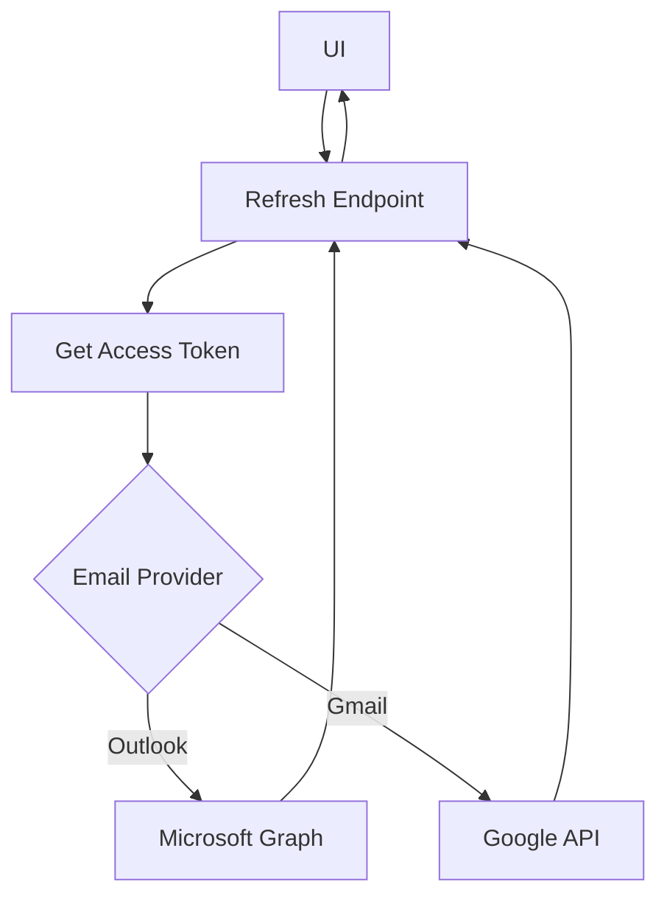
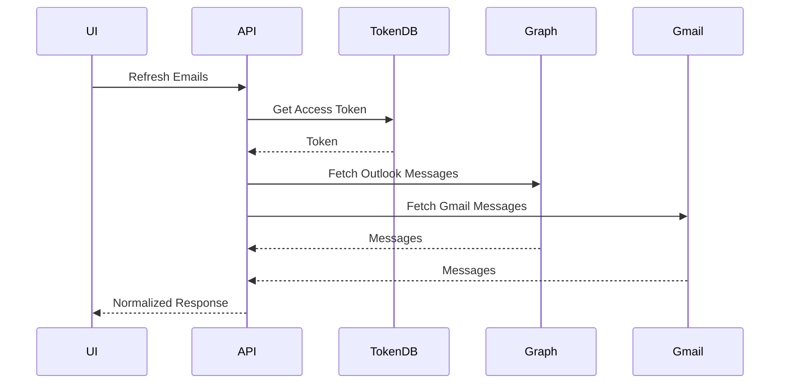
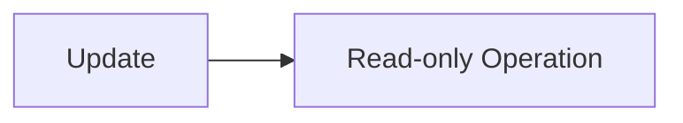
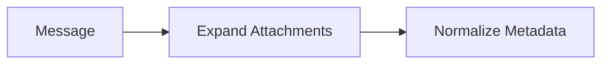

# Unified Email Refresh & Latest Messages Retrieval Module

## 1. Overview

### Purpose
The **Email Refresh & Latest Messages Retrieval Module** provides a unified API to fetch the latest email messages for authenticated users across multiple email providers (Outlook and Gmail).

### Problems It Solves
- Abstracts provider-specific email APIs behind a single endpoint
- Supports incremental message refresh using polling timestamps
- Provides paginated, normalized email list data for UI consumption

### Key Responsibilities
- Authenticate and authorize email access
- Detect email provider dynamically
- Fetch latest messages from Outlook (Microsoft Graph) or Gmail
- Normalize provider-specific responses into a common model

---

## 2. Unified Entry Point

### API Endpoint
```http
GET /Refresh
```

### Controller Method
```csharp
public async Task<ApiResponse<PagedData<EmailsListItem>>> GetLatestMessages(
    int start = 0,
    int length = 10,
    string viewType = "",
    string inboxType = "inbox"
)
```

### Why a Single Entry Point
- Simplifies frontend integration
- Enables provider-agnostic email refresh
- Centralizes authorization and error handling

### Supported Operations
- Refresh inbox, sent, or other folders
- Paginated email listing
- Incremental sync using last poll timestamp

---

## 3. Input Models

### Query Parameters

| Property | Type | Purpose |
|--------|------|--------|
| `start` | `int` | Pagination offset |
| `length` | `int` | Page size |
| `viewType` | `string` | Reserved for future filters |
| `inboxType` | `string` | Folder name (e.g., inbox, sentitems) |

---

## 4. Core Concepts / Normalization Logic

### Provider Detection
The user's email provider is determined from stored access tokens:

```csharp
accessToken.EmailProvider
```

### Incremental Sync
- Uses `_lastPollTime` to fetch only new messages
- Converts timestamp to OData-compliant format

```csharp
lastPollTime.ToString("o")
```

### Normalized Output Model
All provider responses are mapped to:

```csharp
EmailsListItem
```

---

## 5. Base Object Construction

### API Response Wrapper
```csharp
ApiResponse<PagedData<EmailsListItem>>
```

### Why This Exists
- Standardizes success and error responses
- Simplifies frontend error handling

---

## 6. Internal Helpers / Services

### Outlook (Microsoft Graph)
- `GraphServiceClient`
- `MicrosoftController.GetlatestMessages()`

### Gmail
- `GoogleController.GetLatestGmailMessages()`

### Token Store
- `ApplicationUserAccessTokensDB`

---

## 7. Execution Flow by Action Type

### Action: Refresh Emails

#### Trigger Conditions
- User opens mailbox
- UI triggers refresh or polling

#### Step-by-Step Flow
1. Validate user role (ADMIN, MANAGER, STAFF)
2. Retrieve stored email access token
3. Identify email provider
4. Route request to provider-specific handler
5. Normalize response
6. Return paginated email list

#### Special Constraints
- Access token must exist
- Provider must be supported

---

## 8. Attachment / Asset Handling

### Outlook Attachments
- Attachments expanded via Graph `Expand` query

```csharp
Expand = new[] { "attachments($select=id,name,contentType,size)" }
```

### Normalization
- Only attachment ID and name are exposed to UI

---

## 9. Scheduling / Metadata Handling

### Metadata Used
- `receivedDateTime`
- `sentDateTime`

### Rules
- Inbox uses `receivedDateTime`
- Sent folder uses `sentDateTime`

---

## 10. Error Handling Strategy

### Strategy
- Controller-level errors added to `ApiResponse`
- Service-level errors wrapped in `AppModelException`

### Benefits
- Prevents provider exceptions leaking to UI
- Unified error contract

---

## 11. Design Principles

### Architectural Principles
- **Provider Abstraction**: Outlook & Gmail handled transparently
- **Single Responsibility**: Controller orchestrates, services fetch
- **Fail Fast**: Missing tokens cause immediate failure

### Scalability Considerations
- Easy to add new email providers
- Pagination-friendly

### Extensibility Notes
- `viewType` reserved for future filters

---

## 12. Mermaid Diagrams

### Overall Flowchart


### Sequence Diagram


### Update / Patch Flow


### Attachment Flow


---

## 13. Final Outcome

### What This Design Achieves
- Unified email refresh across providers
- Incremental sync for performance
- Clean, UI-ready data structure

### Benefits
- **UI**: Single API, consistent data
- **API**: Clear orchestration layer
- **Scalability**: Easy provider expansion

---

**Status:** Production-ready, provider-agnostic design

