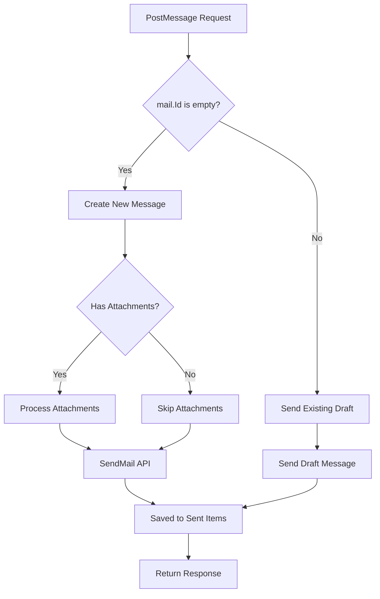
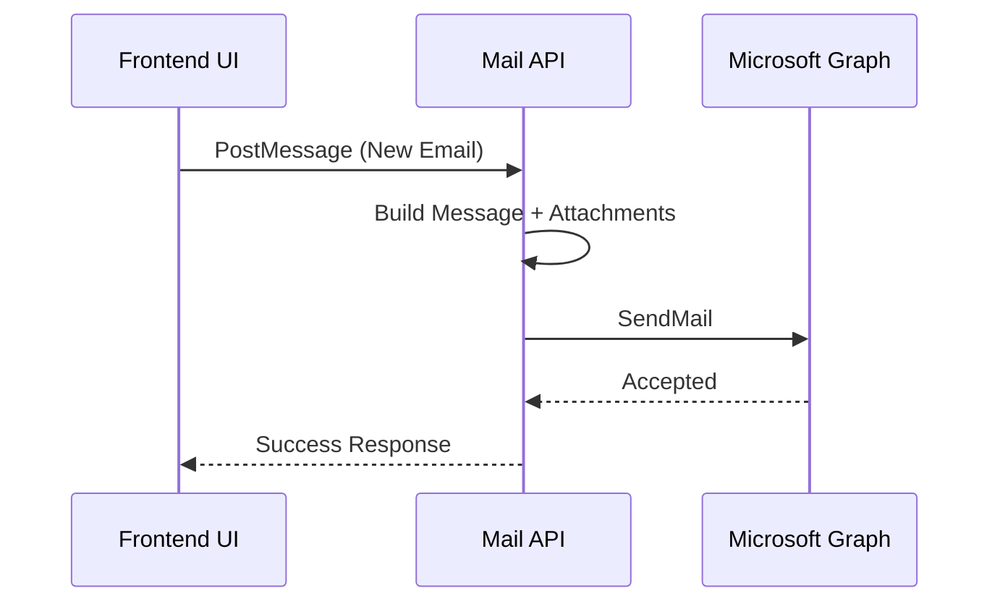
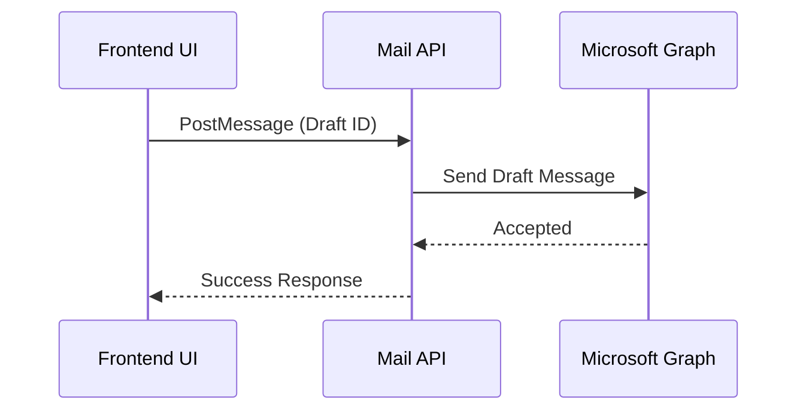

# Send Email Handling – Detailed Flow Documentation (Outlook / Microsoft Graph)

This document explains the **end-to-end behavior of the `PostMessage` method**, which is responsible for **sending emails** using **Microsoft Graph**. It covers message construction, recipient handling, attachment processing, and send logic for both **new messages** and **existing drafts**.

---

## 1. Purpose of `PostMessage`

`PostMessage` is a **send-only operation** that handles:

- Sending a **new email** (optionally with attachments)
- Sending an **existing draft message**
- Normalizing recipients and message body
- Ensuring messages are saved to **Sent Items**

This method does **not** return message content, only a normalized response model.

---

## 2. Method Signature

```csharp
public static async Task<IdNameModel> PostMessage(
    GraphServiceClient client,
    EmailRequest mail
)
```

### Parameters

| Parameter | Purpose |
|---------|--------|
| `client` | Authenticated Microsoft Graph client |
| `mail` | Provider-agnostic email request model |

---

## 3. Input Model – `EmailRequest`

The method relies on the following fields from `EmailRequest`:

| Property | Purpose |
|--------|--------|
| `Id` | Draft message ID (if sending an existing draft) |
| `Subject` | Email subject |
| `Body` | HTML email body |
| `Importance` | Email priority |
| `ToRecipients` | Primary recipients |
| `CcRecipients` | CC recipients |
| `BccRecipients` | BCC recipients |
| `Attachments` | Files to be attached |

---

## 4. Message Construction Logic

A Microsoft Graph `Message` object is constructed before sending:

```csharp
var message = new Message
{
    Importance = mail?.Importance,
    Subject = mail?.Subject ?? "",
    Body = new ItemBody
    {
        ContentType = BodyType.Html,
        Content = mail?.Body
    },
    ToRecipients = ...,
    CcRecipients = ...,
    BccRecipients = ...
};
```

### Key Notes

- Body content is always sent as **HTML**
- Subject defaults to an empty string
- Recipient lists are safely defaulted to empty collections

---

## 5. Recipient Normalization

Recipients are mapped using a shared model:

```csharp
Recipient
{
    EmailAddress = new EmailAddress
    {
        Name = e.Name,
        Address = e.Id
    }
}
```

This ensures:

- Consistent email address mapping
- Compatibility with Microsoft Graph

---

## 6. Attachment Handling Strategy

### Detection

```csharp
var hasAttachments = mail?.Attachments != null && mail.Attachments.Any();
```

### Processing

- Attachments are only processed when **creating a new message**
- Attachments are converted using `GetAttachments(...)`
- Existing draft sends **do not reprocess attachments**

---

## 7. Send Logic – Execution Paths

### A. Send New Email (No Draft ID)

**Condition**

```csharp
if (mail.Id.IsEmpty())
```

**Flow**

1. Build `Message`
2. Attach files (if any)
3. Call `SendMail`
4. Save message to Sent Items

```csharp
client.Me.SendMail.PostAsync(
    new SendMailPostRequestBody
    {
        Message = message,
        SaveToSentItems = true
    }
);
```

---

### B. Send Existing Draft

**Condition**

```csharp
else
```

**Flow**

1. Use existing draft ID
2. Call `Send` on the message

```csharp
client.Me.Messages[mail.Id].Send.PostAsync();
```

---

## 8. Error Handling Strategy

All exceptions are wrapped using:

```csharp
throw new AppModelException(ex.Message);
```

### Benefits

- Consistent error response format
- Hides Microsoft Graph internal exceptions

---

## 9. Mermaid Flowcharts

### A. Overall `PostMessage` Flow



---

### B. Sequence Diagram – New Email Send



---

### C. Sequence Diagram – Draft Send



---

## 10. Key Design Principles

- Clear separation of **draft creation** and **send logic**
- Provider-agnostic request model
- Safe defaults for recipients and content
- Optimized Graph usage (no redundant patching)

---

## 11. Final Outcome

This implementation provides:

- Reliable email sending workflow
- Clean handling of drafts vs new messages
- Consistent behavior across UI and backend
- Scalable design for future provider extensions

