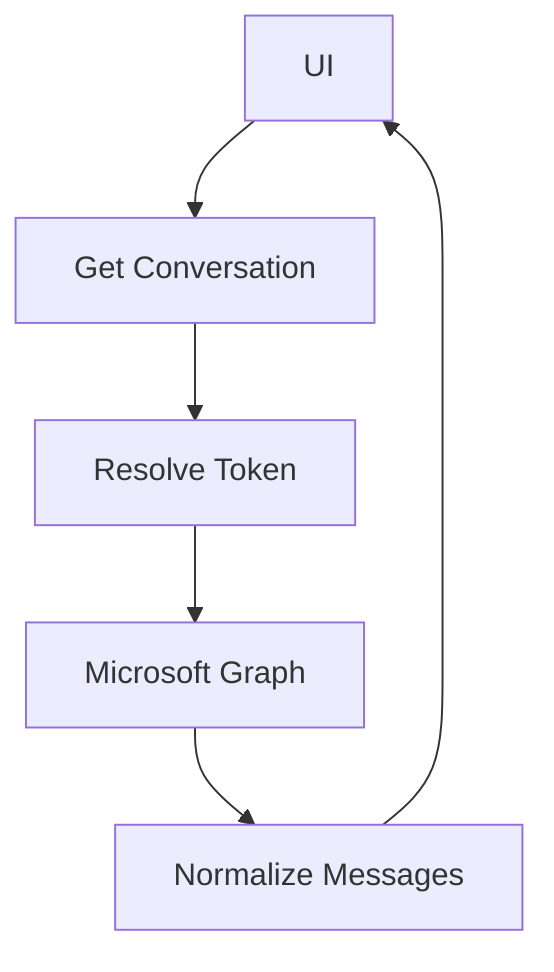
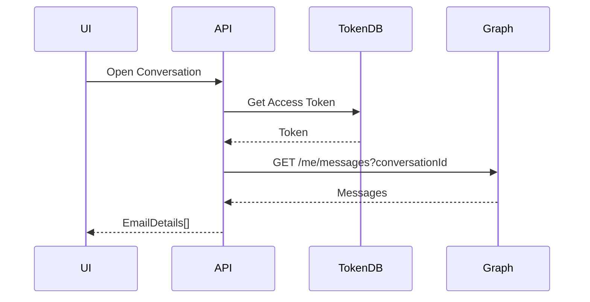
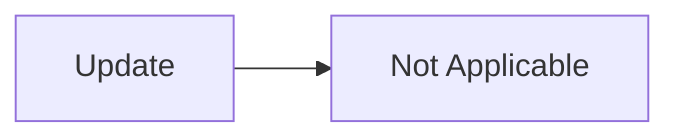
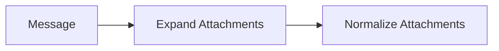

# Email Conversation Thread Retrieval Module (Outlook)

## 1. Overview

### Purpose
The **Email Conversation Thread Retrieval Module** retrieves all non-draft email messages belonging to a single conversation (thread) from an Outlook mailbox using the **Microsoft Graph API**.

### Problems It Solves
- Fetches complete conversation history for threaded email views
- Normalizes raw Graph message data into a UI-friendly model
- Handles attachments, recipients, and message body processing

### Key Responsibilities
- Authorize and authenticate user access
- Identify the email provider (Outlook)
- Query messages by `conversationId`
- Normalize message details into `EmailDetails`

---

## 2. Unified Entry Point

### API Endpoint
```http
GET /conversation/{conversationId}
```

### Controller Method
```csharp
public async Task<ApiResponse<List<EmailDetails>>> GetConversationMessages(string conversationId)
```

### Why a Single Entry Point
- Simplifies frontend integration for threaded views
- Centralizes authorization and error handling
- Enables future Gmail thread support

### Supported Operations
- Retrieve conversation messages (thread view)

---

## 3. Input Models

### Route Parameters

| Property | Type | Purpose |
|--------|------|--------|
| `conversationId` | `string` | Unique identifier for an email conversation |

---

## 4. Core Concepts / Normalization Logic

### Conversation-Based Retrieval
Messages are filtered using Microsoft Graph `conversationId`:

```csharp
Filter = $"conversationId eq '{conversationId}' and isDraft eq false";
```

### Field Selection Optimization
Only required fields are selected to optimize payload size:

- Metadata (IDs, dates, flags)
- Message content (body, preview)
- Participants (sender, recipients)
- Attachments (expanded selectively)

---

## 5. Base Object Construction

### Normalized Output Model

```csharp
List<EmailDetails>
```

Each `Message` is transformed into a fully populated `EmailDetails` object, ensuring:
- Null safety
- UI-ready data
- Consistent structure

---

## 6. Internal Helpers / Services

### Microsoft Graph SDK
- `GraphServiceClient`
- `/me/messages` endpoint

### Helper Methods

| Helper | Responsibility |
|------|---------------|
| `GetAttachmentsAsync` | Fetches & normalizes attachments |
| `CleanHtmlContent` | Sanitizes HTML bodies |
| `GetMessageDate` | Determines correct date based on folder |

---

## 7. Execution Flow

### Action: Retrieve Conversation Threads

#### Trigger Conditions
- User opens a conversation in the UI

#### Step-by-Step Flow
1. Validate `conversationId`
2. Resolve user access token
3. Ensure Outlook provider
4. Query messages filtered by conversation
5. Fetch attachments asynchronously per message
6. Normalize message data
7. Return ordered thread list

#### Constraints
- Draft messages are excluded
- Requires mailbox read permissions

---

## 8. Attachment / Asset Handling

### Retrieval Strategy
- Attachments are expanded in Graph query
- Additional processing via `GetAttachmentsAsync`

### Normalization
Only essential attachment metadata is exposed:
- ID
- Name
- Content type
- Size

---

## 9. Scheduling / Metadata Handling

### Date Resolution Logic

| Folder Type | Date Field Used |
|------------|----------------|
| Inbox | `receivedDateTime` |
| Sent Items | `sentDateTime` |

Dates are normalized to UTC for consistency.

---

## 10. Error Handling Strategy

### Strategy
- Controller wraps errors into `ApiResponse`
- Service layer throws `AppModelException`

### Benefits
- Consistent error contracts
- Prevents Graph SDK exception leakage

---

## 11. Design Principles

### Architectural Principles
- **Thread-Based Retrieval**
- **Normalization First**
- **Provider Abstraction Ready**

### Scalability Considerations
- Supports large threads via async processing
- Easily extendable to Gmail threads

---

## 12. Mermaid Diagrams

### Overall Flowchart


### Sequence Diagram


### Update / Patch Flow


### Attachment Flow


---

## 13. Final Outcome

### What This Design Achieves
- Complete threaded email view
- Clean, UI-ready message structure
- Optimized Graph API usage

### Benefits
- **UI**: Rich conversation rendering
- **API**: Clean orchestration
- **Scalability**: Provider extension ready

---

**Status:** Production-ready conversation retrieval module