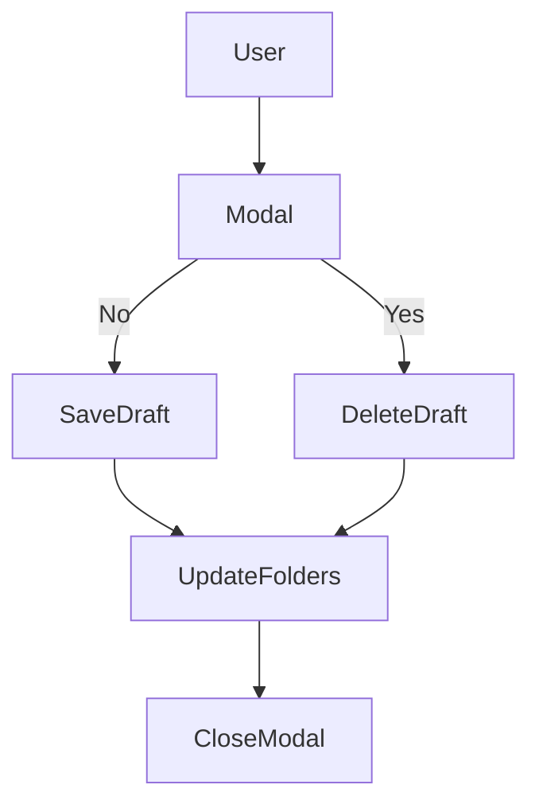
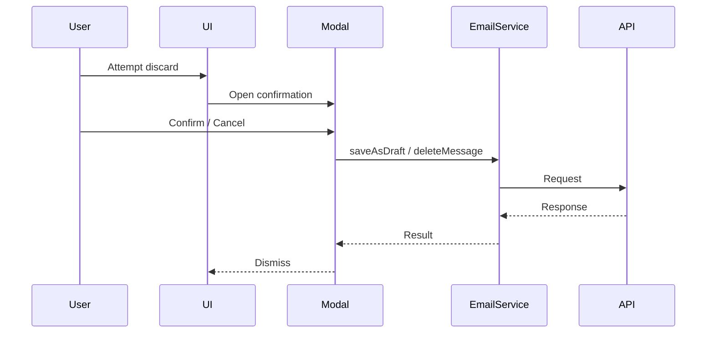
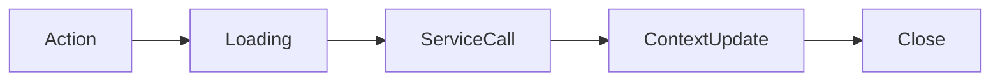
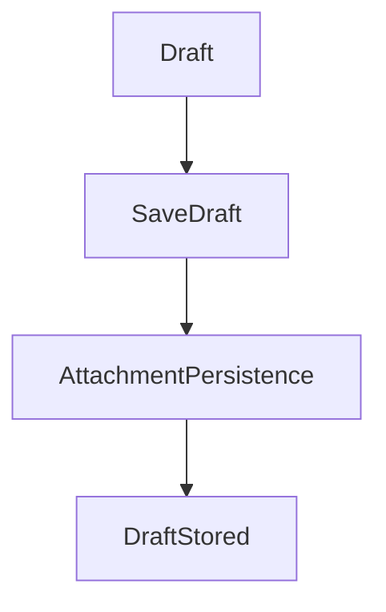

# Draft Confirmation Modal Module Documentation

## 1. Overview

The **Draft Confirmation Modal** module provides a controlled confirmation flow when a user attempts to discard an email draft. It ensures that accidental data loss is avoided while maintaining mailbox consistency across draft state, selected mail, and folder counters.

This module is implemented as a modal component that sits at the boundary between **compose experience UX** and **mail persistence logic**.

### High-level purpose
- Confirm user intent before discarding an in-progress draft.
- Decide between **saving as draft** or **permanently discarding** the draft.
- Keep draft counts, selection state, and compose state consistent.

### Problems it solves
- Prevents accidental loss of unsent email content.
- Avoids orphaned draft records and incorrect folder counters.
- Centralizes discard logic instead of duplicating it across compose flows.

### Key responsibilities
- Present a blocking confirmation modal.
- Persist drafts when discard is cancelled.
- Delete drafts when discard is confirmed.
- Synchronize MailContext state (draft message, selected mail, folders).

---

## 2. Unified Entry Point

### Component Entry Point
- **`DraftConfirmationModel`** (React functional component)

This component acts as the **single decision gate** for draft discard behavior.

### Why a single entry point is used
- All discard-related decisions flow through one component.
- Prevents divergence between UI intent and backend state.
- Simplifies reasoning about draft lifecycle transitions.

### Operations supported
- Cancel discard → save draft
- Confirm discard → delete draft
- Dismiss modal without side effects when no draft exists

---

## 3. Input Models

### Component Props

| Property | Type | Purpose |
|---|---|---|
| value | `EmailRequestModel` | Current email request payload to be saved as draft |
| width | `string \| number \| undefined` | Optional modal width override |
| onDismiss | `() => void` | Callback invoked when modal closes |
| onDiscardConfirmed | `() => void` | Callback invoked after successful discard |

### EmailRequestModel (relevant fields)

| Property | Type | Purpose |
|---|---|---|
| requestType | `EmailRequestType` | Indicates draft vs send flow |
| id | `string` | Draft identifier (when already saved) |

---

## 4. Core Concepts / Normalization Logic

### Draft state resolution
The component distinguishes between two scenarios:

1. **Draft exists in state** (`draftMessage.get()` returns value)
2. **Draft not yet persisted** (no draftMessage)

This determines whether deletion should be attempted or the modal should simply close.

### Folder-aware normalization
When cancelling discard:
- If the request type is `Draft`
- And the current folder is not `Drafts`

Then the Drafts folder counter is incremented to reflect the newly saved draft.

### Loading state normalization
- `isLoading` disables buttons and shows modal loading state.
- Ensures idempotency of user actions.

### Edge cases
- If deletion fails, error is surfaced but modal still closes.
- If no draft exists, confirmation path safely no-ops.

---

## 5. Base Object Construction

### ModalComponent Configuration
The modal itself acts as the reusable base object:

```ts
<ModalComponent
  isOpen={true}
  isLoading={isLoading}
  title="Discard message"
/>
```

### Why this exists
- Provides consistent modal UX across the application.
- Centralizes loading, sizing, and dismissal behavior.

### What it prevents / optimizes
- Prevents duplicate modal logic.
- Avoids inconsistent discard confirmation UX.
- Simplifies accessibility and focus management.

---

## 6. Internal Helpers / Services

### `EmailService`
| Method | Purpose | When Used |
|---|---|---|
| `saveAsDraft(value)` | Persists draft content | User clicks “No” (cancel discard) |
| `deleteMessage(id)` | Deletes existing draft | User confirms discard |

### `useMail()` context dependencies
| Member | Role |
|---|---|
| `draftMessage` | Current in-progress draft |
| `selectedMail` | Selected email in list view |
| `folders` | Folder counters (Drafts) |
| `currentFolder` | Determines folder-aware logic |

---

## 7. Execution Flow by Action Type

### A) Cancel Discard (Save Draft)

**Trigger conditions**
- User clicks **“No”** button.

**Step-by-step flow**
1. Set `isLoading = true`.
2. Call `EmailService.saveAsDraft(value)`.
3. On success:
   - Increment Drafts folder count if applicable.
   - Clear `selectedMail`.
4. Close modal via `onDismiss`.

**Special considerations**
- Draft is saved even if user intended to close compose.
- Folder counters remain accurate across views.

---

### B) Confirm Discard (Delete Draft)

**Trigger conditions**
- User clicks **“Yes”** button.

**Step-by-step flow**
1. Check if `draftMessage` exists.
2. Set `isLoading = true`.
3. Call `EmailService.deleteMessage(draftId)`.
4. On success:
   - Decrement Drafts folder count.
   - Clear `draftMessage`.
   - Invoke `onDiscardConfirmed`.
5. Close modal via `onDismiss`.

**Constraints**
- Deletion only occurs for persisted drafts.
- Non-persisted drafts skip backend calls.

---

## 8. Attachment / Asset Handling

This module does **not** directly manage attachments.

### Upload strategy
- Not applicable.

### Sync strategy
- Attachment lifecycle handled during draft save elsewhere.

### Retrieval strategy
- Not applicable.

---

## 9. Scheduling / Metadata Handling

### Metadata handled
- Draft existence
- Folder counts
- Request type (Draft vs other)

### Validation rules
- Draft deletion requires a valid draft ID.
- Folder count updates are guarded by folder name checks.

### Limitations
- Does not validate draft content integrity.
- Relies on EmailService for backend enforcement.

---

## 10. Error Handling Strategy

### Error handling approach
- Errors are caught locally and surfaced via `AOToast`.
- Generic fallback messages are used for safety.

### Why this strategy is used
- Keeps UX responsive even on backend failure.
- Avoids blocking the user in a destructive flow.

### Benefits
- Predictable dismissal behavior.
- Centralized error presentation.
- Reduced risk of stuck modal states.

---

## 11. Design Principles

### Key architectural principles
- **Single responsibility**: modal handles confirmation, not compose logic.
- **State safety**: loading guards prevent double actions.
- **Context-driven state**: mailbox state lives in `useMail`.

### Scalability considerations
- Can support additional confirmation paths (e.g., auto-save warnings).
- Modal styling and behavior reusable for other confirmations.

### Provider-agnostic notes
- EmailService abstracts persistence details.
- Backend provider can change without impacting modal logic.

---

## 12. Mermaid Diagrams (MANDATORY)

### Overall Flowchart


### Sequence Diagram (UI → API → External Service)


### Update / Patch Flow


### Attachment Flow


---

## 13. Final Outcome

This design provides a **safe, predictable, and user-friendly** draft discard flow.

### Benefits for UI
- Clear confirmation before destructive actions.
- No accidental data loss.
- Consistent modal behavior.

### Benefits for API
- Clean separation between confirmation and persistence.
- Reduced risk of orphaned drafts.

### Benefits for scalability
- Easily extensible to autosave or versioned drafts.
- Works with any backend that supports save/delete semantics.
