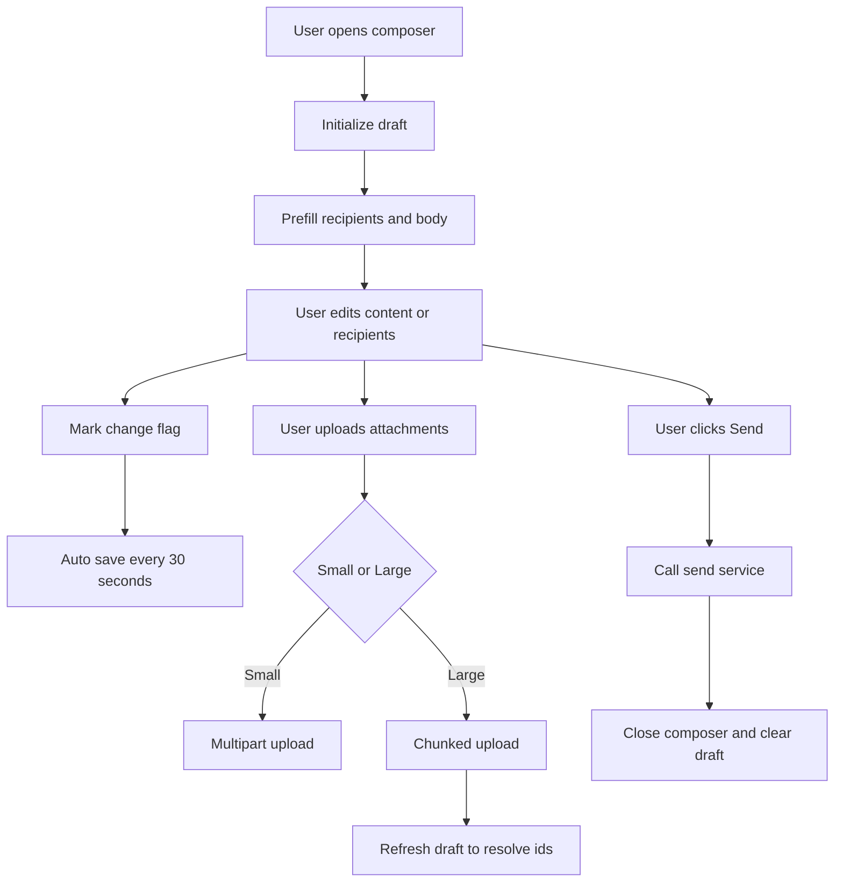
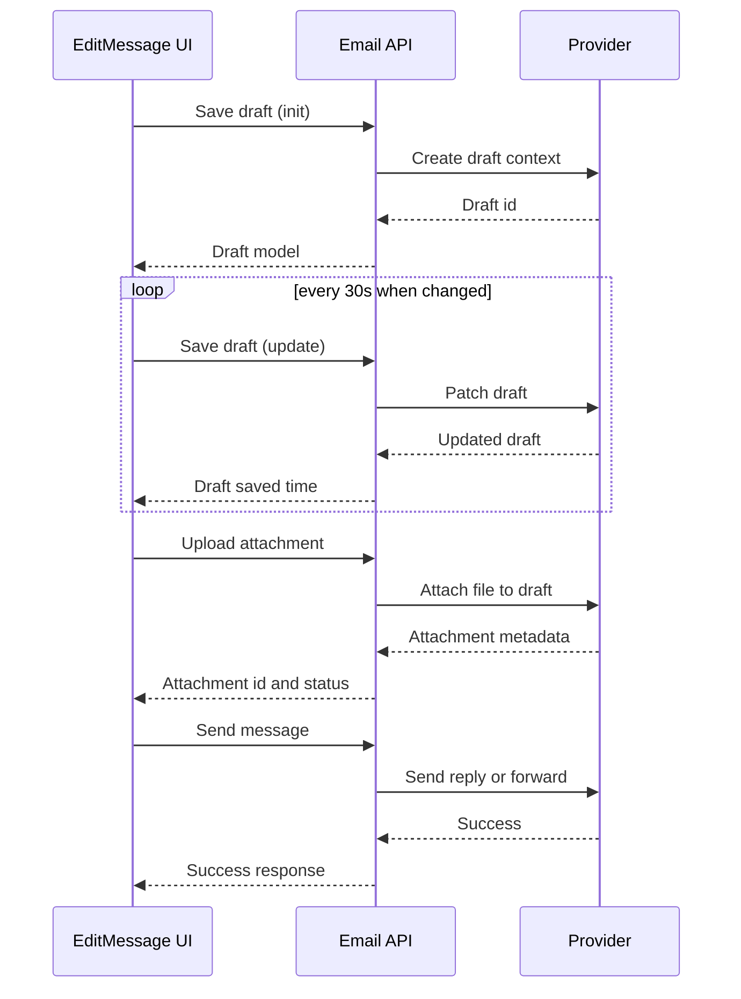
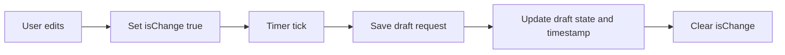
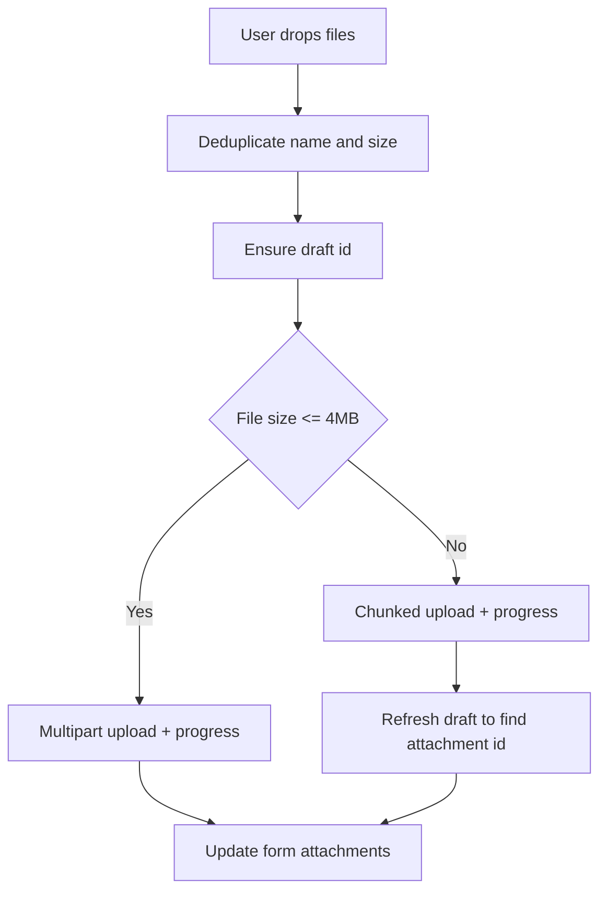

# ✍️ EditMessage UI – Reply / ReplyAll / Forward Composer (Draft + Attachments + Tone)

## EditMessage – Detailed Flow Documentation (Frontend)

This document describes the **frontend message composition module** implemented by the `EditMessage` React component. The component supports **Reply**, **ReplyAll**, and **Forward** flows with **draft initialization**, **auto-save**, **attachment upload/delete**, and **tone analysis** integration.

The intent is to make the UI **provider-agnostic** (Outlook/Gmail handled by backend), while still supporting provider-driven constraints such as **draft IDs** for attachment operations.

---

## 1. Overview

### High-level purpose of the module
`EditMessage` is the primary UI for composing outbound message actions on an existing email thread:
- Reply
- ReplyAll
- Forward

It orchestrates:
- Draft creation (initial)
- Auto-save draft updates
- Recipient editing (To/Cc/Bcc)
- Rich content editing (CKEditor)
- Attachment upload (small + chunked)
- Attachment delete
- Tone analysis display + re-analysis on edit
- Full-page (“Max View”) editing mode

### What problems it solves
- Provides one consistent UI workflow across action types.
- Guarantees a **draft context** exists before attachment operations.
- Auto-saves to reduce message loss.
- Supports large file uploads via chunked upload strategy.
- Presents tone analysis as a lightweight feedback loop while typing.

### Key responsibilities
- Initialize draft state for the message action.
- Pre-fill recipients/body/attachments based on `replyType` and selected email.
- Trigger periodic draft saves when content changes.
- Manage Cc/Bcc visibility toggles.
- Upload/delete attachments against the current draft.
- Dispatch final send via appropriate EmailService method.

---

## 2. Unified Entry Point

### Component
```ts
export const EditMessage = (props) => { ... }
```

### Why a single entry point is used
- Keeps compose UX consistent across Reply / ReplyAll / Forward.
- Centralizes draft lifecycle and attachment logic.
- Enables “Max View” reuse without duplicating send/draft logic.

### Operations it supports
- Compose and send: Reply, ReplyAll, Forward
- Draft lifecycle: initialize + auto-save
- Attachment lifecycle: upload + delete
- Auxiliary UX: tone analysis + auto response generation + max view editor

---

## 3. Input Models

### Component Props

| Property | Type | Purpose |
|---|---|---|
| onClose | `() => void` | Close composer UI |
| replyType | `'reply' \| 'replyAll' \| 'fwd' \| undefined` | Determines compose mode and prefill behavior |
| maxView | `boolean` | External trigger for full-page editor |
| onMaxViewClose | `() => void` | Close full-page editor |
| prefillBody | `string?` | Optional body override injected by caller |
| setAnalyzeTone | `(tones: string[] \| null) => void` | Clears/sets tone badges |
| onAnalyzeTone | `(text: string) => void` | Initiates tone analysis request |
| analyzeTone | `string[] \| null` | Current tone analysis result |
| hasToneError | `boolean` | Whether tone analysis errored |
| importance | `Importance` | Importance metadata to carry into draft/send |

### Local Form Model (Formik Values)

```ts
interface EmailFormValues {
  requestType: EmailRequestType;
  toRecipients: any[];
  ccRecipients: any[];
  bccRecipients: any[];
  content: string;
  subject: string;
  body: string;
  attachments: any[];
  importance?: Importance;
}
```

#### Key fields used by flows

| Field | Type | Purpose |
|---|---|---|
| requestType | `EmailRequestType` | Reply / ReplyAll / Forward / Draft |
| toRecipients | `any[]` | Primary recipients (SelectAsyncCreatableComponent) |
| ccRecipients | `any[]` | CC recipients |
| bccRecipients | `any[]` | BCC recipients |
| content | `string` | Editor content (HTML) |
| body | `string` | Used by saveAsDraft payload (maps from content) |
| attachments | `any[]` | UI attachment list + server ids |
| importance | `Importance` | Send metadata |

---

## 4. Core Concepts / Normalization Logic

### Reply type → Request type mapping
The UI maps UI intent to backend enum:

- reply → Reply
- replyAll → ReplyAll
- fwd → Forward

Draft initialization uses:
- `EmailRequestType.Draft` when a draft already exists locally
- otherwise mapped request type

### Prefill logic by replyType
- Reply:
  - To = sender (if sender exists)
- ReplyAll:
  - To = sender (if sender is not current user) + other To recipients excluding current user
  - Cc = Cc recipients excluding current user
  - Activates Cc field if there are cc recipients
- Forward:
  - Attachments initialized from the selected message attachments
  - Content initialized from original message body

### Content editor → Tone analysis normalization
On editor change:
- marks `isChange = true` (enables auto-save)
- clears prior tone results: `setAnalyzeTone(null)`
- triggers analysis only if content is non-empty
- shows “Analysing tone...” while pending (when `analyzeTone === null` and typing triggered)

### Attachment normalization (UI-side)
Uploads are de-duplicated locally by:
- `(file.name, file.size)` pair

This prevents duplicate uploads when drag/drop events produce repeated objects.

---

## 5. Base Object Construction

### Draft initialization request
```ts
EmailService.saveAsDraft({
  id: selectedMailId,
  requestType: draftOrMappedType,
  importance
})
```

### Auto-save request payload
```ts
EmailService.saveAsDraft({
  ...formikValues,
  Id: draftOrSelectedId,
  requestType: draftOrFormType,
  body: values.content,
  importance: values.importance
})
```

### Why these builders exist
- Ensures backend always receives consistent draft payload fields.
- Keeps UI logic stable even if backend introduces extra draft metadata.

### What they prevent / optimize
- Prevents attachment operations without a draft id.
- Optimizes user experience by auto-saving asynchronously and infrequently (30s cadence).

---

## 6. Internal Helpers / Services

### Hooks
- `useMail()` – provides `selectedMail`, `draftMessage`, and `folders` state.
- `useUser()` – provides current user email for recipient filtering.
- `usePractice()` – provides local user directory for recipient suggestions.

### Services
- `EmailService.saveAsDraft` – creates/updates draft state server-side.
- `EmailService.replyMessage`, `replyAllMessage`, `forwardMessage` – final send operations.
- `EmailService.postAttachment` – small attachment upload (multipart).
- `EmailService.uploadAttachmentInChunks` – chunked upload for large attachments.
- `EmailService.getMessage` – refresh draft to resolve final attachment ids after chunked upload.
- `EmailService.deleteAttachment` – delete server-side attachment by id.

### UI Components
- `SelectAsyncCreatableComponent` – recipients selection with async loading + create option.
- `ContentEditor` – rich editor wrapper (CKEditor ref supported).
- `FileUploadDropZone` – upload UI with progress + cancel + delete callback.
- `AutoResponsePanel` – generates suggested text and injects into editor.
- `FullPageEmailPanel` – max view editor that can pass updated values back.

---

## 7. Execution Flow by Action Type

### Action: Initialize Draft

#### Trigger conditions
- Component mounts
- No current draft id exists (`draftMessage.get()?.id` is falsy)

#### Step-by-step flow
1. Map `replyType` to request type.
2. Call `EmailService.saveAsDraft` with selected message id and importance.
3. Persist returned draft in state: `draftMessage.set(res.result)`.
4. If forward:
   - Replace form attachments with server-returned attachments list.

#### Special considerations / constraints
- Draft creation is required for attachment operations (upload/delete rely on a draft id).
- If the initial draft save fails, UI displays error toast and does not proceed silently.

---

### Action: Prefill Form Values (Reply / ReplyAll / Forward)

#### Trigger conditions
- selected mail changes
- replyType changes
- prefillBody changes

#### Step-by-step flow
1. Build initial `val` based on replyType.
2. Apply prefillBody override if provided.
3. If editor content is empty, set Formik values and editor data.
4. Toggle CC/BCC visibility based on existing recipients.

#### Special considerations / constraints
- ReplyAll explicitly removes current user from recipients to avoid self-sending loops.
- Forward uses original body + original attachments as a starting point.

---

### Action: Auto-Save Draft (Every 30 seconds)

#### Trigger conditions
- `isChange === true` (any relevant change occurred)

#### Step-by-step flow
1. Start interval timer (30s).
2. On tick:
   - Gather Formik values.
   - Determine draft id (`draftMessage.id` or selected message id).
   - Call `EmailService.saveAsDraft` with `body = content`.
3. On success:
   - Update folders count if this was the first draft creation.
   - Persist latest draft in state.
   - Update draft saved time UI.
4. Clear `isChange` flag.

#### Special considerations / constraints
- Saves are throttled by interval; not on every keystroke.
- Errors show toast and stop the current cycle.

---

### Action: Upload Attachments

#### Trigger conditions
- User drops files in `FileUploadDropZone`

#### Step-by-step flow
1. Extract `File` objects and de-duplicate by name+size.
2. Ensure draft id exists; if not, show error and abort.
3. For each file:
   - If size > 30MB → reject and show error.
   - If small (≤ 4MB):
     - Upload via `postAttachment` with progress callback.
     - Add returned attachment objects into Formik values.
   - If large (> 4MB):
     - Upload via `uploadAttachmentInChunks` with progress callback.
     - Poll/refresh message to resolve final attachment id.
     - Add attachment record into Formik values after id is discovered.

#### Special considerations / constraints
- Progress is capped at 99% until the server confirms completion for chunked uploads.
- Cancellation is supported via AbortController.
- Chunked uploads may require eventual consistency polling to obtain attachment id.

---

### Action: Delete Attachment

#### Trigger conditions
- User clicks delete on an attachment in the dropzone list.

#### Step-by-step flow
1. Resolve draft id (draftMessage id or selected message draft id).
2. Call `EmailService.deleteAttachment(draftId, attachmentId)`.
3. On success:
   - Remove attachment from Formik state.
   - Show success toast.

#### Special considerations / constraints
- Requires a valid draft id.
- UI assumes server deletion is authoritative.

---

### Action: Send Message

#### Trigger conditions
- User clicks “Send”

#### Step-by-step flow
1. Set `isDraft` false in form values.
2. Dispatch based on `replyType`:
   - reply → `EmailService.replyMessage(originalId, values + draftId + importance)`
   - replyAll → `EmailService.replyAllMessage(originalId, values + draftId + importance)`
   - fwd → `EmailService.forwardMessage(originalId, values + draftId + importance)`
3. On success:
   - Show success toast.
   - Decrement Drafts folder count.
   - Clear draftMessage state.
   - Close composer.

#### Special considerations / constraints
- Uses `draftMessage.id` as the server-side context to send patched draft (backend supports patch+send patterns).
- Error cases show generic failure toast and log details.

---

## 8. Attachment / Asset Handling

### Upload strategy
- Small files: direct multipart upload (`postAttachment`)
- Large files: chunked upload (`uploadAttachmentInChunks`)

### Sync strategy
- Attachments are bound to a draft; uploads modify draft state server-side.
- UI maintains a local list of attachments with server ids.

### Retrieval strategy
- For chunked uploads: refresh draft message (`getMessage`) to locate server-created attachment ids.

---

## 9. Scheduling / Metadata Handling

### Draft scheduling model
- Auto-save occurs every **30 seconds** when changes are detected.
- `draftTime` is updated with a user-friendly timestamp.

### Validation rules (UI-enforced)
- Must have at least one recipient in `toRecipients` to send.
- File size must be ≤ 30MB for uploads.

### Limitations
- Auto-save interval means up to 30 seconds of changes can be lost in a crash.
- Chunked upload completion relies on polling and may lag briefly behind client completion.

---

## 10. Error Handling Strategy

### How errors are wrapped / surfaced
- UI uses toast notifications:
  - `AOToast.error(...)`
  - `AOToast.success(...)`
  - `AOToast.info(...)`
- Upload errors mark file status as failed.
- Send errors display message text if available, otherwise fallback.

### Why this strategy is used
- Keeps UX responsive and non-blocking.
- Avoids exposing raw provider/backend errors in the editor.
- Standardizes user feedback across many async flows.

### Benefits
- Predictable user feedback loops.
- Reduced support/debug time via contextual toasts and console logs.
- Resilient against partial failures (one file upload can fail without killing the entire editor).

---

## 11. Design Principles

### Key architectural principles
- **Provider-agnostic UI**: backend hides Outlook/Gmail differences.
- **Draft-first attachment lifecycle**: draft id is the source of truth for attachment operations.
- **Progressive enhancement**: small files use simple upload; large files use chunking.
- **Throttled persistence**: auto-save interval reduces backend load and avoids spam writes.
- **Composable UI**: max view and auto response panel integrate without duplicating send logic.

### Scalability considerations
- Chunked upload prevents browser memory spikes for large files.
- Auto-save interval reduces API volume under heavy typing.
- Poll-based attachment id resolution should be bounded to avoid excessive refresh calls.

### Extensibility notes
- Additional features (scheduled send, templates, signatures) can slot into:
  - Formik model
  - Draft save payload
  - Send dispatch layer

---

## 12. Mermaid Diagrams (MANDATORY)

### Overall Flowchart (high-level request lifecycle)


### Sequence Diagram (UI → API → External Service)


### Update / Patch Flow


### Attachment or Asset Flow


---

## 13. Final Outcome

### What this design achieves
- A robust, user-friendly composer that supports Reply/ReplyAll/Forward with drafts and attachments.
- A predictable draft lifecycle that enables attachment operations safely.
- A clean separation between UI orchestration and provider-specific mechanics (handled server-side).

### Benefits for UI, API, and scalability
- **UI**: fewer lost drafts, better attachment UX, consistent send flows.
- **API**: controlled write frequency, draft-centric attachment management.
- **Scalability**: chunked uploads, throttled saving, modular components for future enhancements.
