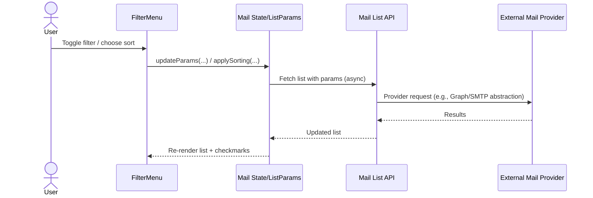
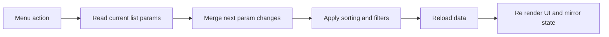
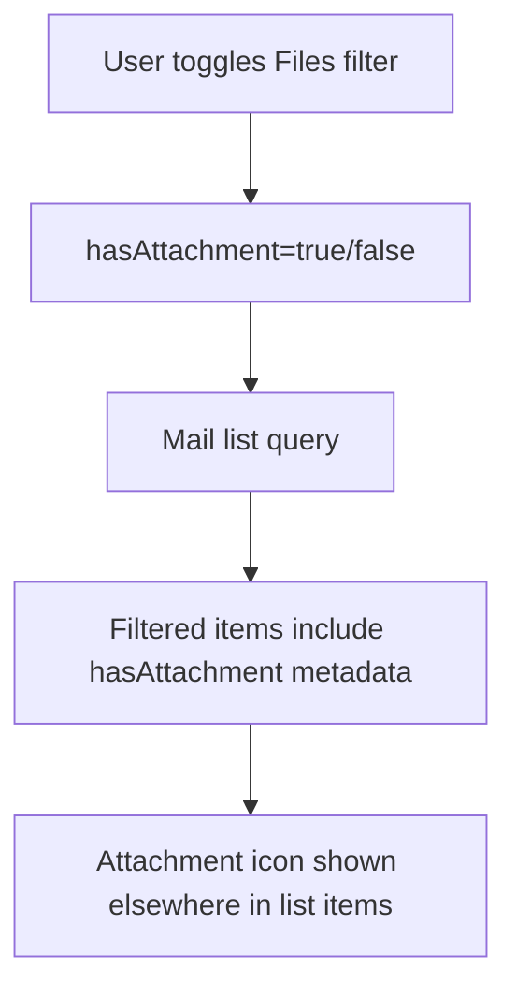

# Filter Menu Module Documentation

## 1. Overview

The **Filter Menu module** provides a contextual, folder-aware filtering and sorting UI for an email list. It is responsible for translating user intent (toggle filters, pick categories, choose sort fields/orders) into **list query parameters** and **sorting directives** that drive the mailbox list view.

This module is implemented as a React component (`FilterMenu`) that integrates with the application’s mail state container (`useMail`) and a query-param/state holder (`listParams`, `updateParams`).

### High-level purpose
- Offer a compact, discoverable menu for **filtering** and **sorting** mail items.
- Ensure filters/sorts stay consistent when switching folders (Inbox, Drafts, Sent Items, etc.).
- Provide immediate UI feedback (checkmarks, disabled states) and keep selection state valid.

### Problems it solves
- Prevents duplication of filtering/sorting logic across multiple list screens.
- Avoids inconsistent list behavior when moving between folders.
- Reduces API calls or state churn by centralizing param updates and predictable state transitions.

### Key responsibilities
- Maintain local UI state for selected filters and search term.
- Synchronize UI state from `listParams` when folder context changes.
- Update list query parameters (`updateParams`) for filters.
- Apply sorting via `applySorting` (from `useMail`).
- Reset incompatible UI state (e.g., clear selected mail) on filter/sort changes.

---

## 2. Unified Entry Point

### Component Entry Point
- **`FilterMenu`** (`React.FC<FilterMenuProps>`)

Although the module exposes a single React component, its behavior is effectively centralized into a single “command surface”: **context menu actions** (items inside `filterMenuProps`) and the **sorting handler** (`handleSort`).

### Why a single entry point is used
- Keeps filter state, folder context, and list parameters consistent.
- Ensures all mutations to list parameters pass through a controlled path.
- Makes it easy to extend with new filter items without scattering logic into multiple components.

### Operations supported
- Refresh inbox list (`refreshInbox`)
- Toggle filters:
  - Flagged
  - Has files/attachments
  - Category (single-select with clear)
- Sort configuration:
  - Field selection (date/category/flag status/from/to/importance/subject)
  - Order selection (asc/desc)
  - Folder-aware availability of sort fields

---

## 3. Input Models

### FilterMenuProps

> The full type definition is not included in the snippet; the table documents what is required based on usage.

| Property | Type | Purpose |
|---|---|---|
| categories | `{ text: string; value: string; key?: string; style?: { color: string; bgColor?: string }; iconProps?: { iconName: string } }[]` | List of category definitions for category filtering UI |
| listParams | `SignalLike<ListParams>` | Read-only access to current list query parameters; must support `.get()` |
| updateParams | `(next: ListParams) => void` | Applies filter parameter changes (likely triggers list refresh / query) |
| theme | `ITheme` | Fluent UI theme used for coloring and hover/disabled states |

### ListParams (inferred from usage)

| Property | Type | Purpose |
|---|---|---|
| isFlagged | `boolean \| undefined` | Whether list is filtered to flagged mail |
| hasAttachment | `boolean \| undefined` | Whether list is filtered to mail with attachments |
| isMentioned | `boolean \| undefined` | Whether list is filtered to “mentioned” mail (UI state supported; menu item not shown in snippet) |
| categoryType | `string \| undefined` | Single selected category filter |
| sortBy | `string \| undefined` | Sort field identifier |
| sortOrder | `'asc' \| 'desc' \| undefined` | Sort direction |

### Selected Filters (local UI state)

| Property | Type | Purpose |
|---|---|---|
| flagged | `boolean` | UI toggle state for flagged filter |
| hasFiles | `boolean` | UI toggle state for attachment filter |
| isMentioned | `boolean` | UI toggle state for mentions filter |
| category | `string \| undefined` | Single selected category value |
| sorting | `string \| undefined` | Active sort field (local mirror of listParams) |
| order | `'asc' \| 'desc' \| undefined` | Active sort direction (local mirror of listParams) |

---

## 4. Core Concepts / Normalization Logic

### Folder-scoped state reset
The component derives a **folder identity key**:

```ts
const folderKey = (currentFolder.get()?.id ?? currentFolder.get()?.name ?? '') as string;
```

This key is used to reset local filter state whenever folder context changes, ensuring stale filters aren’t carried into a new folder unintentionally.

### UI state hydration from list params
On `folderKey` or `listParams` changes, the component re-hydrates local state:

- `flagged` from `p.isFlagged`
- `hasFiles` from `p.hasAttachment`
- `category` from `p.categoryType`
- `sorting` from `p.sortBy ?? 'date'`
- `order` from `p.sortOrder ?? 'desc'`
- clears `searchQuery`

This is a **normalization step** to enforce defaults and avoid `undefined` propagation into UI controls.

### Category search normalization
Category submenu supports a local search box:

- `filteredCategories` is derived by case-insensitive containment match on `cat.text`.

```ts
cat.text.toLowerCase().includes(searchQuery.toLowerCase())
```

### Default sorting order
Sort fields map to default order direction:

- `date` and `importance` default to `desc`
- all others default to `asc`

```ts
const getDefaultOrder = (field?: string) => (field === 'date' || field === 'importance' ? 'desc' : 'asc');
```

### Folder-aware sort options
Sort field availability changes by folder:
- `flagStatus` hidden for Drafts
- `from` hidden for Drafts and Sent Items
- `to` shown only for Drafts and Sent Items

This prevents invalid or meaningless sorts and keeps integration behavior predictable.

### Edge cases & defaults
- Missing `currentFolder` id/name results in empty `folderKey`, still stable.
- Missing `sortBy` and `sortOrder` fall back to `date` / `desc`.
- Category selection is single-select; selecting an already-selected category toggles it off.
- “Clear Filter” is disabled when no category is selected (UI-only disable; action guarded as well).

---

## 5. Base Object Construction

### Contextual menu definition (`filterMenuProps`)
The menu definition serves as the reusable, declarative “base object” for all filter actions.

- Menu items are rendered using `onRender` for custom layouts.
- Each menu action updates local state, clears `selectedMail`, and updates list params or sorting state.

**Why this exists**
- Centralizes UI and action wiring into a single declarative structure.
- Prevents scattered onClick handlers across multiple UI controls.
- Makes it straightforward to add new filters (add new menu item with consistent update pattern).

**What it prevents / optimizes**
- Prevents drift between UI checkmarks and actual applied filters.
- Avoids leaving a selected email open when list filters change (stale detail view risk).
- Reduces accidental re-fetch loops by keeping mutations predictable and scoped.

---

## 6. Internal Helpers / Services

### `useMail()` dependencies
| Member | Role | When used |
|---|---|---|
| `refreshInbox()` | Triggers list refresh | Refresh button click |
| `applySorting(params)` | Applies sorting state to list | Within `handleSort` |
| `selectedMail` | Current selected email signal | Cleared on filter/sort changes |
| `currentFolder` | Current folder context | Determines folderKey & available sort fields |

### Local helpers
#### `getDefaultOrder(field)`
Determines default order for a selected sort field.

#### `getOrderLabels(field)`
Maps sort field to user-friendly ordering labels to reduce ambiguity, e.g.:
- date: “Oldest on top” vs “Newest on top”
- importance: “Low to high” vs “High to low”

---

## 7. Execution Flow by Action Type

### A) Refresh
**Trigger conditions**
- Click **Refresh** icon button

**Step-by-step flow**
1. User clicks Refresh.
2. `refreshInbox()` is invoked.
3. Mail list is reloaded by the surrounding mailbox layer (outside this component).

**Special considerations**
- No local state is mutated here; it is a pure action dispatch.

---

### B) Toggle Flagged Filter
**Trigger conditions**
- Click the “Flagged” menu row in filters menu

**Flow**
1. Toggle `selectedFilters.flagged`.
2. Clear `selectedMail` (`selectedMail.set(null)`).
3. Apply updated list params:

```ts
updateParams({ ...listParams.get(), isFlagged: !selectedFilters.flagged });
```

**Constraints**
- Uses latest list params snapshot (`listParams.get()`), ensuring other filters remain intact.

---

### C) Toggle Has Files (Attachments) Filter
**Trigger conditions**
- Click the “Files” menu row

**Flow**
1. Toggle `selectedFilters.hasFiles`.
2. Clear `selectedMail`.
3. Apply updated list params:

```ts
updateParams({ ...listParams.get(), hasAttachment: !selectedFilters.hasFiles });
```

**Constraints**
- This module only changes query params; it does not handle attachment fetching.

---

### D) Category Filter (Single-select)
**Trigger conditions**
- Select a category in the Categories submenu

**Flow**
1. Compute next category:
   - If selecting a different category → set it
   - If selecting the same category again → clear it (toggle off)
2. Clear `selectedMail`.
3. Apply `categoryType` in list params.

```ts
updateParams({ ...listParams.get(), categoryType: selectedFilters.category === cat.text ? undefined : cat.text });
```

**Special considerations**
- Category submenu supports local search filtering.
- Category is enforced as **single-select** (checkbox UI, but only one checked at a time).

---

### E) Clear Category Filter
**Trigger conditions**
- Click “Clear Filter” in category submenu

**Flow**
1. If `selectedFilters.category` is set:
   - clear it
   - clear `selectedMail`
   - apply `categoryType: undefined`

**Constraints**
- If no category is selected, UI visually disables the item and the click handler is effectively a no-op.

---

### F) Sorting (Field + Order)
Sorting is applied via `handleSort(field?, order?)`.

#### Trigger conditions
- Pick a sort field from Sort submenu (Date, Category, Flag status, etc.)
- Pick a sort order (asc/desc) from Sort order section

#### Step-by-step flow
1. Clear `selectedMail`.
2. Update local state using a functional state update.
3. Determine whether to toggle off sorting (same field clicked again with no explicit order).
4. Compute `nextSorting` and `nextOrder` using:
   - toggle-off rule
   - default order rule
   - explicit order override
5. Call `applySorting()` with updated `sortBy` and `sortOrder`:

```ts
applySorting({
  ...listParams.get(),
  sortBy: nextSorting,
  sortOrder: nextOrder,
});
```

6. Persist local state (`sorting`, `order`) to mirror applied sorting.

#### Special considerations / constraints
- Sort options are folder-gated to avoid invalid sorts.
- Default orders are deterministic and user-friendly.
- Order labels change by field to clarify meaning.

---

## 8. Attachment / Asset Handling

This module does **not** upload or retrieve attachments. It only filters by attachment presence using the `hasAttachment` query parameter.

### Upload strategy
- Not applicable (handled by compose/detail modules).

### Sync strategy
- Filter state sync occurs via `listParams` and `updateParams` (not attachment content sync).

### Retrieval strategy
- Not applicable here; retrieval happens in mail detail/preview components.

---

## 9. Scheduling / Metadata Handling

### Metadata handled
- Category selection (string-based)
- Flagged state (boolean)
- Sort field + order

### Validation rules
- Sort fields are constrained by folder context.
- Category clear action is guarded to avoid redundant updates.

### Limitations
- `isMentioned` exists in local state and is hydrated from `listParams`, but **no menu item is shown in the provided snippet**. If the feature exists elsewhere, it should be wired consistently:
  - toggle local state
  - clear selected mail
  - update `listParams.isMentioned`

---

## 10. Error Handling Strategy

This component itself performs **no direct network calls**, so it does not implement try/catch error wrapping. Error handling is delegated to:

- `refreshInbox()` implementation
- `applySorting()` implementation
- the layer that reacts to `updateParams()`

### Why this strategy is used
- Keeps UI component thin and predictable.
- Prevents double-toasting errors in multiple layers.
- Centralizes API error handling in service/data layers.

### Benefits
- Cleaner separation of concerns.
- Easier to test UI state behavior without mocking HTTP.
- Consistent error presentation across mailbox features.

---

## 11. Design Principles

### Key architectural principles
- **Single source of truth for list state:** `listParams` (external) + local mirror for UI.
- **Deterministic normalization:** defaults applied on hydration.
- **Folder-aware UX constraints:** options gated by mailbox context.
- **State safety:** clear `selectedMail` to avoid stale detail view after list mutation.

### Scalability considerations
- Adding new filters is additive (new menu item, update param).
- Sorting logic is centralized in `handleSort`, reducing drift.
- Category search is local and fast (no network calls).

### Provider-agnostic / extensibility notes
- `updateParams()` and `applySorting()` abstract how data is fetched/sorted.
- Backend implementations can change (Graph API, custom API, cached store) without changing the menu behavior, as long as params contract stays stable.

---

## 12. Mermaid Diagrams (MANDATORY)

### Overall Flowchart (high-level request lifecycle)
```mermaid
flowchart TD
  U[User clicks filter/sort] --> FM[FilterMenu UI]
  FM -->|Updates local state| UIState[Selected filters/searchQuery]
  FM -->|updateParams(...)| Params[ListParams Updated]
  FM -->|applySorting(...)| Sort[Sorting Applied]
  Params --> DataLayer[Mail list data layer]
  Sort --> DataLayer
  DataLayer --> List[Email List Re-render]
  FM -->|selectedMail.set(null)| Detail[Detail cleared]
```

### Sequence Diagram (UI → API → External Service)
> The FilterMenu does not call an API directly; it triggers parameter changes that the mail data layer typically converts into API requests.


### Update / Patch Flow


### Attachment / Asset Flow (filter-only)


---

## 13. Final Outcome

This design provides a **consistent and folder-aware** filtering and sorting experience with minimal coupling to the backend provider.

### Benefits for UI
- Predictable toggles with immediate visual feedback.
- Prevents stale selection by clearing `selectedMail` on mutations.
- Clean, discoverable nested menus (categories + sort options).

### Benefits for API / data layer
- Receives a stable, explicit parameter contract (`listParams` updates).
- Sorting is applied consistently and can be implemented either client-side or server-side.

### Benefits for scalability
- New filters/sorts can be added without refactoring existing flows.
- Folder-specific rules reduce invalid combinations and edge-case bugs.
- Keeps UI logic isolated from provider specifics, supporting future backend swaps.

