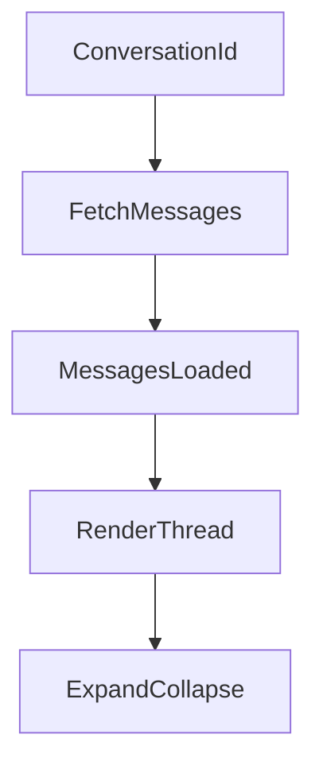
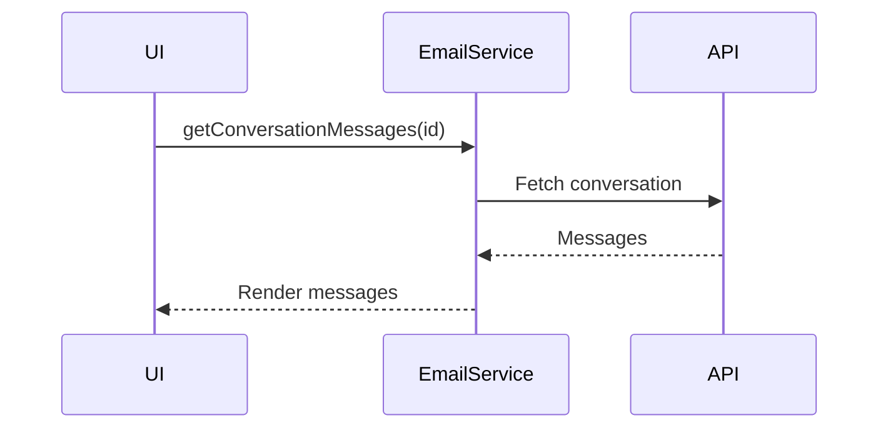
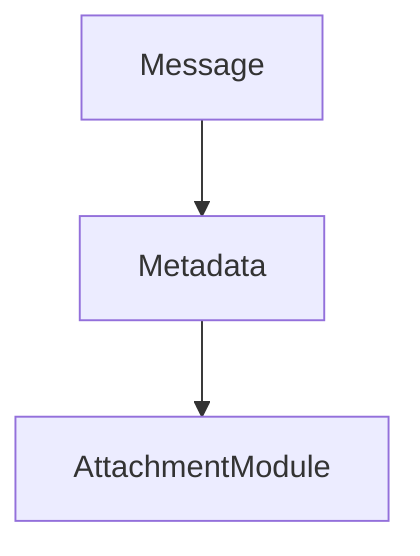

# Thread Messages Module Documentation

## 1. Overview

The **Thread Messages module** is responsible for rendering an email conversation (thread) view. It retrieves all messages belonging to a conversation, displays them in a collapsible timeline, and renders message metadata, recipients, and HTML content safely within the UI.

This module acts as the **read-only conversation renderer** and complements list and compose modules by focusing on message history visualization.

### High-level purpose
- Display all messages within a single email conversation.
- Allow users to expand/collapse individual messages for readability.
- Render recipients, timestamps, and message bodies in a consistent layout.

### Problems it solves
- Avoids navigating between individual emails within the same conversation.
- Prevents overwhelming the UI by collapsing older messages by default.
- Centralizes conversation-fetching logic into a single component.

### Key responsibilities
- Fetch conversation messages by conversation ID.
- Maintain expanded/collapsed state per message.
- Render sender, recipients, timestamps, and message content.
- Ensure links in message bodies open safely in new tabs.

---

## 2. Unified Entry Point

### Component Entry Point
- **`ThreadMessages`** (React functional component)

This component serves as the single entry point for conversation rendering logic.

### Why a single entry point is used
- Guarantees that all thread-related UI and data-fetching logic is centralized.
- Ensures consistent rendering rules across different message threads.
- Simplifies integration with mail state (`useMail`) and backend services.

### Operations supported
- Fetch conversation messages
- Expand / collapse individual messages
- Toggle recipient list visibility
- Render message body content

---

## 3. Input Models

### Component Props

| Property | Type | Purpose |
|---|---|---|
| conversationId | `string` | Identifier used to fetch conversation messages |
| categories | `any[]` | Category metadata (currently unused in rendering logic) |

### Message Model (inferred)

| Property | Type | Purpose |
|---|---|---|
| id | `string` | Unique message identifier |
| subject | `string` | Message subject |
| senderName | `string` | Sender display name |
| bodyPreview | `string` | HTML body content |
| snippet | `string` | Text preview |
| date | `string` | Message timestamp |
| toRecipients | `Recipient[]` | To recipients |
| ccRecipients | `Recipient[]` | CC recipients |
| bccRecipients | `Recipient[]` | BCC recipients |

### Recipient Model

| Property | Type | Purpose |
|---|---|---|
| id | `string` | Recipient identifier |
| name | `string` | Display name |

---

## 4. Core Concepts / Normalization Logic

### Conversation fetch lifecycle
- On `conversationId` change, messages are fetched via `EmailService.getConversationMessages`.
- Local loading state controls spinner visibility.

### Expanded message tracking
- Expanded messages are tracked using a `Set<string>` (`openMessageIds`).
- Clicking a message toggles its presence in the set.

### HTML content normalization
- Message bodies are injected using `dangerouslySetInnerHTML`.
- All `<a>` elements are post-processed to enforce `target="_blank"`.

### Recipient list normalization
- Recipient lists are truncated to 10 entries by default.
- “+N others” allows toggling full recipient visibility.

### Edge cases
- Missing subject defaults to `(No subject)`.
- Missing snippet defaults to `(No preview is available)`.
- Empty recipient arrays render safely without errors.

---

## 5. Base Object Construction

### Message Container
Each message is rendered using a reusable structural pattern:
- Persona (sender avatar)
- Header (sender, recipients, timestamp)
- Collapsible content area

### Why this exists
- Enforces consistent layout for all messages.
- Simplifies expand/collapse animation logic.

### What it prevents / optimizes
- Prevents DOM bloat by collapsing content.
- Improves scroll performance for long threads.

---

## 6. Internal Helpers / Services

### `EmailService`
| Method | Purpose | When Used |
|---|---|---|
| `getConversationMessages(conversationId)` | Fetches thread messages | On component mount / conversation change |

### `useMail()` dependencies
| Member | Role |
|---|---|
| `selectedMail` | Supplies subject, sender, recipients |
| `isLoading` | Triggers UI reset when selection changes |

### Local helpers
- `formattedDateTime(date)` – formats timestamps.
- `renderRecipients()` – renders truncated recipient lists.

---

## 7. Execution Flow by Action Type

### A) Load Conversation

**Trigger conditions**
- Component mount
- `conversationId` changes

**Flow**
1. Set `loading = true`.
2. Call `EmailService.getConversationMessages`.
3. Populate `messages` state.
4. Set `loading = false`.

**Constraints**
- No pagination; entire conversation loaded at once.

---

### B) Expand / Collapse Message

**Trigger conditions**
- User clicks on a message header.

**Flow**
1. Toggle message ID in `openMessageIds` set.
2. Animate content expansion via CSS `max-height`.

**Special considerations**
- Multiple messages can be expanded simultaneously.

---

### C) Recipient List Expansion

**Trigger conditions**
- User clicks “+N others” or “View less”.

**Flow**
1. Toggle `showMore` boolean.
2. Re-render recipient list accordingly.

---

## 8. Attachment / Asset Handling

This module does **not** fetch or render attachments directly.

### Upload strategy
- Not applicable.

### Sync strategy
- Attachment metadata assumed to be part of message payload.

### Retrieval strategy
- Handled in message detail or attachment preview modules.

---

## 9. Scheduling / Metadata Handling

### Metadata handled
- Message timestamps
- Recipient counts
- Conversation grouping

### Validation rules
- Conversation ID must be valid.
- Message body HTML assumed to be sanitized upstream.

### Limitations
- No lazy loading of older messages.
- No inline attachment previews.

---

## 10. Error Handling Strategy

### Approach
- Network errors are implicitly handled by the calling service.
- Component fails silently if message fetch fails.

### Why this strategy is used
- Prevents UI blocking in read-only views.
- Keeps rendering logic simple.

### Benefits
- Reduced UI complexity.
- Error handling centralized in data layer.

---

## 11. Design Principles

### Key architectural principles
- **Single responsibility**: conversation rendering only.
- **State isolation**: UI state does not mutate mailbox state.
- **Progressive disclosure**: collapse content by default.

### Scalability considerations
- Collapsing prevents performance issues in large threads.
- Logic can be extended to virtualized rendering.

### Provider-agnostic notes
- Backend conversation source can change without UI changes.
- Message model remains loosely coupled.

---

## 12. Mermaid Diagrams (MANDATORY)

### Overall Flowchart

### Sequence Diagram (UI → API → External Service)

### Update / Patch Flow

### Attachment Flow

---

## 13. Final Outcome

This design delivers a clean, scalable conversation view that balances readability and performance.

### Benefits for UI
- Clear threaded layout.
- Expandable messages reduce clutter.
- Safe link handling.

### Benefits for API
- Single conversation fetch per thread.
- Minimal coupling to rendering logic.

### Benefits for scalability
- Easy to add virtualization, attachment previews, or inline actions.
- Works with any provider that supports conversation-based retrieval.
