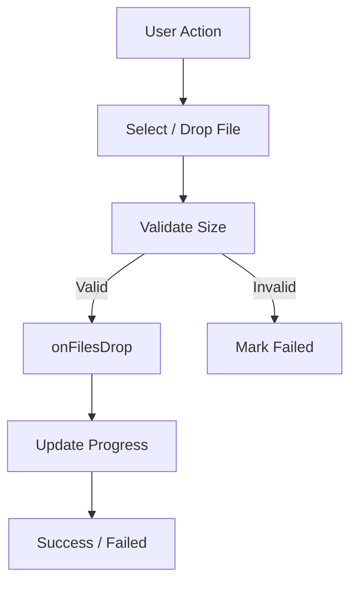
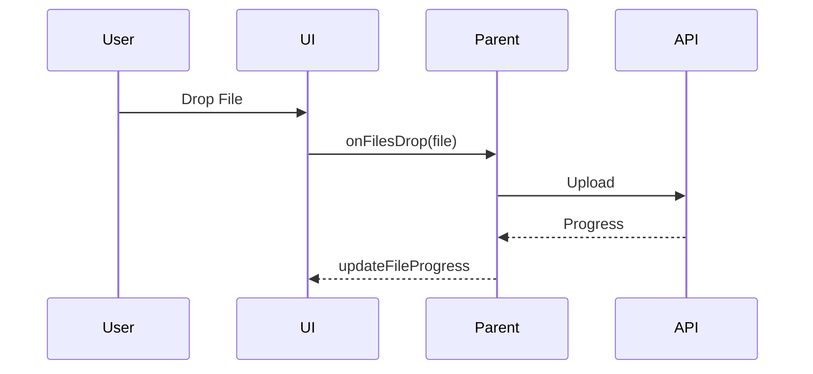

# FileUploadDropInput – Drag & Drop Upload Component

## 1. Overview

The **FileUploadDropInput** component is a reusable, controlled React component designed to handle **file selection, drag-and-drop uploads, and upload progress visualization** in a provider-agnostic way.

### Purpose
- Provide a consistent UX for file uploads
- Delegate upload logic to the parent (API, Graph, S3, Blob, etc.)
- Track per-file upload progress and status

### Problems It Solves
- Avoids coupling UI with upload implementation
- Supports retry, view, and delete actions
- Handles drag/drop edge cases and accessibility

### Key Responsibilities
- File selection (click & drag/drop)
- File size validation
- Progress visualization
- Upload lifecycle UI state

---

## 2. Unified Entry Point

### Component
```tsx
<FileUploadDropInput />
```

### Why a Single Entry Point
- Centralizes all file interaction logic
- Keeps upload behavior predictable
- Simplifies integration with different backends

### Supported Operations
- Add files
- Track upload progress
- Retry failed uploads
- View uploaded files
- Delete files

---

## 3. Input Models

### FileUploadDropZoneProps

| Property | Type | Purpose |
|-------|------|-------|
| value | File[] | Controlled list of files |
| maxFileSize | number | Max file size (bytes, default 30MB) |
| accept | string \| string[] | File type filter |
| disabled | boolean | Disable interactions |
| multiple | boolean | Allow multiple file selection |
| placeholder | string | Empty state text |
| children | ReactNode | Custom UI override |
| onDragStateChange | (boolean) => void | Drag state callback |
| onFilesDrop | (File, updateProgress) => void | Upload handler |
| onDelete | (File) => void | Delete callback |
| onView | (File) => void | View callback |

---

## 4. Core Concepts & Normalization Logic

### File Key Normalization
Each file is uniquely identified using:
```ts
name-size-lastModified
```

This prevents collisions and ensures stable progress tracking.

### Accept Normalization
```ts
string | string[] → comma-separated string
```

### File Size Validation
- Files exceeding `maxFileSize` are immediately marked as **Failed**
- Upload callback is not triggered for invalid files

---

## 5. Base Object Construction

### FileProgress Model

```ts
{
  key: string;
  value: number; // 0–100
  status: Pending | Uploading | Success | Failed
}
```

### Why It Exists
- Decouples upload mechanics from UI
- Enables granular progress updates
- Prevents unnecessary re-renders

---

## 6. Internal Helpers / Services

### updateFileProgress
- Stable callback passed to parent
- Allows parent to push upload state updates

### formatBytes
- Human-readable file size formatting

### Drag Handlers
- `handleDragEnter`
- `handleDragOver`
- `handleDragLeave`
- `handleDrop`

These ensure accurate drag-state tracking without flicker.

---

## 7. Execution Flow by Action Type

### Upload Flow

**Trigger:** File dropped or selected

**Steps:**
1. Validate file size
2. Generate file key
3. Invoke `onFilesDrop(file, updateProgress)`
4. Parent uploads file
5. Parent reports progress & status

### Retry Flow

**Trigger:** Retry icon click

**Steps:**
1. Reinvoke `onFilesDrop`
2. Reset progress

### Delete Flow

**Trigger:** Delete icon click

**Steps:**
1. Call `onDelete(file)`
2. Parent removes file from `value`

---

## 8. Attachment / Asset Handling

### Upload Strategy
- Component does **not** upload files itself
- Parent controls:
  - Chunking
  - Multipart uploads
  - Cloud providers

### Sync Strategy
- Controlled `value` prop ensures UI reflects backend state

### Retrieval Strategy
- `onView` allows opening previews or downloads

---

## 9. Error Handling Strategy

### UI-Level Errors
- Oversized files → `Failed`
- Upload failures → Retry enabled

### Why This Strategy
- Keeps UI responsive
- Avoids blocking other uploads

---

## 10. Design Principles

- Controlled component pattern
- Provider-agnostic uploads
- Minimal internal state
- Accessibility-first (keyboard + ARIA)

### Scalability Considerations
- Handles large file lists
- O(1) progress lookup via Map

---

## 11. Mermaid Diagrams

### Overall Flowchart


### Sequence Diagram


### Retry Flow


---

## 12. Final Outcome

### What This Design Achieves
- Clean separation of concerns
- Reusable across products and providers
- Predictable upload lifecycle

### Benefits
- **UI:** Smooth UX with feedback
- **API:** Full control over uploads
- **Scalability:** Supports large and concurrent uploads

---

**Status:** Production-ready
