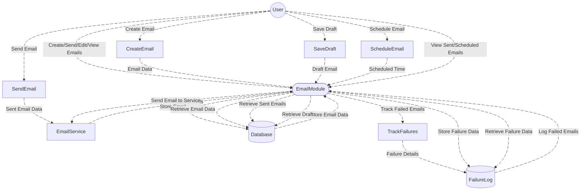
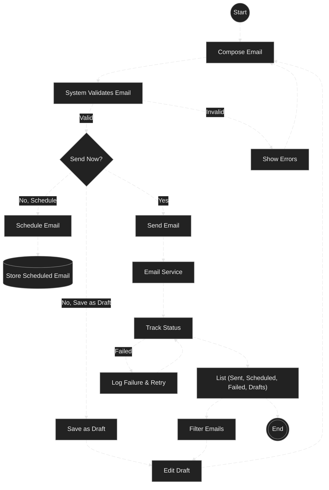
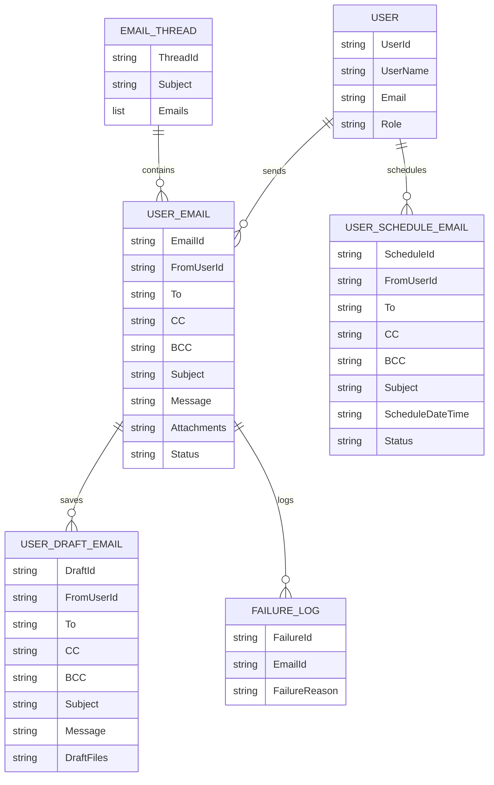

# Email Module Documentation

---

## **Overview**

The **Email Module** is responsible for handling all email-related operations within the system, including email creation, editing, scheduling, sending, and tracking email statuses (e.g., sent, failed, pending). The module also allows users to manage drafts, view sent emails, and track failures. The Email Module integrates with other system components like the CRM, task management, and document storage systems to facilitate email-related activities.

---

## **DFD (Data Flow Diagram)**

---

## **Process Flow**

---

## **ER Diagram (Entity-Relationship Diagram)**

---

## **Entity Definitions**

1. **Email**: Contains the details of an email message, including the sender, recipients (To, CC, BCC), subject, message body, attachments, and status.
2. **User**: Represents users of the system, each with a specific role (Admin, Manager, Staff) that determines their access to email-related features.
3. **Draft**: An email that is saved but not sent yet. It is stored temporarily and can be modified later before being sent.
4. **Scheduled Email**: A scheduled email that is set to be sent at a later time. The system processes these emails and sends them at the scheduled time.
5. **Sent Email**: Represents an email that has been successfully dispatched to recipients.
6. **Failure Log**: Stores information about failed email attempts, such as the reason for failure, time of failure, and any error messages.

---

## **Authentication / APIs**

### **Authentication**

- **Role-Based Access Control (RBAC)**: The **Email Module** uses RBAC for authentication, meaning that different user roles have different access levels and permissions.
- **JWT Tokens**: Users must authenticate via JWT (JSON Web Tokens) to access the system's email-related services.

### **API Endpoints**

1. **GET /Emails**  
   Fetch a list of emails. Supports filters such as user, team, folder, and search query.
   
2. **GET /Emails/{id}**  
   Retrieve detailed information about a specific email.

3. **POST /Emails**  
   Create a new email or send an email immediately.

4. **PUT /Emails/{id}**  
   Update an email (e.g., edit a draft or reschedule a sent email).

5. **GET /Emails/Threads/{id}**  
   Retrieve all emails in a specific thread (useful for viewing conversations).

6. **GET /Emails/InitialMessage**  
   Retrieve the initial message in an email thread (used when replying to an email).

---

## **Testing Guide**

### **Unit Testing**

- **Email Creation**: Ensure that emails can be created and saved correctly.
- **Draft Saving**: Test the ability to save emails as drafts and retrieve them.
- **Email Sending**: Test the email sending logic, including successful delivery and failure handling.

### **Integration Testing**

- **Email Service Integration**: Verify that the email service (SMTP or third-party) is integrated properly with the system for sending emails.
- **Database Integration**: Ensure that emails are correctly stored in the database and that all metadata (e.g., recipient, subject, status) is saved appropriately.

### **End-to-End Testing**

- **End-to-End Flow**: Test the complete process from email creation, saving as a draft, scheduling, and sending to failure handling and retries.
- **UI Testing**: Ensure that users can interact with the email interface as expected, including creating, editing, and managing emails.

### **API Testing**

- Use **Postman** or **Swagger** to test the various API endpoints.
- Test edge cases such as missing required fields or invalid email addresses.

---

## **References**

- **Email Service API Documentation**: [Link to email service API documentation].
- **Fluent UI Documentation**: [Link to Fluent UI documentation].
- **Capsitech Storage and Services**: [Link to Capsitech documentation].

---

## **Version and Change Log**

| Version | Date       | Changes                                                                                                                                          |
|---------|------------|--------------------------------------------------------------------------------------------------------------------------------------------------|
| 1.0     | 2025-12-18 | Initial version of the **Email Module** documentation created.                                                                                  |
| 1.1     | 2025-12-20 | Added API details and testing guidelines for email service interactions.                                                                         |

---

This documentation serves as a comprehensive guide for the **Email Module**, outlining its functionality, integration points, and best practices for use and testing.

