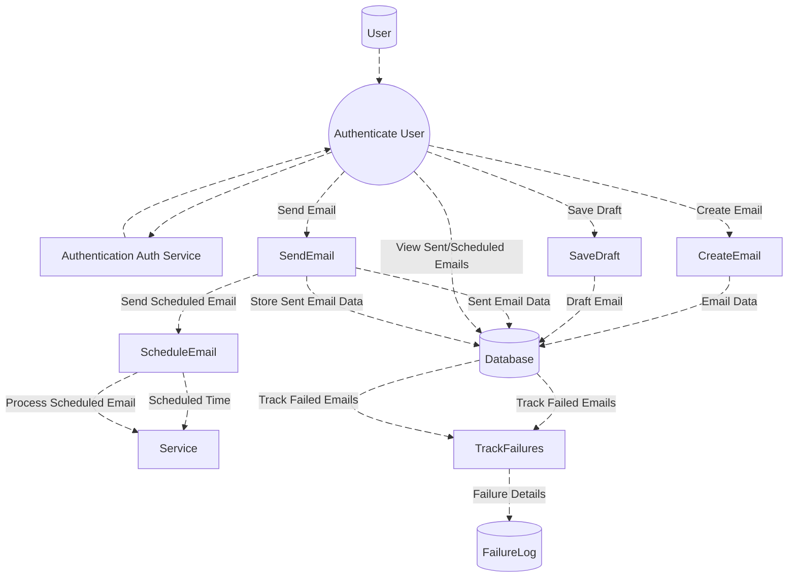
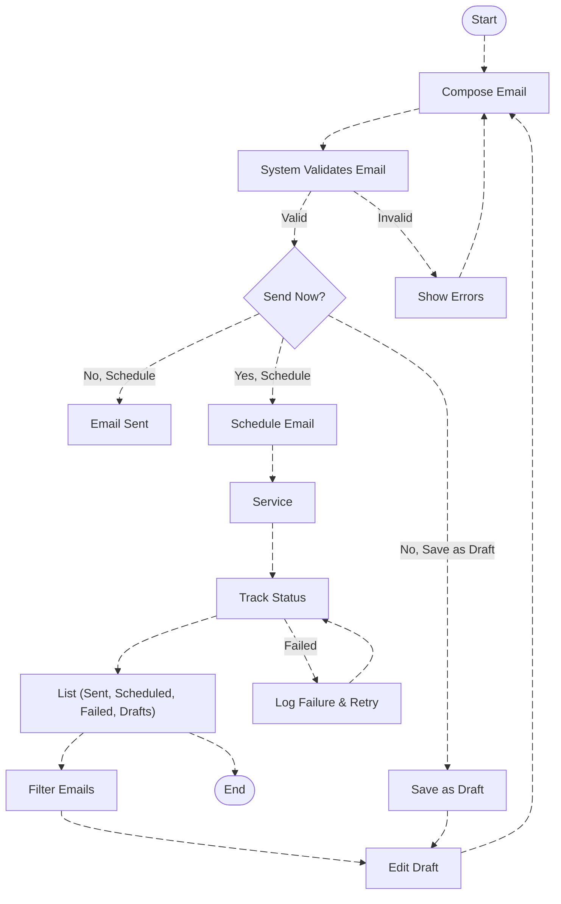
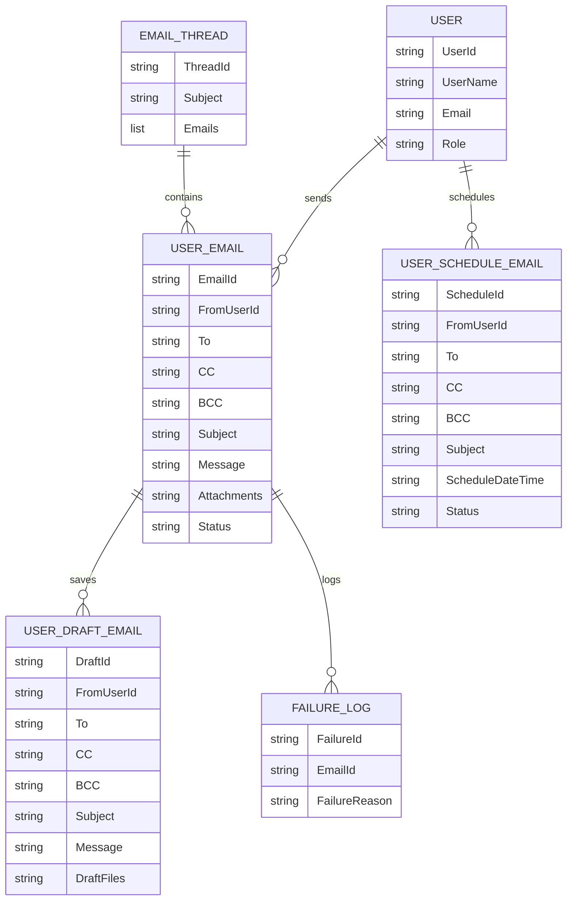

# Email Module Documentation

---

## **Overview**

The **Email Module** serves as the backbone of communication within the system, managing a comprehensive range of email-related operations with unmatched efficiency and precision. It handles everything from the seamless creation and editing of emails to the sophisticated scheduling and timely delivery of messages. Beyond basic sending, this powerhouse module tracks email statuses meticulously—whether it's a successful delivery, a pending message, or a failed attempt—ensuring that no communication is ever lost.

Designed to meet the needs of modern businesses, the Email Module offers users full control over their email activities, allowing them to manage drafts, review sent emails, and swiftly identify any failures or delivery issues. It seamlessly integrates with key system components, such as CRM, task management, and document storage, to create a unified communication experience.

Whether you're sending invoices, client updates, or internal notifications, the Email Module empowers users with advanced features like automated retries for failed emails, detailed status tracking, and effortless email rescheduling. It acts as a central hub for all email-related tasks, ensuring that no message ever goes unnoticed or untracked.

From drafting personalized messages to automating email workflows, this module is engineered to enhance efficiency and streamline communication processes, making it indispensable for every team within the system. With its robust functionality, the Email Module ensures that email management is no longer a chore, but a seamless, integrated experience that drives productivity and fosters communication across the entire organization.

---

## **DFD (Data Flow Diagram)**

---
## **Process Flow**

1. **Start**  
   - The email management process begins when a user initiates the system to compose, manage, or track emails.

2. **Compose Email**  
   - A user can compose a new email by specifying the recipients, subject, body, and attachments.
   - The user enters all necessary email details in the composition interface.

3. **System Validates Email**  
   - The system validates the email content, checking for required fields, proper email formats, and any content restrictions.
   - If validation fails, the system displays error messages to the user.

4. **Show Errors**  
   - When validation fails, specific error messages are displayed to guide the user in correcting the issues.
   - The user is redirected back to the composition screen to fix the errors and resubmit.

5. **Send Now Decision**  
   - After successful validation, the user decides how to proceed with the email:
     - Send immediately
     - Schedule for later delivery
     - Save as draft for future editing

6. **Email Sent (Immediate)**  
   - If the user chooses to send immediately, the email is marked as sent and stored in the database.
   - The email is then passed to the SMTP service for delivery.

7. **Schedule Email**  
   - Users can schedule emails to be sent at a specified time in the future.
   - Scheduled emails are stored in the database with their designated send time and processed by a background job to be sent at the scheduled time.

8. **Save as Draft**  
   - Emails can be saved as drafts for future editing. This allows users to complete their emails at a later time.
   - Drafts are stored in the database and can be retrieved for editing before sending.

9. **Track Status**  
    - The system tracks the email's status throughout the delivery process (sent, failed, pending).
    - Status updates are monitored in real-time and recorded in the database.

10. **Log Failure & Retry**  
    - Failed email attempts are logged with detailed error information, and users are notified of any issues.
    - The system retries sending emails that fail under certain conditions, implementing automatic retry logic.
    - After retry attempts, the status is updated and tracked again.

11. **List (Sent, Scheduled, Failed, Drafts)**  
    - Users can view their sent, scheduled, failed, and draft emails in a comprehensive list view.
    - The list provides an organized overview of all emails across different states in the system.

12. **Filter Emails**  
    - Emails can be filtered based on status (e.g., sent, failed, pending, scheduled, drafts) and other criteria (e.g., recipient, subject, date).
    - The filtering system allows users to quickly locate specific emails within their collection.

13. **Edit Draft**  
    - Users can edit drafts before sending them, including modifying the recipients, subject, message body, or attachments.
    - After editing, the draft returns to the composition stage for validation and processing.

14. **End**  
    - The process concludes when the user exits the email management interface or completes their email management tasks.
---

### **Process Flow Diagram**:

---

## **ER Diagram (Entity-Relationship Diagram)**

---

## **Entity Definitions**

### **User**
Represents the system user interacting with emails.

- **user_id** (string): Unique identifier for the user
- **email_address** (string): User's email address
- **name** (string): User's full name
- **role** (string): User's role (ADMIN, MANAGER, STAFF)

### **Email**
Represents the email message.

- **email_id** (string): Unique identifier for the email
- **subject** (string): Email subject line
- **body** (text): Email body content
- **date** (datetime): Date and time the email was sent/received
- **importance** (string): Priority level (Low, Normal, High)
- **is_read** (boolean): Whether the email has been read
- **folder_id** (string): Foreign key to the folder
- **user_id** (string): Foreign key to the user

### **Draft Email**
Represents a saved but unsent email draft.

- **draft_id** (string): Unique identifier for the draft email
- **from_user_id** (string): Foreign key to the user sending the draft
- **to** (string): Recipients of the draft email
- **cc** (string): Carbon copy recipients
- **bcc** (string): Blind carbon copy recipients
- **subject** (string): Subject of the draft email
- **message** (text): Content of the draft email
- **draft_files** (string): List of files associated with the draft email

### **Scheduled Email**
Represents an email that is scheduled to be sent at a later time.

- **schedule_id** (string): Unique identifier for the scheduled email
- **from_user_id** (string): Foreign key to the user scheduling the email
- **to** (string): Recipients of the scheduled email
- **cc** (string): Carbon copy recipients
- **bcc** (string): Blind carbon copy recipients
- **subject** (string): Subject of the scheduled email
- **schedule_datetime** (datetime): Date and time the email is scheduled to be sent
- **status** (string): Status of the scheduled email (e.g., Pending, Sent, Failed)

### **Failure Log**
Stores information about failed email attempts.

- **failure_id** (string): Unique identifier for the failure log
- **email_id** (string): Foreign key to the email that failed
- **failure_reason** (string): Reason for failure (e.g., "Server error", "Invalid email address")

### **Email Thread**
Represents a conversation thread of emails.

- **thread_id** (string): Unique identifier for the email thread
- **subject** (string): Subject of the email thread
- **emails** (list): List of email messages in the thread, linked to the `USER_EMAIL` entity

---

## **Authentication / APIs**

### **Authentication**

- **Role-Based Access Control (RBAC)**: The **Email Module** uses RBAC for authentication and authorization. Access to this module is restricted using `[Authorize(Roles = "ADMIN,MANAGER,STAFF")]`, ensuring that only users with **ADMIN**, **MANAGER**, or **STAFF** roles can access it.

### **API Endpoints**

| **Description**                         | **HTTP Method** | **Endpoint**                                                                 |
|-----------------------------------------|-----------------|-----------------------------------------------------------------------------|
| **Send Email**                          | POST            | [/SendEmail](https://apiuat.actingoffice.com/api-docs/index.html?urls.primaryName=Acting+Office+-+CRM) |
| **Get Canned Messages**                 | GET             | [/CannedMessages](https://apiuat.actingoffice.com/api-docs/index.html?urls.primaryName=Acting+Office+-+CRM) |
| **Add New Draft**                       | POST            | [/SaveDraft](https://apiuat.actingoffice.com/api-docs/index.html?urls.primaryName=Acting+Office+-+CRM) |
| **Update Draft**                        | POST            | [/SaveDraft/{id}](https://apiuat.actingoffice.com/api-docs/index.html?urls.primaryName=Acting+Office+-+CRM) |
| **Get Draft Emails**                    | GET             | [/GetDraftMails](https://apiuat.actingoffice.com/api-docs/index.html?urls.primaryName=Acting+Office+-+CRM) |
| **Download Draft File**                 | GET             | [/DraftFileDownload](https://apiuat.actingoffice.com/api-docs/index.html?urls.primaryName=Acting+Office+-+CRM) |
| **Get Schedule Emails**                 | GET             | [/GetScheduleMails](https://apiuat.actingoffice.com/api-docs/index.html?urls.primaryName=Acting+Office+-+CRM) |
| **Add Schedule**                        | POST            | [/SaveSchedule](https://apiuat.actingoffice.com/api-docs/index.html?urls.primaryName=Acting+Office+-+CRM) |
| **Update Schedule**                     | POST            | [/SaveSchedule/{id}](https://apiuat.actingoffice.com/api-docs/index.html?urls.primaryName=Acting+Office+-+CRM) |
| **Update Schedule**                     | POST            | [/UpdateSchedule/{id}](https://apiuat.actingoffice.com/api-docs/index.html?urls.primaryName=Acting+Office+-+CRM) |
| **Get Schedule by ID**                  | GET             | [/schedule/{id}](https://apiuat.actingoffice.com/api-docs/index.html?urls.primaryName=Acting+Office+-+CRM) |
| **Send Scheduled Email**                | POST            | [/SendSchedule/{id}](https://apiuat.actingoffice.com/api-docs/index.html?urls.primaryName=Acting+Office+-+CRM) |
| **Download Attachment**                 | GET             | [/ScheduleFileDownload](https://apiuat.actingoffice.com/api-docs/index.html?urls.primaryName=Acting+Office+-+CRM) |

---

## **Testing Guide**

### **Unit Testing**

- **Email Creation**: Ensure that emails can be created and saved correctly.
- **Draft Saving**: Test the ability to save emails as drafts and retrieve them.
- **Email Sending**: Test the email sending logic, including successful delivery and failure handling.

### **Integration Testing**

- **Email Service Integration**: Verify that the email service (SMTP or third-party) is integrated properly with the system for sending emails.
- **Database Integration**: Ensure that emails are correctly stored in the database and that all metadata (e.g., recipient, subject, status) is saved appropriately.

### **End-to-End Testing**

- **End-to-End Flow**: Test the complete process from email creation, saving as a draft, scheduling, and sending to failure handling and retries.
- **UI Testing**: Ensure that users can interact with the email interface as expected, including creating, editing, and managing emails.

### **API Testing**

- Use **Postman** or **Swagger** to test the various API endpoints.
- Test edge cases such as missing required fields or invalid email addresses.

---

## **References**

- **API Documentation**: [Link to email service API documentation].

---

